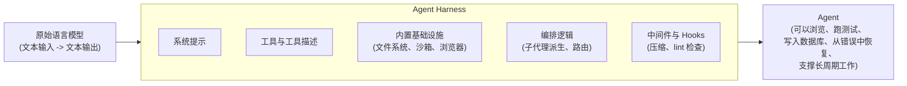

# 前言

这本书讨论的是语言模型真正被拿来做事时，围绕模型构建的那套系统。这套系统现在常被称为 *harness*。下面的章节会把相关文献串成一条连续叙事。读者如果想把某条线索追溯到原始来源，可以在对应论断旁找到引用。

这个领域的基本前提很简单。LangChain 的 Vivek Trivedy 将其概括为：“Agent = Model + Harness。**如果你不是模型，那你就是 harness。**”([LangChain - The Anatomy of an Agent Harness](https://blog.langchain.com/the-anatomy-of-an-agent-harness/))。除此之外，系统提示、工具、沙箱、记忆、子代理、控制流、评估基础设施，都属于 harness。如何把这些东西设计好，就是本书要研究的内容。

---

## 核心公式

---

## 要点

- 语言模型本身不能维护状态、执行代码或访问实时知识；这些都是 harness 层面的能力。
- Harness engineering 不等同于 prompt engineering：它迭代的是整个系统，而不是单个提示词。
- 这个领域仍然年轻，许多关键文章发表于 2025 和 2026 年，但实践正在快速成熟。
- 本书尽量为每个关键论断附上来源，方便读者回到原文。

## 延伸阅读

- Vivek Trivedy, *The Anatomy of an Agent Harness*, LangChain, Mar 2026. https://blog.langchain.com/the-anatomy-of-an-agent-harness/
- *Awesome Harness Engineering* reading list: https://github.com/walkinglabs/awesome-harness-engineering
