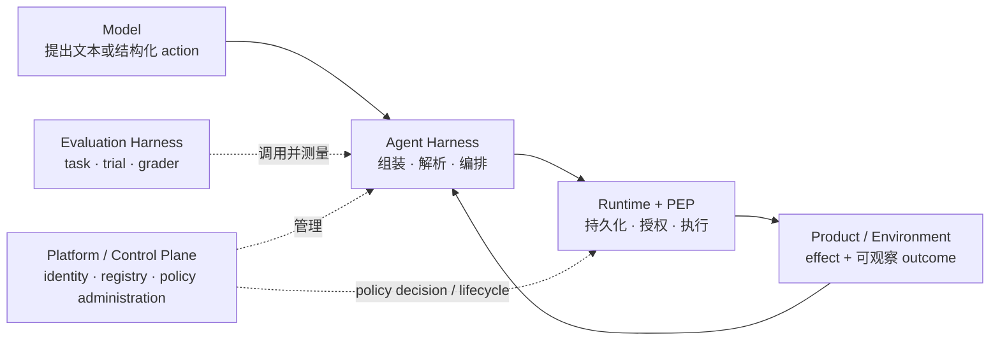

# 前言

本书讨论的是：当语言模型真正开始执行任务时，围绕它运行的多层系统。接下来的章节会把 agent harness 资料串联成一条工程主线。关键事实会在正文对应位置给出来源，方便读者核对证据及其适用范围。

这个领域建立在一个简单的前提之上。LangChain 的 Vivek Trivedy 将其概括为：“Agent = Model + Harness。**如果你不是模型，那你就是 harness。**”([LangChain - The Anatomy of an Agent Harness](https://blog.langchain.com/the-anatomy-of-an-agent-harness/))。这句话适合划分责任，但粒度有意保持得很粗。本书会进一步区分紧邻模型的 *agent harness*、持久化运行时、面向用户的产品、fleet platform 或 control plane，以及独立的 evaluation harness。Anthropic 也采用了这种较窄的区分：agent harness 负责处理输入和编排工具调用，evaluation harness 则负责运行 trial、记录过程、执行评分并汇总结果 ([Anthropic - Demystifying Evals for AI Agents](https://www.anthropic.com/engineering/demystifying-evals-for-ai-agents))。

阅读本书时，可以把模型理解为一个接收当前输入表示、再生成文本或结构化输出的组件。工具调用只是提议，不是已经发生的副作用：应用代码负责验证并执行指定工具，再把 tool result 返回给模型 ([Anthropic - How Tool Use Works](https://platform.claude.com/docs/en/agents-and-tools/tool-use/how-tool-use-works))。正因为模型输出不等于现实世界中的实际效果，后续章节才会重点讨论上下文、工具、状态、权限、测试、沙箱和评估。

配套的第一卷已经介绍了本书所依赖的模型行为，包括 token、attention、单次请求内的 KV cache、provider prompt caching、context window、采样、检索，以及 tool calling 的模型侧边界。第一卷最后给出了六类责任边界：模型负责预测；外部系统负责上下文选择、持久状态、工具执行、权限、验证和后果 ([《LLM Foundations》第 14 章](../llm-foundations-zh/14-operational-mental-model.md))。本卷负责实现这些外部责任，不再重新推导模型机制。

## 开始之前

本书是两卷系列中的第二卷。我们假定读者已经读过 *[LLM Foundations for Harness Engineering](../llm-foundations-zh/)*，并熟悉 token、attention、context window、采样、post-training、检索、模型生成的 tool call、prompt injection，以及 pass@k/pass^k。遇到第一卷已经讲过的概念时，本书会指回对应章节，而不再从头推导。没有读过第一卷的读者仍可理解本书主线，但应把这些简短回顾视为进一步阅读的入口，而不是完整讲解。Provider 价格、缓存生命周期、模型能力和 benchmark 分数都会变化；它们在本书中出现时，都应被理解为带日期的案例，而不是永久定义。

---

## 核心公式

```mermaid
flowchart LR
    M["Model<br/>提出文本或结构化 action"] --> H["Agent Harness<br/>组装 · 解析 · 编排"]
    H --> R["Runtime + PEP<br/>持久化 · 授权 · 执行"]
    R --> P["Product / Environment<br/>effect + 可观察 outcome"]
    P --> H
    E["Evaluation Harness<br/>task · trial · grader"] -. "调用并测量" .-> H
    C["Platform / Control Plane<br/>identity · registry · policy administration"] -. "管理" .-> H
    C -. "policy decision / lifecycle" .-> R
```

---

## 要点

- 单次语言模型调用不拥有持久化应用状态，不执行真实工具，也不强制权限；这些能力由外部软件提供。
- Harness engineering 不等同于 prompt engineering：它改进的是整个系统，而不只是单个提示词。
- “Harness” 是一种宽泛的责任缩写；当架构差异重要时，后续章节会区分 agent harness、runtime、product、platform 和 evaluation harness。
- 时变的 provider 与产品事实会标成带日期的案例，而不是写成永久定义。
- 关键事实在章节正文中直接引用来源，方便读者检查原始适用范围。

## 延伸阅读

- Vivek Trivedy, *The Anatomy of an Agent Harness*, LangChain, Mar 2026. https://blog.langchain.com/the-anatomy-of-an-agent-harness/
- Mikaela Grace et al., *Demystifying Evals for AI Agents*, Anthropic, Jan 2026. https://www.anthropic.com/engineering/demystifying-evals-for-ai-agents
- Anthropic, *How Tool Use Works*. https://platform.claude.com/docs/en/agents-and-tools/tool-use/how-tool-use-works
- *Awesome Harness Engineering* reading list: https://github.com/walkinglabs/awesome-harness-engineering
