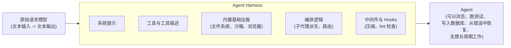

# 前言

本书讨论的是：当语言模型真正开始执行任务时，围绕它运行的整套系统。这套系统如今有了一个名字——*harness*，如何构建它也已经形成一批规模不大、却在迅速成熟的研究与实践。接下来的章节会把这些资料串联成一条完整的脉络，并在每项论断旁标明原始出处，方便读者继续追溯。

这个领域建立在一个简单的前提之上。LangChain 的 Vivek Trivedy 将其概括为：“Agent = Model + Harness。**如果你不是模型，那你就是 harness。**”([LangChain - The Anatomy of an Agent Harness](https://blog.langchain.com/the-anatomy-of-an-agent-harness/))。按照这一框架，模型周围的一切——系统提示、工具、沙箱、记忆、子代理、控制流和评估基础设施——都属于 harness。本书研究的正是如何设计好这套周边系统。

阅读本书时，可以把模型理解为一个接收 token、输出 token 的组件。模型既可能生成供用户阅读的文本，也可能生成请求执行某项操作的结构化文本，但真正执行操作的始终是周边软件。正因为模型输出不等于现实世界中的实际效果，后续章节才会重点讨论上下文、工具、状态、测试、沙箱和评估。

配套的第一卷已经介绍了本书所依赖的模型内部机制，包括 token、attention 与 KV-cache、context window、采样、检索和 tool-call 协议。本书只会简要回顾这些概念，并在此基础上讲解 harness engineering。新增内容大多属于软件工程范畴：上下文、工具、状态、沙箱和评估。

## 开始之前

本书是两卷系列中的第二卷。我们假定读者已经读过 *[LLM Foundations for Harness Engineering](../llm-foundations-zh/)*，并熟悉 token、attention 与 KV-cache、context window、采样、post-training、检索、agent loop、tool-call 协议、prompt injection，以及 pass@k/pass^k。遇到第一卷已经讲过的概念时，本书会标出对应章节（例如“Foundations 第 9 章”），而不再从头推导。没有读过第一卷的读者仍可理解本书主线，但应把这些简短回顾视为进一步阅读的入口，而不是完整讲解。

---

## 核心公式

```mermaid
flowchart LR
    A["原始语言模型<br/>(文本输入 -> 文本输出)"] --> B["Agent Harness"]
    B --> C["Agent<br/>(可以浏览、跑测试、<br/>写入数据库、从错误中恢复、<br/>支撑长周期工作)"]

    subgraph B["Agent Harness"]
        direction TB
        SP["系统提示"]
        T["工具与工具描述"]
        I["内置基础设施<br/>(文件系统、沙箱、浏览器)"]
        O["编排逻辑<br/>(子代理派生、路由)"]
        M["中间件与 Hooks<br/>(压缩、lint 检查)"]
    end
```

---

## 要点

- 语言模型本身不能维护状态、执行代码或访问实时知识；这些都是 harness 层面的能力。
- Harness engineering 不等同于 prompt engineering：它改进的是整个系统，而不只是单个提示词。
- 这个领域仍然年轻，许多关键文章发表于 2025 和 2026 年，但实践正在快速成熟。
- 本书为每个论断都附上引用，方便读者回到原文。

## 延伸阅读

- Vivek Trivedy, *The Anatomy of an Agent Harness*, LangChain, Mar 2026. https://blog.langchain.com/the-anatomy-of-an-agent-harness/
- *Awesome Harness Engineering* reading list: https://github.com/walkinglabs/awesome-harness-engineering
