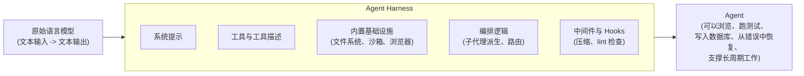

# 前言

这本书讨论的是语言模型真正被拿来做事时，围绕模型构建的那套系统。这套系统现在常被称为 *harness*。下面的章节会把相关文献串成一条连续叙事。读者如果想把某条线索追溯到原始来源，可以在对应论断旁找到引用。

这个领域的基本前提很简单。LangChain 的 Vivek Trivedy 将其概括为：“Agent = Model + Harness。**如果你不是模型，那你就是 harness。**”([LangChain - The Anatomy of an Agent Harness](https://blog.langchain.com/the-anatomy-of-an-agent-harness/))。除此之外，系统提示、工具、沙箱、记忆、子代理、控制流、评估基础设施，都属于 harness。如何把这些东西设计好，就是本书要研究的内容。

贯穿全书，可以先把模型理解为一个接收 token、输出 token 的组件。它可能输出给用户看的文本，也可能输出请求某个动作的结构化文本，但真正执行动作的始终是模型周围的软件。区分“模型输出”和“真实世界效果”，正是后续章节反复讨论上下文、工具、状态、测试、沙箱和评估的原因。

本书所依赖的模型内部机制——token、attention 与 KV-cache、context window、采样、检索，以及 tool-call 协议——都在配套的 stage-1 卷中讲解；在这里我们用一句话点出每个概念，并在其之上构建 harness engineering 这一层。真正属于本书的新内容主要是软件工程：context、工具、状态、sandbox 和评估。

## 开始之前

这是一个两卷序列中的第二本。它假定你已经读过 *[LLM Foundations for Harness Engineering](../llm-foundations-zh/)*，并且熟悉 token、attention 与 KV-cache、context window、采样、post-training、检索、agent loop、tool-call 协议、prompt injection，以及 pass@k/pass^k。凡是本书提到某个 Foundations 概念之处，都会向回指（例如“Foundations 第 9 章”），而不是重新推导。没有 stage-1 基础的读者仍然可以跟上叙事，但应把这些一行回顾当作指引，而不是完整讲解。

---

## 核心公式

```mermaid
flowchart LR
    A["原始语言模型<br/>(文本输入 -> 文本输出)"] --> B["Agent Harness"]
    B --> C["Agent<br/>(可以浏览、跑测试、<br/>写入数据库、从错误中恢复、<br/>支撑长周期工作)"]

    subgraph B["Agent Harness"]
        direction TB
        SP["系统提示"]
        T["工具与工具描述"]
        I["内置基础设施<br/>(文件系统、沙箱、浏览器)"]
        O["编排逻辑<br/>(子代理派生、路由)"]
        M["中间件与 Hooks<br/>(压缩、lint 检查)"]
    end
```

---

## 要点

- 语言模型本身不能维护状态、执行代码或访问实时知识；这些都是 harness 层面的能力。
- Harness engineering 不等同于 prompt engineering：它迭代的是整个系统，而不是单个提示词。
- 这个领域仍然年轻，许多关键文章发表于 2025 和 2026 年，但实践正在快速成熟。
- 本书为每个论断都附上引用，方便读者回到原文。

## 延伸阅读

- Vivek Trivedy, *The Anatomy of an Agent Harness*, LangChain, Mar 2026. https://blog.langchain.com/the-anatomy-of-an-agent-harness/
- *Awesome Harness Engineering* reading list: https://github.com/walkinglabs/awesome-harness-engineering
