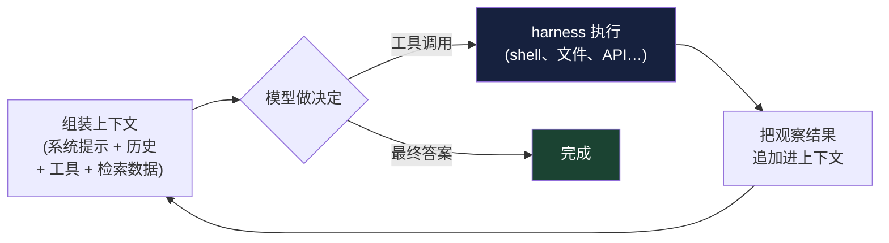
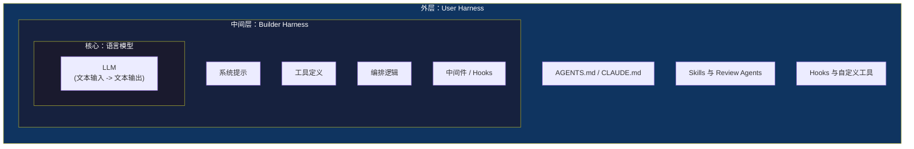

# 第 1 章：什么是 Agent Harness？

### 1.1 Model + Harness 公式

原始语言模型接收文本并输出文本。这就是它原生能力的全部。要把它变成 agent，也就是一个能浏览代码库、运行测试、写入数据库、与用户对话、从错误中恢复，并在数小时任务中持续推进的系统，额外能力都必须围绕模型构建出来。LangChain 将 harness 枚举为：系统提示、工具及其描述、内置基础设施（文件系统、沙箱、浏览器）、子代理派生和模型路由等编排逻辑，以及压缩、续跑、lint 检查等确定性执行的 hooks 或中间件 ([LangChain - The Anatomy of an Agent Harness](https://blog.langchain.com/the-anatomy-of-an-agent-harness/))。

这个框架之所以重要，是因为它把设计问题摆到了明处。模型开箱即用时，无法跨交互维护持久状态、执行代码、访问实时知识，也不能为了完成任务自行配置环境和安装包；这些都是 harness 层能力 ([LangChain - The Anatomy of an Agent Harness](https://blog.langchain.com/the-anatomy-of-an-agent-harness/))。即使是最基本的聊天，也就是模型看起来“记得”刚才说过什么，本质上也是一个 harness 模式：一个 while-loop 记录历史消息，并把新消息追加进上下文。

HumanLayer 从配置 coding agent 的视角给出的工作定义基本相同：“coding agent = AI model(s) + harness”。这里的 harness 是 agent 的运行时，或者说是模型用来与环境交互的外围设备 ([HumanLayer - Skill Issue: Harness Engineering for Coding Agents](https://www.humanlayer.dev/blog/skill-issue-harness-engineering-for-coding-agents))。

### 1.2 Agent 循环

在逐块剖析 harness 之前，先看清每个 agent 都在运行的那个循环。一次原始模型调用是一次性的——文本进，文本出。*agent* 把这次调用包进一个循环里：

1. **组装上下文** — 系统提示、目前为止的对话与事件历史、工具定义，以及任何刚检索到的数据，被拼接成模型的输入。
2. **模型做决定** — 它发出最终答案，或一个 *工具调用*：通常是 JSON 的结构化输出，指明工具名和参数。
3. **harness 执行** — 确定性的 harness 代码解析这个工具调用，执行它（一条 shell 命令、一次文件读取、一个 API 请求），并捕获结果。
4. **追加观察结果** — 工具结果作为新消息追加进上下文。
5. **重复** — 循环带着更长的上下文再次运行，直到模型返回最终答案或触发停止条件。

因此，工具调用不是魔法，也不是模型真的直接行动。它只是模型生成的结构化输出，由代码解释和执行；HumanLayer 后来也把这一点明确成 “tools are just structured outputs” 原则 ([HumanLayer - 12-Factor Agents](https://www.humanlayer.dev/blog/12-factor-agents))。Agent transcript 中所有看起来像“动作”的东西也是如此：文件编辑、shell 命令、浏览器点击、数据库写入、给人类发消息，都只有在 harness 接受模型请求并执行之后，才会变成真实效果。

Anthropic 把这个循环中心的模型称为 *augmented LLM*——配备了检索、工具和记忆的模型，能生成自己的查询、选择工具、决定保留什么 ([Anthropic - Building Effective Agents](https://www.anthropic.com/engineering/building-effective-agents))。在研究文献中，这种把推理与工具调用交错进行的模式常被称为 *ReAct*（reason + act）([Yao et al. - ReAct](https://arxiv.org/abs/2210.03629))；无论模型是否在每次调用前以可见文本“思考”，循环结构都是一样的。

这个循环的两个后果贯穿全书。第一，**上下文单调增长**：每一轮都追加一个工具调用及其观察结果，因此 N 步任务会累积 N 轮历史。这就是为什么第 2 章把上下文当作有限资源，也是压缩、子代理和记忆之所以存在的原因。第二，**模型本身从不执行任何东西**——它只发出请求，由确定性的 harness 代码决定满足哪些请求。请求与执行之间的这个间隙，正是后续章节中每一道护栏、沙箱、hook 和审批关卡的插入点：harness 就处在循环里，夹在模型所要求的与实际发生的之间。

### 1.3 Harness 的边界：内层与外层

“Harness”这个词的用法并不总是严格。Thoughtworks 的作者指出，不同人说 harness 时可能指不同层。Birgitta Böckeler 建议把它理解成三层同心圆：核心是模型，中间是 coding agent 的 *builder harness*（Anthropic、OpenAI 等提供的系统提示和工具），外层是 *user harness*（团队为了适配自己代码库而添加的 AGENTS.md、hooks、skills、review agents）([Thoughtworks / Martin Fowler - Harness Engineering](https://martinfowler.com/articles/exploring-gen-ai/harness-engineering.html))。多数工程师的日常工作主要发生在外层。

### 1.4 Harness 为什么存在：从模型缺陷倒推

LangChain 给出了一种有用推导：先列出你希望 agent 具备的行为，再列出模型原生做不到什么，harness 组件就会自然浮现出来 ([LangChain - The Anatomy of an Agent Harness](https://blog.langchain.com/the-anatomy-of-an-agent-harness/))。文件系统之所以存在，是因为模型只能操作上下文窗口中的内容，而文件系统提供持久存储、卸载工作内容的空间，以及多 agent 和人类协作的界面。Bash 和代码执行之所以存在，是因为预先定义 agent 可能需要的所有工具并不现实；给模型一个通用执行通道，可以让它按需现场设计工具。沙箱之所以存在，是因为执行必须发生在安全边界内。记忆和搜索之所以存在，是因为模型除了权重和当前上下文之外没有新知识，任何新信息都必须注入。压缩、工具结果卸载和 skills 之所以存在，是因为上下文窗口有限，并且会随着填充而退化。

每个组件都是对某个具体限制的回应。Harness 整体就是这些回应的总和。

### 1.5 历史脉络：从 Prompt Engineering 到 Harness Engineering

Anthropic 将最近的转变描述为自然演进。早期 LLM 应用的主导工作是 *prompt engineering*：为一次性任务编写和组织指令。随着应用发展成多轮、长时间运行的 agent，相关工作转向 *context engineering*：在 LLM 推理时策划和维护最优 token 集合，包括提示词之外进入上下文的一切信息 ([Anthropic - Effective Context Engineering for AI Agents](https://www.anthropic.com/engineering/effective-context-engineering-for-ai-agents))。

Harness engineering 位于 context engineering 之上。Mitchell Hashimoto 的说法是，每当 agent 犯错，就花时间把系统工程化到它以后不再犯同一个错 ([HumanLayer - Skill Issue: Harness Engineering for Coding Agents](https://www.humanlayer.dev/blog/skill-issue-harness-engineering-for-coding-agents) quoting Hashimoto)。Prompt engineering 调的是一个提示；harness engineering 迭代的是承载这个提示运行的整个系统。

### 1.6 Framework、Runtime 与 Harness

这三个词有时会被混用。LangChain 的 Harrison Chase 给出了如下区分 ([LangChain - Agent Frameworks, Runtimes, and Harnesses, Oh My!](https://blog.langchain.com/agent-frameworks-runtimes-and-harnesses-oh-my/))：

*Framework*，例如 LangChain、Vercel AI SDK、CrewAI、OpenAI Agents SDK、Google ADK，提供抽象，帮助快速开始并标准化应用构建方式。*Runtime*，例如 LangGraph、Temporal、Inngest，负责基础设施层问题：持久执行、流式输出、human-in-the-loop、线程级和跨线程持久化。*Harness*，例如 LangChain 的 DeepAgents 或 Anthropic 的 Claude Agent SDK，则位于更高一层：它带有默认提示、带立场的工具处理、规划工具、文件系统访问，以及其他“开箱即用”的能力。边界会模糊（LangGraph 可以合理地既被叫 runtime 也被叫 framework），但这个区分有助于判断应该采用什么。

### 1.7 怀疑论观点

Harness engineering 这个视角并非没有反对意见。HumanLayer 在 “Skill Issue” 中的论点是，很多团队把问题归因于模型：“GPT-6 会解决”“我们只需要更好的指令遵循”，但真正的问题往往是 harness 配置 ([HumanLayer - Skill Issue: Harness Engineering for Coding Agents](https://www.humanlayer.dev/blog/skill-issue-harness-engineering-for-coding-agents))。随着模型进步，现有失败模式会消失，但更聪明的模型会被交给更难的问题，并继续以意想不到的方式失败，因为意外失败是非确定性系统的基本属性。结论是：harness engineering 是长期工作，不是模型足够好后就能丢掉的脚手架。

LangChain 得出类似结论：随着模型更强大，今天 harness 中的一些能力会被吸收到模型中，但 harness engineering 仍然有用，既用于弥补缺陷，也用于围绕模型智能构建更有效的系统 ([LangChain - The Anatomy of an Agent Harness](https://blog.langchain.com/the-anatomy-of-an-agent-harness/))。

---

## 图：模型到 Harness 层

---

## 要点

- **Agent = Model + Harness**：任何超出原始文本输入输出的能力，都必须由周边系统工程化出来。
- **Agent 循环是基础**：组装上下文、模型发出工具调用、harness 执行、结果被追加——循环往复，每一轮都让上下文增长。
- **工具调用是结构化请求**：模型用文本提出动作，harness 决定哪些请求会变成真实效果。
- **三层同心圆**：LLM 核心、AI 实验室提供的 builder harness、团队自行构建的 user harness。
- **Harness 组件来自模型缺陷**：文件系统、沙箱、记忆、压缩分别回应具体限制。
- **Harness engineering 是长期工作**：模型越强，任务越难，新的失败模式也会出现。
- **Framework 不等于 Runtime，不等于 Harness**：理解区别有助于做采用决策。

## 延伸阅读

- Vivek Trivedy, *The Anatomy of an Agent Harness*, LangChain, Mar 2026. https://blog.langchain.com/the-anatomy-of-an-agent-harness/
- Harrison Chase, *Agent Frameworks, Runtimes, and Harnesses, Oh My!*, LangChain, Oct 2025. https://blog.langchain.com/agent-frameworks-runtimes-and-harnesses-oh-my/
- Kyle Brunet, *Skill Issue: Harness Engineering for Coding Agents*, HumanLayer, Mar 2026. https://www.humanlayer.dev/blog/skill-issue-harness-engineering-for-coding-agents
- Birgitta Böckeler, *Harness Engineering for Coding Agent Users*, Thoughtworks / martinfowler.com, Apr 2026. https://martinfowler.com/articles/exploring-gen-ai/harness-engineering.html
- Anthropic Applied AI Team, *Effective Context Engineering for AI Agents*, Anthropic, Sep 2025. https://www.anthropic.com/engineering/effective-context-engineering-for-ai-agents
- Erik Schluntz and Barry Zhang, *Building Effective Agents*, Anthropic, Dec 2024. https://www.anthropic.com/engineering/building-effective-agents
