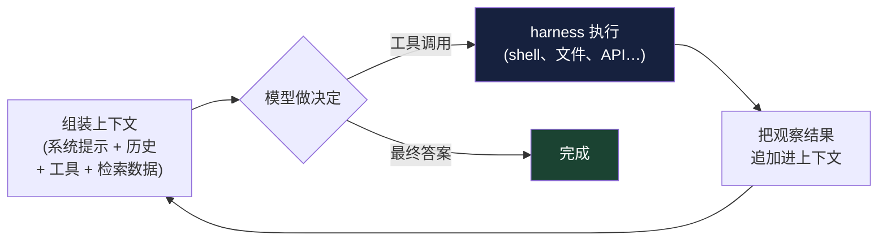
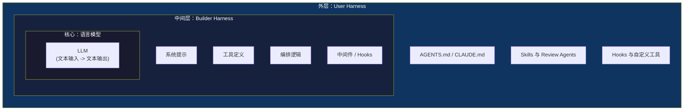

# 第 1 章：什么是 Agent Harness？

### 1.1 Model + Harness 公式

原始语言模型只能接收文本、输出文本；配套的前置卷介绍了它的原生能力与局限（见《LLM Foundations》第 1 章）。要把模型变成 agent，让它能够浏览代码库、运行测试、写入数据库、与用户对话、从错误中恢复，乃至在长达数小时的任务中持续推进，就必须围绕模型构建所有这些额外能力。LangChain 将由此形成的 harness 分为几类：系统提示；工具及其描述；文件系统、沙箱和浏览器等内置基础设施；子代理派生、模型路由等编排逻辑；以及负责压缩、续跑、lint 检查等确定性操作的 hooks 或中间件 ([LangChain - The Anatomy of an Agent Harness](https://blog.langchain.com/the-anatomy-of-an-agent-harness/))。

这一框架把系统设计问题清楚地摆在了台面上。模型本身无法跨多次交互保存持久状态、执行代码、获取实时知识，也不能自行配置环境和安装软件包。这些都属于 harness 层的能力 ([LangChain - The Anatomy of an Agent Harness](https://blog.langchain.com/the-anatomy-of-an-agent-harness/))。即便是最基本的聊天也依赖一种 harness 模式：while-loop 保存历史消息，再把新消息加入上下文，于是模型看起来像是“记得”刚才的对话。

HumanLayer 从配置 coding agent 的角度给出了几乎相同的公式：“coding agent = AI model(s) + harness”。它把 harness 称为 agent 的运行时或“外围设备”，也就是模型与环境交互所依赖的各个组件 ([HumanLayer - Skill Issue: Harness Engineering for Coding Agents](https://www.humanlayer.dev/blog/skill-issue-harness-engineering-for-coding-agents))。

### 1.2 Agent 循环

配套的前置卷已经介绍了 agent 循环，以及它背后的一项关键原则：工具调用只是交给 harness 执行的结构化输出，并不是模型亲自采取的行动（见《LLM Foundations》第 1 章与第 12 章）。简要回顾一下：原始模型调用是一次性的，也就是文本输入、文本输出；*agent* 则把这次调用放进一个循环。Harness 先组装上下文，模型再输出最终答案或一个 *工具调用*。工具调用通常是 JSON 格式的结构化输出，其中包含工具名称和参数。随后，确定性的 harness 代码执行该调用，把观察结果加入上下文，并以扩展后的上下文开始下一轮。

HumanLayer 用一句话概括了同一个意思：“tools are just structured outputs” ([HumanLayer - 12-Factor Agents](https://www.humanlayer.dev/blog/12-factor-agents))。无论是编辑文件、执行 shell 命令、点击浏览器，还是写入数据库，都只有在 harness 接受并执行模型请求之后，才会在现实中产生效果。位于这个循环中心的模型，就是 Anthropic 所说的 *augmented LLM*，也是研究文献中的 *ReAct*（reason + act）（具体机制见《LLM Foundations》第 12 章）。

这个循环会带来两个贯穿全书的后果。第一，**上下文单调增长**：每一轮都会追加一次工具调用及其观察结果，因此一个包含 N 个步骤的任务会积累 N 轮历史。正因如此，第 2 章把上下文视为有限资源，而压缩、子代理和记忆都是管理这种资源的手段。第二，**模型本身从不执行任何操作**。模型只会发出请求，确定性的 harness 代码则负责决定是否执行、如何执行。请求与执行之间的这段距离，为后续章节中的护栏、沙箱、hook 和审批关卡提供了介入点。Harness 就位于循环之中，连接模型提出的请求与最终发生的现实效果。

```mermaid
flowchart LR
    A["组装上下文<br/>(系统提示 + 历史<br/>+ 工具 + 检索数据)"] --> B{"模型做决定"}
    B -->|"工具调用"| C["harness 执行<br/>(shell、文件、API…)"]
    C --> D["把观察结果<br/>追加进上下文"]
    D --> A
    B -->|"最终答案"| E["完成"]

    style C fill:#16213e,color:#fff
    style E fill:#1b4332,color:#fff
```

### 1.3 Harness 的边界：内层与外层

“Harness”这个词并没有完全统一的边界。Thoughtworks 的作者指出，不同人所说的 harness 可能覆盖不同层次。Birgitta Böckeler 建议将其理解为三层同心圆：核心是模型；中间层是 coding agent 的 *builder harness*，包括 Anthropic、OpenAI 等厂商提供的系统提示和工具；外层是 *user harness*，包括团队为适配自己的代码库而添加的 AGENTS.md、hooks、skills 和 review agents ([Thoughtworks / Martin Fowler - Harness Engineering](https://martinfowler.com/articles/exploring-gen-ai/harness-engineering.html))。多数工程师的日常工作主要集中在最外层。

OpenReview 论文 *Agent Harness Engineering: A Survey* 对这条边界给出了更正式的定义：harness 是一套软件和接口基础层，用来管理 foundation model 如何获取上下文、调用工具、持续执行任务，并在部署环境中保持可审计性 ([OpenReview - Agent Harness Engineering: A Survey](https://openreview.net/pdf?id=3hXEPbG0dh))。论文进一步将 harness 视为一种潜在的 *binding constraint*：对于长周期 agent，可靠性往往既取决于模型本身的质量，也同样取决于模型周围的运行基础。

### 1.4 ETCLOVG：七层系统地图

这篇综述用 **ETCLOVG** 组织 harness 的设计空间：Execution environment、Tool interface、Context、Lifecycle、Observability、Verification 和 Governance ([OpenReview - Agent Harness Engineering: A Survey](https://openreview.net/pdf?id=3hXEPbG0dh))。这张地图提醒我们，harness 不能被简化为只有 prompt 或 tool。

- **Execution environment**：让操作产生实际效果的沙箱、浏览器、操作系统、代码执行器或托管云环境。
- **Tool interface**：协议、schema、registry、function calling、MCP/A2A 式边界和工具选择策略。
- **Context**：prompt 组装、检索、记忆、压缩、状态压缩，以及允许模型看到哪些信息。
- **Lifecycle**：任务启动、规划、checkpoint/resume、失败恢复、handoff、session 终止和长时间运行所需的状态。
- **Observability**：trace、telemetry、成本归因、延迟、token 用量核算和失败取证。
- **Verification**：eval harness、grader、任务集、outcome check 和 readiness gate。
- **Governance**：权限、策略语言、审计记录、人类审批、constitutional/rule-based 控制和跨层安全。

接下来的大部分章节，都可以看作对这七个层次的逐一展开。第 2—3 章主要讨论 context 和 memory；第 4—5 章讨论 tools 和 execution；第 7—9 章转向 lifecycle；第 10—12 章则展开 verification、observability 和 governance，并在展望部分再次回到这些主题。

### 1.5 Harness 为什么存在：从模型缺陷倒推

LangChain 提供了一种倒推 harness 组件的方法：先列出你希望 agent 表现出的行为，再找出模型原生无法做到的部分。所需的 harness 组件便可以从这些能力缺口中推导出来 ([LangChain - The Anatomy of an Agent Harness](https://blog.langchain.com/the-anatomy-of-an-agent-harness/))。

例如，模型只能处理上下文窗口中的信息，因此文件系统需要承担持久存储、信息卸载，以及 agent 与人类共享工作空间的作用。Bash 和代码执行解决的是另一项局限：我们不可能预先定义 agent 可能用到的每一种工具，因此需要提供通用执行通道，让模型按需创建工具。执行过程又必须置于安全边界之内，所以需要沙箱。模型无法凭空获知权重和当前上下文之外的信息，所以需要借助记忆与搜索把新信息注入上下文。上下文窗口本身容量有限，而且内容越多，性能越可能下降，因此还需要压缩、工具结果卸载和 skills。

每个组件都在弥补一项具体局限，而 harness 就是这些组件共同构成的系统。

### 1.6 历史脉络：从 Prompt Engineering 到 Harness Engineering

Anthropic 将这几次转变描述为一种自然演进。早期 LLM 应用主要关注 *prompt engineering*，也就是为一次性任务编写和组织指令。随着应用发展成能够多轮交互、长时间运行的 agent，关注范围扩展到了 *context engineering*：在 LLM 推理期间整理并持续维护最有用的一组 token，其中也包括提示词之外进入上下文的所有信息 ([Anthropic - Effective Context Engineering for AI Agents](https://www.anthropic.com/engineering/effective-context-engineering-for-ai-agents))。

Harness engineering 又比 context engineering 高一个层次。按照 Mitchell Hashimoto 的说法，每当 agent 出错，都应投入时间设计系统性解决方案，避免它以后重犯同样的错误 ([HumanLayer - Skill Issue: Harness Engineering for Coding Agents](https://www.humanlayer.dev/blog/skill-issue-harness-engineering-for-coding-agents) quoting Hashimoto)。Prompt engineering 调整的是单个提示；harness engineering 改进的则是提示运行于其中的整套系统。

2026 年，这一演进又出现了名为 *loop engineering（循环工程）* 的新视角。随着 agent 开始在更长周期内无人值守地运行，工作的关注点再次转移：先是 prompt，再到 context，如今则是决定“给模型什么提示、何时调用模型、结果是否合格”的 *loop* ([Addy Osmani - Loop Engineering](https://addyosmani.com/blog/loop-engineering/))。Loop engineering 与其说是 harness engineering 的替代方案，不如说是从运行管理角度观察其外层控制循环，重点关注围绕 agent 的 trigger、verifier 和 stop rule。第 8 章将完整展开这一概念。

### 1.7 Framework、Runtime 与 Harness

这三个词有时会被混用。LangChain 的 Harrison Chase 对它们作了如下区分 ([LangChain - Agent Frameworks, Runtimes, and Harnesses, Oh My!](https://blog.langchain.com/agent-frameworks-runtimes-and-harnesses-oh-my/))：

*Framework*（如 LangChain、Vercel AI SDK、CrewAI、OpenAI Agents SDK 或 Google ADK）提供开发抽象，帮助开发者快速入门，并统一应用的构建方式。*Runtime*（如 LangGraph、Temporal 或 Inngest）处理基础设施问题，包括持久执行、流式输出、human-in-the-loop，以及线程内和跨线程的状态持久化。*Harness*（如 LangChain 的 DeepAgents 或 Anthropic 的 Claude Agent SDK）则又高一层，通常内置默认提示、对工具处理方式的明确取舍、规划工具、文件系统访问，以及其他“开箱即用”的能力。三者的边界并非绝对，例如 LangGraph 既可以被视为 runtime，也可以被视为 framework；即便如此，这一区分仍有助于团队判断应该采用什么。

### 1.8 更好的模型会让 Harness 过时吗？

一个始终伴随 harness engineering 的问题是：模型变得更好之后，周边系统会不会就不再重要？HumanLayer 在 “Skill Issue” 中指出，团队常常把问题归咎于模型——“GPT-6 会解决”“我们只需要模型更听指令”——但真正的症结往往在于 harness 配置 ([HumanLayer - Skill Issue: Harness Engineering for Coding Agents](https://www.humanlayer.dev/blog/skill-issue-harness-engineering-for-coding-agents))。更好的模型会消除一些现有的失败模式，但也会被交付更困难的任务，并继续以意想不到的方式失败。这样的意外失败，是非确定性系统的基本属性。因此，harness engineering 是一项需要持续投入的工作，而不是等模型足够强大后就能丢弃的临时脚手架。

LangChain 也得出了类似结论。随着模型能力提升，今天位于 harness 中的一部分功能可能会被模型吸收。即便如此，harness engineering 仍有价值：既可以弥补模型的不足，也可以围绕模型智能构建系统，让这种智能得到更有效的发挥 ([LangChain - The Anatomy of an Agent Harness](https://blog.langchain.com/the-anatomy-of-an-agent-harness/))。

---

## 图：模型到 Harness 层

```mermaid
flowchart TB
    subgraph UH["外层：User Harness"]
        direction TB
        AM["AGENTS.md / CLAUDE.md"]
        SK["Skills 与 Review Agents"]
        HK["Hooks 与自定义工具"]

        subgraph BH["中间层：Builder Harness"]
            direction TB
            SP["系统提示"]
            TD["工具定义"]
            OL["编排逻辑"]
            MW["中间件 / Hooks"]

            subgraph MODEL["核心：语言模型"]
                LM["LLM<br/>(文本输入 -> 文本输出)"]
            end
        end
    end

    style MODEL fill:#1a1a2e,color:#fff
    style BH fill:#16213e,color:#fff
    style UH fill:#0f3460,color:#fff
```

---

## 要点

- **Agent = Model + Harness**：任何超出原始文本输入输出的能力，都必须通过周边系统构建出来。
- **Agent 循环是基础**：组装上下文、由模型发出工具调用、由 harness 执行，再把结果追加到上下文——循环每运行一轮，上下文都会继续增长。
- **工具调用是结构化请求**：模型以文本形式提出操作请求，harness 决定哪些请求会产生实际效果。
- **三层同心圆**：LLM 核心、AI 实验室提供的 builder harness、团队自行构建的 user harness。
- **ETCLOVG 提供系统地图**：execution、tools、context、lifecycle、observability、verification、governance 都是 harness 层。
- **Harness 组件来自模型局限**：文件系统、沙箱、记忆和压缩分别弥补不同的能力缺口。
- **Harness engineering 需要持续投入**：模型越强，承担的任务也越难，新的失败模式仍会出现。
- **Framework 不等于 Runtime，也不等于 Harness**：理解这些区别有助于团队做出技术选型。

## 延伸阅读

- Vivek Trivedy, *The Anatomy of an Agent Harness*, LangChain, Mar 2026. https://blog.langchain.com/the-anatomy-of-an-agent-harness/
- Harrison Chase, *Agent Frameworks, Runtimes, and Harnesses, Oh My!*, LangChain, Oct 2025. https://blog.langchain.com/agent-frameworks-runtimes-and-harnesses-oh-my/
- Kyle Brunet, *Skill Issue: Harness Engineering for Coding Agents*, HumanLayer, Mar 2026. https://www.humanlayer.dev/blog/skill-issue-harness-engineering-for-coding-agents
- Birgitta Böckeler, *Harness Engineering for Coding Agent Users*, Thoughtworks / martinfowler.com, Apr 2026. https://martinfowler.com/articles/exploring-gen-ai/harness-engineering.html
- Anthropic Applied AI Team, *Effective Context Engineering for AI Agents*, Anthropic, Sep 2025. https://www.anthropic.com/engineering/effective-context-engineering-for-ai-agents
- Erik Schluntz and Barry Zhang, *Building Effective Agents*, Anthropic, Dec 2024. https://www.anthropic.com/engineering/building-effective-agents
- *Agent Harness Engineering: A Survey*, OpenReview / TMLR submission, 2026. https://openreview.net/pdf?id=3hXEPbG0dh
