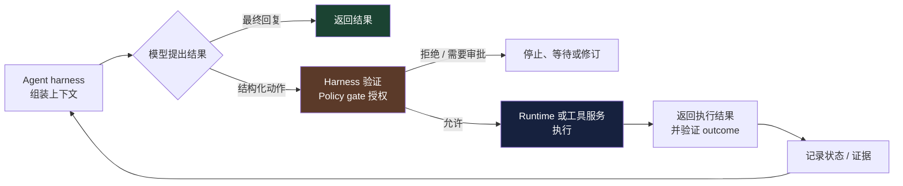

# 第 1 章：什么是 Agent Harness？

### 1.1 从有用的简称到精确的边界

配套的《LLM Foundations》把 **harness** 有意用作模型外部系统的粗粒度简称。在这个粒度上，下面的核心公式很有用：

> **Agent 的行为 = 模型的行为 + 周边系统的行为**

模型接收为当前一次推理组装好的表示，并生成 token 或结构化输出。模型本身不会保存持久的应用状态、授予权限、执行 shell 命令、写入数据库记录，也不会验证所请求的现实世界变化是否真的发生。这些责任位于模型之外，属于[模型—系统责任边界](../llm-foundations-zh/14-operational-mental-model.md)。

但在设计生产系统时，“模型之外的一切”范围太宽，因此本书需要更细的词汇。例如，Anthropic 把 **agent harness**（也称 scaffold）定义为使模型能够作为 agent 行动的系统：它处理输入、编排工具调用并返回结果；同时又单独定义了围绕该系统创建并运行测试的 **evaluation harness**（[Anthropic - Demystifying Evals for AI Agents](https://www.anthropic.com/engineering/demystifying-evals-for-ai-agents)）。本书采用这一区分，并在下文继续划分 runtime、product 和 platform 层。

因此，本书用 **agent harness** 指紧邻模型的循环控制系统；当一项论断涉及更大范围时，则使用**周边系统（surrounding system）**。“模型 + harness”这一粗粒度公式仍然是有用的教学工具，但它并不表示所有外部责任都由同一个进程、软件库或团队承担。

### 1.2 最小 Agent 循环：提议不等于效果

《LLM Foundations》已经介绍了模型侧的工具使用与最小循环（[Foundations 第 12 章](../llm-foundations-zh/12-reasoning-tools-and-agents.md)）。这里需要进一步明确工程边界：

1. Agent harness 从指令、筛选后的历史或记忆、工具 schema、检索数据和当前状态中**组装上下文**。
2. 模型**提出**最终回复，或提出工具调用等结构化动作。
3. Harness **解析并验证**这一提议，再把它送入所需的授权或审批关卡。
4. Runtime 或工具服务**执行**获准的动作。
5. 周边系统接收执行结果；如果动作后果重要，还要检查最终的环境状态或业务 outcome。
6. 系统记录状态并组装下一次模型输入，或者结束本次 run。

这是一项实际的接口契约，而不只是比喻。在 Anthropic 文档描述的客户端工具循环中，模型发出结构化的 `tool_use` 请求，应用代码执行操作，再把 `tool_result` 返回对话。由 provider 执行的工具只是把 executor 移到了 provider 的基础设施上，并没有让模型本身变成 executor（[Anthropic - How Tool Use Works](https://platform.claude.com/docs/en/agents-and-tools/tool-use/how-tool-use-works)）。

```mermaid
flowchart LR
    A["Agent harness<br/>组装上下文"] --> B{"模型提出结果"}
    B -->|"最终回复"| F["返回结果"]
    B -->|"结构化动作"| C["Harness 验证<br/>Policy gate 授权"]
    C -->|"拒绝 / 需要审批"| G["停止、等待或修订"]
    C -->|"允许"| D["Runtime 或工具服务<br/>执行"]
    D --> E["返回执行结果<br/>并验证 outcome"]
    E --> H["记录状态 / 证据"]
    H --> A

    style C fill:#5b3a29,color:#fff
    style D fill:#16213e,color:#fff
    style F fill:#1b4332,color:#fff
```

真正关键的边界位于**提议（proposal）**与**效果（effect）**之间。通过 schema 验证的请求并不自动拥有执行权限，成功的 API 响应也不一定能证明预期 outcome 已经发生。模型可以解释、请求或建议一项动作，但不能自行授予权限。后续章节会把 validation、authorization、execution 和 outcome confirmation 分别落成具体设计。

### 1.3 上下文不必单调增长

在最简单的 append-only 实现中，每轮循环都会向 transcript 加入模型请求和工具结果，因此 transcript 会单调增长。但生产 harness 不必在每次调用时重新发送全部原始 transcript。它可以裁剪消息、把 artifact 移出上下文、压缩旧内容、重置 context、检索部分 memory，或只在需要时暴露工具。Anthropic 把 context engineering 描述为整理推理期间可用的 token 集合，而不只是不断累积对话文本（[Anthropic - Effective Context Engineering for AI Agents](https://www.anthropic.com/engineering/effective-context-engineering-for-ai-agents)）。

因此，准确的不变量不是“上下文始终增长”，而是**一次 run 会持续产生需要管理的信息**。下一次 context 是对这些信息筛选和序列化后的视图。筛选与压缩可能丢失证据或改变行为，所以系统必须在模型输入之外保存持久状态、artifact、provenance 和尚未解决的不确定性。Context 是一次调用的有限输入，而不是系统数据库或 event history；其底层机制见 [Foundations 第 9 章](../llm-foundations-zh/09-context-window-and-kv-cache.md)。

### 1.4 本书使用的六个系统层级

下列层级是本书采用的架构约定。真实产品可能把几个层级合并到一个服务中，也可能把一个层级拆给多个 vendor，但这些责任仍然可以区分。

| 层级 | 本书中的定义 | 典型责任 |
|---|---|---|
| **Model** | 接收当前表示并生成 token 或结构化输出的概率组件 | 语言与多模态推理、动作提议、分类、计划 |
| **Agent harness** | 组装输入、解析输出并驱动一个或多个 agent loop 的模型邻近系统 | Prompt/context 组装、工具暴露、循环控制、handoff 协调 |
| **Runtime** | 让工作可持久执行，并负责运行获准操作的执行基础 | 调度、队列、checkpoint、retry 语义、沙箱、worker 生命周期 |
| **Product / application** | Agent 所嵌入的用户侧 workflow 与领域系统 | UX、领域逻辑、业务状态、review surface、用户沟通 |
| **Platform / control plane** | 管理多 tenant、多版本、多 agent 和多 runtime 的管理层 | Registry、identity、policy 管理与决策、rollout、fleet 生命周期 |
| **Evaluation harness** | 创建 trial、调用被测系统、采集证据并应用 grader 的测试系统 | 任务环境、隔离、多次 trial、transcript、outcome、报告 |

在每一种部署中，这些层级都不一定表现为同心结构。例如，授权决策可能来自 platform 服务，但由 runtime 中的 enforcement point 阻止不允许的动作。同样，由 provider 执行的工具可以提供一部分 runtime 能力，而 workflow 仍归 product 所有。

**Framework** 与这些层级不同：它是用于实现一个或多个层级的一组抽象或软件库。把某个组件称为 framework，说明的是开发者如何用它构建系统，而不是它拥有哪项生产责任。

### 1.5 六类外部责任分别归谁所有？

Foundations 卷在结尾给出了必须位于模型预测之外的六类责任：context、state、tools、permissions、verification 和 consequences。按照本书采用的更细粒度，它们的归属如下：

| 责任 | 周边系统中的主要 owner | 模型的合理角色 |
|---|---|---|
| **Context** | Agent harness 筛选并序列化模型可见的视图 | 使用所提供的上下文；指出可能还需要哪些信息 |
| **State** | Runtime 保存 execution state；product 拥有领域和业务状态 | 提议状态变更；绝不能充当唯一的持久记录 |
| **Tools** | Agent harness 暴露契约；runtime 或工具服务执行 | 选择工具并提出参数 |
| **Permissions** | Product/platform policy 作出决策；runtime 中不可绕过的 enforcement point 负责落实 | 请求访问或解释意图；绝不能自行授予权限 |
| **Verification** | Runtime、product 和 evaluation harness 采用测试、环境检查、grader 或人工 review | 提供 critique 或假设，但只作为一种可能出错的信号 |
| **Consequences** | Runtime 与接入的外部系统产生并记录实际效果；product 负责解释其业务含义 | 预测或描述预期效果 |

在 Foundations 教材的粗粒度边界上，说“harness 拥有这些责任”是正确的。本书通过这张表进一步避免这个简称掩盖真正需要实现某项保证的子系统。

### 1.6 Agent Harness 与 Evaluation Harness 是不同系统

**Agent harness** 是被评估系统的一部分。**Evaluation harness** 则在测试期间包围这个系统：它配置任务与环境，调用 model 与 agent harness 的组合，记录一次 trial，检查 transcript 或最终环境状态，应用 grader，再汇总结果。Anthropic 的评估术语也作出了相同区分，并指出评估一个“agent”时，实际评估的是模型与其 agent harness 的组合（[Anthropic - Demystifying Evals for AI Agents](https://www.anthropic.com/engineering/demystifying-evals-for-ai-agents)）。

这一区分在运营中很重要。生产 trace 可以为评估提供证据，但生产 observability 并不会自动构成 evaluation harness。反过来，测试 runner 可以模拟工具与环境，却不一定是为用户提供服务的 runtime。把二者分开后，团队才可能在保持测试基础设施足够稳定的同时，更换 agent harness 并测量改动效果。

### 1.7 两张有用的地图，但都不是通用标准

业界使用多种彼此重叠的地图来描述周边系统。它们回答的问题不同，不应被误认为规范层级。

Birgitta Böckeler 为 coding agent 提出了三层同心范围：模型；由模型或 agent vendor 提供的 **builder harness**；以及由采用方团队加入 repository 指令、hooks、skills 和 review agents 的 **user harness**（[Thoughtworks / Martin Fowler - Harness Engineering](https://martinfowler.com/articles/exploring-gen-ai/harness-engineering.html)）。这是一张描述 ownership 与 customization 的地图。Builder harness 和 user harness 都可能分别包含上文所定义的 agent-harness、runtime、product 与 evaluation 层组件。

2026 年的论文稿 *Agent Harness Engineering: A Survey* 提出了 **ETCLOVG**，用七个方面组织工程关注点：Execution environment、Tool interface、Context、Lifecycle、Observability、Verification 和 Governance（[OpenReview - Agent Harness Engineering: A Survey](https://openreview.net/pdf?id=3hXEPbG0dh)）。本书把它当作覆盖范围 checklist，而不是行业标准或部署架构：

- **Execution environment**：获准动作在何处转化为实际效果。
- **Tool interface**：schema、协议、registry 和选择策略。
- **Context**：组装、检索、memory 注入与压缩。
- **Lifecycle**：启动、checkpoint、恢复、handoff 与终止。
- **Observability**：trace、telemetry、延迟、成本与失败证据。
- **Verification**：outcome check、测试套件、grader 与发布门。
- **Governance**：identity、权限、审批、policy 与审计证据。

六个系统层级回答的是**责任位于哪里**。ETCLOVG 问的是**需要覆盖哪些关注点**。Builder/user 同心范围问的是**谁提供或定制组件**。同一个组件可以处于某个层级、覆盖多个关注点，也可以由多个参与方共同定制。

### 1.8 Framework、Runtime、Harness 与 Product 标签

Vendor 和 practitioner 文献并不统一使用这些标签。LangChain 的一种分类把 framework 描述为开发抽象，把 runtime 描述为持久执行基础设施，再把 harness 描述为更有明确取舍、功能更完整的 agent 系统；同时也承认存在相互重叠的案例（[LangChain - Agent Frameworks, Runtimes, and Harnesses, Oh My!](https://blog.langchain.com/agent-frameworks-runtimes-and-harnesses-oh-my/)）。这套分类有助于比较产品，但它不是协议规范。

因此，本书按照一个组件实际承担的责任对其分类，而不是照搬网站上的产品标签。名为“agent runtime”的软件库可能包含 agent-harness 逻辑；作为“agent platform”销售的产品也可能同时打包 runtime、control-plane、evaluation 和 application 功能。六层词汇让我们可以直接讨论这些功能，而无需强行把每个 vendor 放进唯一类别。

### 1.9 Prompt、Context、Harness 与 Loop Engineering

Prompt engineering、context engineering、harness engineering 和 loop engineering 更适合作为四种互补视角：

- **Prompt engineering** 设计模型可见的指令和示例。
- **Context engineering** 筛选并维护一次推理可用的信息；Anthropic 明确把它描述为整理推理期间使用的 token 集合（[Anthropic - Effective Context Engineering for AI Agents](https://www.anthropic.com/engineering/effective-context-engineering-for-ai-agents)）。
- **Harness engineering** 设计紧邻模型的控制与接口，把提议转换为受治理的工作。
- **Loop engineering** 是一个 practitioner 术语，关注重复调用、反馈、验证、budget 和 stop rule 的设计（[Addy Osmani - Loop Engineering](https://addyosmani.com/blog/loop-engineering/)）。

这些词并不表示所有系统都必须沿着同一条历史阶梯演进，彼此之间也不存在替代关系。可靠系统通常需要同时在四个范围内作出设计决策。

### 1.10 模型变强后，这条边界为什么仍然存在？

能力更强的模型可以减少失败，也可以吸收一些过去需要复杂 prompt 或 orchestration 才能实现的行为。但模型能力不会消除概率性提议与已授权、已记录外部效果之间的区别。只要 agent 能够花钱、修改数据、对外沟通或操作基础设施，某个周边系统就仍然必须负责 credential、policy enforcement、execution、durable state、verification 和 recovery。

能够变化的是这些机制的位置与复杂度。Provider 可能在服务端执行工具；product 可能把原先由显式 workflow 代码完成的 planning 移进模型；runtime 也可能让恢复过程对上层透明。实现边界可以移动，但责任边界仍应清晰可见。这就是本书其余章节的组织原则。

---

## 要点

- **“模型 + harness”是粗粒度公式**：它把模型预测与周边系统分开，但生产设计需要更细的层级。
- **Agent harness 紧邻模型**：它组装输入、解释提议并驱动循环，但并不自动等于完整产品或 platform。
- **提议不等于效果**：validation、authorization、execution 和 outcome confirmation 都发生在模型之外。
- **Context 是组装出来的，并非注定永远追加**：单调增长描述的是朴素 transcript，而不是所有 harness。
- **Runtime、product、platform 和 evaluation harness 各有不同职责**，即使同一 vendor 把它们打包出售。
- **Context、state、tools、permissions、verification 和 consequences 都有外部 owner**；模型只贡献提议和可能出错的判断。
- **ETCLOVG 与 builder/user 同心范围是有用的地图，不是通用标准**。
- **更好的模型可能移动实现边界，但不会因此取得对现实后果的权限**。

## 延伸阅读

- Anthropic, *How Tool Use Works*. https://platform.claude.com/docs/en/agents-and-tools/tool-use/how-tool-use-works
- Anthropic, *Demystifying Evals for AI Agents*, Jan 2026. https://www.anthropic.com/engineering/demystifying-evals-for-ai-agents
- Anthropic, *Effective Context Engineering for AI Agents*, Sep 2025. https://www.anthropic.com/engineering/effective-context-engineering-for-ai-agents
- Erik Schluntz and Barry Zhang, *Building Effective Agents*, Anthropic, Dec 2024. https://www.anthropic.com/engineering/building-effective-agents
- Birgitta Böckeler, *Harness Engineering for Coding Agent Users*, Thoughtworks / martinfowler.com, Apr 2026. https://martinfowler.com/articles/exploring-gen-ai/harness-engineering.html
- Harrison Chase, *Agent Frameworks, Runtimes, and Harnesses, Oh My!*, LangChain, Oct 2025. https://blog.langchain.com/agent-frameworks-runtimes-and-harnesses-oh-my/
- *Agent Harness Engineering: A Survey*, OpenReview 论文稿, 2026. https://openreview.net/pdf?id=3hXEPbG0dh
