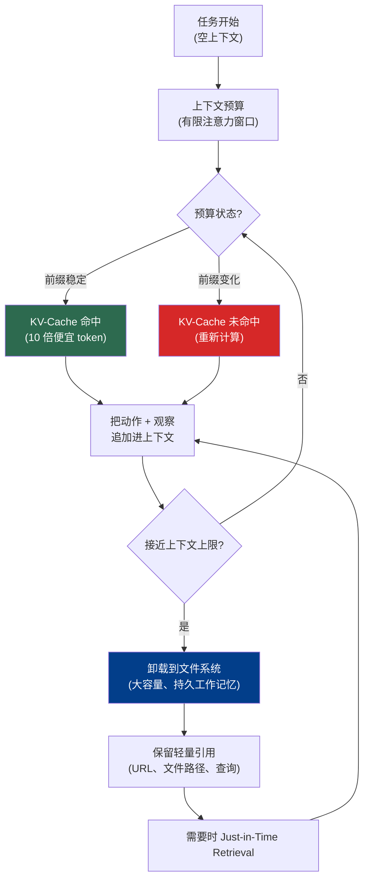

# 第 2 章：上下文是一种有限资源

### 2.1 Context Rot 与注意力预算

对 agent harness 来说，最重要的运行约束之一是：有用上下文不等于最大上下文长度。Anthropic 将相关失败模式称为 “context rot”，并把它与 needle-in-a-haystack benchmark 联系起来：随着 token 数增加，模型从上下文中准确回忆信息的能力可能下降 ([Anthropic - Effective Context Engineering for AI Agents](https://www.anthropic.com/engineering/effective-context-engineering-for-ai-agents))。这个效应取决于模型、任务和相关信息在上下文中的位置，所以应当把它理解成概率性工程约束，而不是每个 prompt 都严格成立的硬规律。

Anthropic 的机制解释并不是说 transformer 字面意义上“耗尽”了注意力，而是长上下文为模型带来了更多需要表示的 token 关系，而训练数据和位置机制通常更擅长较短、更局部的依赖。位置编码插值和其他长上下文技术可以让模型处理比原始训练更长的序列，但仍可能降低位置分辨率或检索可靠性 ([Anthropic - Effective Context Engineering for AI Agents](https://www.anthropic.com/engineering/effective-context-engineering-for-ai-agents))。

实践结论是：上下文是一种边际收益递减的有限资源。Anthropic 把它称作“注意力预算”。HumanLayer 更直白：即便模型支持更长上下文，生产系统通常也应偏向小而聚焦的提示与上下文；在他们的经验中，开放式“tool-calling loop”在大约 10-20 轮之后往往会变得难以恢复 ([HumanLayer - 12-Factor Agents](https://www.humanlayer.dev/blog/12-factor-agents))。

更大的上下文窗口在缺失信息确实需要出现时有帮助，但它不会自动带来更好的注意力或指令遵循。HumanLayer 指出，扩展上下文版本通常用 YaRN 等技术延长序列长度，而不是增加模型的有效“指令预算”；对 needle-in-a-haystack 式任务来说，更大的窗口有时只是把草堆变得更大 ([HumanLayer - Skill Issue](https://www.humanlayer.dev/blog/skill-issue-harness-engineering-for-coding-agents))。

### 2.2 有效上下文的结构

在预算约束下，目标是 Anthropic 所说的：“最小的一组高信号 token，使期望结果的概率最大化” ([Anthropic - Effective Context Engineering for AI Agents](https://www.anthropic.com/engineering/effective-context-engineering-for-ai-agents))。具体来说：

系统提示应当处在合适的“高度”：既不要为每个边界情况写硬编码 if-else，也不要只有模糊高层原则；它应该具体到足以引导行为，同时保留模型的强启发能力。Anthropic 建议用 XML 或 Markdown 分隔符组织提示，例如 `<background_information>`、`<instructions>`、`## Tool guidance` 等，但随着模型改进，格式本身的重要性会下降。

工具定义了 agent 与环境之间的契约。它们应当自包含、描述清晰、重叠最少。Anthropic 看到的常见失败是工具集臃肿，覆盖过多功能且决策点模糊；如果人类工程师都无法明确判断某个场景该用哪个工具，就不能期待 AI agent 做得更好。

Few-shot 示例应该多样且典型，而不是把每个边界情况都列成清单。Anthropic 的类比是：对 LLM 来说，示例是“胜过千言万语的图片”。

### 2.3 KV-Cache：为什么稳定前缀有价值

KV-cache 是生产 agent 设计中的关键杠杆。Manus 认为它是“生产阶段 AI agent 最重要的指标” ([Manus - Context Engineering for AI Agents](https://manus.im/blog/Context-Engineering-for-AI-Agents-Lessons-from-Building-Manus))。

机制是：典型 agent 接收输入，从工具空间中选择动作，执行动作，并把动作和观察结果追加进上下文供下一轮使用。上下文随每一步增长，而输出通常较短，使 prefilling 与 decoding 的比例极度倾斜。Manus 报告其平均输入/输出 token 比约为 100:1。相同前缀可以由 KV-cache 服务，从而降低首 token 延迟和推理成本。Manus 引用 Claude Sonnet 价格：缓存输入 token 每百万 $0.30，未缓存 $3，是 10 倍差距。

Manus 保持 cache 命中的三条规则是：保持 prompt 前缀稳定（一个 token 的差异会从该点起使 cache 失效，所以把秒级时间戳放进系统提示代价很高）；上下文追加式增长，并使用确定性 JSON 序列化（某些库不保证 key 顺序，会悄悄破坏 cache）；当推理框架需要时，显式标记 cache 断点。

### 2.4 Mask，而不是删除

Manus 的第二条原则关于动作空间。随着工具数量增长，MCP 让用户轻易接入数百个工具，常见冲动是运行中动态加载和卸载工具。Manus 的实验给出明确规则：避免这样做。工具定义位于上下文前部，任何变化都会使后续 cache 失效；前面轮次还可能引用已不存在的工具，导致 schema violation 或幻觉调用 ([Manus - Context Engineering for AI Agents](https://manus.im/blog/Context-Engineering-for-AI-Agents-Lessons-from-Building-Manus))。

替代方案是 action masking：在上下文中保持稳定的工具表面，然后根据当前状态约束可选动作。不同 provider 和 harness 可能用 logit constraint、tool-choice 控制、response prefill，或运行时 validator 拒绝不允许的动作来实现。Manus 使用一致的动作名前缀，例如浏览器工具 `browser_*`、shell 工具 `shell_*`，这样就能用简单约束启用或排除整个工具组。

### 2.5 文件系统作为工作记忆

即使有 128K token 窗口，真实 agentic 工作也经常超出上下文。网页和 PDF 的观察结果很大；性能在达到技术上限前就会退化；即使用 cache，长输入仍然昂贵 ([Manus - Context Engineering for AI Agents](https://manus.im/blog/Context-Engineering-for-AI-Agents-Lessons-from-Building-Manus))。

Manus 的解决方案，也是 Anthropic 和 LangChain 都趋同的方向，是把文件系统当作 agent 的工作记忆：它远大于上下文、跨轮次持久、可由 agent 直接操作，并由路径作为引用索引。它不是人类意义上的“记忆”；如果没有良好文件名、摘要、索引或检索习惯，agent 仍可能找不到自己写过的东西。Manus 的压缩策略刻意保持 *可恢复*：只要保留 URL，就可以从上下文中移除网页内容；只要保留路径，就可以省略文档内容。

LangChain 称文件系统是“可能最基础的 harness primitive”，因为它提供读取数据、代码和文档的工作区；让 agent 可以逐步卸载工作，而不是全放在上下文里；还天然成为多 agent 和人机协作表面 ([LangChain - The Anatomy of an Agent Harness](https://blog.langchain.com/the-anatomy-of-an-agent-harness/))。叠加 git 后，还能得到版本、回滚和分支。

### 2.6 Just-in-Time Retrieval

传统模式是：预先 embed 一切，检索 top-k chunk，再 prepend 到上下文。现在它正被 *just-in-time* 方法补充：与其预处理全部内容，agent 保留轻量标识符（文件路径、查询、链接），在需要时动态加载数据进上下文 ([Anthropic - Effective Context Engineering for AI Agents](https://www.anthropic.com/engineering/effective-context-engineering-for-ai-agents))。

Anthropic 的 Claude Code 在大型代码库工作中使用这个模式：模型编写目标查询、存储结果，并使用 `head`、`tail` 等工具分析大数据，而不是全部加载。文件路径元数据本身也有信息量：`tests/` 里的 `test_utils.py` 与 `src/core_logic/` 里的同名文件角色不同。目录层级、命名和时间戳都会成为 agent 导航信号。

代价是：运行时探索比检索预计算数据更慢；缺少工具指导的 agent 会浪费上下文追逐死路。常见混合模式是： upfront 提供少量高价值上下文，例如 `CLAUDE.md` 或 `AGENTS.md` 中的项目说明，然后让 agent 按需探索其余部分。

---

## 图：上下文预算 -> KV-Cache -> 文件系统记忆

---

## 要点

- **Context rot 足以影响设计**：更大上下文有帮助，但不能替代上下文策划。
- **KV-cache 是重要生产指标**：稳定前缀对延迟和成本的影响可能与模型质量同样关键。
- **能 mask 就不要随意 churn 工具**：运行中动态增删工具会破坏 cache locality，并可能导致 schema violation。
- **文件系统是工作记忆，不是魔法记忆**：它更大、更持久，但仍需要路径、摘要和检索纪律。
- **Just-in-time retrieval 往往优于预加载**：保留轻量标识符，只在需要时加载数据。

## 延伸阅读

- Anthropic Applied AI Team, *Effective Context Engineering for AI Agents*, Anthropic, Sep 2025. https://www.anthropic.com/engineering/effective-context-engineering-for-ai-agents
- Yichao 'Peak' Ji, *Context Engineering for AI Agents: Lessons from Building Manus*, Manus, Jul 2025. https://manus.im/blog/Context-Engineering-for-AI-Agents-Lessons-from-Building-Manus
- Dex Horthy, *12-Factor Agents*, HumanLayer, Apr 2025. https://www.humanlayer.dev/blog/12-factor-agents
- Kyle Brunet, *Skill Issue: Harness Engineering for Coding Agents*, HumanLayer, Mar 2026. https://www.humanlayer.dev/blog/skill-issue-harness-engineering-for-coding-agents
- Vivek Trivedy, *The Anatomy of an Agent Harness*, LangChain, Mar 2026. https://blog.langchain.com/the-anatomy-of-an-agent-harness/
