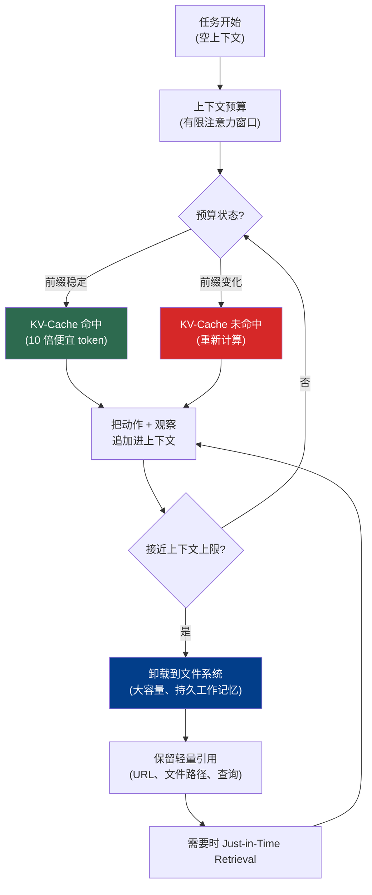

# 第 2 章：上下文是一种有限资源

### 2.1 上下文退化与注意力预算

对 agent harness 来说，最重要的运行约束是：有用的上下文不等于模型所能容纳的最长上下文。其背后的失败模式称为 *context rot*（上下文退化），即输入越长，模型的输出质量反而可能越差。配套卷已将这一现象拆成两层：一层来自长度本身，另一层来自无关信息的不断累积（见《LLM Foundations》第 9 章）。本章把上下文退化作为贯穿全章的设计约束。Anthropic 还将它与 needle-in-a-haystack benchmark 联系起来：上下文中的 token 越多，模型从中准确找回信息的能力就越可能下降 ([Anthropic - Effective Context Engineering for AI Agents](https://www.anthropic.com/engineering/effective-context-engineering-for-ai-agents))。具体影响取决于模型、任务以及相关信息所在的位置，因此应把它视为一种概率性的工程规律，而不是对每个 prompt 都必然成立的定律。

Anthropic 对其机制的解释并不是 transformer 会在字面意义上“耗尽”注意力。真正的问题是，上下文越长，模型需要表示的 token 两两关系就越多，而训练数据和位置机制通常更擅长处理较短、较局部的依赖。位置编码插值等长上下文技术虽然能让模型处理超出原始训练长度的序列，却仍可能牺牲位置分辨率或检索可靠性 ([Anthropic - Effective Context Engineering for AI Agents](https://www.anthropic.com/engineering/effective-context-engineering-for-ai-agents))。

工程上的结论是：上下文是一种边际收益递减的有限资源。Anthropic 将它比作“注意力预算”，每加入一个 token 都会消耗一部分预算。HumanLayer 的说法更直接：即使模型支持更长的上下文窗口，生产系统通常也应优先采用短小、聚焦的 prompt 和上下文。根据他们的经验，开放式的 “tool-calling loop” 运行约 10-20 轮后，往往就很难恢复到良好状态 ([HumanLayer - 12-Factor Agents](https://www.humanlayer.dev/blog/12-factor-agents))。

如果模型确实需要访问更多信息，更大的上下文窗口当然有帮助；但窗口变大，并不会自动改善注意力分配或指令遵循能力。HumanLayer 指出，扩展上下文版本往往使用 YaRN 等技术来延长可处理的序列，而不是提高模型实际可用的“指令预算”。对于 needle-in-a-haystack 式任务，更大的窗口有时只是带来一个更大的草堆 ([HumanLayer - Skill Issue](https://www.humanlayer.dev/blog/skill-issue-harness-engineering-for-coding-agents))。

### 2.2 有效上下文的结构

在这一预算约束下，目标就是 Anthropic 所说的：找到“尽可能少的一组高信号 token，使期望结果出现的概率最大化” ([Anthropic - Effective Context Engineering for AI Agents](https://www.anthropic.com/engineering/effective-context-engineering-for-ai-agents))。落实到 harness 中，主要涉及以下几个部分：

系统提示应处在合适的“抽象高度”：既不要为每个边界情况硬编码一套 if-else，也不要只给出模糊的高层原则。它需要具体到足以引导行为，同时给模型留出运用启发式判断的空间。Anthropic 建议用 XML 或 Markdown 分隔符来组织 prompt，例如 `<background_information>`、`<instructions>`、`## Tool guidance` 等；不过随着模型能力提高，具体格式的重要性正在下降。

工具定义了 agent 与环境之间的契约。每个工具都应当自包含、说明清楚，并尽量避免与其他工具功能重叠。Anthropic 观察到的常见问题是工具集过于臃肿：功能覆盖太广，工具之间的选择边界又不明确。如果人类工程师都无法断定某个场景应该使用哪个工具，就更不能指望 AI agent 做出更好的判断。

Few-shot 示例应当既多样又典型，而不是罗列所有边界情况。Anthropic 的类比是：对 LLM 而言，示例就像“胜过千言万语的图片”。

### 2.3 KV-Cache：为什么稳定前缀有价值

配套卷已经介绍过 KV-cache 和前缀稳定规则：只要改动前部的一个 token，例如系统提示中的时间戳，后面的所有 token 都必须重新计算（见《LLM Foundations》第 9 章）。本节关注的是 KV-cache 作为生产成本杠杆的价值。虽然上下文工程的学术文献很少讨论它，但它是生产级 agent 设计的核心。Manus 甚至认为，KV-cache 命中率是“生产阶段 AI agent 最重要的指标” ([Manus - Context Engineering for AI Agents](https://manus.im/blog/Context-Engineering-for-AI-Agents-Lessons-from-Building-Manus))。

KV-cache 之所以主导成本模型，与典型的 agent 循环有关。Agent 接收输入，从工具空间中选择并执行一个动作，再把动作和观察结果追加到上下文中，供下一轮使用。上下文每轮都在增长，模型输出却通常很短，因此预填充（prefill）与解码（decoding）的比例会严重失衡。Manus 报告的平均输入输出 token 比约为 100:1。如果前缀保持不变，KV-cache 就可以直接复用它，从而缩短首 token 延迟并降低推理成本。Manus 引用的 Claude Sonnet 价格显示：每百万缓存输入 token 的价格是 $0.30，未缓存输入则为 $3，相差 10 倍。

Manus 给出了三条保持 cache 命中的规则。第一，保持 prompt 前缀稳定：哪怕只有一个 token 不同，也会使 cache 从该处开始失效，因此在系统提示中加入精确到秒的时间戳会付出很高代价。第二，让上下文只追加、不改写，并使用确定性的 JSON 序列化；有些库不保证 key 的顺序，会在不易察觉的情况下破坏 cache。第三，如果推理框架要求，应显式标记 cache 断点。

### 2.4 屏蔽（Mask），而不是删除

Manus 的第二条原则涉及动作空间。随着工具数量增长，MCP（Model Context Protocol，模型上下文协议；见第 4 章）让用户可以轻松接入数百个工具，人们很容易想到在 agent 循环中动态加载和卸载工具。Manus 的实验给出了一条明确规则：不要这样做。工具定义位于上下文前部，一旦发生变化，后续内容的 cache 就会全部失效。此外，早先的对话轮次可能还引用了已经移除的工具，进而导致 schema violation 或产生并不存在的工具调用 ([Manus - Context Engineering for AI Agents](https://manus.im/blog/Context-Engineering-for-AI-Agents-Lessons-from-Building-Manus))。

替代方案是 action masking：让工具界面在上下文中保持稳定，同时根据当前状态限制 agent 可以选择的动作。具体实现取决于 provider 和 harness，可以使用 logit constraint、tool-choice 控制、response prefill，也可以由运行时 validator 拒绝不允许的动作 ([Manus - Context Engineering for AI Agents](https://manus.im/blog/Context-Engineering-for-AI-Agents-Lessons-from-Building-Manus))。Manus 会为同类动作采用一致的名称前缀，例如浏览器工具使用 `browser_*`，shell 工具使用 `shell_*`。这样，一条简单的约束就能允许或排除整个工具组。

### 2.5 文件系统作为工作记忆

即使上下文窗口达到 128K token（这是 Manus 当时引用的数字；如今的窗口更大，但基本规律没有改变），真实的 agentic 任务仍会经常超出容量。网页和 PDF 可能产生体量巨大的观察结果；模型性能也可能在触及技术上限之前就开始下降；即便能够使用 cache，长输入的成本仍然很高 ([Manus - Context Engineering for AI Agents](https://manus.im/blog/Context-Engineering-for-AI-Agents-Lessons-from-Building-Manus))。

Manus 的解决方案，也与 Anthropic 和 LangChain 的思路一致：把文件系统当作 agent 的工作记忆。文件系统的容量远大于上下文窗口，可以跨轮次持久保存，agent 也能直接操作其中的内容，并通过路径引用保存的产物。但它并不是人类意义上的“记忆”。如果文件名、摘要、索引或检索习惯设计得不好，agent 仍然可能找不到自己写下的内容。因此，Manus 刻意采用 *可恢复* 的压缩策略：只要留下 URL，就可以把网页正文移出上下文；只要保留文件路径，就可以暂时省略文档内容。

LangChain 称文件系统是“可能最基础的 harness primitive”。它既为数据、代码和文档提供统一的工作区，也让 agent 能够逐步把中间成果转存到外部，而不必把所有内容都留在上下文中；同时，它还是多 agent 协作和人机协作的天然界面 ([LangChain - The Anatomy of an Agent Harness](https://blog.langchain.com/the-anatomy-of-an-agent-harness/))。再叠加 git，就能获得版本管理、回滚和分支能力。

对于 coding agent，这个原则还应再推进一步：代码仓库应当成为项目事实的权威来源。OpenAI 的 Codex harness 指南强调，面向 agent 的仓库会把所需上下文放在代码附近：由 `AGENTS.md` 指明查找方向，用短小的设计文档解释局部架构，再通过结构检查把关键规则固化下来 ([OpenAI - Harness Engineering](https://openai.com/index/harness-engineering/))。如果一项决策只存在于 Slack、ticket 或资深工程师的记忆中，那么新的 agent session 就无法把它当作可靠上下文。

这并不意味着要把更多文字塞进 prompt，而是要让仓库中的事实容易被发现。一个实用的冷启动测试是：启动一个没有任何口头背景的新 agent session，只让它查看仓库，然后提出五个问题：这是什么系统？它如何组织？如何运行？如何验证？当前处于什么状态？如果 repo 文件和标准命令无法给出答案，说明 harness 存在知识可见性缺口。要补上这个缺口，通常需要在代码附近放置短小文档，提供稳定的入口、进度文件和验证命令，而不是堆出一个庞大的根级指令文件。

### 2.6 即时检索（Just-in-Time Retrieval）

传统的 RAG 流水线会预先对所有内容进行 embedding，检索最相关的 top-k chunk，再把它们放到上下文前部（见《LLM Foundations》第 11 章）。如今，*just-in-time* 方法正成为一种重要补充：agent 不必预处理并预加载全部内容，而是先保留文件路径、查询和链接等轻量标识符，只在真正需要时才把原始数据载入上下文 ([Anthropic - Effective Context Engineering for AI Agents](https://www.anthropic.com/engineering/effective-context-engineering-for-ai-agents))。

Anthropic 的 Claude Code 在处理大型代码库时就采用了这种模式。模型会编写有针对性的查询、保存结果，并借助 `head`、`tail` 等工具查看大型数据集，而不是一次性加载全部内容。文件路径本身也包含有用信息：`tests/` 目录中的 `test_utils.py`，与 `src/core_logic/` 目录下的同名文件，通常承担完全不同的职责。目录层级、名称和时间戳都可以成为 agent 的导航线索。

这种做法也有代价：运行时探索比检索预计算数据更慢；如果缺少明确的工具使用指导，agent 还可能在无效路径上浪费上下文。因此，实践中常采用混合模式：预先提供少量高价值上下文，例如 `CLAUDE.md` 或 `AGENTS.md` 中的项目说明，再让 agent 按需探索其他内容。

---

## 图：上下文预算 -> KV-Cache -> 文件系统记忆

```mermaid
flowchart TD
    A["任务开始<br/>(空上下文)"] --> B["上下文预算<br/>(有限注意力窗口)"]
    B --> C{预算状态?}
    C -->|"前缀稳定"| D["KV-Cache 命中<br/>(10 倍便宜 token)"]
    C -->|"前缀变化"| E["KV-Cache 未命中<br/>(重新计算)"]
    D --> F["把动作 + 观察<br/>追加进上下文"]
    E --> F
    F --> G{接近上下文上限?}
    G -->|否| C
    G -->|是| H["卸载到文件系统<br/>(大容量、持久工作记忆)"]
    H --> I["保留轻量引用<br/>(URL、文件路径、查询)"]
    I --> J["需要时 Just-in-Time Retrieval"]
    J --> F

    style D fill:#2d6a4f,color:#fff
    style E fill:#d62828,color:#fff
    style H fill:#023e8a,color:#fff
```

---

## 要点

- **上下文退化必须纳入设计**：更大的上下文窗口确实有帮助，但不能取代对上下文的筛选与组织。
- **KV-cache 是重要生产指标**：稳定前缀对延迟和成本的影响可能与模型质量同样关键。
- **能屏蔽就不要频繁更换工具界面**：运行中动态增删工具会破坏 cache locality，还可能导致 schema violation。
- **文件系统是工作记忆，不是万能记忆**：它容量更大、保存更持久，但仍然需要清晰的路径、摘要和检索规则。
- **仓库是 agent 的权威事实来源**：关键项目信息应当能在冷启动时通过 repo 文件和命令找到。
- **即时检索往往优于预加载**：先保留轻量标识符，只在需要时载入原始数据。

## 延伸阅读

- Anthropic Applied AI Team, *Effective Context Engineering for AI Agents*, Anthropic, Sep 2025. https://www.anthropic.com/engineering/effective-context-engineering-for-ai-agents
- Yichao 'Peak' Ji, *Context Engineering for AI Agents: Lessons from Building Manus*, Manus, Jul 2025. https://manus.im/blog/Context-Engineering-for-AI-Agents-Lessons-from-Building-Manus
- Dex Horthy, *12-Factor Agents*, HumanLayer, Apr 2025. https://www.humanlayer.dev/blog/12-factor-agents
- Kyle Brunet, *Skill Issue: Harness Engineering for Coding Agents*, HumanLayer, Mar 2026. https://www.humanlayer.dev/blog/skill-issue-harness-engineering-for-coding-agents
- Vivek Trivedy, *The Anatomy of an Agent Harness*, LangChain, Mar 2026. https://blog.langchain.com/the-anatomy-of-an-agent-harness/
- OpenAI, *Harness Engineering: Leveraging Codex in an Agent-First World*, Feb 2026. https://openai.com/index/harness-engineering/
