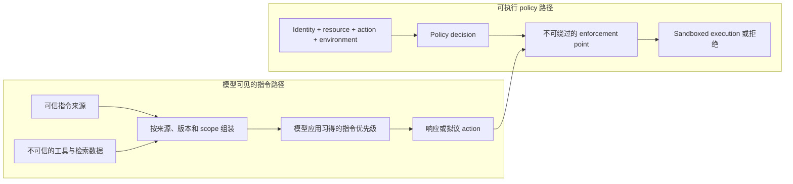

# 第 2 章：System Prompt、指令与 Policy 边界

《LLM Foundations》已经确立了两个事实，本章将把它们转化为工程实践。第一，role marker、delimiter 和指令都会被序列化为模型输入；post-training 可以让模型以不同方式响应这些内容，但不会把它们变成绝不会失效的控制通道。第二，模型可以提议动作，却不能授予自身权限，也不能产生外部效果（[Foundations 第 8 章](../llm-foundations-zh/08-prompting-and-in-context-learning.md)、[Foundations 第 14 章](../llm-foundations-zh/14-operational-mental-model.md)）。

因此，指令层承担着重要但有限的职责：塑造模型行为。它不是实施硬授权的地方。本章将说明如何组合、版本化、缓存和评测模型可见的指令，同时把可执行 policy 留在 harness 与 runtime 中。

### 2.1 指令是模型输入，不是可执行 Policy

Agent 的 system prompt 不只是用户在聊天框中输入的问题。它是一种持续维护、面向模型的工件，可以定义 agent 的角色、目标、工具使用指导、响应 contract，以及处理不确定性的规则。HumanLayer 用 *own your prompts* 概括了这项运维原则：不要让重要行为隐藏在没有版本管理的框架默认值里（[HumanLayer — 12-Factor Agents](https://www.humanlayer.dev/blog/12-factor-agents)）。

把 prompt 称为“应用代码”有助于强调责任归属，但不能抹去一个关键区别：runtime 中的代码会执行确定性检查；prompt 文本则为概率模型提供条件。一句“绝不把数据发送到这个 tenant 之外”可以减少不安全提议，却无法检查凭据、阻断网络出口，也无法让 dispatch 路径不可绕过。这些控制必须位于模型之外。

Prompt 也不是模型内部的持久状态。Harness 为一次调用选择并组装指令，provider 序列化相应的 role 与内容，模型再基于该 representation 生成下一份输出。之后的调用只有在外围系统再次提供这条指令时才能看到它。

### 2.2 指令优先级是一种行为防御

Agent 会接收来自多个来源的内容：平台或 system 指令、developer 与项目指令、用户请求、示例、工具结果和检索文档。Provider 可以训练模型遵循这些来源之间的预期优先级。*The Instruction Hierarchy* 将它形式化为一种训练目标：较高优先级的指令应当压过与之冲突的低优先级文本（[Wallace 等 — The Instruction Hierarchy](https://arxiv.org/abs/2404.13208)）。

这是一种行为防御，不是硬边界。Role 名称和确切优先顺序取决于 provider；即使模型接受过 hierarchy following 训练，也仍可能在冲突中失败。IHEval 观察到不同优先级的指令发生冲突时，模型表现会显著下降，这说明不能把内容位置当作 enforcement guarantee（[IHEval: Evaluating Language Models on Following the Instruction Hierarchy](https://arxiv.org/abs/2502.08745)）。

需要把三个概念分开：

- **指令优先级（instruction priority）**是模型在可见文本发生冲突时应表现出的行为；
- **来源信任（source trust）**是 harness 对内容由谁提供、该来源可以影响什么所做的分类；
- **授权（authorization）**是判断某个 identity 能否对某个 resource 执行某项 action 的可执行决策。

把可信指令放进 provider 规定的较高优先级 role，可以提高模型遵从它的概率，但不会赋予模型权力。反过来，工具返回或文档检索得到的内容，即使含有祈使句，也应被归类为不可信数据。标题、XML tag、引用块和“把以下内容视为数据”等措辞可以减少一般性歧义，却不能像 parser 或 access-control boundary 那样隔离内容（[Foundations 第 8 章](../llm-foundations-zh/08-prompting-and-in-context-learning.md)）。

Prompt injection 利用的正是这种残余歧义。Hierarchy training 和明确的数据标记可以降低模型遵循注入文本的概率；下一节的可执行控制则会在行为防御失效时限制后果。

### 2.3 模型可见 Policy 与可执行 Policy

生产系统通常同时需要两类 policy，但两者用途不同：

| 模型可见 policy | 可执行 policy |
|---|---|
| 描述期望行为与决策标准 | 计算并执行 allow、deny、redact、constrain 或 require-approval 决策 |
| 帮助模型选择工具、放弃回答、提出问题或建议升级处理 | 控制工具可用性、参数、凭据、文件、网络目的地、预算和副作用 |
| 可能不会被模型完美遵循 | 必须位于其所声称保证对应的不可绕过 dispatch 路径上 |
| 按模型行为进行评测 | 按软件和安全 policy 进行测试 |

例如，“发送邮件前先询问”是一条有用的模型可见指导。真正的硬保证来自 runtime gate：它拦截每次邮件 dispatch，检查 identity 与 policy，并在 action 属于适用范围时要求有效的审批记录。模型生成的“已经获得批准”不能作为审批证据。同一分离原则也适用于删除文件、购买、使用凭据、导出数据和访问 tenant 范围内的检索内容。

[第 7 章](./07-sandboxing-runtime-enforcement.md)将展开 sandbox 与 policy enforcement point，[第 14 章](./14-human-agent-interaction.md)区分咨询与 mandatory approval，[第 19 章](./19-agent-fleets-control-plane.md)讨论 policy administration 与分布式 enforcement。这里的责任边界与 Foundations 的总结相同：模型提出动作；外围系统负责授权、校验、执行并承担后果（[Foundations 第 14 章](../llm-foundations-zh/14-operational-mental-model.md)）。

### 2.4 把不同信息放在正确位置

并非所有相关事实都应进入 system message。指令前缀过载会消耗[第 3 章](./03-context-as-finite-resource.md)所述的有限 context 预算，让冲突更难诊断，并扩大每次修改的影响范围。可以采用以下职责划分：

- **System 或 developer 指令：**持久的角色、目标、高价值行为规则、跨工具指导和响应 contract。使用 provider 所支持的最高适用 role，但不要从这个位置推导出安全保证。
- **工具描述与 schema：**每个工具的功能、参数和结果 contract。完整的调用与 enforcement 路径见[第 6 章](./06-tools-invocation-lifecycle.md)。
- **检索上下文：**当前的、大规模的、tenant-scoped 或 task-specific evidence。保留来源和 access-control metadata，并把返回内容视为不可信输入；[第 4 章](./04-production-retrieval-grounding.md)讨论完整的生产数据路径。
- **可执行 policy：**在模型之外实施 identity、resource permission、参数限制、审批要求、sandbox 限制和 egress rule。

在四个位置重复同一条规则，会产生逐渐分叉的多个事实来源。对于硬控制，应优先保留一份规范的可执行 policy；在可行时，再由同一个 policy reference 派生简洁的模型可见指导和面向人的解释。

### 2.5 动态组装需要 Provenance

大多数生产级 agent 并不使用一段固定 prompt 字符串。Harness 会组装一组有序 segment：provider 或 builder 指令、应用 policy 指导、项目指令、task-scoped skill、检索 evidence、用户请求和先前 observation。如果系统在模型 context 之外记录一份 assembly manifest，动态组装会更容易调试。

对于每个 segment，manifest 至少应记录：

- 稳定的 segment ID，以及内容版本或 hash；
- 来源和 owner；
- scope，例如 global、tenant、repository、directory、task 或 turn；
- 适用的 model 与 instruction role；
- freshness 相关时的创建或检索时间；
- 该 segment 派生自哪个 policy、artifact 或 retrieval record。

Manifest 可以回答 raw prompt text 无法可靠回答的问题：当时启用了哪个版本？该 segment 为什么在 scope 内？发生冲突时采用了哪个来源？是否把某个 tenant 的内容混入了另一个 tenant 的调用？它还允许 trace 引用 instruction version，而不必把 secret 或个人数据复制进每条 observability record。

组装过程应拒绝或显式暴露有歧义的冲突，而不是默默依赖偶然的字符串顺序。较窄的 scope 可以细化宽泛约定，但除非可执行 policy 明确允许，否则不能覆盖更高信任级别的限制。Timestamp 和 request ID 通常应留在 manifest 或易变后缀中；把它们放在靠前位置会破坏可复用前缀，却不会增加任何权威性。

### 2.6 稳定前缀与 Provider Prompt Cache

当 provider 提供跨请求 prompt caching 时，指令布局会影响成本和延迟。这里讨论的是 **provider prompt cache**，不同于一次 generation 内使用的 per-request KV cache。不同 provider 对 eligibility、cache breakpoint、retention period、data control 和价格的规定并不相同，因此必须根据当前 API contract 查询这些属性，不能把它们写成通用事实（[OpenAI — Prompt Caching](https://developers.openai.com/api/docs/guides/prompt-caching)、[Anthropic — Prompt Caching](https://platform.claude.com/docs/en/build-with-claude/prompt-caching)）。

如果复用依赖前缀匹配，就把稳定、可复用的内容放在易变内容之前。Base instruction 和稳定示例可以放在靠前位置；当前任务、新鲜检索结果、请求特定 identifier 与 timestamp 应放在后面。工具目录需要明确策略：稳定的完整 catalog、deferred loading 或 tool search，以及稳定的 meta-tool surface，在缓存、context 和授权上各有取舍，详见第 [3](./03-context-as-finite-resource.md)章和第 [6](./06-tools-invocation-lifecycle.md)章。

可缓存不等于正确。逐字节相同的前缀仍可能包含过时或互相冲突的 policy。会改变行为的版本更新应主动使相关缓存前缀失效；解释缓存 telemetry 时，则应遵循 provider 记录在案的语义。

### 2.7 把指令作为版本化、可评测的工件

修改指令可能改变工具选择、拒答行为、输出结构、延迟和成本。因此，prompt 变更需要 owner、版本控制、review，并用有代表性的任务进行评测。比较 outcome 和失败类别，而不只判断新措辞是否看起来更清楚。[第 11 章](./11-evaluation.md)定义 trial 与 grader；[第 17 章](./17-trace-driven-iteration.md)说明 trace 如何帮助定位造成故障的 segment 或 interaction。

被评测的单位是完整 configuration，而非孤立的 prompt：instruction version、model 与 provider setting、tool schema、retrieval configuration 和可执行 policy 都会相互影响。为一个模型调优的 prompt 可能使另一个模型出现回退。每次 trial 和生产 trace 都应记录 configuration identity，同时对敏感 prompt 内容实施适当的 access control 与 redaction。

### 2.8 选择合适的高度和可验证输出

Anthropic 把指令设计描述为选择合适的 *altitude（高度）*。指令过于低层，会变成不断膨胀的脆弱特例清单；过于抽象，则不能为行动提供足够信号（[Anthropic — Effective Context Engineering for AI Agents](https://www.anthropic.com/engineering/effective-context-engineering-for-ai-agents)）。合适的中间位置会说明目标、约束、决策标准和可观察的完成条件，同时为模型处理变化保留空间。

Trace 中出现一次故障时，再加一句话只是可能的修复方式之一。更合适的 intervention 可能是更清楚的 tool schema、确定性 validator、不同的检索 evidence、一条 sandbox rule，或一个新的 eval case。只要稳定 invariant 能用确定性方式表达，就应把它移入可执行检查。

Output contract 应要求人和软件能够检查的工件：plan、当前 status、简洁 rationale、带引用的 evidence、拟议 tool argument、test result 或结构化 uncertainty field。不要把访问隐藏 chain-of-thought 设为 correctness 或 audit 要求。可见推理仍是生成文本，不能证明答案正确，也不保证忠实反映模型的私有计算；应独立验证 claim 与 outcome（[Foundations 第 8 章](../llm-foundations-zh/08-prompting-and-in-context-learning.md)）。

### 2.9 分层且有 Scope 的指令

Coding agent 通常会组合 agent 产品提供的 builder instruction、组织或项目指令（如 `AGENTS.md`）、目录范围内的约定，以及 task-specific skill。这些层共同构成模型可见指令集，但它们的名称本身并不能建立信任。Harness 应先解析 scope 与 provenance，再进行组装，最后衡量最终 configuration 是否改善 outcome。

Scoped review rule 是一个有用的例子。高信号规则会指出一种具体缺陷、说明适用范围，并解释如何识别它——例如“标记绕过 `authorize()` 的新 endpoint”，而不是“遵循安全最佳实践”。目录级规则可以让指导贴近其所治理的代码；linter 和 test 则负责实施确定性 invariant（[OpenAI — Custom Code Review Rules for Codex](https://developers.openai.com/blog/custom-code-review-rules-for-codex)）。更多指令文本并不自动意味着更好：重叠规则会消耗 context、制造冲突，并可能增加 false positive。

---

## 图：行为指导与可执行 Enforcement

*上方路径塑造概率性的模型行为，下方路径实施真正允许发生的动作。标签和优先级有助于第一条路径，只有第二条路径才能提供执行保证。*

---

## 要点

- **指令优先级是行为机制，不是权威来源：**训练形成的 role 优先级和 delimiter 可以减少混淆，但不能授予权限或实施 policy。
- **把指导与保证分开：**模型可见 policy 塑造提议；可执行 policy 对 dispatch 进行授权和约束。
- **记录组装 provenance：**版本、来源、scope、tenant 和 policy reference 使动态 prompt 可调试、可审计，同时无需暴露隐藏推理。
- **准确命名缓存：**跨请求复用属于 provider prompt-cache contract，不是 per-request KV cache；匹配、保留和计费都取决于 provider。
- **版本化并评测完整 configuration：**prompt 会与 model、tool、retrieval 和 runtime policy 共同作用。
- **要求可验证输出：**plan、rationale、evidence、action 和 result 都是有用接口；隐藏 chain-of-thought 不是 security 或 audit primitive。

## 延伸阅读

- Eric Wallace et al., *The Instruction Hierarchy: Training LLMs to Prioritize Privileged Instructions*, OpenAI, Apr 2024. https://arxiv.org/abs/2404.13208
- Zhihan Zhang et al., *IHEval: Evaluating Language Models on Following the Instruction Hierarchy*, 2025. https://arxiv.org/abs/2502.08745
- OpenAI, *Prompt Caching*. https://developers.openai.com/api/docs/guides/prompt-caching
- Anthropic, *Prompt Caching*. https://platform.claude.com/docs/en/build-with-claude/prompt-caching
- Anthropic Applied AI Team, *Effective Context Engineering for AI Agents*, Sep 2025. https://www.anthropic.com/engineering/effective-context-engineering-for-ai-agents
- Dex Horthy, *12-Factor Agents*, HumanLayer, Apr 2025. https://www.humanlayer.dev/blog/12-factor-agents
- OpenAI, *Custom Code Review Rules for Codex*, Jul 2026. https://developers.openai.com/blog/custom-code-review-rules-for-codex
