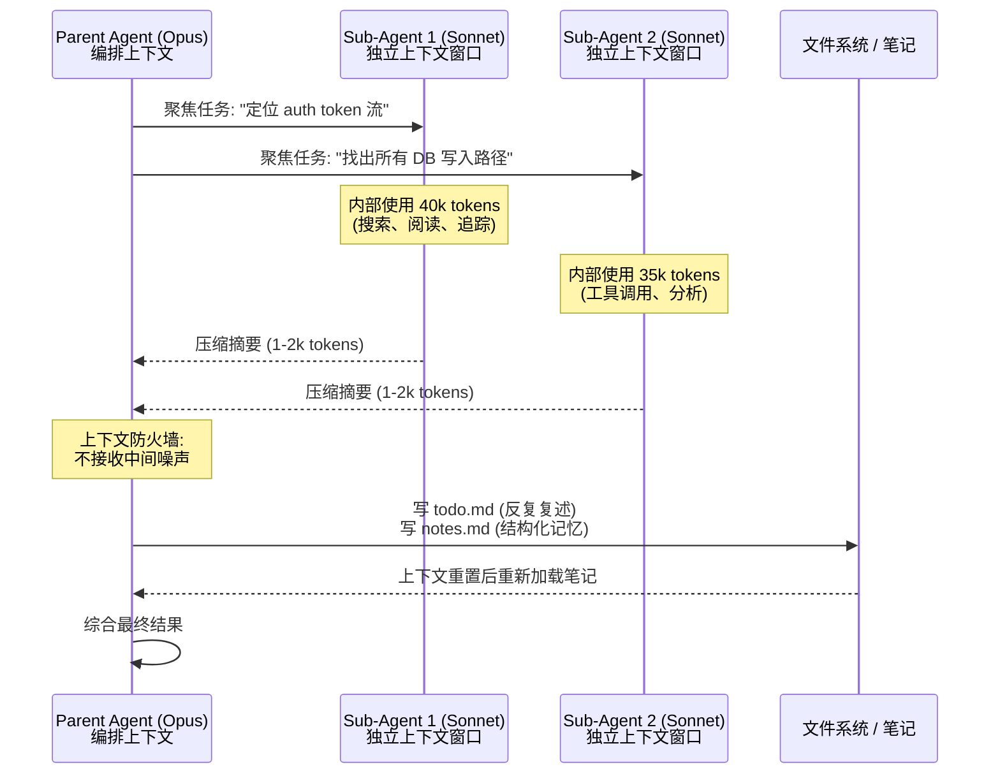

# 第 3 章：压缩、记忆与子代理模式

即便上下文工程做得很好，长周期任务也经常会超过单个上下文窗口。相关文献通常汇聚到三类技术。

### 3.1 压缩

压缩（compaction）会在对话接近上下文窗口上限时，总结当前对话，并用该总结重新开启一个新的上下文窗口 ([Anthropic - Effective Context Engineering for AI Agents](https://www.anthropic.com/engineering/effective-context-engineering-for-ai-agents))。在 Claude Code 中，消息历史会被交给模型，并要求保留架构决策、未解决 bug 和实现细节，同时丢弃冗余工具输出。随后 agent 以压缩后的上下文和最近访问的文件继续工作。

Anthropic 对压缩提示的建议是：在真实复杂 trace 上调优；先最大化 recall，确保相关信息被捕获；再迭代 precision，移除多余内容。最轻量的做法是清理工具结果：工具被调用且结果已被后续行动吸收后，原始结果通常可以丢弃。

关键限制是：压缩是有损的。它适合保留决策、目标、约束和产物指针，而不是保留长调试 trace 的每个细节。好的 harness 会把压缩与可恢复引用结合起来：commit hash、文件路径、issue ID、URL、短笔记，让后续 agent 在摘要不够时能重新加载一手证据。

### 3.2 结构化笔记

互补模式是 *agentic memory*：让 agent 定期把笔记写到磁盘，之后再加载。Anthropic 用 Claude 玩宝可梦作为一个清晰的例子：在数千个游戏步骤中，agent 会维护各类计数（“在过去 1,234 步里，我一直在 1 号道路训练宝可梦，皮卡丘已升 8 级，目标是 10 级”）、绘制地区地图、记录战斗策略，使它能在上下文重置后继续多小时的训练序列 ([Anthropic - Effective Context Engineering for AI Agents](https://www.anthropic.com/engineering/effective-context-engineering-for-ai-agents))。

Manus 的 `todo.md` 技巧是这一模式的专门形式，但它还有下一节中的额外作用。

### 3.3 反复复述：把注意力拉回上下文尾部

Manus 报告称，在处理复杂任务时，agent 会创建 `todo.md`，并随着任务推进逐步重写它，勾掉已完成项目。这不仅是为了组织工作。典型 Manus 任务平均约 50 次工具调用；在长上下文中，模型容易偏离主题或忘记早期目标。通过反复重写 todo list，agent 把目标“复述”到上下文尾部，将全局计划推入模型最近的注意范围，缓解 “lost-in-the-middle” 问题 ([Manus - Context Engineering for AI Agents](https://manus.im/blog/Context-Engineering-for-AI-Agents-Lessons-from-Building-Manus))。

### 3.4 子代理与上下文防火墙

第三种模式，也是架构影响最大的一种，是子代理分解。一个专门的 sub-agent 在自己的上下文窗口内处理聚焦任务，内部可能使用数万 token，最后只向父 agent 返回 1,000-2,000 token 的压缩摘要 ([Anthropic - Effective Context Engineering for AI Agents](https://www.anthropic.com/engineering/effective-context-engineering-for-ai-agents))。HumanLayer 称其为 *context firewall*：负责编排的父线程永远看不到子代理工作的中间噪声，只接收浓缩结果，因此更久地避免进入“dumb zone” ([HumanLayer - Skill Issue](https://www.humanlayer.dev/blog/skill-issue-harness-engineering-for-coding-agents))。

HumanLayer 对这里什么有效、什么无效说得很明确。把子代理设成“前端工程师”“后端工程师”这种 persona 通常不有效；把子代理用于上下文控制才有效。适合子代理的任务是：最终答案简单，但中间工具调用很多，例如定位代码定义、追踪跨服务的信息流、做大范围研究。

子代理也有助于成本控制：HumanLayer 用昂贵模型（Opus）做 orchestrator，用更便宜的模型（Sonnet 或 Haiku）做子代理。没有必要用 Opus token 做 `grep`。

Anthropic 的多代理研究系统是这一模式规模化应用的典型例子。lead agent 分析查询并并行派生专门 sub-agents，各自探索一个方面；每个 sub-agent 有自己的上下文窗口；结果被压缩回 lead，由 lead 综合成最终报告。lead-agent-as-Opus、sub-agents-as-Sonnet 的配置在 Anthropic 内部研究评估中比单 agent Opus 相对高出 90.2% ([Anthropic - How We Built Our Multi-Agent Research System](https://www.anthropic.com/engineering/multi-agent-research-system))。机制很大程度是 token economics：他们的分析中，三个因素解释了 BrowseComp benchmark 上 95% 的性能方差，其中 token 使用量单独解释了 80%。

代价是成本。Anthropic 数据中，多 agent 系统使用的 token 约为 chat 的 15 倍、single-agent run 的 4 倍，因此只有在高价值且并行化确实有帮助的任务上才经济。它不适合共享可变状态的强耦合子任务；许多重新实现类的 coding task 属于这一类。但在 coding workflow 中，如果委托工作是只读调查，或能按 ownership 边界清晰拆开，它仍有价值。当前模型也不擅长 agent 间实时协调，所以 coordinator 必须明确任务边界。

### 3.5 不要把 Few-Shot 做成惯性

Manus 提供了一个反直觉原则：上下文里过度一致可能有害。模型很会模仿，会照着上下文中的模式继续。如果 trace 充满相似的 action-observation 对，模型会在不再合适时继续沿用模式，导致漂移、过度泛化和幻觉。Manus 的例子是批量审阅 20 份简历，agent 会进入节奏，开始为重复而重复 ([Manus - Context Engineering for AI Agents](https://manus.im/blog/Context-Engineering-for-AI-Agents-Lessons-from-Building-Manus))。

他们的修复方式是引入小的结构化变化：不同序列化模板、替代说法、轻微重排、受控噪声。trace 多样性可以让注意力分布更均衡。

### 3.6 保留有用的错误

互补原则是：不要抹掉有用错误。自然冲动是重试失败动作，并隐藏失败 trace；但 Manus 认为这会删除模型需要用来远离类似错误的证据 ([Manus - Context Engineering for AI Agents](https://manus.im/blog/Context-Engineering-for-AI-Agents-Lessons-from-Building-Manus))。在上下文中保留最近的失败动作和相关 stack trace，让模型可以隐式学习。这不等于永远保留无限日志；重复的相同失败应压缩成简短诊断和 retry counter。Manus 称错误恢复是“真正 agentic 行为最清晰的指标之一”，并指出它在学术 benchmark 中代表性不足。

HumanLayer 将其形式化为 Factor 9：把错误压缩进上下文。Agent 的 *self-healing* 能力，即读取错误并调整下一次调用，是 LLM agent 的真实优势之一，而它只有在错误可见时才有效 ([HumanLayer - 12-Factor Agents](https://www.humanlayer.dev/blog/12-factor-agents))。配合连续相同错误计数器，这个模式更稳健。

### 3.7 成本、延迟与模型路由

上面的子代理模式已经把成本当作一个设计变量——用昂贵模型做编排，用更便宜的模型做跑腿。值得把这个一般原则讲明：成本和延迟是 harness 的一等关切，不是事后才考虑的东西。

文献中反复出现三个杠杆：

- **模型路由。** 并非每一步都需要最强的模型。harness 可以把便宜、高频的工作——一次 `grep`、一次分类、一段简短摘要——路由给小而快的模型，把 frontier 模型留给推理密集的步骤。HumanLayer 用 Opus 做 orchestrator，用 Sonnet 或 Haiku 做子代理 ([HumanLayer - Skill Issue](https://www.humanlayer.dev/blog/skill-issue-harness-engineering-for-coding-agents))；Anthropic 的研究系统采用同样的 lead agent / sub-agent 拆分（见第 7 章）。
- **KV-cache。** 稳定的上下文前缀由缓存服务，价格约为未缓存 token 的十分之一，延迟也只是其一小部分（见第 2 章）。在生产 agent 中，缓存纪律往往是单个最大的成本杠杆。
- **Token 核算。** Agentic 工作负载偏重 prefill——Manus 报告输入输出比约 100:1——而成本随上下文长度增长。多 agent 系统可能烧掉单次 chat 约 15 倍的 token，这正是它们只在高价值任务上才划算的原因。

延迟有它自己的结构。首 token 延迟主要由 prefill 决定，因而由缓存命中决定；端到端延迟则主要由*顺序*模型往返的次数决定。并行工具调用和并行子代理能大幅削减墙钟时间——在 Anthropic 的研究工作负载上最多达 90%（见第 7 章）——却不减少总 token 成本。一般规则是：把 token、金钱和秒数都当作显式预算，并清楚哪个杠杆影响哪一个。

---

## 图：父 Agent -> 子 Agent -> 压缩结果（上下文防火墙）

---

## 要点

- **压缩延长任务视野，但会丢细节**：保留关键决策和可恢复引用，而不是每个原始观察。
- **结构化笔记支持多会话连续性**：把进度写到磁盘的 agent，可以在上下文重置后恢复工作。
- **反复复述缓解 lost-in-the-middle**：反复重写 todo list，把目标推入最近注意范围。
- **上下文防火墙是子代理模式的关键价值**：父 agent 不看中间噪声，只接收浓缩结果。
- **保留有用错误**：self-healing 需要相关错误 trace 可见，但重复失败应被压缩。
- **成本与延迟是设计变量**：把便宜的工作路由给小模型，保持 KV-cache 命中，并用并行换取墙钟速度。

## 延伸阅读

- Anthropic Applied AI Team, *Effective Context Engineering for AI Agents*, Anthropic, Sep 2025. https://www.anthropic.com/engineering/effective-context-engineering-for-ai-agents
- Yichao 'Peak' Ji, *Context Engineering for AI Agents: Lessons from Building Manus*, Manus, Jul 2025. https://manus.im/blog/Context-Engineering-for-AI-Agents-Lessons-from-Building-Manus
- Kyle Brunet, *Skill Issue: Harness Engineering for Coding Agents*, HumanLayer, Mar 2026. https://www.humanlayer.dev/blog/skill-issue-harness-engineering-for-coding-agents
- Jeremy Hadfield et al., *How We Built Our Multi-Agent Research System*, Anthropic, Jun 2025. https://www.anthropic.com/engineering/multi-agent-research-system
- Dex Horthy, *12-Factor Agents*, HumanLayer, Apr 2025. https://www.humanlayer.dev/blog/12-factor-agents
