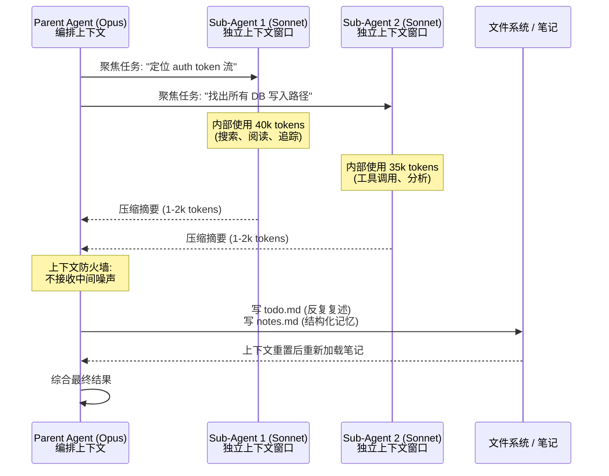

# 第 3 章：压缩、记忆与子代理模式

即使上下文工程做得足够严谨，长周期任务仍可能超出任何一个上下文窗口的容量。相关文献大体归纳出三类延续任务的方法。

### 3.1 压缩

压缩（compaction）是指：当对话接近上下文窗口上限时，先总结已有内容，再以这份摘要为起点开启新的上下文窗口 ([Anthropic - Effective Context Engineering for AI Agents](https://www.anthropic.com/engineering/effective-context-engineering-for-ai-agents))。在 Claude Code 中，harness 会把消息历史交给模型，要求它保留架构决策、尚未解决的 bug 和实现细节，同时舍弃冗余的工具输出。随后，agent 根据压缩后的上下文和最近访问过的文件继续工作。何时触发压缩——通常以 token 数或上下文使用比例为阈值——本身也需要调优：太晚触发，可能在一轮尚未结束时就溢出；太早触发，又可能丢掉仍有价值的细节。

Anthropic 建议在真实、复杂的 trace 上调优压缩 prompt。第一步先提高 recall，确保所有相关信息都进入摘要；然后再改善 precision，删除无助于继续任务的内容。最轻量的压缩形式是清理工具结果：当 agent 已经根据某次工具调用的结果采取行动后，原始输出通常就可以丢弃。

必须注意，压缩是有损的。它适合保留决策、目标、约束以及产物的位置，却无法保留漫长调试 trace 中的每一个细节。因此，设计良好的 harness 会把摘要与可恢复的引用结合起来，例如 commit hash、文件路径、issue ID、URL 和短笔记。这样，当摘要信息不足时，后续 agent 仍能重新加载一手证据。

### 3.2 结构化笔记

与压缩互补的模式是 *agentic memory*：agent 定期把结构化笔记写入磁盘，并在之后按需重新加载。Anthropic 用 Claude 玩宝可梦来说明这种做法。在数千个游戏步骤中，agent 会持续记录进度（例如“过去 1,234 步一直在 1 号道路训练宝可梦，皮卡丘已提升 8 级，目标是 10 级”）、绘制地区地图并整理战斗策略。这些笔记让它即使经历上下文重置，也能继续完成持续数小时的训练序列 ([Anthropic - Effective Context Engineering for AI Agents](https://www.anthropic.com/engineering/effective-context-engineering-for-ai-agents))。

Manus 的 `todo.md` 技巧是结构化笔记的一种特殊形式，同时还有下一节将介绍的另一层作用。

### 3.3 反复复述：把注意力拉回上下文尾部

Manus 的 agent 在处理复杂任务时会创建 `todo.md`，随着工作推进反复重写，并逐项勾掉已经完成的任务。这样做不只是为了整理工作。典型的 Manus 任务平均包含约 50 次工具调用；随着上下文变长，模型很容易偏离任务或忘记早期目标。反复重写 todo list，相当于不断把目标“复述”到上下文末尾，让全局计划重新进入模型最近的注意范围，从而缓解 “lost-in-the-middle” 问题（底层机制见配套卷《LLM Foundations》第 9 章） ([Manus - Context Engineering for AI Agents](https://manus.im/blog/Context-Engineering-for-AI-Agents-Lessons-from-Building-Manus))。

### 3.4 子代理与上下文防火墙

第三种模式是子代理分解，它对系统架构的影响也最大。一个专门的 sub-agent 会接收范围明确的任务，并在独立的上下文窗口中工作。它内部可能消耗数万 token，最终却只向父 agent 返回一份 1,000-2,000 token 的压缩摘要 ([Anthropic - Effective Context Engineering for AI Agents](https://www.anthropic.com/engineering/effective-context-engineering-for-ai-agents))。HumanLayer 将这道边界称为 *context firewall*（上下文防火墙）：父线程只负责编排，看不到子代理工作过程中的噪声，只接收浓缩后的结果，因此能够更长时间地保持上下文有效，避免进入 “dumb zone” ([HumanLayer - Skill Issue](https://www.humanlayer.dev/blog/skill-issue-harness-engineering-for-coding-agents))。

HumanLayer 明确区分了角色扮演与上下文控制。仅仅把子代理设定为“前端工程师”或“后端工程师”之类的 persona，通常没有多少帮助；真正有价值的是把边界清楚的工作委派出去，保护父 agent 的上下文。最适合交给子代理的任务，往往最终答案很简洁，却需要大量中间工具调用，例如在代码库中定位定义、追踪跨服务的信息流，或开展大范围研究。

子代理还可以用来控制成本。HumanLayer 使用昂贵的模型（Opus）负责编排，再让更便宜的模型（Sonnet 或 Haiku）执行委派任务。像 `grep` 这样的简单操作，没有必要消耗 orchestrator 所用的最强模型。

Anthropic 的多代理研究系统是这一模式规模化应用的典型案例。Lead agent 先分析查询，再并行派出多个专门的 sub-agent，分别调查不同方面。每个 sub-agent 都在自己的上下文窗口中工作，随后把压缩后的结果返回给 lead，由 lead 汇总成最终报告。在 Anthropic 的内部研究评估中，由 Opus 担任 lead、Sonnet 担任 sub-agent 的配置，比单 agent Opus 相对高出 90.2% ([Anthropic - How We Built Our Multi-Agent Research System](https://www.anthropic.com/engineering/multi-agent-research-system))。这一提升很大程度上来自 token economics：在他们的分析中，三个因素解释了 BrowseComp benchmark 上 95% 的性能方差，而 token 使用量单独就解释了 80%。

代价则是更高的成本。根据 Anthropic 的数据，single-agent run 使用的 token 约为普通 chat 的 4 倍，多 agent 系统则约为 15 倍。由此可推得，多 agent 系统的成本约为单 agent 的 4 倍；这个比值是根据来源数据推算得出的，并非来源直接给出的数字。因此，只有当任务价值较高，而且并行确实能带来收益时，多 agent 系统才划算。对于共享可变状态、彼此紧密耦合的子任务，它通常并不合适，许多实现工作量较大的 coding task 就属于这一类。不过，如果 coding workflow 中委派的是只读调查，或任务可以沿清晰的 ownership 边界拆分，子代理仍然很有价值。当前模型也不擅长在 agent 之间实时协调，因此 coordinator 必须明确划定任务边界。

### 3.5 不要把 Few-Shot 做成惯性

Manus 提出了一个反直觉的原则：上下文过于一致也可能有害。模型善于模仿它看到的模式。如果 trace 中充满相似的 action-observation 对，模型可能在这种模式已经不再适用时仍继续照做，进而出现偏离、过度泛化或幻觉。Manus 举的例子是批量审阅 20 份简历：agent 很容易形成固定节奏，最终只是为了重复而重复 ([Manus - Context Engineering for AI Agents](https://manus.im/blog/Context-Engineering-for-AI-Agents-Lessons-from-Building-Manus))。

相应的修复方法，是引入少量而有结构的变化，例如使用不同的序列化模板、替代表述、轻微调整顺序，或加入受控噪声。让 trace 保持一定多样性，可以避免某一种模式垄断模型的注意力。

### 3.6 保留有用的错误

另一个与之互补的原则是保留有用的错误。面对失败动作，人们自然会选择重试并隐藏失败 trace；但 Manus 认为，这样做会删掉模型用来避免重蹈覆辙的证据 ([Manus - Context Engineering for AI Agents](https://manus.im/blog/Context-Engineering-for-AI-Agents-Lessons-from-Building-Manus))。把最近一次失败动作及相关 stack trace 留在上下文中，模型才能据此调整下一次尝试。当然，这不意味着要无限期保存所有日志。反复出现的同一种失败，应压缩成简短诊断和 retry counter。Manus 将错误恢复称为“真正 agentic 行为最清晰的指标之一”，并指出学术 benchmark 往往只衡量理想条件下能否成功，因此没有充分覆盖这种能力。

HumanLayer 将这一思路总结为 Factor 9：把错误压缩进上下文。Agent 读取错误并调整下一次调用的能力，也就是 *self-healing*，是 LLM agent 真正有价值的特性之一；而它只有在错误仍然可见时才能发挥作用 ([HumanLayer - 12-Factor Agents](https://www.humanlayer.dev/blog/12-factor-agents))。再配合限制连续相同错误次数的计数器，这一模式会更加稳健。

### 3.7 成本、延迟与模型路由

前面的子代理模式已经把成本作为设计变量：昂贵模型负责编排，便宜模型执行辅助工作。这里需要把原则说得更明确：成本和延迟是 harness 的一等设计目标，而不是系统完成后才考虑的问题。

文献中反复出现三个杠杆：

- **模型路由。** 并非每一步都需要最强的模型。harness 可以把便宜且高频的任务——例如一次 `grep`、一次分类或一段简短摘要——交给更小、更快的模型，把 frontier 模型留给推理密集的步骤。HumanLayer 使用 Opus 作为 orchestrator，让 Sonnet 或 Haiku 担任子代理 ([HumanLayer - Skill Issue](https://www.humanlayer.dev/blog/skill-issue-harness-engineering-for-coding-agents))；Anthropic 的研究系统也采用相同的 lead agent / sub-agent 拆分（见第 7 章）。
- **KV-cache。** 如果上下文前缀保持稳定，就可以由 cache 直接提供，价格大约是未缓存 token 的十分之一，延迟也只有其一小部分（机制见配套卷《LLM Foundations》第 9 章；亦见第 2 章）。对于生产级 agent，严格遵守缓存规则往往是最大的单项成本杠杆。
- **Token 核算。** Agentic 工作负载的大部分开销来自 prefill。Manus 报告的输入输出比约为 100:1，而成本会随上下文长度增长。多 agent 系统可能消耗普通 chat 约 15 倍的 token，因此只有在高价值任务上才值得使用。

延迟的构成有所不同。首 token 延迟主要取决于 prefill，因此与 cache 命中密切相关；端到端延迟则主要取决于需要依次完成多少次模型往返。并行调用工具或并行运行子代理，可以显著缩短实际等待时间——在 Anthropic 的研究工作负载中最多可缩短 90%（见第 7 章）——但不会减少 token 总成本。一般原则是：把 token、金钱和秒数分别列为明确预算，并弄清楚每个设计杠杆影响的是哪一项。

### 3.8 具名记忆架构

第 3.1-3.3 节把压缩、笔记和复述作为 harness *技术*来讨论。研究文献还将这些思路组合成若干具名的记忆*系统*，了解它们有助于识别不同的架构选择。

- **MemGPT** 直接借用了操作系统的类比。它把上下文窗口视为高速“主存”，把外部存储视为“磁盘”，再让模型通过函数调用，在固定容量的上下文中换入、换出信息。这种*虚拟上下文管理（virtual context management）*，让一个容量有限的窗口呈现出远大于自身的可用空间 ([Packer et al. - MemGPT: Towards LLMs as Operating Systems](https://arxiv.org/abs/2310.08560))。该系统现已产品化为 Letta。
- **Mem0** 是一个记忆层。它会从对话中动态*抽取*重要事实，与已有存储进行*整合*，并在后续轮次中*检索*；其图结构变体还能够表示实体之间的关系。它所报告的优势主要体现在运行效率上：对于跨多个会话的长对话，token 成本和延迟都远低于回放完整历史 ([Chhikara et al. - Mem0: Building Production-Ready AI Agents with Scalable Long-Term Memory](https://arxiv.org/abs/2504.19413))。
- **Sleep-time compute（睡眠期计算）** 利用请求之间的空闲时间。Agent 不再只是等待，而是离线处理已有上下文，预判可能出现的后续问题并提前计算相关推断，从而减少后续查询所需的 test-time compute。在部分 benchmark 上，达到相同准确率所需的推理预算因此降低了约 5 倍 ([Lin et al. - Sleep-time Compute: Beyond Inference Scaling at Test-time](https://arxiv.org/abs/2504.13171))。

从 harness 的角度看，警告仍与第 3.1 节相同：受管记忆虽然强大，却也是有损的，而且会引入新的失败模式。系统可能取回错误的记忆、错误地整合信息，或信心十足地陈述已经过时的事实。只有在会话很长、确实需要跨会话回忆时，这些系统的复杂性才有价值；对于短任务，它们往往只是在第 3.2 节所述结构化笔记之上增加额外开销。

### 3.9 多代理拓扑及其失败原因

第 3.4 节把子代理作为上下文防火墙引入，并介绍了 orchestrator-worker 配置；第 6、7 章将进一步讨论编排。除此之外，实践中还常见以下几种多代理*拓扑（topology）*：

- **Orchestrator-worker（supervisor，主管）**：由一个 lead agent 分解任务、把各部分委派给 worker，再综合它们的结果（第 6、7 章）。
- **Hierarchical（分层）**：由 supervisor 管理其他 supervisor，适用于任务分解层次太深、单个 lead 无法在上下文中容纳完整结构的情况。
- **Blackboard / shared memory（黑板 / 共享记忆）**：agent 通过读写公共工作区进行协调，而不是彼此直接发送消息。当多个 agent 共同构建同一份不断演进的产物时，这种拓扑尤其有用。
- **Debate / voting（辩论 / 投票）**：多个 agent 通过辩论或投票来提高可靠性，是第 6.3 节 parallelization-voting 模式的多代理版本。

人们很容易把更多 agent 等同于更强能力，但实证结果要冷静得多。MAST 研究人工标注了七个流行多代理框架中的 200 多个任务，并总结出 14 种失败模式，分为三大类：**规格问题（specification issues）**，即角色和 prompt 定义不足；**代理间错位（inter-agent misalignment）**，即 agent 之间各说各话、丢失信息或偏离共同目标；以及**任务验证（task verification）**，即对最终结果的检查薄弱或完全缺失 ([Cemri et al. - Why Do Multi-Agent LLM Systems Fail?](https://arxiv.org/abs/2503.13657))。这项研究的关键结论是：很多失败并不是模型能力不足，而是*协调与验证*出了问题，而这些恰好都属于 harness 的职责范围。

由此可以直接得出几条实践原则：优先采用能够满足需求的最简单拓扑（第 6.1 节）；明确划分任务边界，避免 worker 重复工作或遗漏任务（第 3.4 节、第 7 章）；把验证作为一等职责，而不是事后补丁，例如采用第 7 章的 generator-evaluator 拆分。MAST 已将验证薄弱列为三大失败类型之一。

### 3.10 记忆投毒与信任升级

持久记忆会改变系统的安全模型。网页中的注入指令通常只会威胁当前一次运行；但如果 agent 把这条指令写入持久笔记、偏好存储或共享黑板，攻击就可能跨过上下文重置，继续影响后续运行。Anthropic 将这种现象称为**持久记忆投毒（persistent memory poisoning）**：不可信内容跨越写入边界，进入了未来 agent 会当作可信状态的存储 ([Anthropic - How We Contain Claude](https://www.anthropic.com/engineering/how-we-contain-claude))。

防御的关键，是把记忆视为带有溯源信息的存储，而不是上下文的中性延伸：

- 为每条记忆标注来源、授权写入的身份、创建时间和信任等级；
- 将观察与指令分开，绝不自动把检索到的内容提升为策略；
- 不可信信息在进入持久的共享记忆前，必须经过审查或确定性验证；
- 支持过期、替代和回滚，以便从所有后续上下文中移除被投毒的事实；
- 检索时重新检查授权，因为写入者可以访问的事实，读取者未必有权访问。

多 agent 系统还会引入**信任升级（trust escalation）**。低权限 worker 可能向高权限 coordinator 返回一份看似可信的摘要，随后 coordinator 使用 worker 从未拥有的权限采取行动。压缩会进一步放大这种风险，因为溯源信息和不确定性往往最先在摘要中消失。因此，子 agent 的结果应附带引用或产物位置、置信程度和未决问题，以及生成结果时所使用的身份与权限。父 agent 必须先核验证据，才能把这些结果转化为高权限动作。第 5 章将展开 containment 控制，第 18 章则介绍如何通过身份与控制平面模型，在整个 fleet 中执行这些控制。

---

## 图：父 Agent -> 子 Agent -> 压缩结果（上下文防火墙）

```mermaid
sequenceDiagram
    participant PA as Parent Agent (Opus)<br/>编排上下文
    participant SA1 as Sub-Agent 1 (Sonnet)<br/>独立上下文窗口
    participant SA2 as Sub-Agent 2 (Sonnet)<br/>独立上下文窗口
    participant FS as 文件系统 / 笔记

    PA->>SA1: 聚焦任务: "定位 auth token 流"
    PA->>SA2: 聚焦任务: "找出所有 DB 写入路径"
    Note over SA1: 内部使用 40k tokens<br/>(搜索、阅读、追踪)
    Note over SA2: 内部使用 35k tokens<br/>(工具调用、分析)
    SA1-->>PA: 压缩摘要 (1-2k tokens)
    SA2-->>PA: 压缩摘要 (1-2k tokens)
    Note over PA: 上下文防火墙:<br/>不接收中间噪声
    PA->>FS: 写 todo.md (反复复述)<br/>写 notes.md (结构化记忆)
    FS-->>PA: 上下文重置后重新加载笔记
    PA->>PA: 综合最终结果
```

---

## 要点

- **压缩能延长任务跨度，但一定会丢失细节**：应保留关键决策和可恢复引用，而不是每一条原始观察。
- **结构化笔记支持跨会话连续工作**：把进度写入磁盘后，agent 可以在上下文重置后恢复任务。
- **反复复述可以缓解 lost-in-the-middle**：持续重写 todo list，能把目标重新带回模型最近的注意范围。
- **上下文防火墙是子代理模式的核心价值**：父 agent 不接收中间噪声，只获取浓缩后的结果。
- **应保留有用的错误**：self-healing 依赖可见的错误 trace，但重复失败应当压缩。
- **成本与延迟都是设计变量**：把低成本工作路由给小模型，保持 KV-cache 命中，并通过并行缩短实际等待时间。
- **具名记忆系统封装了常见记忆模式**：MemGPT（OS 式虚拟上下文）、Mem0（抽取-整合-检索）和 sleep-time compute（离线预处理）都是有用的参照，但也各自引入了检索错误和信息过时等失败模式。
- **更多 agent 不仅放大成本，也会放大协调失败**：MAST 分类法表明，规格缺口、代理间错位和薄弱验证主导了多代理失败，而这些都属于 harness 的职责范围。应优先选择最简单的拓扑，并把验证作为一等职责。
- **持久记忆是一道信任边界**：保留溯源、区分数据与指令，并在把不可信信息提升为共享状态前完成验证；否则，一张被注入的网页就可能影响之后的多次运行。
- **委派不能悄然提升权限**：父 agent 在使用 worker 从未拥有的权限采取行动前，必须先验证 worker 提供的证据。

## 延伸阅读

- Anthropic Applied AI Team, *Effective Context Engineering for AI Agents*, Anthropic, Sep 2025. https://www.anthropic.com/engineering/effective-context-engineering-for-ai-agents
- Yichao 'Peak' Ji, *Context Engineering for AI Agents: Lessons from Building Manus*, Manus, Jul 2025. https://manus.im/blog/Context-Engineering-for-AI-Agents-Lessons-from-Building-Manus
- Kyle Brunet, *Skill Issue: Harness Engineering for Coding Agents*, HumanLayer, Mar 2026. https://www.humanlayer.dev/blog/skill-issue-harness-engineering-for-coding-agents
- Jeremy Hadfield et al., *How We Built Our Multi-Agent Research System*, Anthropic, Jun 2025. https://www.anthropic.com/engineering/multi-agent-research-system
- Dex Horthy, *12-Factor Agents*, HumanLayer, Apr 2025. https://www.humanlayer.dev/blog/12-factor-agents
- Charles Packer et al., *MemGPT: Towards LLMs as Operating Systems*, arXiv, Oct 2023. https://arxiv.org/abs/2310.08560
- Prateek Chhikara et al., *Mem0: Building Production-Ready AI Agents with Scalable Long-Term Memory*, arXiv, Apr 2025. https://arxiv.org/abs/2504.19413
- Kevin Lin et al., *Sleep-time Compute: Beyond Inference Scaling at Test-time*, arXiv, Apr 2025. https://arxiv.org/abs/2504.13171
- Mert Cemri et al., *Why Do Multi-Agent LLM Systems Fail?*, arXiv, Mar 2025. https://arxiv.org/abs/2503.13657
- Anthropic Safeguards Research Team, *How We Contain Claude*, Anthropic, May 2026. https://www.anthropic.com/engineering/how-we-contain-claude
