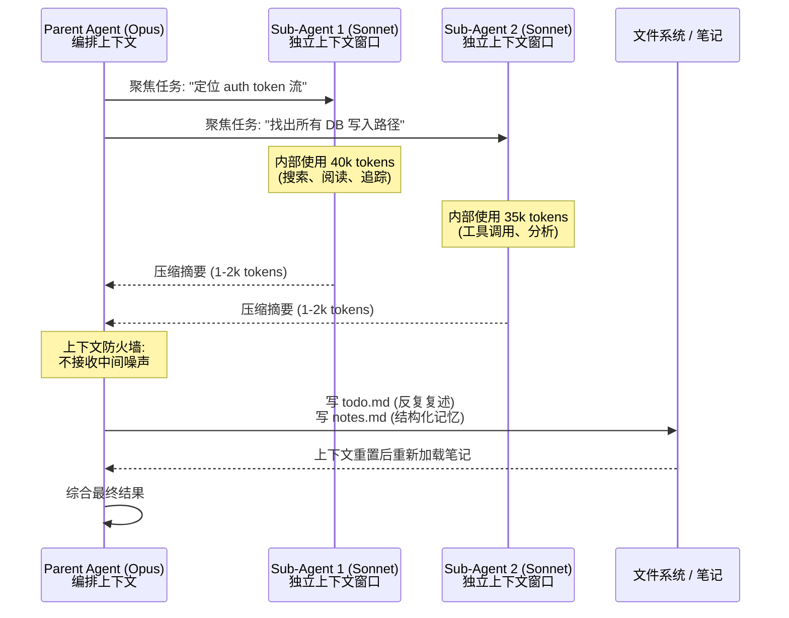

# 第 3 章：压缩、记忆与子代理模式

即便上下文工程做得很好，长周期任务也经常会超过单个上下文窗口。相关文献通常汇聚到三类技术。

### 3.1 压缩

压缩（compaction）会在对话接近上下文窗口上限时，总结当前对话，并用该总结重新开启一个新的上下文窗口 ([Anthropic - Effective Context Engineering for AI Agents](https://www.anthropic.com/engineering/effective-context-engineering-for-ai-agents))。在 Claude Code 中，消息历史会被交给模型，并要求保留架构决策、未解决 bug 和实现细节，同时丢弃冗余工具输出。随后 agent 以压缩后的上下文和最近访问的文件继续工作。触发时机——通常是上下文用量的某个 token 或百分比水位线——本身就是一个需要调优的参数：触发太晚，可能在一轮中途就溢出；触发太早，又会丢掉仍然有用的细节。

Anthropic 对压缩提示的建议是：在真实复杂 trace 上调优；先最大化 recall，确保相关信息被捕获；再迭代 precision，移除多余内容。最轻量的做法是清理工具结果：工具被调用且结果已被后续行动吸收后，原始结果通常可以丢弃。

关键限制是：压缩是有损的。它适合保留决策、目标、约束和产物指针，而不是保留长调试 trace 的每个细节。好的 harness 会把压缩与可恢复引用结合起来：commit hash、文件路径、issue ID、URL、短笔记，让后续 agent 在摘要不够时能重新加载一手证据。

### 3.2 结构化笔记

互补模式是 *agentic memory*：让 agent 定期把笔记写到磁盘，之后再加载。Anthropic 用 Claude 玩宝可梦作为一个清晰的例子：在数千个游戏步骤中，agent 会维护各类计数（“在过去 1,234 步里，我一直在 1 号道路训练宝可梦，皮卡丘已升 8 级，目标是 10 级”）、绘制地区地图、记录战斗策略，使它能在上下文重置后继续多小时的训练序列 ([Anthropic - Effective Context Engineering for AI Agents](https://www.anthropic.com/engineering/effective-context-engineering-for-ai-agents))。

Manus 的 `todo.md` 技巧是这一模式的专门形式，但它还有下一节中的额外作用。

### 3.3 反复复述：把注意力拉回上下文尾部

Manus 报告称，在处理复杂任务时，agent 会创建 `todo.md`，并随着任务推进逐步重写它，勾掉已完成项目。这不仅是为了组织工作。典型 Manus 任务平均约 50 次工具调用；在长上下文中，模型容易偏离主题或忘记早期目标。通过反复重写 todo list，agent 把目标“复述”到上下文尾部，将全局计划推入模型最近的注意范围，缓解 “lost-in-the-middle” 问题（其底层效应见配套卷《LLM Foundations》第 9 章） ([Manus - Context Engineering for AI Agents](https://manus.im/blog/Context-Engineering-for-AI-Agents-Lessons-from-Building-Manus))。

### 3.4 子代理与上下文防火墙

第三种模式，也是架构影响最大的一种，是子代理分解。一个专门的 sub-agent 在自己的上下文窗口内处理聚焦任务，内部可能使用数万 token，最后只向父 agent 返回 1,000-2,000 token 的压缩摘要 ([Anthropic - Effective Context Engineering for AI Agents](https://www.anthropic.com/engineering/effective-context-engineering-for-ai-agents))。HumanLayer 称其为 *context firewall*：负责编排的父线程永远看不到子代理工作的中间噪声，只接收浓缩结果，因此更久地避免进入“dumb zone” ([HumanLayer - Skill Issue](https://www.humanlayer.dev/blog/skill-issue-harness-engineering-for-coding-agents))。

HumanLayer 对这里什么有效、什么无效说得很明确。把子代理设成“前端工程师”“后端工程师”这种 persona 通常不有效；把子代理用于上下文控制才有效。适合子代理的任务是：最终答案简单，但中间工具调用很多，例如定位代码定义、追踪跨服务的信息流、做大范围研究。

子代理也有助于成本控制：HumanLayer 用昂贵模型（Opus）做 orchestrator，用更便宜的模型（Sonnet 或 Haiku）做子代理。没有必要用 Opus token 做 `grep`。

Anthropic 的多代理研究系统是这一模式规模化应用的典型例子。lead agent 分析查询并并行派生专门 sub-agents，各自探索一个方面；每个 sub-agent 有自己的上下文窗口；结果被压缩回 lead，由 lead 综合成最终报告。lead-agent-as-Opus、sub-agents-as-Sonnet 的配置在 Anthropic 内部研究评估中比单 agent Opus 相对高出 90.2% ([Anthropic - How We Built Our Multi-Agent Research System](https://www.anthropic.com/engineering/multi-agent-research-system))。机制很大程度是 token economics：他们的分析中，三个因素解释了 BrowseComp benchmark 上 95% 的性能方差，其中 token 使用量单独解释了 80%。

代价是成本。在 Anthropic 的数据中，single-agent run 使用的 token 约为 chat 的 4 倍，多 agent 系统约为 15 倍——因此多 agent 系统的成本约为单个 agent 的 4 倍（这是推导出的比值，而非该来源直接给出的数字）。所以它们只有在高价值且并行化确实有帮助的任务上才经济。它不适合共享可变状态的强耦合子任务；许多重新实现类的 coding task 属于这一类。但在 coding workflow 中，如果委托工作是只读调查，或能按 ownership 边界清晰拆开，它仍有价值。当前模型也不擅长 agent 间实时协调，所以 coordinator 必须明确任务边界。

### 3.5 不要把 Few-Shot 做成惯性

Manus 提供了一个反直觉原则：上下文里过度一致可能有害。模型很会模仿，会照着上下文中的模式继续。如果 trace 充满相似的 action-observation 对，模型会在不再合适时继续沿用模式，导致漂移、过度泛化和幻觉。Manus 的例子是批量审阅 20 份简历，agent 会进入节奏，开始为重复而重复 ([Manus - Context Engineering for AI Agents](https://manus.im/blog/Context-Engineering-for-AI-Agents-Lessons-from-Building-Manus))。

他们的修复方式是引入小的结构化变化：不同序列化模板、替代说法、轻微重排、受控噪声。trace 多样性可以让注意力分布更均衡。

### 3.6 保留有用的错误

互补原则是：不要抹掉有用错误。自然冲动是重试失败动作，并隐藏失败 trace；但 Manus 认为这会删除模型需要用来远离类似错误的证据 ([Manus - Context Engineering for AI Agents](https://manus.im/blog/Context-Engineering-for-AI-Agents-Lessons-from-Building-Manus))。在上下文中保留最近的失败动作和相关 stack trace，让模型可以隐式学习。这不等于永远保留无限日志；重复的相同失败应压缩成简短诊断和 retry counter。Manus 称错误恢复是“真正 agentic 行为最清晰的指标之一”，并指出它在学术 benchmark 中代表性不足。

HumanLayer 将其形式化为 Factor 9：把错误压缩进上下文。Agent 的 *self-healing* 能力，即读取错误并调整下一次调用，是 LLM agent 的真实优势之一，而它只有在错误可见时才有效 ([HumanLayer - 12-Factor Agents](https://www.humanlayer.dev/blog/12-factor-agents))。配合连续相同错误计数器，这个模式更稳健。

### 3.7 成本、延迟与模型路由

上面的子代理模式已经把成本当作一个设计变量——用昂贵模型做编排，用更便宜的模型做跑腿。值得把这个一般原则讲明：成本和延迟是 harness 的一等关切，不是事后才考虑的东西。

文献中反复出现三个杠杆：

- **模型路由。** 并非每一步都需要最强的模型。harness 可以把便宜、高频的工作——一次 `grep`、一次分类、一段简短摘要——路由给小而快的模型，把 frontier 模型留给推理密集的步骤。HumanLayer 用 Opus 做 orchestrator，用 Sonnet 或 Haiku 做子代理 ([HumanLayer - Skill Issue](https://www.humanlayer.dev/blog/skill-issue-harness-engineering-for-coding-agents))；Anthropic 的研究系统采用同样的 lead agent / sub-agent 拆分（见第 7 章）。
- **KV-cache。** 稳定的上下文前缀由缓存服务，价格约为未缓存 token 的十分之一，延迟也只是其一小部分（其机制见配套卷《LLM Foundations》第 9 章；亦见第 2 章）。在生产 agent 中，缓存纪律往往是单个最大的成本杠杆。
- **Token 核算。** Agentic 工作负载偏重 prefill——Manus 报告输入输出比约 100:1——而成本随上下文长度增长。多 agent 系统可能烧掉单次 chat 约 15 倍的 token，这正是它们只在高价值任务上才划算的原因。

延迟有它自己的结构。首 token 延迟主要由 prefill 决定，因而由缓存命中决定；端到端延迟则主要由*顺序*模型往返的次数决定。并行工具调用和并行子代理能大幅削减墙钟时间——在 Anthropic 的研究工作负载上最多达 90%（见第 7 章）——却不减少总 token 成本。一般规则是：把 token、金钱和秒数都当作显式预算，并清楚哪个杠杆影响哪一个。

### 3.8 具名记忆架构

第 3.1-3.3 节把压缩、笔记和复述当作 harness *技术*来讲。研究文献则进一步把这些想法打包成了几个值得记住的具名记忆*系统*。

- **MemGPT** 明确类比操作系统：它把上下文窗口当作快速的“主存”，把外部存储当作“磁盘”，让模型通过函数调用，在固定大小的上下文里换入换出信息——即*虚拟上下文管理（virtual context management）*。有界窗口由此得以呈现出远大于自身容量的表象 ([Packer et al. - MemGPT: Towards LLMs as Operating Systems](https://arxiv.org/abs/2310.08560))。该系统现已产品化为 Letta。
- **Mem0** 是一个记忆层：它从对话中动态*抽取*显著事实，与已有存储*整合*，并在后续轮次*检索*；其图变体还能捕获实体间关系。它报告的收益是运营层面的——在跨会话的长对话中，token 成本和延迟都远低于回放完整历史 ([Chhikara et al. - Mem0: Building Production-Ready AI Agents with Scalable Long-Term Memory](https://arxiv.org/abs/2504.19413))。
- **Sleep-time compute（睡眠期计算）** 利用的是空闲时间：agent 不在请求之间闲着，而是离线处理其上下文——预判可能的后续问题并预先计算推断——使后续查询所需的 test-time compute 更少。在部分 benchmark 上，这把达到给定准确率所需的推理预算削减了约 5 倍 ([Lin et al. - Sleep-time Compute: Beyond Inference Scaling at Test-time](https://arxiv.org/abs/2504.13171))。

harness 视角与第 3.1 节一致：受管记忆很强大，但同样是有损的，并引入了它自己的失败面——检索到错误记忆、整合出错、自信地断言过时事实。当会话很长、跨会话回忆确实重要时，这些系统才物有所值；在短任务上，它们只是在第 3.2 节已有的笔记之上徒增开销。

### 3.9 多代理拓扑及其失败原因

第 3.4 节把子代理作为上下文防火墙引入，并介绍了 orchestrator-worker 配置；第 6、7 章进一步展开编排。除 orchestrator-worker 外，实践者还会用到一小套多代理*拓扑（topology）*词汇：

- **Orchestrator-worker（supervisor，主管）**：一个 lead agent 分解任务、委派给 worker，再综合结果（第 6、7 章）。
- **Hierarchical（分层）**：主管之上还有主管，适用于分解太深、单个 lead 容纳不下的任务。
- **Blackboard / shared memory（黑板 / 共享记忆）**：agent 通过读写一块公共工作区来协调，而非彼此直接发消息——当许多 agent 共同构建同一份不断演进的产物时尤其有用。
- **Debate / voting（辩论 / 投票）**：多个 agent 争论或投票以提升可靠性，是第 6.3 节 parallelization-voting 模式的多代理形式。

诱惑在于把更多 agent 读成更多能力，而经验记录要清醒得多。MAST 研究在七个流行的多代理框架上人工标注了 200 多个任务，归纳出 14 种失败模式，分为三大类：**规格问题（specification issues）**（角色和提示欠定义）、**代理间错位（inter-agent misalignment）**（agent 各说各话、丢失信息或偏离共享目标）、以及**任务验证（task verification）**（对最终结果的检查薄弱或缺失） ([Cemri et al. - Why Do Multi-Agent LLM Systems Fail?](https://arxiv.org/abs/2503.13657))。要点是：很大一部分失败并非模型本身能力不足，而是*协调与验证*的崩溃——恰恰是 harness 掌管的那些面。

实践指引由此得出：优先选择能奏效的最简拓扑（第 6.1 节）；明确任务边界，使 worker 不重叠、不漏活（第 3.4 节、第 7 章）；把验证当作一等 agent 而非事后补丁（第 7 章的 generator-evaluator 拆分），因为 MAST 把薄弱验证列为三大失败族之一。

### 3.10 记忆投毒与信任升级

持久记忆会改变安全模型。网页中的注入指令通常只威胁一次运行；但如果 agent 把它摘要进持久笔记、偏好存储或共享黑板，攻击就能越过上下文重置，继续操纵后续运行。Anthropic 将此称为**持久记忆投毒（persistent memory poisoning）**：不可信内容跨过写入边界，进入了未来 agent 会当作可信状态的存储 ([Anthropic - How We Contain Claude](https://www.anthropic.com/engineering/how-we-contain-claude))。

防御方法是把记忆视为带溯源信息的存储，而不是上下文的中性延伸：

- 给每条记忆标注来源、授权身份、创建时间和信任等级；
- 将观察与指令分开，绝不自动把检索内容提升为策略；
- 不可信发现进入持久共享记忆前，必须经过审查或确定性验证；
- 支持过期、替代和回滚，使被投毒的事实能从未来所有上下文中移除；
- 检索时重新检查授权，因为写入者有权看到的事实，读取者不一定有权看到。

多 agent 系统还会带来**信任升级（trust escalation）**。低权限 worker 可以把一个看似可信的摘要返回给高权限 coordinator，后者再使用 worker 从未拥有的权力采取行动。压缩会加剧危险，因为溯源和不确定性往往最先被删掉。因此，子 agent 的结果应携带引用或产物指针、置信程度或未决问题，以及生成结果时所用的身份与权限。父 agent 必须先验证证据，再把结果转化为高权限动作。第 5 章展开 containment 控制，第 18 章则给出让这些控制能跨 fleet 执行的身份与控制平面模型。

---

## 图：父 Agent -> 子 Agent -> 压缩结果（上下文防火墙）

```mermaid
sequenceDiagram
    participant PA as Parent Agent (Opus)<br/>编排上下文
    participant SA1 as Sub-Agent 1 (Sonnet)<br/>独立上下文窗口
    participant SA2 as Sub-Agent 2 (Sonnet)<br/>独立上下文窗口
    participant FS as 文件系统 / 笔记

    PA->>SA1: 聚焦任务: "定位 auth token 流"
    PA->>SA2: 聚焦任务: "找出所有 DB 写入路径"
    Note over SA1: 内部使用 40k tokens<br/>(搜索、阅读、追踪)
    Note over SA2: 内部使用 35k tokens<br/>(工具调用、分析)
    SA1-->>PA: 压缩摘要 (1-2k tokens)
    SA2-->>PA: 压缩摘要 (1-2k tokens)
    Note over PA: 上下文防火墙:<br/>不接收中间噪声
    PA->>FS: 写 todo.md (反复复述)<br/>写 notes.md (结构化记忆)
    FS-->>PA: 上下文重置后重新加载笔记
    PA->>PA: 综合最终结果
```

---

## 要点

- **压缩延长任务视野，但会丢细节**：保留关键决策和可恢复引用，而不是每个原始观察。
- **结构化笔记支持多会话连续性**：把进度写到磁盘的 agent，可以在上下文重置后恢复工作。
- **反复复述缓解 lost-in-the-middle**：反复重写 todo list，把目标推入最近注意范围。
- **上下文防火墙是子代理模式的关键价值**：父 agent 不看中间噪声，只接收浓缩结果。
- **保留有用错误**：self-healing 需要相关错误 trace 可见，但重复失败应被压缩。
- **成本与延迟是设计变量**：把便宜的工作路由给小模型，保持 KV-cache 命中，并用并行换取墙钟速度。
- **具名记忆系统把记忆模式打包**：MemGPT（OS 式虚拟上下文）、Mem0（抽取-整合-检索）和 sleep-time compute（离线预处理）值得了解——但每个都会引入自己的失败面：检索出错和信息陈旧。
- **更多 agent 放大的是协调失败，不只是成本**：MAST 分类法发现规格缺口、代理间错位与薄弱验证——都是 harness 掌管的面——主导了多代理失败；优先选最简拓扑，并让验证成为一等公民。
- **持久记忆是一条信任边界**：保留溯源，把数据与指令分开，并在把不可信发现提升为共享状态前验证；否则一张被注入的网页就能操纵许多次未来运行。
- **委派不能静默升级权限**：父 agent 在使用 worker 不曾拥有的权限行动前，必须验证 worker 的证据。

## 延伸阅读

- Anthropic Applied AI Team, *Effective Context Engineering for AI Agents*, Anthropic, Sep 2025. https://www.anthropic.com/engineering/effective-context-engineering-for-ai-agents
- Yichao 'Peak' Ji, *Context Engineering for AI Agents: Lessons from Building Manus*, Manus, Jul 2025. https://manus.im/blog/Context-Engineering-for-AI-Agents-Lessons-from-Building-Manus
- Kyle Brunet, *Skill Issue: Harness Engineering for Coding Agents*, HumanLayer, Mar 2026. https://www.humanlayer.dev/blog/skill-issue-harness-engineering-for-coding-agents
- Jeremy Hadfield et al., *How We Built Our Multi-Agent Research System*, Anthropic, Jun 2025. https://www.anthropic.com/engineering/multi-agent-research-system
- Dex Horthy, *12-Factor Agents*, HumanLayer, Apr 2025. https://www.humanlayer.dev/blog/12-factor-agents
- Charles Packer et al., *MemGPT: Towards LLMs as Operating Systems*, arXiv, Oct 2023. https://arxiv.org/abs/2310.08560
- Prateek Chhikara et al., *Mem0: Building Production-Ready AI Agents with Scalable Long-Term Memory*, arXiv, Apr 2025. https://arxiv.org/abs/2504.19413
- Kevin Lin et al., *Sleep-time Compute: Beyond Inference Scaling at Test-time*, arXiv, Apr 2025. https://arxiv.org/abs/2504.13171
- Mert Cemri et al., *Why Do Multi-Agent LLM Systems Fail?*, arXiv, Mar 2025. https://arxiv.org/abs/2503.13657
- Anthropic Safeguards Research Team, *How We Contain Claude*, Anthropic, May 2026. https://www.anthropic.com/engineering/how-we-contain-claude
