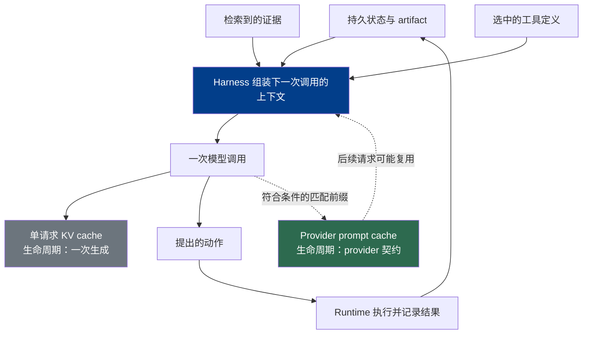

# 第 3 章：上下文是一种有限资源

本章负责单次调用的上下文选择与缓存生命周期；后续章节分别负责检索流水线、记忆和持久状态。

### 3.1 上下文是预算，不是记忆存储

*上下文（context）* 是一次模型调用可见的 token 与多模态表示。它容量有限，针对特定调用组装，不能与持久执行状态或记忆混为一谈。《LLM Foundations》第 9 章解释了模型侧的限制；本章讨论 harness 应当把什么放进这个限制之内。

可用上下文更多有时会有帮助，但把窗口填满并不天然有益。Anthropic 把上下文描述为一种“注意力预算”：新增材料可能稀释相关信号，检索准确率也会随模型、任务、长度和信息位置而变化（[Anthropic — Effective Context Engineering for AI Agents](https://www.anthropic.com/engineering/effective-context-engineering-for-ai-agents)）。因此，应把这种 *上下文退化（context rot）* 当作概率性的工程风险，而不是固定的轮数限制，也不是“任何 prompt 变长都会变差”的定律。

一个朴素的 agent 循环会让问题变得很直观：

1. 组装指令、工具、对话记录和当前任务数据；
2. 让模型提出一个动作；
3. 执行获得授权的动作，并追加其结果；
4. 使用扩大的对话记录重复上述过程。

只有这个只追加的基线才会单调增长。生产 harness 可以裁剪低价值材料、清除体量过大的工具结果、卸载 artifact、压缩早期轮次、重置上下文、按需检索信息，或延迟加载工具定义。每种变换都会改变下一次调用可见的内容，因此需要明确的正确性标准和可恢复引用；第 5 章会深入讨论这些损失和 provenance 问题。

### 3.2 组装足够使用的最小上下文

实际目标是为下一项决策提供足够使用的最小高信号输入。Anthropic 把这个目标描述为：找到能最大化预期结果概率的最小 token 集合（[Anthropic — Effective Context Engineering for AI Agents](https://www.anthropic.com/engineering/effective-context-engineering-for-ai-agents)）。一种实用的组装顺序是：

- 稳定的指令和行为指导；
- 只包含模型可能需要发现的工具；
- 以紧凑结构表示的任务状态；
- 局部连续性所需的近期动作和观察；
- 与当前步骤相关的检索证据和 artifact 引用。

结构有助于导航，但不会产生安全边界。Markdown 标题、XML 标签和清晰的标记可以区分指令与证据，而授权与强制策略检查仍然属于 harness 和 runtime 的责任（见第 2、7 章）。工具描述之间也应有足够清晰的区别，让模型能够做出选择；重叠或含糊的接口既会占用上下文，也会增加选错工具的概率（[Anthropic — Effective Context Engineering for AI Agents](https://www.anthropic.com/engineering/effective-context-engineering-for-ai-agents)）。

Few-shot 示例也应采用同样的取舍原则。优先选择少量、有代表性并能展示预期决策边界的示例。把所有边界情况都列成目录，可能会挤占实时任务所需的空间，却不能保证模型泛化。

### 3.3 三个不同对象：上下文、KV cache 与 prompt cache

三个相互关联的概念有不同的生命周期：

| 对象 | 生命周期与所有者 | 对 harness 的含义 |
|---|---|---|
| 上下文 | 一次模型调用；由 harness 组装 | 本次调用中模型可见的完整输入。它不是持久状态。 |
| 单请求 KV cache | 一次生成；由推理系统管理 | 在该次生成中，为已经处理的 token 复用 attention key/value 状态。 |
| 跨请求 provider prompt cache | 跨符合条件的请求；由 provider 契约暴露 | 复用完全匹配或按 provider 规则匹配的前缀。准入条件、匹配、断点、保留时间、数据控制、指标、延迟和计费都依 provider 而定。 |

第三种机制在内部可能复用由 KV 派生的状态，但这个实现细节并不会让它与单请求 KV cache 成为同一个产品契约。OpenAI 文档说明会自动缓存符合条件且精确匹配的 prompt 前缀，并在响应 usage 中暴露 cached-token 信息；Anthropic 文档则说明了显式 cache breakpoint、前缀匹配和可配置的缓存生命周期（[OpenAI — Prompt Caching](https://developers.openai.com/api/docs/guides/prompt-caching)；[Anthropic — Prompt Caching](https://platform.claude.com/docs/en/build-with-claude/prompt-caching)）。因此，在讨论独立 API 请求之间的复用时，代码和正文都应使用 *provider prompt-cache 命中*。

Agent 循环往往会让跨请求 prompt cache 很有价值，因为一个较大的前缀可能保持稳定，而每轮只追加很短的动作和观察。但这取决于工作负载，并非普遍规律。Yichao “Peak” Ji 在 2025 年 7 月关于 Manus 的报告中称，其平均输入输出 token 比接近 100:1，并引用了当时 Claude Sonnet 的价格：每百万缓存输入 token 为 0.30 美元，未缓存输入 token 为 3 美元（[Manus — Context Engineering for AI Agents: Lessons from Building Manus](https://manus.im/blog/Context-Engineering-for-AI-Agents-Lessons-from-Building-Manus)）。这些数字只是一个具名的历史案例，不代表当前价格、跨 provider 比率，也不能预测其他工作负载。

### 3.4 设计与调试可缓存前缀

Cache-aware 设计必须从 provider 契约出发。OpenAI 和 Anthropic 都要求前缀内容匹配才能复用，但各自的准入规则、缓存控制、生命周期和核算方式并不相同；应用应查阅所选模型的当前文档，而不是硬编码一个通用阈值或价格（[OpenAI — Prompt Caching](https://developers.openai.com/api/docs/guides/prompt-caching)；[Anthropic — Prompt Caching](https://platform.claude.com/docs/en/build-with-claude/prompt-caching)）。

如果 API 的匹配规则会奖励前缀稳定性，就应把稳定内容放在易变内容之前。在语义允许时，把时间戳、request ID、用户专属状态和当前 observation 放在可复用边界之后。确定性序列化同样重要：即使底层对象看起来等价，字段顺序或空白变化也可能改变序列化后的前缀。

Cache 命中率下降时，在改变 agent 设计之前检查以下项目：

- **前缀边界：** 哪些确切的字节或 token 位于可复用前缀中？
- **动态字段：** 时间戳、nonce、request ID、tenant 值或轮换指令是否进入了该前缀？
- **工具定义：** 描述、顺序、schema 或可用性是否发生变化？
- **序列化：** prompt 和工具 JSON 是否以确定方式生成？
- **缓存控制：** 该 provider 是否要求或支持显式 breakpoint，其位置是否正确？
- **Provider 指标：** 缓存输入用量和延迟是否来自 provider 响应，而不是根据总 token 数推测？
- **当前契约：** 模型、region、retention mode 和 data-control 设置是否仍符合 provider 的当前文档？

### 3.5 工具目录：三种有效策略

Agent 并不必须把每个工具定义永久保留在上下文中，这不是通用规则。MCP 明确允许 server 通知 client 工具列表发生变化，因此协议支持动态目录；只是特定模型或缓存设计可能让这种变化代价很高（[MCP — Tools Specification](https://modelcontextprotocol.io/specification/2025-06-18/server/tools)）。常见模式有三种：

1. **稳定目录加 action masking。** 为了保持模型连续性和 prompt-cache locality，让工具定义保持稳定，但由确定性 runtime 拒绝当前状态下不可用的动作。Manus 报告称，它在自己的 provider 和工作负载配置中采用了这种模式，并为同类动作使用一致的名称前缀（[Manus — Context Engineering for AI Agents: Lessons from Building Manus](https://manus.im/blog/Context-Engineering-for-AI-Agents-Lessons-from-Building-Manus)）。它提出的“屏蔽而非删除”是一个案例，不是协议要求。
2. **延迟加载或工具搜索。** 不在初始模型输入中放入大型目录，而是在发现相关工具时才加载定义。Anthropic 的 tool-search 接口支持 `defer_loading`，并说明延迟定义如何在选中后展开，同时与其 prompt-caching 设计兼容（[Anthropic — Tool Reference](https://platform.claude.com/docs/en/agents-and-tools/tool-use/tool-reference)）。
3. **稳定的 meta-tool 或代码界面。** 暴露一个小而稳定的搜索、registry 或代码执行界面，在其背后解析更大的 capability 目录。这样可以减少 schema 体积，但会增加一个发现步骤，也不会取消对最终 capability 进行 dispatch validation 和授权的要求。

应当用评测数据在这些模式之间做选择。相关变量包括目录大小、模型的工具选择质量、provider 缓存行为、延迟、token 成本、权限范围以及陈旧工具引用的风险。动态工具列表发生变化时，绝不能因为旧版本曾经暴露过某个工具就沿用授权；第 6 章会定义调用与授权生命周期。

### 3.6 把工作材料卸载到 Artifact

大体量 observation、源文档、中间计算和生成输出不必全部留在实时上下文里。文件系统或 artifact store 可以为它们提供持久、可寻址的位置。上下文只需保留短摘要，加上能够在需要时恢复底层证据的路径、URI、版本或内容哈希。

这些存储是*工作材料*，不是自动形成的记忆。如果没有有意义的名称、索引、provenance、访问检查和检索约定，agent 仍可能找不到 artifact，也可能从错误的任务或 tenant 中取回内容。LangChain 把文件系统描述为基础性的 harness primitive，因为它支持渐进卸载与协作，同时仍要求 harness 决定哪些内容应返回上下文（[LangChain — The Anatomy of an Agent Harness](https://blog.langchain.com/the-anatomy-of-an-agent-harness/)）。

对于 coding agent，代码仓库通常是项目事实的权威来源。OpenAI 的 Codex harness 指南建议，把导航指令、设计知识和可机械检查的约束放在代码附近，让新的 session 能自行发现系统的工作方式与改动验证方法（[OpenAI — Harness Engineering](https://openai.com/index/harness-engineering/)）。这一原则倾向于短小、局部、易发现的文档和标准验证命令，而不是一个不断增长的单一 prompt。

### 3.7 即时选择，而不是完整检索流水线

Just-in-time retrieval 是一种上下文选择技术：先保留路径、链接和查询等轻量标识符，只在下一项决策需要时加载底层材料（[Anthropic — Effective Context Engineering for AI Agents](https://www.anthropic.com/engineering/effective-context-engineering-for-ai-agents)）。它是对预计算检索的补充，而不是替代。混合系统可以预加载少量高价值指令，为任务检索索引证据，并让 agent 按需检查 artifact。

本章止步于上下文边界：加载什么、何时加载，以及卸载后保留什么引用。第 4 章会沿着生产数据路径继续讨论 ingestion、parsing、chunking、ACL-aware indexing、freshness、hybrid retrieval、reranking、provenance 和 retrieval evaluation。《LLM Foundations》第 11 章提供了这条流水线依赖的 embedding 与 retrieval 概念。

---

## 图：上下文选择与缓存生命周期

---

## 要点

- **上下文是单次调用的输入，而不是持久记忆：** harness 从状态、artifact、检索证据和近期交互中选择上下文。
- **只有朴素的只追加对话记录才会单调增长：** 生产循环可以裁剪、卸载、压缩、重置、检索或延迟工具。
- **KV cache 与 provider prompt cache 有不同生命周期：** 跨请求复用应使用 provider 术语，并把规则和价格视为 provider-specific。
- **稳定工具只是一种策略，不是定律：** 应使用工作负载评测比较 masking、延迟加载/tool search 与稳定 meta-tool。
- **Artifact 让上下文可恢复：** 路径和 provenance 使大体量材料能够离开窗口，而不至于无法找回。
- **Just-in-time retrieval 是上下文选择：** 第 4 章负责生产检索流水线。

## 延伸阅读

- Anthropic Applied AI Team, *Effective Context Engineering for AI Agents*, Anthropic, Sep 2025. https://www.anthropic.com/engineering/effective-context-engineering-for-ai-agents
- OpenAI, *Prompt Caching*. https://developers.openai.com/api/docs/guides/prompt-caching
- Anthropic, *Prompt Caching*. https://platform.claude.com/docs/en/build-with-claude/prompt-caching
- Model Context Protocol, *Tools Specification*, Jun 2025. https://modelcontextprotocol.io/specification/2025-06-18/server/tools
- Anthropic, *Tool Reference*. https://platform.claude.com/docs/en/agents-and-tools/tool-use/tool-reference
- Yichao 'Peak' Ji, *Context Engineering for AI Agents: Lessons from Building Manus*, Manus, Jul 2025. https://manus.im/blog/Context-Engineering-for-AI-Agents-Lessons-from-Building-Manus
- Vivek Trivedy, *The Anatomy of an Agent Harness*, LangChain, Mar 2026. https://blog.langchain.com/the-anatomy-of-an-agent-harness/
- OpenAI, *Harness Engineering: Leveraging Codex in an Agent-First World*, Feb 2026. https://openai.com/index/harness-engineering/
