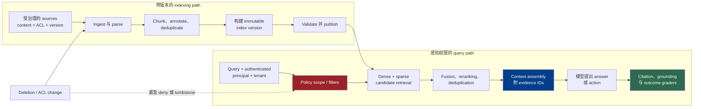

# 第 4 章：生产检索与 Grounding

《LLM Foundations》第 11 章解释了 retrieval embedding、lexical 与 dense search、chunking、reranking 以及 retrieval metrics。本章从生产边界接手：harness 如何把持续变化、受权限约束的源数据变成模型可以安全使用、operator 又能追溯到来源的 evidence。

Retrieval-augmented generation 改变的是模型输入，而不是模型权重：系统检索外部信息，并把它提供给当前 generation（[Lewis et al. — Retrieval-Augmented Generation for Knowledge-Intensive NLP Tasks](https://arxiv.org/abs/2005.11401)）。到了生产环境，这项看似简单的操作同时是 data lifecycle、authorization decision、context-selection step 和 evaluation problem。

### 4.1 Retrieval、Grounding 与 Outcome 是三种不同的主张

本书有意区分以下三个术语：

- **Retrieval**：针对特定 query、identity 与 task，从受治理的 corpus 中选择 candidate evidence。
- **Grounding**：检查生成结果中的 claims 是否得到实际提供给模型的 evidence 支持。
- **Task outcome**：检查整个 workflow 是否产生了正确的外部结果。

系统可能检索到 relevant chunk，但模型没有使用它；模型可能忠实总结了一段已经过时或本身错误的 retrieved chunk；一份引用完备的回答仍可能没有完成用户任务。反过来，回答也可能依靠参数知识得出正确结论，却没有得到 retrieved corpus 的支持。这些是不同的 failure modes，需要不同的 graders。

因此，harness 应把 retrieval output 当作结构化 evidence product，而不是一段匿名字符串：

```text
EvidenceItem {
  source_id, source_version, chunk_id,
  title, location, content_hash,
  retrieved_at, index_version,
  acl_scope, retrieval_scores,
  text
}
```

具体 schema 取决于 application。不可省略的原则是：文本必须始终与 source identity、version、location、authorization scope 以及生成它的 index 绑定。这些字段使后续 citation check、删除、incident review 和可复现 evaluation 成为可能。

### 4.2 从受治理的 Source Record 构建 Index

Indexing pipeline 应从明确声明的 system of record 开始，而不是从 crawler 偶然发现的某个副本开始。一条实用的 source record 包含稳定的 source ID、source version 或 modification marker、tenant、content type、owner、access policy 或 ACL reference，以及 deletion status。Ingest job 还要记录自己何时、以何种方式观察到该状态。

生产路径如下：

1. **Ingest：** 枚举或接收 source changes，同时保留 source identity 与 permissions。
2. **Parse：** 提取文本和结构，并保留 page、heading、table、code symbol 或 timestamp 等 location。
3. **Chunk：** 创建可检索单元，同时避免把 claim 与理解它所必需的 qualifier 拆开。
4. **Annotate：** 附加 provenance、tenant、ACL、language、timestamp、document type 和其他可过滤 metadata。
5. **Deduplicate：** 用 content hash 识别完全相同的副本，用经过评测的规则识别 near-duplicate；即使正文只索引一份，也要保留所有 source relationships。
6. **Represent：** 创建所选 retrievers 需要的 lexical fields 与 retrieval embeddings。
7. **Publish：** 把 immutable records 写入具名的 index version；只有通过 validation 后，该版本才可用于 serving。

Chunk size、boundary、overlap 和 document context 都会影响 retrieval behavior；它们是调优变量，并不是中性的 preprocessing detail。例如，Anthropic 的 Contextual Retrieval 报告会在创建 embedding 与 BM25 index 前加上 document-specific context，但这只是一个经过评测的 preprocessing design，并非普遍要求（[Anthropic — Contextual Retrieval](https://www.anthropic.com/engineering/contextual-retrieval)）。

记录 parser、chunker、metadata schema、embedding model 与 mode、lexical analyzer，以及 contextualization prompt 或 model 的版本。没有这份 manifest，就无法把“index 发生变化”拆解为 corpus change、preprocessing change 或 retrieval-model change。

Deduplication 不能抹掉 provenance。如果同一段 policy paragraph 出现在三个受管控的 sources 中，index 可以避免把三份副本都发送给模型，但仍需知道哪些 source versions 包含这段文本，以及各自适用什么 access rules。Content hash 只能证明按某种 normalization 得到的 bytes 相等；它不能证明两条 source records 拥有相同的 authority 或 lifecycle。

### 4.3 执行 ACL-Aware Query Path

在 query time，harness 组装的不只是一条 search string。它要把 request 与 tenant 和 principal 绑定，推导 mandatory filters，生成一条或多条 retrieval queries，并让当前 index version 与 policy version 贯穿结果。

一条稳健的 query path 包含以下阶段：

1. **Formulate the query：** 使用用户 request，以及 retrieval 所必需的最少 workflow state；任何 rewrite 都要与 original query 一起保留。
2. **Apply scope：** 在暴露 evidence 前，选择 tenant、corpus、time range、document type 与 authorization filters。
3. **Generate candidates：** 根据 workload 运行 dense 和/或 sparse retrieval。
4. **Fuse：** 融合 rank 或经过归一化的 scores；不同 retriever 的 raw scores 并不会天然可比。
5. **Rerank：** 当 evaluation 证明额外工作值得时，用成本更高的 relevance model 处理有上限的 candidate set。
6. **Deduplicate and diversify：** 当 task 需要更广的 evidence 时，避免让等价 passages 浪费 result slots 与 context。
7. **Assemble context：** 在 token budget 内选择 evidence，保留 source labels，并让 quoted evidence 与 instructions 明确分离。
8. **Return evidence metadata：** 让 model-facing prompt 与下游 citation validation 都能获得 source 和 version identifiers。

Dense 与 lexical retrieval 捕获不同信号；reranking 也只能重新排列第一阶段 retrieval 已经提供的 candidates。Anthropic 发布的实现按这一顺序结合 embeddings、BM25、rank fusion、deduplication 与 reranking；其测得结果只属于报告中使用的 corpora、models、candidate counts 与 metric，不能代表所有 RAG 系统（[Anthropic — Contextual Retrieval](https://www.anthropic.com/engineering/contextual-retrieval)）。

Query rewriting 同样可能失败。记录 original query、每条 derived query、filters、candidate IDs、各阶段 score 以及最终选择的 evidence。一次 rewrite 如果悄悄丢掉 identifier 或 negation，search 表面上可能完全健康，结果却已经变得不相关。

### 4.4 Freshness、Deletion 与 Index Migration

Index 是派生 view，不是 source of truth。它的 lifecycle 应让每条 source record 的四种状态可以被观察：current、pending update、tombstoned 或 failed。“Ingestion job 已运行”弱于“截至 source watermark W 的所有变更均已体现在 serving index V 中”。

按 source class 定义 freshness service level。Product catalog 也许能容忍几分钟延迟；被撤销的访问权限或已删除的机密文档，则可能需要在较慢的文本和 vector 清理完成前就退出 retrieval。安全模式是先让 tombstone 或 deny marker 在 serving path 生效，再异步执行物理删除与 compaction。

当 parser、chunker、embedding model、lexical analyzer 或 schema change 让新旧 records 不再兼容时，应进行 re-index。构建并验证新的 immutable index version，在固定 eval set 上把它与当前版本对比，然后切换 serving pointer。Elasticsearch index aliases 是一个 vendor-specific 示例：它可以切换 application 使用的 index，并支持无停机 reindex；这里可迁移的架构经验是 versioned publication，而不是依赖该 API（[Elastic — Aliases](https://www.elastic.co/guide/en/elasticsearch/reference/current/aliases.html)）。

每次 migration 都要显式处理：

- **Backfill：** 新 schema 能否重建每条仍然 live 的 source record？
- **Dual writes 或 change capture：** backfill 期间到达的 edits 如何应用到两个版本？
- **Validation：** document counts、ACL coverage、抽样 content hashes 与 retrieval evals 是否通过？
- **Cutover 与 rollback：** 每条 request 由哪个 serving version 处理，流量是否可以切回上一版本？
- **Retirement：** 何时可以删除旧 index 及其中的敏感副本？

Source deletion、ACL revocation 或 legal hold 不只是另一种 relevance update。要让它带着可审计的 completion state，贯穿 ingestion、index publication、caches、replicas、backups 和 citation surfaces。

### 4.5 在 Retrieval 阶段强制执行 Permission

Permission check 应位于 retrieval path，而不能只放在显示最终回答的界面上。把 authenticated principal、tenant、groups 或 roles、resource scope、适用时的 purpose，以及 policy version 绑定到 search request。只有获得授权的 candidates 才能进入 context assembly。

Microsoft 文档中的 security-filter pattern 展示了这种机制：系统把 principal identifiers 存入可过滤 metadata，再在 query 中提供这些标识，以排除不匹配的 documents。Microsoft 同时提醒，这种 pattern 本身只是基于字符串的 filtering，并不等于 authentication；application 仍必须验证 caller，并正确构造 filter（[Microsoft — Security filters for trimming results in Azure AI Search](https://learn.microsoft.com/en-us/azure/search/search-security-trimming-for-azure-search)）。

把以下各项视为 correctness invariants：

- 每个 chunk 都继承其 source 当前的 permission semantics；
- ACL changes 通过可测量、高优先级的路径传播；
- 所有 retrieval modes——包括 dense、sparse、hybrid、reranking、cache hits 与 direct document lookup——都应用等价 scope；
- reranker 永远不会收到 calling service 无权披露的 candidates；
- evidence cache 除了 query 与 index version，还必须按 tenant 和 authorization scope 区分；
- citation 在 view time 通过 authorization check 解析，而不是变成永久有效的 capability URL。

对一份已经组装好的 top-`k` list 做 post-filtering，并不等于 permission-aware retrieval：它可能只剩下过少的 authorized candidates，也可能在 intermediate services、logs 或 models 中暴露 restricted text。如果 search backend 无法直接执行 policy，就应在任何不受信任的 consumer 看见 candidate content 前部署不可绕过的 policy enforcement point，并在该设计下检索足够多的 authorized candidates。

Tenant isolation 是系统属性，不只是一个 metadata field。根据风险，它可能要求 separate indexes、encryption keys、service identities、network boundaries 或 retention policies。无论采用哪种设计，cross-tenant negative tests 都应进入每个 retrieval release suite。

### 4.6 Retrieved Content 是不受信任的 Content

Retrieval relevance 不会赋予 instruction authority。Web page、uploaded PDF、ticket、code comment 或 internal document 都可能包含试图改变模型方向或触发 tool use 的文字。NIST 把 prompt injection 定义为利用 untrusted input 与 higher-trust prompt 拼接的攻击；这正是 retrieval system 会建立的边界（[NIST AI 100-2e2025 — Adversarial Machine Learning Taxonomy](https://nvlpubs.nist.gov/nistpubs/ai/NIST.AI.100-2e2025.pdf)）。

Harness 应当：

- 把 retrieved spans 标记为 evidence，而不是 system 或 developer instructions；
- 让 source 与 trust metadata 贯穿 query rewriting、reranking 和 context assembly；
- 使用 delimiter 帮助模型导航 evidence，但不声称 delimiter 构成安全边界；
- 把 content 最小化为当前问题真正需要的部分；
- 对 retrieved text 建议的任何 action 继续要求常规 authorization 与 mandatory approval gates；
- 即使 passage 提出请求，也不能把 secrets 和 high-impact tools 交给模型控制；
- 记录 action 发生前有哪些 evidence，以便重建 incident。

第 2 章讨论的 instruction priority 是 behavioral defense。第 7 章中的 sandbox、credential broker、allowlist、policy enforcement point 与 approval gate 才提供 executable boundary。Retrieval filtering 可以减少系统接触已知 malicious material 的机会，但 classifier 或 blocklist 不能证明剩余文本一定安全。

### 4.7 保留 Citation 与 Provenance

Citation 至少包含两个相互独立的 correctness condition：

1. **Attribution：** citation 能解析到实际提供给模型的 source version 与 location。
2. **Support：** 该 passage 支持与之绑定的 claim。

关于 citation-enabled generation 的研究会把 citation correctness 与 completeness 同整体 answer quality 分开评估，这说明仅仅加入 source markers 并不够（[Gao et al. — Enabling Large Language Models to Generate Text with Citations](https://arxiv.org/abs/2305.14627)）。

给模型提供稳定的 evidence IDs，而不是要求它复现任意 URL。Generation 完成后，解析 claim-to-evidence links，检查每个 ID 是否来自 authorized evidence set，再从已存储的 source record 渲染 human-facing citation。在风险值得时，使用 entailment check 或 human review 检验 support；不能因为某个 retrieved passage 排名很高，就把它重新标记成“verified”。

Provenance 应跨越 answer generation。Stored output 可以指向 `source_id + source_version + location + content_hash`，interface 则另行解析最新、仍获授权的 view。这样 operator 才能区分“模型当时看到了什么”和“source 现在写了什么”。

### 4.8 评测完整 Pipeline，包括 No-Answer Cases

Retrieval 调优应使用 end-to-end trials，而不是只看一个 aggregate relevance number。Evaluation harness 应固定 corpus snapshot、index version、identity 与 ACL set、query transformations、model versions 和 grader versions。Anthropic 的 agent evaluation 指南也把 environment、trial、transcript、outcome 与 graders 视为必须分别定义并保持稳定的组件（[Anthropic — Demystifying Evals for AI Agents](https://www.anthropic.com/engineering/demystifying-evals-for-ai-agents)）。

使用分层 scorecard：

| 层级 | 问题与示例 measurements |
|---|---|
| Corpus 与 index | 预期 sources 是否存在、最新、已去重且 permissions 完整？Deletion 与 ACL propagation lag 是多少？ |
| Candidate retrieval | Recall@`k`、Precision@`k`、MRR、NDCG，以及不同 query cohort 下的 misses；《Foundations》第 11 章定义了这些 metrics。 |
| Selection | Fusion 或 reranking 是否在 context budget 内改善有用 evidence？结果有多大比例彼此重复或冲突？ |
| Abstention | 当 corpus 缺少支持，或所有 candidates 都不在 authorized scope 内时，系统是否返回经过校准的 no-evidence state，而不是捏造支持？ |
| Grounding 与 citation | 哪些 claims 得到支持、缺少支持、受到反驳或缺少 citation？Citation 是否解析到实际使用的精确 source version？ |
| Task outcome | 回答或 agent workflow 是否解决了任务，并避免 disallowed actions 或 data disclosure？ |
| Operations | Ingestion lag、分阶段 query latency、failure rate、tokens、reranker calls，以及每个 successful outcome 的 cost。 |

数据集应包含 answerable、unanswerable、stale-source、conflicting-source、deleted-source、revoked-ACL、cross-tenant、exact-identifier、paraphrase 和 adversarial-document cases。No-answer decision 是 task definition 的一部分，不是应该从 dataset 中省略的例外。

Candidate count、最终 top-`k`、fusion weights、reranker cutoff 与 no-evidence threshold 应联合调优。更大的 candidate set 可能改善 recall，但会增加 search 与 reranking 工作；更多 final passages 会消耗 model context，也可能增加干扰。Anthropic 在自己的 reranking 配置中报告了这种 latency/cost/quality tradeoff，并明确建议针对具体 workload 做实验（[Anthropic — Contextual Retrieval](https://www.anthropic.com/engineering/contextual-retrieval)）。Raw similarity 或 reranker scores 不应被当作可移植概率；应针对精确的 model、corpus、index 与 query cohorts 校准 threshold。

同时报告 stage latency 与 end-to-end latency。至少拆分 query formulation、embedding、sparse 与 dense search、fusion、reranking、context assembly 和 generation。优化目标应是每个 successful、policy-compliant outcome 的 cost，而不只是 cost per query 或 Recall@`k`。

### 4.9 Case Study：Contextual Retrieval，而不是通用 Baseline

Anthropic 2024 年的 Contextual Retrieval 报告是 combined pipeline 的一个有用具名案例。它在 embedding 与 BM25 indexing 前加入 chunk-specific context，融合 lexical 与 dense candidates，进行 deduplication，并测试了 reranking stage。报告中的 improvement 是在特定 corpora、embedding configurations、candidate counts、基于 top-20 recall 的 failure rate 和特定 reranker 下测得的（[Anthropic — Contextual Retrieval](https://www.anthropic.com/engineering/contextual-retrieval)）。

可迁移的经验是实验方法：定义 corpus 与 metric，改变一个 pipeline component，测量 retrieval 与 downstream behavior，并把 cost 与 latency 纳入考量。报告中的 improvement percentages 和推荐 top-`k` 并不是其他 corpus 的默认值。生产团队应先在自己的 documents、permissions、questions 与 outcome graders 上复现对比，再决定是否采用这种设计。

---

## 图：受治理的 Retrieval Path



---

## 要点

- **Retrieval 是一条受治理的数据流水线：** ingestion、parsing、chunking、metadata、ACL、index version 与 deletion 都属于 answer correctness。
- **Permission 必须在 evidence 暴露前生效：** 每种 retrieval mode、cache、reranker 与 citation resolver 都要绑定 identity 和 tenant。
- **Retrieved text 不受信任：** relevance 不会赋予 passage 指令权，也不会允许它造成 side effect。
- **Evidence 需要持久 provenance：** 保留 source version、location、content hash、index version 与 authorization scope。
- **Retrieval、grounding、citation 与 outcome 需要不同 graders：** 一层成功并不能证明下一层成功。
- **调优整个系统：** top-`k`、threshold、reranking、abstention、latency 与 cost 都是 workload-specific decisions。
- **具名结果仍然只是具名案例：** Anthropic 的 Contextual Retrieval 结果可以启发实验，但不是通用 performance guarantee。

## 延伸阅读

- Patrick Lewis et al., *Retrieval-Augmented Generation for Knowledge-Intensive NLP Tasks*, 2020. https://arxiv.org/abs/2005.11401
- Anthropic, *Introducing Contextual Retrieval*, Sep 2024. https://www.anthropic.com/engineering/contextual-retrieval
- Microsoft, *Security filters for trimming results in Azure AI Search*. https://learn.microsoft.com/en-us/azure/search/search-security-trimming-for-azure-search
- Elastic, *Aliases*. https://www.elastic.co/guide/en/elasticsearch/reference/current/aliases.html
- NIST, *Adversarial Machine Learning: A Taxonomy and Terminology of Attacks and Mitigations*, NIST AI 100-2e2025. https://nvlpubs.nist.gov/nistpubs/ai/NIST.AI.100-2e2025.pdf
- Tianyu Gao et al., *Enabling Large Language Models to Generate Text with Citations*, 2023. https://arxiv.org/abs/2305.14627
- Anthropic, *Demystifying Evals for AI Agents*. https://www.anthropic.com/engineering/demystifying-evals-for-ai-agents
