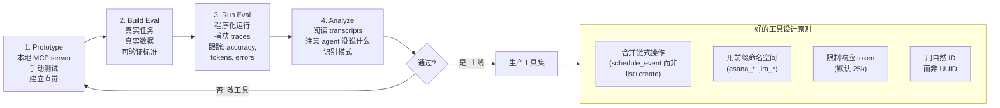

# 第 4 章：工具与 Agent-Computer Interface

### 4.1 为什么工具设计不同

Anthropic 借用 HCI 的类比提出 *agent-computer interface*（ACI）：agent 如何使用工具，值得像人类如何使用界面一样认真设计 ([Anthropic - Building Effective Agents](https://www.anthropic.com/engineering/building-effective-agents))。工具格式有三条具体建议：

- 给模型足够 token 在提交语法前“思考”，因为语法一旦写出很难撤回。
- 保持格式接近模型训练数据中常见形式。
- 避免过高的格式开销，例如 diff header 中的精确行号，或 JSON 嵌套代码时的过度转义。

Anthropic 构建 SWE-bench agent 时，在工具 schema 优化上花的时间比 prompt 本身更多。一个具体改进是：把工具路径从相对路径改为绝对路径后，agent 离开根目录后的路径错误几乎全部消失。

### 4.2 选择正确工具与正确数量

Anthropic 后续的 “Writing Effective Tools for Agents” 进一步说明核心陷阱：更多工具并不带来更好结果 ([Anthropic - Writing Effective Tools for Agents](https://www.anthropic.com/engineering/writing-tools-for-agents))。常见错误是把每个 API endpoint 都包装成工具，不管它是否适合 agent。Agent 的 *affordance* 与传统软件不同：如果用 `list_contacts` 查通讯录，agent 必须逐 token 读每个联系人，等于暴力搜索；更合适的是 `search_contacts` 或 `message_contact`。

工具应合并经常串联的操作。与其给 `list_users`、`list_events`、`create_event`，不如给 `schedule_event`。与其给 `read_logs`，不如给 `search_logs`。与其给 `get_customer_by_id` + `list_transactions` + `list_notes`，不如给 `get_customer_context`。

### 4.3 工具从哪里来：Model Context Protocol

本章前后几节都假设 agent 已经有了一组设计良好的工具。实践中，这些工具很多是通过一个标准接口送达的：*Model Context Protocol*（MCP，模型上下文协议）。MCP 是一个开放的客户端-服务器标准。一个 *MCP server* 通过统一协议暴露一组工具，以及可选的资源和可复用提示；任何兼容 MCP 的 *客户端*，例如 Claude Code、IDE 或自定义 agent，都能发现并调用它们，无需定制集成 ([Anthropic - Code Execution with MCP](https://www.anthropic.com/engineering/code-execution-with-mcp))。

它的价值在于可组合性。一个团队可以把 Google Drive server、Salesforce server 和内部数据库 server 接到同一个 agent 上，每个 server 独立构建和维护，而 agent 看到的是一个合并后的工具界面。这就是 MCP 在本书中反复出现的原因：它是本章其余部分所讲的命名空间、masking 和代码执行模式的底座。

代价是 MCP 让工具供给过剩变得轻而易举。正如第 2 章指出的，MCP 让用户能轻易接入数百个工具，而一个装满数百条工具定义的上下文，正是第 2 章“mask，而不是删除”原则和上面的合并建议所要对抗的膨胀。MCP 是管道，不是工具设计的替代品：一个设计糟糕的 MCP server 只会把设计糟糕的工具规模化地送来。本章的纪律——合并经常串联的操作、用命名空间、限制响应大小、像写入职文档一样写描述——无论工具是手写的还是经 MCP 送达，都同样适用。

### 4.4 命名空间

当 agent 能访问几十个 MCP server 和数百个工具时，命名冲突和目的模糊会成为关键失败模式。Anthropic 建议把相关工具放在共同前缀下，例如服务前缀 `asana_*`、`jira_*`，以及服务内部资源前缀 `asana_projects_*`、`asana_users_*`。他们发现前缀与后缀命名方案会对工具使用评估产生非平凡影响，且最佳方案依赖 workload ([Anthropic - Writing Effective Tools for Agents](https://www.anthropic.com/engineering/writing-tools-for-agents))。

Manus 也用相同模式控制动作空间：所有浏览器工具用 `browser_` 前缀，shell 工具用 `shell_` 前缀，从而用简单 logit 约束 mask 整组工具 ([Manus - Context Engineering for AI Agents](https://manus.im/blog/Context-Engineering-for-AI-Agents-Lessons-from-Building-Manus))。

### 4.5 返回有意义的上下文

工具响应应优先考虑相关性，而不是最大灵活性；应优先使用自然语言标识符，而不是技术 ID。Anthropic 发现，把字母数字 UUID 解析成语义标签，甚至 0-indexed ID，可以显著提升 Claude 的精度并减少幻觉 ([Anthropic - Writing Effective Tools for Agents](https://www.anthropic.com/engineering/writing-tools-for-agents))。如果两者都需要，可以让自然名称供 agent 使用、技术 ID 供下游调用，也可以用 `response_format` enum 提供 `concise` 与 `detailed` 两种模式；他们的 Slack 示例中，concise 响应体积可以只有 detailed 的三分之一。

### 4.6 Token 高效响应

工具响应是上下文膨胀的主要来源。Anthropic 默认将 Claude Code 的工具响应限制为 25,000 token，并建议结合分页、范围选择、过滤和带合理默认值的截断 ([Anthropic - Writing Effective Tools for Agents](https://www.anthropic.com/engineering/writing-tools-for-agents))。被截断的响应应包含引导，建议 agent 采取更高效策略，例如小而精准的搜索，而不是一次宽泛搜索；错误响应也应有帮助，而不是不透明 traceback。

HumanLayer 在自己代码库中的 “back-pressure” 实践就是直接应用：build 和 test hook 在成功时吞掉输出，只暴露错误。早期他们让 agent 每次改动后跑完整测试套件，4,000 行通过测试输出会灌满上下文，导致 agent 忘记真实任务并开始对测试文件产生幻觉 ([HumanLayer - Skill Issue](https://www.humanlayer.dev/blog/skill-issue-harness-engineering-for-coding-agents))。

### 4.7 对工具描述做 Prompt Engineering

Anthropic 认为这是最有效的杠杆之一，并报告称 Claude Sonnet 3.5 在 SWE-bench Verified 达到 SOTA 需要对工具描述做精细改写 ([Anthropic - Writing Effective Tools for Agents](https://www.anthropic.com/engineering/writing-tools-for-agents))。建议是：像给刚入职的初级工程师写说明一样写工具描述。把隐含上下文显式化，例如专门查询格式、领域术语、资源之间关系。参数名要明确，如 `user_id` 而不是 `user`。在 workbench 中跑大量例子，观察错误并迭代。

一个具体调试例子：Claude 的 web search 工具刚推出时，trace 显示 Claude 会不必要地把 `2025` 附加到 `query` 参数中，偏置搜索结果。修复无需重新训练模型，只需要更清楚的工具描述。

### 4.8 代码执行作为元工具

近期一个转变是：不要把 MCP 工具直接呈现为调用，而是呈现为 agent 通过写代码调用的代码 API。Anthropic 的 “Code Execution with MCP” 认为，当 agent 面对几十个 MCP server、数百个工具时，预先把每个工具定义加载进上下文，并让每个中间结果都经过模型，非常浪费 ([Anthropic - Code Execution with MCP](https://www.anthropic.com/engineering/code-execution-with-mcp))。

替代方案是：把 MCP server 暴露为 TypeScript 文件系统，每个工具一个文件，文件中是 `callMCPTool` 的类型化 wrapper。Agent 通过列目录和读取所需工具文件来发现工具。在 Anthropic 的 Google Drive -> Salesforce 示例中，这将 token 使用量从 150,000 降到 2,000，节省 98.7%。

收益会叠加：

- **渐进披露**：只在需要时加载工具，减少前置上下文成本。
- **上下文高效结果**：agent 可以在执行环境中把 10,000 行 spreadsheet 过滤到 5 行，再把结果带进模型上下文。
- **更好的控制流**：循环、条件、错误处理用熟悉的代码模式，由 runtime 评估条件，而不是模型用 token 推演。
- **隐私保护操作**：中间结果默认留在执行环境中；只有 agent 显式 log 的内容进入模型。设计正确的 proxy 可以在 MCP client 边界 token 化 PII，使原始值无需进入模型。
- **状态持久化与 skills**：agent 可以把工作代码保存成由 `SKILL.md` 支持的可复用函数，逐步积累工具箱。

Cloudflare 以 “Code Mode” 为名报告了相似发现，强化了同一个结论：LLM 擅长写代码，开发者应当让它们这么做 ([Anthropic - Code Execution with MCP](https://www.anthropic.com/engineering/code-execution-with-mcp))。

代价是：代码执行需要沙箱基础设施，带来运营和安全成本。

### 4.9 用 Eval 迭代工具

Anthropic 推荐的工具开发流程有四阶段 ([Anthropic - Writing Effective Tools for Agents](https://www.anthropic.com/engineering/writing-tools-for-agents))：

1. **Prototype**：在本地 MCP server 中原型化工具，手动测试，建立直觉。
2. **Build an evaluation**：使用真实任务、真实数据和可验证成功标准，而不是玩具 sandbox。
3. **Run the evaluation**：程序化运行，并捕获包含 planning summary、工具调用、工具结果、runtime、token count、工具错误的 trace。如果模型暴露 visible thinking mode，它可以帮助调试，但 eval 不应依赖隐藏 chain-of-thought。
4. **Analyze results**：阅读 transcript，注意 agent 没说什么（LLM 不总是说出真实意图），并据此重构工具。

Anthropic 在内部 Slack 和 Asana 工具上跑这个循环，发现 Claude 优化版工具在 held-out 测试集上超过专家手写实现。这验证了这个循环，也提供了 agent 改进自身工具的早期实例。

---

## 图：工具设计流水线

---

## 要点

- **工具设计与提示设计同样重要**：ACI 类比 HCI 是恰当的。
- **更多工具会伤害而非帮助**：把常串联操作合并成专用工具。
- **MCP 标准化了工具的来源**：它让工具能跨独立 server 组合，但也让工具供给过剩变得容易——无论如何，工具设计纪律都适用。
- **命名空间不是表面美化**：它支持工具组 masking，也减少大型 MCP 环境中的冲突。
- **工具响应是上下文膨胀主因**：默认 cap、分页、过滤和截断。
- **代码执行作为元工具是阶段性跃迁**：Anthropic 示例中，把 MCP 暴露成类型化代码 API 节省 98.7% token。
- **四阶段 eval loop 是推荐工作流**：prototype -> build eval -> run eval -> analyze transcripts -> iterate。

## 延伸阅读

- Ken Aizawa, *Writing Effective Tools for Agents - with Agents*, Anthropic, Sep 2025. https://www.anthropic.com/engineering/writing-tools-for-agents
- Adam Jones and Conor Kelly, *Code Execution with MCP: Building More Efficient Agents*, Anthropic, Nov 2025. https://www.anthropic.com/engineering/code-execution-with-mcp
- Erik Schluntz and Barry Zhang, *Building Effective Agents*, Anthropic, Dec 2024. https://www.anthropic.com/engineering/building-effective-agents
- Yichao 'Peak' Ji, *Context Engineering for AI Agents: Lessons from Building Manus*, Manus, Jul 2025. https://manus.im/blog/Context-Engineering-for-AI-Agents-Lessons-from-Building-Manus
- Kyle Brunet, *Skill Issue: Harness Engineering for Coding Agents*, HumanLayer, Mar 2026. https://www.humanlayer.dev/blog/skill-issue-harness-engineering-for-coding-agents
