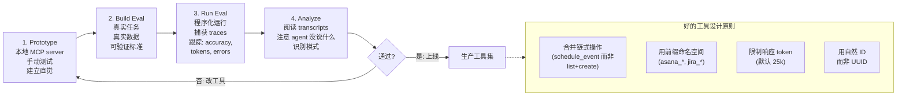

# 第 4 章：工具与 Agent-Computer Interface

### 4.1 为什么工具设计不同

Anthropic 借用 HCI 的类比提出 *agent-computer interface*（ACI）：agent 如何使用工具，值得像人类如何使用界面一样认真设计 ([Anthropic - Building Effective Agents](https://www.anthropic.com/engineering/building-effective-agents))。工具格式有三条具体建议：

- 给模型足够 token 在提交语法前“思考”，因为语法一旦写出很难撤回。
- 保持格式接近模型训练数据中常见形式。
- 避免过高的格式开销，例如 diff header 中的精确行号，或 JSON 嵌套代码时的过度转义。

Anthropic 构建 SWE-bench agent 时，在工具 schema 优化上花的时间比 prompt 本身更多。一个具体改进是：把工具路径从相对路径改为绝对路径后，agent 离开根目录后的路径错误几乎全部消失 ([Anthropic - Building Effective Agents](https://www.anthropic.com/engineering/building-effective-agents))。

### 4.2 选择正确工具与正确数量

Anthropic 后续的 “Writing Effective Tools for Agents” 进一步说明核心陷阱：更多工具并不带来更好结果 ([Anthropic - Writing Effective Tools for Agents](https://www.anthropic.com/engineering/writing-tools-for-agents))。常见错误是把每个 API endpoint 都包装成工具，不管它是否适合 agent。Agent 的 *affordance* 与传统软件不同：如果用 `list_contacts` 查通讯录，agent 必须逐 token 读每个联系人，等于暴力搜索；更合适的是 `search_contacts` 或 `message_contact`。

工具应合并经常串联的操作。与其给 `list_users`、`list_events`、`create_event`，不如给 `schedule_event`。与其给 `read_logs`，不如给 `search_logs`。与其给 `get_customer_by_id` + `list_transactions` + `list_notes`，不如给 `get_customer_context`。

### 4.3 工具从哪里来：Model Context Protocol

本章前后几节都假设 agent 已经有了一组设计良好的工具。实践中，这些工具很多是通过一个标准接口送达的：*Model Context Protocol*（MCP，模型上下文协议）。简要回顾一下，MCP 是一个开放的客户端-服务器标准：一个 *MCP server* 通过统一协议暴露一组工具，以及可选的资源和可复用提示，任何兼容 MCP 的 *客户端*（Claude Code、IDE、自定义 agent）都能发现并调用它们，无需定制集成。传输机制以及结果不可信这一点已在《LLM Foundations》第 12 章讲过；本章把 MCP 当作一个 harness 设计面来处理 ([Anthropic - Code Execution with MCP](https://www.anthropic.com/engineering/code-execution-with-mcp))。

它的价值在于可组合性。一个团队可以把 Google Drive server、Salesforce server 和内部数据库 server 接到同一个 agent 上，每个 server 独立构建和维护，而 agent 看到的是一个合并后的工具界面。这就是 MCP 在本书中反复出现的原因：它是本章其余部分所讲的命名空间、masking 和代码执行模式的底座。

代价是 MCP 让工具供给过剩变得轻而易举。正如第 2 章指出的，MCP 让用户能轻易接入数百个工具，而一个装满数百条工具定义的上下文，正是第 2 章“mask，而不是删除”原则和上面的合并建议所要对抗的膨胀。MCP 是管道，不是工具设计的替代品：一个设计糟糕的 MCP server 只会把设计糟糕的工具规模化地送来。本章的纪律——合并经常串联的操作、用命名空间、限制响应大小、像写入职文档一样写描述——无论工具是手写的还是经 MCP 送达，都同样适用。

MCP 也创造了一条部署边界。不能只因为托管 agent 需要访问内部 server，就把 server 暴露到公网。OpenAI 的安全 MCP tunnel 在私有网络内运行一个**仅出站（outbound-only）的 client**：client 连接到明确配置的目的地，保留 streaming 与 authentication，同时让客户控制一段可检查的进程，而无需开放入站端口 ([OpenAI - Connect Private MCP Servers to OpenAI Products](https://developers.openai.com/blog/connect-private-mcp-servers-to-openai-products))。这是一种可复用模式，而不只是网络技巧：跨边界工具访问应从拥有私有能力的一侧发起，只允许指定目的地，并像其他 delegated authority 一样审计。

### 4.4 四类集成边界

OpenReview 综述认为，比较工具与协议标准时，按它们跨越的边界来分，比按厂商或发布时间更有用 ([OpenReview - Agent Harness Engineering: A Survey](https://openreview.net/pdf?id=3hXEPbG0dh))：

- **Model -> Function**：function calling 这类结构化调用，模型输出机器可读请求，由确定性代码执行。
- **Agent -> External capability**：MCP 式解耦，agent runtime 发现外部 server 暴露的 tools、resources 和 prompts。
- **Agent -> Agent**：A2A 式委托，一个 agentic application 把工作交给另一个有自己状态和工具的不透明 agent。
- **Agent -> Repo/environment**：版本控制下的 policy 与 affordance，例如 AGENTS.md、本地 skills、仓库命令和环境特定工具规则。

这个边界视角说明了为什么 MCP、A2A、OpenAPI、function calling 和 AGENTS.md 不应被当成直接替代品。它们解决的是不同集成问题。Harness 设计者要先判断当前跨的是哪条边界，再选择能在边界上保留 provenance、permission、cost 和 failure evidence 的协议与治理模型。

### 4.5 命名空间

当 agent 能访问几十个 MCP server 和数百个工具时，命名冲突和目的模糊会成为关键失败模式。Anthropic 建议把相关工具放在共同前缀下，例如服务前缀 `asana_*`、`jira_*`，以及服务内部资源前缀 `asana_projects_*`、`asana_users_*`。他们发现前缀与后缀命名方案会对工具使用评估产生非平凡影响，且最佳方案依赖 workload ([Anthropic - Writing Effective Tools for Agents](https://www.anthropic.com/engineering/writing-tools-for-agents))。

Manus 也用相同模式控制动作空间：所有浏览器工具用 `browser_` 前缀，shell 工具用 `shell_` 前缀，从而用简单 logit 约束 mask 整组工具 ([Manus - Context Engineering for AI Agents](https://manus.im/blog/Context-Engineering-for-AI-Agents-Lessons-from-Building-Manus))。

### 4.6 返回有意义的上下文

工具响应应优先考虑相关性，而不是最大灵活性；应优先使用自然语言标识符，而不是技术 ID。Anthropic 发现，把字母数字 UUID 解析成语义标签，甚至 0-indexed ID，可以显著提升 Claude 的精度并减少幻觉 ([Anthropic - Writing Effective Tools for Agents](https://www.anthropic.com/engineering/writing-tools-for-agents))。如果两者都需要，可以让自然名称供 agent 使用、技术 ID 供下游调用，也可以用 `response_format` enum 提供 `concise` 与 `detailed` 两种模式；他们的 Slack 示例中，concise 响应体积可以只有 detailed 的三分之一。

### 4.7 Token 高效响应

工具响应是上下文膨胀的主要来源。Anthropic 默认将 Claude Code 的工具响应限制为 25,000 token，并建议结合分页、范围选择、过滤和带合理默认值的截断 ([Anthropic - Writing Effective Tools for Agents](https://www.anthropic.com/engineering/writing-tools-for-agents))。被截断的响应应包含引导，建议 agent 采取更高效策略，例如小而精准的搜索，而不是一次宽泛搜索；错误响应也应有帮助，而不是不透明 traceback。

HumanLayer 在自己代码库中的 “back-pressure” 实践就是直接应用：build 和 test hook 在成功时吞掉输出，只暴露错误。早期他们让 agent 每次改动后跑完整测试套件，4,000 行通过测试输出会灌满上下文，导致 agent 忘记真实任务并开始对测试文件产生幻觉 ([HumanLayer - Skill Issue](https://www.humanlayer.dev/blog/skill-issue-harness-engineering-for-coding-agents))。

### 4.8 对工具描述做 Prompt Engineering

Anthropic 认为这是最有效的杠杆之一，并报告称对工具描述的精细改写是 Claude Sonnet 3.5 在 SWE-bench Verified 达到 SOTA 的关键杠杆之一 ([Anthropic - Writing Effective Tools for Agents](https://www.anthropic.com/engineering/writing-tools-for-agents))。建议是：像给刚入职的初级工程师写说明一样写工具描述。把隐含上下文显式化，例如专门查询格式、领域术语、资源之间关系。参数名要明确，如 `user_id` 而不是 `user`。在 workbench 中跑大量例子，观察错误并迭代。

一个具体调试例子：Claude 的 web search 工具刚推出时，trace 显示 Claude 会不必要地把 `2025` 附加到 `query` 参数中，偏置搜索结果。修复无需重新训练模型，只需要更清楚的工具描述。

### 4.9 代码执行作为元工具

近期一个转变是：不要把 MCP 工具直接呈现为调用，而是呈现为 agent 通过写代码调用的代码 API。Anthropic 的 “Code Execution with MCP” 认为，当 agent 面对几十个 MCP server、数百个工具时，预先把每个工具定义加载进上下文，并让每个中间结果都经过模型，非常浪费 ([Anthropic - Code Execution with MCP](https://www.anthropic.com/engineering/code-execution-with-mcp))。

替代方案是：把 MCP server 暴露为 TypeScript 文件系统，每个工具一个文件，文件中是 `callMCPTool` 的类型化 wrapper。Agent 通过列目录和读取所需工具文件来发现工具。在 Anthropic 的 Google Drive -> Salesforce 示例中，这将 token 使用量从 150,000 降到 2,000，节省 98.7%。

收益会叠加：

- **渐进披露**：只在需要时加载工具，减少前置上下文成本。
- **上下文高效结果**：agent 可以在执行环境中把 10,000 行 spreadsheet 过滤到 5 行，再把结果带进模型上下文。
- **更好的控制流**：循环、条件、错误处理用熟悉的代码模式，由 runtime 评估条件，而不是模型用 token 推演。
- **隐私保护操作**：中间结果默认留在执行环境中；只有 agent 显式 log 的内容进入模型。设计正确的 proxy 可以在 MCP client 边界 token 化 PII，使原始值无需进入模型。
- **状态持久化与 skills**：agent 可以把工作代码保存成由 `SKILL.md` 支持的可复用函数，逐步积累工具箱。

Cloudflare 以 “Code Mode” 为名报告了相似发现，强化了同一个结论：LLM 擅长写代码，开发者应当让它们这么做 ([Anthropic - Code Execution with MCP](https://www.anthropic.com/engineering/code-execution-with-mcp))。

OpenAI 的 **programmatic tool calling（程序化工具调用）**把同一思想推广到一次 Responses API 调用内部：模型编写短程序，调用获准工具，过滤或连接结果，只把紧凑产物返回模型。它很适合有界数据流——过滤、连接、排序、去重、聚合和验证——因为确定性 runtime 控制取代了多次模型往返。当每个观察都会显著改变下一步判断、每次动作都需要单独审批，或每条来源结果都必须为引用或审查保持可见时，它就不合适 ([OpenAI - Programmatic Tool Calling](https://developers.openai.com/api/docs/guides/tools-programmatic-tool-calling))。换句话说，用代码压缩机械编排，不要用它隐藏有后果的决策。

代价是：代码执行需要沙箱基础设施，带来运营和安全成本。它也改变了审计单元：harness 必须记录程序、获准调用的工具及其产生的副作用，而不只是最后那份紧凑结果。

### 4.10 用 Eval 迭代工具

Anthropic 推荐的工具开发流程有四阶段 ([Anthropic - Writing Effective Tools for Agents](https://www.anthropic.com/engineering/writing-tools-for-agents))：

1. **Prototype**：在本地 MCP server 中原型化工具，手动测试，建立直觉。
2. **Build an evaluation**：使用真实任务、真实数据和可验证成功标准，而不是玩具 sandbox。
3. **Run the evaluation**：程序化运行，并捕获包含 planning summary、工具调用、工具结果、runtime、token count、工具错误的 trace。如果模型暴露 visible thinking mode，它可以帮助调试，但 eval 不应依赖隐藏 chain-of-thought。
4. **Analyze results**：阅读 transcript，注意 agent 没说什么（LLM 不总是说出真实意图），并据此重构工具。

Anthropic 在内部 Slack 和 Asana 工具上跑这个循环，发现 Claude 优化版工具在 held-out 测试集上超过专家手写实现。这验证了这个循环，也提供了 agent 改进自身工具的早期实例。

### 4.11 Agent 到 Agent 的边界：A2A

第 4.4 节的四个集成边界里，model-to-function、agent-to-external-capability（MCP）、agent-to-repo/environment 三个已在上文展开。第四个——*agent 到 agent*——则有一套新兴的专属标准。**Agent2Agent（A2A）协议**由 Google 于 2025 年 4 月推出，并于 2025 年 6 月捐赠给 Linux 基金会，是一个开放标准，让一个 agentic 应用把工作委派给另一个*不透明（opaque）*的 agent——一个拥有自己模型、工具、记忆和内部状态、且不对外暴露这些的对等体 ([Agent2Agent (A2A) Protocol](https://github.com/a2aproject/A2A); [Linux Foundation - Agent2Agent Protocol Project](https://www.linuxfoundation.org/press/linux-foundation-launches-the-agent2agent-protocol-project-to-enable-secure-intelligent-communication-between-ai-agents))。

其机制刻意采用常规做法，以便复用现有 Web 基础设施：通信是 HTTP(S) 上的 JSON-RPC 2.0；每个 agent 发布一张描述其能力的 *Agent Card* 供他人发现；任务生命周期涵盖提交、交互模态（文本、文件、结构化数据）协商，以及把结果流式返回给调用方。

真正有启发的是它与 MCP 的对比。MCP 把一个 agent *向下*连接到它掌控、可检视的工具与资源；A2A 把一个 agent *横向*连接到一个它既不掌控、也无法窥其内部的对等体。这就把首要工程关切从工具 schema 设计，翻转为*跨组织边界的信任与溯源*。因为你无法检视对方 agent 的上下文或 sandbox，来自 A2A 对等体的响应正是第 5 章意义上的不可信内容——lethal trifecta 纪律对对等 agent 与对网页同样适用——治理（受限身份、委托授权、审计）必须横跨这次 A2A 调用，而非止于你自己的进程边界（第 5 章、第 17 章）。A2A 并不消除信任问题；它只是把解决这个问题的位置标准化了。

同一边界也给出一条实用拓扑规则。原生多 agent 执行最适合**相互独立、有界、可合并**的工作：并行研究分支、隔离审查或不同产物。对于顺序依赖链，或多个 writer 共同修改同一份可变状态，它通常是错误抽象，因为协调开销和 race condition 会占主导。此时应保留一个 owner，使用普通工具或确定性 workflow。即使 peer agent 合适，第 18 章的控制平面仍必须为每次调用解析身份、委派权限、版本、lineage 和撤销状态。

---

## 图：工具设计流水线

```mermaid
flowchart LR
    A["1. Prototype<br/>本地 MCP server<br/>手动测试<br/>建立直觉"] --> B["2. Build Eval<br/>真实任务<br/>真实数据<br/>可验证标准"]
    B --> C["3. Run Eval<br/>程序化运行<br/>捕获 traces<br/>跟踪: accuracy,<br/>tokens, errors"]
    C --> D["4. Analyze<br/>阅读 transcripts<br/>注意 agent 没说什么<br/>识别模式"]
    D --> E{通过?}
    E -->|"否: 改工具"| A
    E -->|"是: 上线"| F["生产工具集"]

    subgraph DESIGN["好的工具设计原则"]
        G["合并链式操作<br/>(schedule_event 而非<br/>list+create)"]
        H["用前缀命名空间<br/>(asana_*, jira_*)"]
        I["限制响应 token<br/>(默认 25k)"]
        J["用自然 ID<br/>而非 UUID"]
    end

    F -.-> DESIGN
```

---

## 要点

- **工具设计与提示设计同样重要**：ACI 类比 HCI 是恰当的。
- **更多工具会伤害而非帮助**：把常串联操作合并成专用工具。
- **MCP 标准化了工具的来源**：它让工具能跨独立 server 组合，但也让工具供给过剩变得容易——无论如何，工具设计纪律都适用。
- **工具协议跨越不同边界**：function calling、MCP、A2A 和 repo-local policy 互补，不是互相替代。
- **命名空间不是表面美化**：它支持工具组 masking，也减少大型 MCP 环境中的冲突。
- **工具响应是上下文膨胀主因**：默认 cap、分页、过滤和截断。
- **代码执行作为元工具是阶段性跃迁**：Anthropic 示例中，把 MCP 暴露成类型化代码 API 节省 98.7% token。
- **程序化工具调用适合有界数据流**：在代码中做过滤、连接、排序、去重、聚合和验证；让自适应判断、审批和带引用的证据保持对 agent 可见。
- **私有 MCP 连接应仅出站**：由拥有该能力的网络发起连接，限制目的地，并把它作为 delegated authority 审计。
- **四阶段 eval loop 是推荐工作流**：prototype -> build eval -> run eval -> analyze transcripts -> iterate。
- **A2A 标准化了 agent 到 agent 的边界**：它让一个 agent 借助 JSON-RPC + Agent Card 把工作委派给不透明的对等体——把关切从工具 schema 设计转向跨组织边界的信任与溯源，第 5 章的 lethal trifecta 与治理规则在此适用。
- **并行 agent 需要独立 ownership**：共享可变状态和顺序依赖通常更适合一个 owner 加确定性编排。

## 延伸阅读

- Ken Aizawa, *Writing Effective Tools for Agents - with Agents*, Anthropic, Sep 2025. https://www.anthropic.com/engineering/writing-tools-for-agents
- Adam Jones and Conor Kelly, *Code Execution with MCP: Building More Efficient Agents*, Anthropic, Nov 2025. https://www.anthropic.com/engineering/code-execution-with-mcp
- Erik Schluntz and Barry Zhang, *Building Effective Agents*, Anthropic, Dec 2024. https://www.anthropic.com/engineering/building-effective-agents
- Yichao 'Peak' Ji, *Context Engineering for AI Agents: Lessons from Building Manus*, Manus, Jul 2025. https://manus.im/blog/Context-Engineering-for-AI-Agents-Lessons-from-Building-Manus
- Kyle Brunet, *Skill Issue: Harness Engineering for Coding Agents*, HumanLayer, Mar 2026. https://www.humanlayer.dev/blog/skill-issue-harness-engineering-for-coding-agents
- *Agent Harness Engineering: A Survey*, OpenReview / TMLR submission, 2026. https://openreview.net/pdf?id=3hXEPbG0dh
- *Agent2Agent (A2A) Protocol*, Google / Linux Foundation, 2025. https://github.com/a2aproject/A2A
- Linux Foundation, *Linux Foundation Launches the Agent2Agent Protocol Project*, Jun 2025. https://www.linuxfoundation.org/press/linux-foundation-launches-the-agent2agent-protocol-project-to-enable-secure-intelligent-communication-between-ai-agents
- OpenAI, *Connect Private MCP Servers to OpenAI Products*, Jun 2026. https://developers.openai.com/blog/connect-private-mcp-servers-to-openai-products
- OpenAI, *Programmatic Tool Calling*, 2026. https://developers.openai.com/api/docs/guides/tools-programmatic-tool-calling
