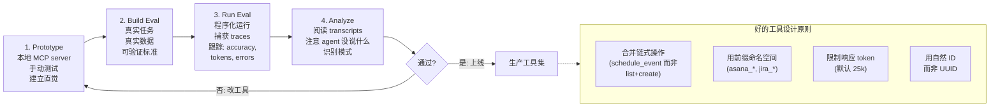

# 第 4 章：工具与 Agent-Computer Interface

### 4.1 为什么工具设计不同

Anthropic 借鉴 HCI（人机界面）的思路，提出了 *agent-computer interface*（ACI）：设计 agent 使用工具的方式，应该像设计人类使用界面的方式一样受到重视 ([Anthropic - Building Effective Agents](https://www.anthropic.com/engineering/building-effective-agents))。具体到工具格式，有三条建议：

- 给模型留出足够的 token 来“思考”，再让它提交难以修改的语法。
- 尽量采用模型在训练数据中熟悉的格式。
- 避免不必要的格式处理，例如精确计算 diff header 的行数，或对嵌入 JSON 的代码做过度字符串转义。

Anthropic 在构建 SWE-bench agent 时，优化工具 schema 所花的时间甚至超过了优化 prompt。一个改动就能说明工具设计的影响：把相对路径改为绝对路径后，agent 离开仓库根目录时出现的路径错误几乎全部消失 ([Anthropic - Building Effective Agents](https://www.anthropic.com/engineering/building-effective-agents))。

### 4.2 选择正确工具与正确数量

Anthropic 后续在 “Writing Effective Tools for Agents” 中强调了一个常见误区：给 agent 更多工具，不一定会带来更好的结果 ([Anthropic - Writing Effective Tools for Agents](https://www.anthropic.com/engineering/writing-tools-for-agents))。一种典型错误，是不考虑 agent 的使用方式，直接把每个 API endpoint 都包装成工具。Agent 所需要的 *affordance*（可供性）与传统软件不同。例如，用 `list_contacts` 搜索通讯录时，agent 只能逐个读取联系人，既浪费 token，也挤占有限的上下文；`search_contacts` 或 `message_contact` 才是更直接的工具。

设计工具时，还应合并 agent 经常连续执行的操作。与其分别提供 `list_users`、`list_events` 和 `create_event`，不如直接提供 `schedule_event`；与其提供 `read_logs`，不如提供 `search_logs`；与其让 agent 依次调用 `get_customer_by_id`、`list_transactions` 和 `list_notes`，不如把它们合并为 `get_customer_context`。

### 4.3 工具从哪里来：Model Context Protocol

本章接下来的内容假设 agent 已经拥有一组设计良好的工具。实践中，许多工具会通过一个标准接口提供：*Model Context Protocol*（MCP，模型上下文协议）。简要来说，MCP 是一项开放的客户端—服务器标准。*MCP server* 通过统一协议暴露工具，也可以同时提供资源和可复用的 prompt；任何兼容的 *client*，例如 Claude Code、IDE 或自定义 agent，都能发现并调用这些能力，不必为每项能力单独开发集成。传输机制和“不应信任工具返回结果”的风险已在《LLM Foundations》第 12 章介绍；本章关注的是如何把 MCP 作为 harness 的一个设计面 ([Anthropic - Code Execution with MCP](https://www.anthropic.com/engineering/code-execution-with-mcp))。

MCP 的主要价值在于可组合性。团队可以把独立构建和维护的 Google Drive server、Salesforce server 与内部数据库 server 接入同一个 agent；对 agent 来说，它们共同组成了一个统一的工具界面。这也是 MCP 在本书中反复出现的原因：它为下文的命名空间、masking 和代码执行模式提供了基础。

MCP 的代价是，它也让工具过度供给变得非常容易。正如第 2 章所说，用户可以轻易接入数百个工具，使上下文被大量工具定义占满；第 2 章“mask，而不是删除”的原则，以及上文合并操作的建议，正是为了控制这种膨胀。MCP 只是连接工具的管道，不能替代工具设计：设计糟糕的 MCP server，只会批量提供设计糟糕的工具。无论工具是手写的，还是通过 MCP 接入，都应该遵循本章的原则：合并常见的连续操作、设置命名空间、限制响应大小，并像编写新人入职文档一样认真撰写工具说明。

MCP 同时形成了一条部署边界。不能因为托管 agent 需要访问内部 server，就把该 server 直接暴露到公网。OpenAI 的安全 MCP tunnel 会在私有网络内运行一个**仅出站（outbound-only）的 client**：该 client 只连接预先明确配置的目的地，保留 streaming 和 authentication，同时仍由客户掌控并可供检查，因此无需开放入站端口 ([OpenAI - Connect Private MCP Servers to OpenAI Products](https://developers.openai.com/blog/connect-private-mcp-servers-to-openai-products))。这不只是网络实现技巧，也体现了一种可复用的安全模式：跨边界访问工具时，应由拥有私有能力的一侧发起连接，把访问限制在指定目的地，并按照 delegated authority 的标准进行审计。

### 4.4 四类集成边界

OpenReview 综述指出，比较工具和协议标准时，按它们所跨越的边界分类，比按厂商或发布时间分类更有意义 ([OpenReview - Agent Harness Engineering: A Survey](https://openreview.net/pdf?id=3hXEPbG0dh))：

- **Model -> Function**：以 function calling 为代表的结构化调用。模型发出机器可读的请求，再由确定性代码执行。
- **Agent -> External capability**：以 MCP 为代表的解耦方式。Agent runtime 发现外部 server 暴露的 tools、resources 和 prompts。
- **Agent -> Agent**：以 A2A 为代表的委托方式。一个 agentic application 把工作交给另一个拥有自身状态和工具、但内部不透明的 agent。
- **Agent -> Repo/environment**：由版本控制管理的 policy 和 affordance，例如 AGENTS.md、本地 skills、仓库命令以及针对具体环境的工具规则。

从边界出发，就能理解为什么 MCP、A2A、OpenAPI、function calling 和 AGENTS.md 不能互相替代：它们解决的是不同的集成问题。Harness 设计者应先确定实际跨越的是哪条边界，再选择相应的协议和治理模型，确保 provenance、permission、cost 和 failure evidence 都能跨越该边界得到保留。

### 4.5 命名空间

当 agent 能访问几十个 MCP server 和数百个工具时，名称冲突和用途不清会成为严重的失败来源。Anthropic 建议使用统一前缀组织相关工具：先按服务设置 `asana_*`、`jira_*` 等前缀，再按服务内的资源细分为 `asana_projects_*`、`asana_users_*` 等前缀。评估结果表明，使用前缀还是后缀并非无关紧要，它会影响工具使用表现，而且最佳方案取决于具体 workload ([Anthropic - Writing Effective Tools for Agents](https://www.anthropic.com/engineering/writing-tools-for-agents))。

Manus 也用这一模式控制 agent 的动作空间：为所有浏览器工具加上 `browser_` 前缀，为所有 shell 工具加上 `shell_` 前缀，harness 就能通过简单的 logit 约束一次 mask 整组工具 ([Manus - Context Engineering for AI Agents](https://manus.im/blog/Context-Engineering-for-AI-Agents-Lessons-from-Building-Manus))。

### 4.6 返回有意义的上下文

工具响应应该优先提供相关信息，而不是追求最大灵活性；标识符也应尽量采用有含义的名称，而不是不透明的技术 ID。Anthropic 发现，把字母数字 UUID 替换为有语义的标签，甚至改用从 0 开始的简单 ID，都能显著提高 Claude 的准确率并减少幻觉 ([Anthropic - Writing Effective Tools for Agents](https://www.anthropic.com/engineering/writing-tools-for-agents))。如果 agent 需要可读名称，而下游调用又必须使用技术 ID，可以通过 `response_format` enum 提供 `concise` 和 `detailed` 两种模式。在 Anthropic 的 Slack 示例中，concise 响应的体积只有 detailed 响应的三分之一。

### 4.7 Token 高效响应

工具响应是上下文膨胀的主要来源之一。Anthropic 默认将 Claude Code 的工具响应限制在 25,000 token，并建议为分页、范围选择、过滤和截断设置合理的默认值，再组合使用这些机制 ([Anthropic - Writing Effective Tools for Agents](https://www.anthropic.com/engineering/writing-tools-for-agents))。响应被截断时，还应告诉 agent 如何换用更高效的策略，例如执行多次小范围的精准搜索，而不是一次搜索过宽的范围。错误响应也应给出有用的下一步，而不只是返回难以理解的 traceback。

HumanLayer 在自己的代码库中用 “back-pressure” 落实了这一思路：build 和 test hook 成功时保持静默，只在失败时返回错误。早期，他们曾让 agent 每次修改后都运行完整测试套件；4,000 行通过测试的输出会迅速占满上下文，导致 agent 忘记真正的任务，甚至开始臆测测试文件的内容 ([HumanLayer - Skill Issue](https://www.humanlayer.dev/blog/skill-issue-harness-engineering-for-coding-agents))。

### 4.8 对工具描述做 Prompt Engineering

Anthropic 把工具描述视为最有效的设计杠杆之一，并指出，改进工具描述是 Claude Sonnet 3.5 在 SWE-bench Verified 上达到 SOTA 的关键因素 ([Anthropic - Writing Effective Tools for Agents](https://www.anthropic.com/engineering/writing-tools-for-agents))。撰写描述时，可以把读者想象成一位刚入职的初级工程师：明确写出原本隐含的上下文，包括特殊查询格式、领域术语和资源之间的关系；参数名也要避免歧义，例如使用 `user_id`，而不是含义宽泛的 `user`。随后在 workbench 中运行大量示例，分析错误，再持续迭代。

一个具体案例说明了这种做法的价值。Claude 的 web search 工具刚推出时，trace 显示 Claude 会无故在 `query` 参数中附加 `2025`，从而使搜索结果产生偏差。这个问题无需重新训练模型，只要把工具描述写得更清楚即可解决。

### 4.9 代码执行作为元工具

一种较新的做法，是不再把 MCP 工具直接暴露为调用，而是把它们组织成代码 API，让 agent 通过编写代码来调用。Anthropic 在 “Code Execution with MCP” 中指出，当 agent 面对几十个 MCP server 和数百个工具时，传统方式会产生大量浪费：所有工具定义都要预先装入上下文，每个中间结果也都要经过模型 ([Anthropic - Code Execution with MCP](https://www.anthropic.com/engineering/code-execution-with-mcp))。

替代方案是把 MCP server 表示成一组 TypeScript 文件，每个工具对应一个文件，其中包含 `callMCPTool` 的类型化 wrapper。Agent 可以先查看目录，再按需读取具体工具文件，从而逐步发现工具。在 Anthropic 的 Google Drive -> Salesforce 示例中，这种方式把 token 使用量从 150,000 降到 2,000，节省了 98.7%。

这种设计带来的多项收益会相互增强：

- **渐进披露**：只在需要时加载工具，减少前置上下文成本。
- **提高结果的上下文效率**：agent 可以先在执行环境中把 10,000 行 spreadsheet 过滤到 5 行，再把筛选结果送入模型上下文。
- **改善控制流**：循环、条件分支和错误处理都可以采用熟悉的代码模式。条件由 runtime 求值，无需模型消耗 token 来逐步推演。
- **保护操作中的隐私**：中间结果默认留在执行环境中，只有 agent 显式 log 的内容才会进入模型。设计得当的 proxy 还可以在 MCP client 边界对 PII 做 token 化，使原始值不必到达模型。
- **持久化状态并积累 skills**：agent 可以把有效代码保存为由 `SKILL.md` 支持的可复用函数，逐步形成自己的工具箱。

Cloudflare 以 “Code Mode” 为名报告了相似结果。这些实践共同指向一个直接的结论：LLM 擅长编写代码，工具接口应当利用这种能力 ([Anthropic - Code Execution with MCP](https://www.anthropic.com/engineering/code-execution-with-mcp))。

OpenAI 的 **programmatic tool calling（程序化工具调用）**把同一思路应用在一次 Responses API 调用内部：模型编写一段短程序，调用获准使用的工具，对结果进行过滤或连接，最后只把精简后的产物返回模型。这种方式很适合处理有界数据流，例如过滤、连接、排序、去重、聚合和验证，因为确定性的 runtime 控制可以替代多次模型往返。但如果每次观察都会显著影响下一步判断、每项动作都要单独审批，或者所有来源结果都必须保留给引用和审查，它就不适用 ([OpenAI - Programmatic Tool Calling](https://developers.openai.com/api/docs/guides/tools-programmatic-tool-calling))。简而言之，可以用代码压缩机械性的编排，但不能用它遮蔽后果重大的决策。

代码执行也有代价：它需要沙箱基础设施，因此会增加运营和安全成本。同时，审计对象也会发生变化。Harness 不能只记录最后的精简结果，还必须记录执行的程序、程序获准调用的工具，以及由此产生的副作用。

### 4.10 用 Eval 迭代工具

Anthropic 推荐的工具开发流程有四阶段 ([Anthropic - Writing Effective Tools for Agents](https://www.anthropic.com/engineering/writing-tools-for-agents))：

1. **Prototype**：在本地 MCP server 中制作工具原型，手动测试并建立直觉。
2. **Build an evaluation**：用真实任务、真实数据和可验证的成功标准构建评估，而不是只使用玩具式 sandbox。
3. **Run the evaluation**：以程序化方式运行评估，并捕获 trace，其中包括 planning summary、工具调用、工具结果、runtime、token count 和工具错误。如果模型提供 visible thinking mode，可以借此调试行为，但 eval 不应依赖不可见的 chain-of-thought。
4. **Analyze results**：阅读 transcript，既关注 agent 说了什么，也关注它没有说什么——LLM 不一定会准确表达其实际判断——然后据此重构工具。

Anthropic 把这个循环用于内部 Slack 和 Asana 工具。在 held-out 测试集上，经 Claude 优化的版本超过了专家手写实现。这个结果既支持了上述工作流，也提供了 agent 改进自身工具的早期案例。

### 4.11 Agent 到 Agent 的边界：A2A

第 4.4 节列出的四类集成边界中，上文已经介绍了 model-to-function、agent-to-external-capability（MCP）和 agent-to-repo/environment。第四类 *agent 到 agent* 边界也出现了自己的标准。**Agent2Agent（A2A）协议**由 Google 于 2025 年 4 月推出，并在 2025 年 6 月捐赠给 Linux 基金会。这项开放标准允许一个 agentic 应用把工作委托给另一个*不透明（opaque）*的 agent。所谓不透明，是指这个对等 agent 拥有自己的模型、工具、记忆和内部状态，但不会把这些内部细节暴露给调用方 ([Agent2Agent (A2A) Protocol](https://github.com/a2aproject/A2A); [Linux Foundation - Agent2Agent Protocol Project](https://www.linuxfoundation.org/press/linux-foundation-launches-the-agent2agent-protocol-project-to-enable-secure-intelligent-communication-between-ai-agents))。

为了复用现有 Web 基础设施，A2A 刻意采用了常规的技术机制：通过 HTTP(S) 和 JSON-RPC 2.0 通信；每个 agent 发布一张描述自身能力的 *Agent Card*，供其他 agent 发现；任务生命周期则涵盖任务提交、交互形式协商（文本、文件或结构化数据），以及把结果流式返回给调用方。

理解 A2A 的关键，在于它与 MCP 的差异。MCP 把 agent *向下*连接到由它控制、也可以检查的工具和资源；A2A 则把 agent *横向*连接到一个既无法控制、也无法检查其内部状态的对等体。因此，首要工程问题不再是工具 schema 设计，而是*如何在组织边界之间建立信任并保留溯源信息*。调用方无法查看对等 agent 的上下文或 sandbox，所以 A2A 返回的内容必须按照第 5 章所说的不可信内容处理。对网页适用的 lethal trifecta 防护原则，同样适用于对等 agent；治理措施，包括受限身份、委托授权和审计，也必须覆盖整次 A2A 调用，而不能止于本地进程边界（第 5 章、第 17 章）。A2A 没有消除信任问题，只是把需要解决这一问题的边界标准化了。

这条边界也带来一条实用的拓扑规则：原生多 agent 执行最适合**相互独立、范围有界且结果可合并**的任务，例如并行研究、隔离审查或分别制作不同产物。面对存在先后依赖的任务链，或多个 writer 需要共同修改同一份可变状态的情况，多 agent 通常不是合适的抽象，因为协调成本和 race condition 会成为主要问题。此时应保留一个明确的 owner，再配合普通工具或确定性 workflow。即使任务确实适合交给 peer agent，第 18 章介绍的控制平面仍须为每次调用确认身份、委派权限、版本、lineage 和撤销状态。

---

## 图：工具设计流水线

```mermaid
flowchart LR
    A["1. Prototype<br/>本地 MCP server<br/>手动测试<br/>建立直觉"] --> B["2. Build Eval<br/>真实任务<br/>真实数据<br/>可验证标准"]
    B --> C["3. Run Eval<br/>程序化运行<br/>捕获 traces<br/>跟踪: accuracy,<br/>tokens, errors"]
    C --> D["4. Analyze<br/>阅读 transcripts<br/>注意 agent 没说什么<br/>识别模式"]
    D --> E{通过?}
    E -->|"否: 改工具"| A
    E -->|"是: 上线"| F["生产工具集"]

    subgraph DESIGN["好的工具设计原则"]
        G["合并链式操作<br/>(schedule_event 而非<br/>list+create)"]
        H["用前缀命名空间<br/>(asana_*, jira_*)"]
        I["限制响应 token<br/>(默认 25k)"]
        J["用自然 ID<br/>而非 UUID"]
    end

    F -.-> DESIGN
```

---

## 要点

- **工具设计与提示设计同样重要**：正如 HCI 面向人类设计界面，ACI 面向 agent 设计工具界面。
- **工具并非越多越好**：应把经常连续执行的操作合并为用途明确的工具。
- **MCP 标准化了工具的来源**：它让不同 server 提供的工具可以组合，也让工具过度供给变得容易，因此工具设计原则仍然不可缺少。
- **工具协议跨越不同边界**：function calling、MCP、A2A 和 repo-local policy 互补，不是互相替代。
- **命名空间并非表面修饰**：它既支持对整组工具进行 masking，也能减少大型 MCP 环境中的命名冲突。
- **工具响应是上下文膨胀的主要来源**：默认就应设置大小上限，并支持分页、过滤和截断。
- **把代码执行作为元工具是一项重要转变**：在 Anthropic 的示例中，把 MCP 工具暴露为类型化代码 API，节省了 98.7% 的 token。
- **程序化工具调用适合有界数据流**：过滤、连接、排序、去重、聚合和验证可以交给代码；自适应判断、审批和用于引用的证据仍应对 agent 保持可见。
- **私有 MCP 连接应仅允许出站**：连接应由拥有私有能力的网络发起，目的地必须受限，并按 delegated authority 进行审计。
- **四阶段 eval loop 是推荐工作流**：prototype -> build eval -> run eval -> analyze transcripts -> iterate。
- **A2A 标准化了 agent 到 agent 的边界**：它让一个 agent 通过 JSON-RPC 和 Agent Card 把工作委托给不透明的对等体，也把工程重点从工具 schema 设计转向跨组织边界的信任与溯源；第 5 章的 lethal trifecta 防护和治理规则同样适用于这里。
- **并行 agent 需要彼此独立的任务归属**：如果存在共享可变状态或顺序依赖，通常更适合由一个 owner 负责，再配合确定性编排。

## 延伸阅读

- Ken Aizawa, *Writing Effective Tools for Agents - with Agents*, Anthropic, Sep 2025. https://www.anthropic.com/engineering/writing-tools-for-agents
- Adam Jones and Conor Kelly, *Code Execution with MCP: Building More Efficient Agents*, Anthropic, Nov 2025. https://www.anthropic.com/engineering/code-execution-with-mcp
- Erik Schluntz and Barry Zhang, *Building Effective Agents*, Anthropic, Dec 2024. https://www.anthropic.com/engineering/building-effective-agents
- Yichao 'Peak' Ji, *Context Engineering for AI Agents: Lessons from Building Manus*, Manus, Jul 2025. https://manus.im/blog/Context-Engineering-for-AI-Agents-Lessons-from-Building-Manus
- Kyle Brunet, *Skill Issue: Harness Engineering for Coding Agents*, HumanLayer, Mar 2026. https://www.humanlayer.dev/blog/skill-issue-harness-engineering-for-coding-agents
- *Agent Harness Engineering: A Survey*, OpenReview / TMLR submission, 2026. https://openreview.net/pdf?id=3hXEPbG0dh
- *Agent2Agent (A2A) Protocol*, Google / Linux Foundation, 2025. https://github.com/a2aproject/A2A
- Linux Foundation, *Linux Foundation Launches the Agent2Agent Protocol Project*, Jun 2025. https://www.linuxfoundation.org/press/linux-foundation-launches-the-agent2agent-protocol-project-to-enable-secure-intelligent-communication-between-ai-agents
- OpenAI, *Connect Private MCP Servers to OpenAI Products*, Jun 2026. https://developers.openai.com/blog/connect-private-mcp-servers-to-openai-products
- OpenAI, *Programmatic Tool Calling*, 2026. https://developers.openai.com/api/docs/guides/tools-programmatic-tool-calling
