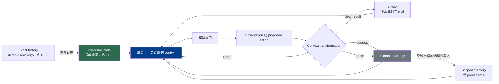

# 第 5 章：压缩、记忆与上下文交接

长周期任务可能持续得比一次模型调用更久，最终也会超出任何单个上下文窗口。因此，连续工作不能等同于“不断追加 transcript”。Harness 必须变换下一次调用能够看到的内容，同时保留足以恢复被省略信息的证据。《LLM Foundations》第 9 章已经说明，context 是有限且临时的输入，而非持久状态；本章讨论这一边界对 harness 的直接要求（[《LLM Foundations》第 9 章](../llm-foundations-zh/09-context-window-and-kv-cache.md)）。

核心设计问题不只是怎样缩短 context，而是：

> 哪些信息现在可以丢失，哪些信息必须在其他位置保持权威，以及后续调用如何恢复证据？

### 5.1 不应混为一谈的五类对象

如果把所有形式的连续性都叫作“记忆”，context engineering 就很容易变得不安全。本书区分五类对象：

| 对象 | 含义 | 权威来源 |
|---|---|---|
| **Context（上下文）** | 一次模型调用可见的 token 与多模态 representation | 由 harness 为本次调用组装；调用结束后，它不再作为模型可见输入存在 |
| **Memory（记忆）** | 为未来调用检索或注入的信息 | 具有明确 scope、provenance、更新、访问与遗忘规则的 memory store |
| **Execution state（执行状态）** | 当前步骤、待执行动作、预算、审批状态等结构化 workflow 事实 | 应用或 runtime state machine |
| **Artifact（产物）** | 文件、diff、报告、dataset、build 或已记录工具输出等可寻址工作产物 | Artifact store 或底层 system of record，以路径、URI、版本或 content hash 标识 |
| **Event history（事件历史）** | 用于恢复 durable workflow execution 的有序记录 | Runtime 的持久 history；如果声称能够 replay，就必须复用已记录的模型与工具结果，而不是悄悄重新计算 |

临时 context 与持久状态之间的模型侧边界来自 Foundations 第 9、14 章（[《LLM Foundations》第 9 章](../llm-foundations-zh/09-context-window-and-kv-cache.md)；[《LLM Foundations》第 14 章](../llm-foundations-zh/14-operational-mental-model.md)）。Temporal 展示了一种具体的 durable-execution 设计：系统利用持久化的 workflow-history events，在故障后重建 workflow state（[Temporal — History Service](https://github.com/temporalio/temporal/blob/main/docs/architecture/history-service.md)）。这只是一个实现案例，并不要求每个 harness 都使用 Temporal。

一份压缩摘要可以成为下一次调用的 context、供检查的 artifact，以及以后可检索的 memory 候选项，但它不会因此自动成为权威 execution state 或 event history。如果摘要说审批已经通过，而 runtime state 仍显示待审批，应以 runtime state 为准。第 10 章负责 execution state、checkpoint 与 event history；本章只深入 context transformation、memory 与 handoff artifact。

### 5.2 不同变换具有不同的损失模型

Harness 有多种方法让任务留在 context budget 内，它们不能互相替代：

| 技术 | 变换 | 可能丢失或出错的内容 | 恢复路径 |
|---|---|---|---|
| **Tool-result clearing（工具结果清理）** | 用简短结论和引用替换体积很大的 observation | 原始字段、顺序、warning 或错误细节可能消失 | 重新加载已记录的结果或 artifact |
| **Recitation（复述）** | 在当前 context 尾部重述目标、计划或约束 | 不会有意删除内容，但可能放大过时或错误的信息 | 与权威 task state 和源证据核对 |
| **Compaction（压缩）** | 把选定的早期 context 总结为更短的 representation | 被省略的 rationale、少数证据、精确措辞、provenance 或 uncertainty | 沿 citation 和 artifact pointer 回到一手材料 |
| **Context reset + handoff（上下文重置与交接）** | 用刻意构造的 handoff package 启动新 context | 任何未进入 package 的事实都不再对模型可见 | 按需读取权威 state、artifact、event history 或 memory |
| **Retrieval（检索）** | 选择外部材料并注入后续调用 | 可能遗漏相关证据，或选中过时、越权、误导性材料 | 重新检索、检查 provenance，并评测 retrieval pipeline |

Compaction 和 clearing 减少已经进入 context 的材料；reset 改变连续性边界；retrieval 把选定的外部材料带回来；recitation 改变显著性，却不会创造持久性。第 4 章讨论检索质量和权限感知的生产 pipeline；第 3 章讨论单次调用预算与 provider prompt cache 行为。

这些选择对缓存的影响也不同。改写前部 prefix 可能导致跨请求的 **provider prompt cache** 无法命中，但匹配、保留和计费都是 provider-specific contract，而不是 correctness guarantee（[OpenAI — Prompt Caching](https://developers.openai.com/api/docs/guides/prompt-caching)；[Anthropic — Prompt Caching](https://platform.claude.com/docs/en/build-with-claude/prompt-caching)）。绝不能为了维持 cache hit 而保留过时或不安全的内容。

### 5.3 压缩是一份有损且可测试的契约

当 context 接近设定预算时，compaction 会总结较早的交互，再把摘要作为后续 context 的一部分。Anthropic 建议在真实、复杂的 trajectory 上调优 compaction prompt：先提高 recall，确保继续任务所需的信息得以保留；再提高 precision，删除不再有帮助的材料（[Anthropic — Effective Context Engineering for AI Agents](https://www.anthropic.com/engineering/effective-context-engineering-for-ai-agents)）。根据 token 数量或 context utilization 触发压缩是一种实现策略，而不是通用阈值；太晚触发可能耗尽窗口，太早触发则会造成原本可以避免的信息损失。

生产系统中的 compaction 应有明确 schema，至少保留：

- 已经作出的 **decision**；如果理由会约束后续工作，也要保留 rationale；
- **open task** 和下一项预期动作，不能把未完成工作标成完成；
- **constraint**，包括用户要求与适用 policy check 的引用；
- **artifact pointer**，最好包含版本、commit 或 content hash；
- **provenance**，把重要结论连回源 observation 或文档；
- **unresolved uncertainty**，包括相互冲突的 hypothesis 和仍然缺少的证据。

近期且可操作的失败也可能需要进入下一段 context，但必须具有生命周期。如果准确的错误消息、失败参数或 stack trace 能改变下一次尝试，就保留最近一次错误；如果同一种失败反复发生，应把重复输出替换为 diagnosis、retry count 和原始日志指针。Manus 提倡保留有用的失败，让模型据此调整；12-Factor Agents 则建议把错误压缩进下一段 context（[Manus — Context Engineering for AI Agents: Lessons from Building Manus](https://manus.im/blog/Context-Engineering-for-AI-Agents-Lessons-from-Building-Manus)；[HumanLayer — 12-Factor Agents](https://www.humanlayer.dev/blog/12-factor-agents)）。两种实践都不意味着应把无限日志留在 live context 中。

评估 compaction 时，应把它当成一次 transformation，而不是根据摘要文笔是否流畅来判断。有效的测试会从 compacted package 恢复一组有代表性的任务，并衡量 agent 是否保留必需约束、识别下一步、找到被引用的 artifact、保留经过校准的不确定性，以及避免重复已经解决或放弃的工作。在条件允许时，应与未压缩 baseline 比较，并加入 adversarial case，例如重要 caveat 只出现过一次，或者与 trace 中的多数内容冲突。

### 5.4 记忆是一种受治理的信息产品

结构化笔记会把选定信息变成可复用的产品。Anthropic 曾描述 agent 如何在数千个游戏步骤中维护进度笔记、地图和策略，并在 context reset 后重新加载这些笔记（[Anthropic — Effective Context Engineering for AI Agents](https://www.anthropic.com/engineering/effective-context-engineering-for-ai-agents)）。关键机制不是文件名或行文格式，而是围绕笔记建立的 write–retrieve lifecycle。

每条 memory 都应回答：

- **Scope：** 哪个 task、user、tenant、repository 或 agent 可以使用它？
- **Provenance：** 哪次 observation、哪个来源、哪种 identity 和哪个 tool 产生了它？
- **Type：** 它是 observation、用户偏好、派生结论，还是 instruction candidate？
- **Freshness：** 它何时创建、何时必须重新验证，什么内容可以替代它？
- **Authority：** 谁授权了写入，未来 reader 是否有权访问底层证据？
- **Forgetting：** 如何让它过期、删除、回滚或更正？

Memory 不会因为持久化就自动成为事实。Retrieval 可能选错条目，consolidation 可能合并不相容的事实，曾经正确的条目也可能过时。MemGPT 探索了 virtual context management：在容量有限的模型 context 与外部存储之间移动信息（[Packer et al. — MemGPT: Towards LLMs as Operating Systems](https://arxiv.org/abs/2310.08560)）。Mem0 探索了提取、整合和检索 memory，而不是回放完整的多 session history（[Chhikara et al. — Mem0: Building Production-Ready AI Agents with Scalable Long-Term Memory](https://arxiv.org/abs/2504.19413)）。这些是有用的架构案例，并不说明每个短任务都需要 memory subsystem。

持久记忆也是一道信任边界。从网页复制到共享笔记中的不可信文本，在原始 context 消失很久以后仍可能影响后续运行。应把 observation 当作数据；绝不能因为模型总结过某段检索内容，就自动把它提升为 policy；读取和写入时都需要重新检查 authorization。Anthropic 把这种跨运行风险称为 persistent memory poisoning，并强调必须对 agent 可访问状态实施 containment（[Anthropic — How We Contain Claude](https://www.anthropic.com/engineering/how-we-contain-claude)）。

### 5.5 复述与清理服务于局部连续性

Recitation 会刻意在当前 context 尾部重写一份简短任务表示，通常是一张 checklist。Manus 报告称，其系统会反复更新 `todo.md`，让长任务的目标在充满 action 的 trajectory 中保持显著（[Manus — Context Engineering for AI Agents: Lessons from Building Manus](https://manus.im/blog/Context-Engineering-for-AI-Agents-Lessons-from-Building-Manus)）。这是一种 attention-management technique，而不是 durable state 或 correctness mechanism。Checklist 应从权威 task state 重新生成，或至少与之核对；否则 recitation 只会让过时计划继续保持显著。

这一动机与 “lost in the middle” 的实证结果一致：在该研究评估的 retrieval 和 question-answering 场景中，模型表现会随相关信息在长输入中的位置而变化（[Liu et al. — Lost in the Middle](https://arxiv.org/abs/2307.03172)）。这一结果不能证明所有模型和任务都有相同的位置曲线，因此仍应在目标 workload 上验证 recitation。

Tool-result clearing 是范围最窄的有损操作。只有在保存了下一项决策所需的信息后才能清理结果：派生结论、重要 warning 或 unresolved error、据此采取的动作，以及能够恢复原始输出的指针。在 side effect 尚未确认、结果存在争议，或者 audit/debugging 可能需要精确字段时，清理尤其危险。原始输出应该进入 artifact store 或适当记录，而不是无限期留在 live context 中。

### 5.6 交接是类型化接口，而非可信摘要

只要工作跨过 context boundary，就发生了 context handoff：context reset 之后、session 之间、sub-agent 到 parent，或者一种 model configuration 到另一种配置。应把它视为带有 schema 的接口，而不是一段随意写成的文字。

稳健的 handoff package 包含：

1. **Task identity 与 bounded scope**——请求是什么、哪些内容被有意排除，以及完成标准是什么。
2. **Worker identity 与 authority scope**——哪个 agent/model/tooling 执行了工作，它能够访问哪些资源。
3. **Claim 与 decision**——简洁结果，并与 observation、proposal 明确分开。
4. **Evidence 与 provenance**——行内 citation，以及可寻址的 artifact、version、query、command 或 tool-call identifier。
5. **External effect**——尝试过的动作、已确认 outcome、失败，以及任何 pending approval。
6. **Uncertainty 与 open question**——置信限制、冲突、缺失证据和假设。
7. **Verification status**——实际运行过的 test/check、结果，以及完整输出的位置。
8. **Next action**——receiver 下一步应做什么，包括执行高权限动作前需要重新验证的内容。

Sub-agent 是有价值的 context firewall，因为它可以在独立窗口中完成大量工具调用，再把紧凑结果返回给 parent（[Anthropic — Effective Context Engineering for AI Agents](https://www.anthropic.com/engineering/effective-context-engineering-for-ai-agents)；[HumanLayer — Skill Issue: Harness Engineering for Coding Agents](https://www.humanlayer.dev/blog/skill-issue-harness-engineering-for-coding-agents)）。这道 firewall 会隔离中间噪声，却不会让结果变得更可信。

尤其需要注意，高权限 parent 不能把低权限 worker 的摘要当作 authorization 或已经验证的事实。Parent 应检查被引用的证据，在 action dispatch 时重新检查当前 policy，并独立确认高影响 outcome。Identity 与 scope 必须随结果一同传递，使 receiver 知道 worker 能看到什么、不能看到什么。Handoff artifact 可以为 execution state 提供输入，但只有 runtime 或 application 才能提交状态转换；第 6、7、19 章将分别讨论 dispatch、enforcement 与 fleet identity。

### 5.7 上下文连续性循环

图中指向 memory 的虚线是刻意设计的：并非每份摘要都应成为持久 memory。信息升级需要明确的 write policy、provenance、scope 与 lifecycle。同样，event history 支持恢复，却不应被原样塞入每一次模型调用。

---

## 要点

- **Context、memory、execution state、artifact 与 event history 是不同对象：** 摘要可以引用权威状态，却不能取代它。
- **每种 context transformation 都有自己的损失模型：** clearing、recitation、compaction、reset 与 retrieval 以不同方式失败，也需要不同恢复路径。
- **Compaction 需要 schema 与 evaluation：** 应保留 decision、open task、constraint、artifact pointer、provenance 与 unresolved uncertainty。
- **有用错误也有生命周期：** 保留近期且可操作的细节，压缩重复噪声，并确保原始证据可恢复。
- **Memory 必须受治理、有限定 scope 且可以修订：** 持久化不会让模型生成的笔记自动变为事实或获得授权。
- **Recitation 改变显著性，不改变权威性：** 反复重述的计划必须与真实 task state 核对。
- **Context firewall 不是 trust firewall：** Sub-agent 结果必须携带 evidence、identity 与 authority scope、uncertainty、verification status 和可寻址 artifact。
- **高权限 parent 必须在行动前重新验证：** Worker 摘要既不是 authorization，也不是已经确认的 outcome。
- **跨请求复用应使用 provider prompt cache 这个名称：** 不能称作 per-request KV cache，也不能为了命中缓存而牺牲 correctness。

## 延伸阅读

- Anthropic Applied AI Team, *Effective Context Engineering for AI Agents*, Anthropic, Sep 2025. https://www.anthropic.com/engineering/effective-context-engineering-for-ai-agents
- OpenAI, *Prompt Caching*. https://developers.openai.com/api/docs/guides/prompt-caching
- Anthropic, *Prompt Caching*. https://platform.claude.com/docs/en/build-with-claude/prompt-caching
- Yichao 'Peak' Ji, *Context Engineering for AI Agents: Lessons from Building Manus*, Manus, Jul 2025. https://manus.im/blog/Context-Engineering-for-AI-Agents-Lessons-from-Building-Manus
- Kyle Brunet, *Skill Issue: Harness Engineering for Coding Agents*, HumanLayer, Mar 2026. https://www.humanlayer.dev/blog/skill-issue-harness-engineering-for-coding-agents
- Dex Horthy, *12-Factor Agents*, HumanLayer, Apr 2025. https://www.humanlayer.dev/blog/12-factor-agents
- Charles Packer et al., *MemGPT: Towards LLMs as Operating Systems*, arXiv, Oct 2023. https://arxiv.org/abs/2310.08560
- Prateek Chhikara et al., *Mem0: Building Production-Ready AI Agents with Scalable Long-Term Memory*, arXiv, Apr 2025. https://arxiv.org/abs/2504.19413
- Nelson F. Liu et al., *Lost in the Middle: How Language Models Use Long Contexts*, TACL, 2024. https://arxiv.org/abs/2307.03172
- Anthropic Safeguards Research Team, *How We Contain Claude*, Anthropic, May 2026. https://www.anthropic.com/engineering/how-we-contain-claude
- Temporal, *History Service*. https://github.com/temporalio/temporal/blob/main/docs/architecture/history-service.md
