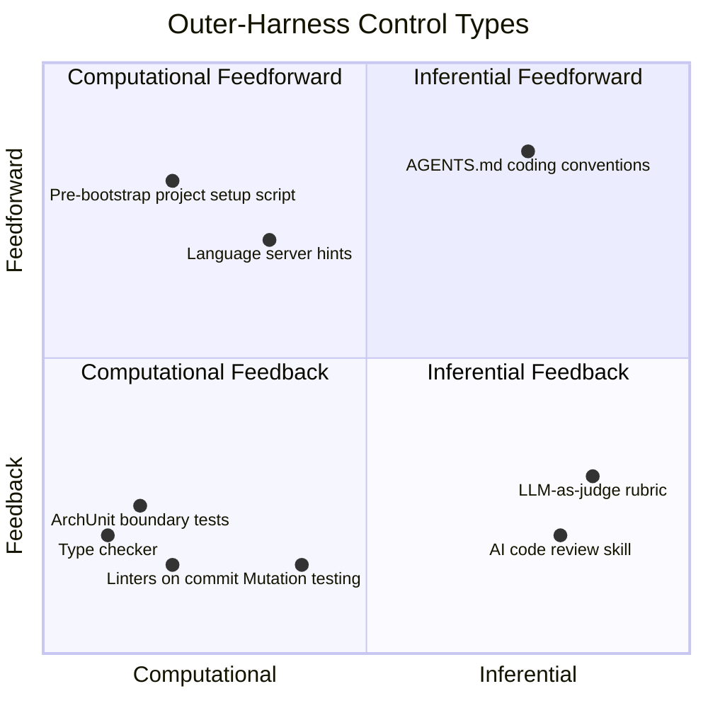

# 第 5 章：沙箱、护栏与安全自治

### 5.1 权限疲劳问题

完全无监督运行的 coding agent 很危险；每一步都请求批准的 coding agent 又不可用。Anthropic 将其称作 approval fatigue：不断点击 approve 会拖慢开发循环，并让用户不再认真看自己批准了什么，反而降低安全性 ([Anthropic - Beyond Permission Prompts](https://www.anthropic.com/engineering/claude-code-sandboxing))。解决方案是结构性的：定义 agent 可以自由行动的边界，只有越界时才请求权限。

在 Anthropic 内部使用中，沙箱安全地减少了 84% 的权限提示。

### 5.2 文件系统隔离必须与网络隔离配对

Claude Code 的沙箱同时执行两类边界，Anthropic 认为二者都必要。文件系统隔离防止被 prompt injection 的 agent 修改敏感文件；网络隔离防止它泄露数据或下载恶意软件。没有网络隔离，被攻陷的 agent 可能外传 SSH key；没有文件系统隔离，被攻陷的 agent 可能逃出沙箱并访问网络 ([Anthropic - Beyond Permission Prompts](https://www.anthropic.com/engineering/claude-code-sandboxing))。

实现基于 OS 级 primitive：Linux bubblewrap 和 macOS seatbelt，并覆盖 Claude Code 的直接交互以及任何 subprocess。网络访问通过 Unix domain socket 进入 proxy，由 proxy 强制执行域名限制，并在请求新域名时处理用户确认。该 runtime 已开源。

Claude Code on the web 将其扩展为云沙箱，敏感凭据（git credentials、signing keys）从不与 agent 同处沙箱中。自定义 proxy 处理 git 交互，只在确认操作被允许后附加 scoped credentials，例如只允许 push 到配置分支。

### 5.3 Hooks 与 Middleware 作为程序化执行

沙箱是一种程序化护栏；hooks 和 middleware 是另一种更细粒度的护栏。Claude Code 支持用户定义的命令或脚本，在生命周期事件上自动运行，例如 agent 启动、工具调用后、停止时等 ([HumanLayer - Skill Issue](https://www.humanlayer.dev/blog/skill-issue-harness-engineering-for-coding-agents))。LangChain 的 middleware 概念结构上相似。有些 hook 是完全确定性的脚本；有些是把上下文重新注入模型的过程性检查点。可靠性来自 harness 自动执行它们，而不是依赖模型记住某条规则。

常见用途包括通知（agent 完成时播放声音）、自动批准或拒绝（拒绝 migration 命令，让用户手动运行）、集成（发 Slack 消息、开 PR）、验证（停止时运行 typecheck 和 build，把错误暴露给 agent，迫使其修复后再结束）。HumanLayer 的示例 hook 会在每次 Claude stop 时并行运行 Biome 和 TypeScript；成功时静默退出，失败时只暴露错误并以 exit code 2 返回，告诉 harness 重新拉起 agent。

LangChain 报告称，这类 middleware 是 deepagents-cli 从 Terminal-Bench 2.0 Top 30 提升到 Top 5 的关键。他们的 `PreCompletionChecklistMiddleware` 在 agent 退出前拦截并提醒它对任务 spec 做验证；`LocalContextMiddleware` 启动时映射工作目录和可用工具；`LoopDetectionMiddleware` 跟踪每个文件编辑次数，并在同一文件被编辑 N 次后提示 agent 重新考虑，从而打断“doom loop” ([LangChain - Improving Deep Agents](https://blog.langchain.com/improving-deep-agents-with-harness-engineering/))。

### 5.4 前馈与反馈：控制论视角

Thoughtworks 的 Birgitta Böckeler 给出更高层分类 ([Thoughtworks - Harness Engineering](https://martinfowler.com/articles/exploring-gen-ai/harness-engineering.html))。外层 harness 控制分为两个方向：

- **Guides（前馈）** 在 agent 行动前预判并引导行为，提高第一次产出好的概率，例如 AGENTS.md、skills、参考文档、语言服务器提示。
- **Sensors（反馈）** 在 agent 行动后观察并帮助自我修正，例如测试、linter、type checker、AI code review。

只有前馈的 harness 会不断发布规则，却不知道规则是否有效；只有反馈的 harness 会不断抓到同样错误，却无法预防。两者都需要。

每个方向还有第二条轴：

- **Computational** 控制，例如 linter、type checker、结构测试，确定性强、运行快、结果可靠。
- **Inferential** 控制，例如语义分析、AI code review、LLM-as-judge，能处理细微判断，但更慢、更贵、非确定性。

两条轴互相独立。AGENTS.md 中的编码约定是 inferential feedforward。提交时检查模块边界的 ArchUnit 测试是 computational feedback。`/code-review` skill 是 inferential feedback。预启动脚本创建项目结构是 computational feedforward。好的 harness 会混合四类。

### 5.5 三类调节对象

Böckeler 还按 harness 调节对象区分三类 ([Thoughtworks - Harness Engineering](https://martinfowler.com/articles/exploring-gen-ai/harness-engineering.html))：

- **Maintainability harness**：内部代码质量、重复、复杂度、覆盖率、风格。这是最容易的一类，因为已有几十年工具积累。
- **Architecture fitness harness**：性能、可观测性、可调试性，捕捉应用的横切“fitness functions”。
- **Behavior harness**：应用功能行为是否符合预期。这是未解决类别。今天多数团队依赖功能 spec 作为前馈，用 AI 生成测试作为反馈，有时加 mutation testing；Böckeler 坦率地说，信任 AI 生成测试“还不够好”。

这些类别的意义在于评估 harness 的覆盖面。一个 maintainability 很强、behavior 很弱的 harness 会给人虚假的安全感。

### 5.6 时机：把质量左移

CI 的经验是，越早发现问题，修复越便宜；harness 设计也是如此。快速 computational sensors（linter、快速测试）应在 commit 前运行；昂贵 computational 与 inferential sensors（mutation testing、更广泛 code review）在 pipeline 中 post-integration 运行；持续漂移 sensors（死代码检测、依赖扫描、日志异常 judge）则独立于变更生命周期持续运行 ([Thoughtworks - Harness Engineering](https://martinfowler.com/articles/exploring-gen-ai/harness-engineering.html))。

Böckeler 注意到，OpenAI Codex 团队的 harness 也类似：用自定义 linter 和结构测试强制分层架构，加上周期性“garbage collection”扫描漂移，并让 agent 建议修复。

### 5.7 Harnessability 与环境可供性

不是每个代码库都同样容易 harness。强类型语言天然带来 type-checking sensor；清晰模块边界让架构约束规则可写；Spring 等 opinionated framework 抽象掉了 agent 无需操心的细节 ([Thoughtworks - Harness Engineering](https://martinfowler.com/articles/exploring-gen-ai/harness-engineering.html))。

Ned Letcher 的术语 *ambient affordances* 捕捉了这一点：环境本身会带有一些属性，使 agent 更容易理解、导航和处理。Greenfield 团队可以从第一天就设计这些 affordance；legacy 团队面对的是相反情况：越需要 harness 的地方，越难构建 harness。

面向未来，Böckeler 提出 *harness templates*：按服务拓扑打包 guides 和 sensors，例如 JVM CRUD service、Go event processor、Node dashboard，并随现有 service template 一起分发。Ashby 的必要变异度定律给出形式化理由：调节器必须具有至少与被调节系统同样多的变异度。因此，约束服务拓扑本身就是降低变异度的动作，使完整 harness 更可达。

---

## 图：前馈/反馈 x 计算/推断

---

## 要点

- **沙箱减少 84% 权限提示**：结构边界优于不断弹窗。
- **文件系统与网络隔离必须配对**：二者对应不同攻击向量，单独使用都不足。
- **Hooks 与 middleware 是程序化执行**：它们不依赖模型记忆，比纯 prompt 约束可靠。
- **前馈与反馈都需要**：guide 没有 sensor 就没有学习回路；sensor 没有 guide 只能事后反应。
- **三类 harness 覆盖**：maintainability、architecture fitness、behavior；behavior 仍是难题。
- **环境可供性重要**：强类型语言和 opinionated framework 让 harness 更容易。

## 延伸阅读

- David Dworken and Oliver Weller-Davies, *Beyond Permission Prompts*, Anthropic, Oct 2025. https://www.anthropic.com/engineering/claude-code-sandboxing
- Birgitta Böckeler, *Harness Engineering for Coding Agent Users*, Thoughtworks / martinfowler.com, Apr 2026. https://martinfowler.com/articles/exploring-gen-ai/harness-engineering.html
- Kyle Brunet, *Skill Issue: Harness Engineering for Coding Agents*, HumanLayer, Mar 2026. https://www.humanlayer.dev/blog/skill-issue-harness-engineering-for-coding-agents
- Vivek Trivedy, *Improving Deep Agents with Harness Engineering*, LangChain, Feb 2026. https://blog.langchain.com/improving-deep-agents-with-harness-engineering/
