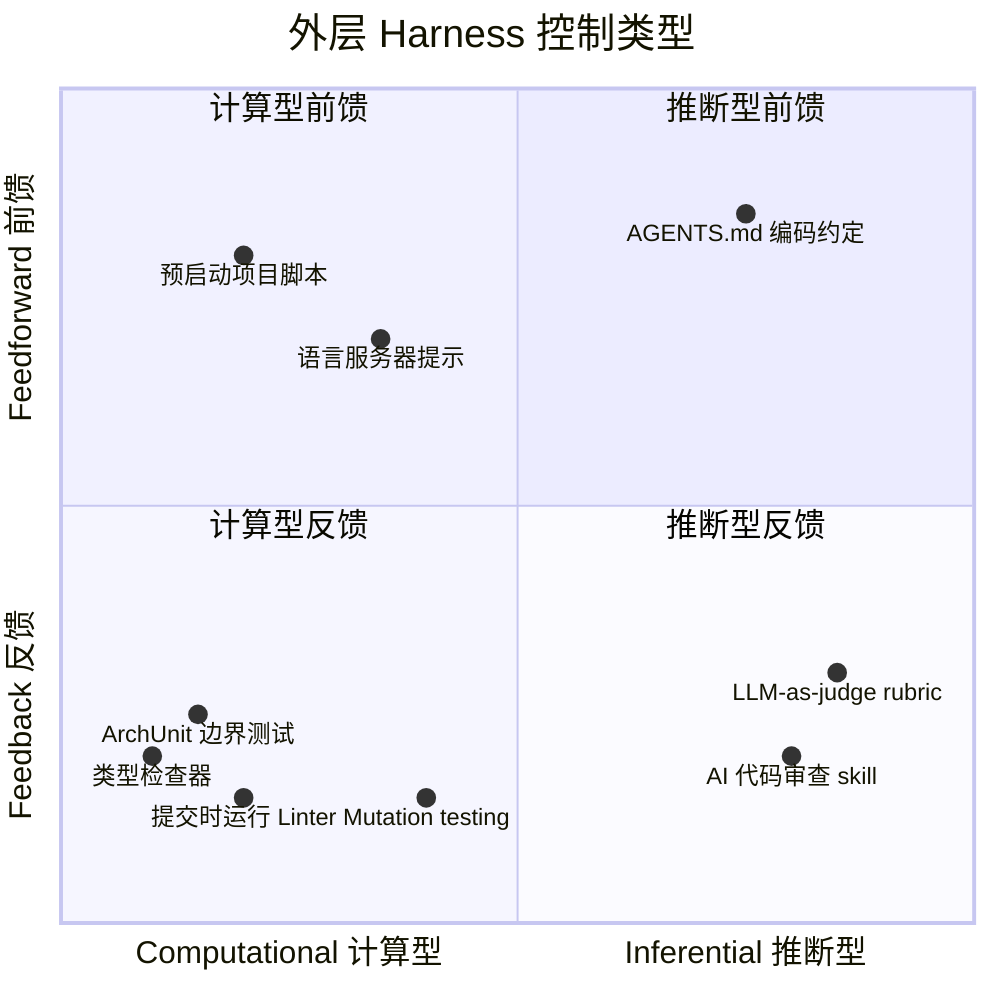

# 第 5 章：沙箱、护栏与安全自治

### 5.1 Agent 安全威胁模型

本章大部分内容讲的是*缓解手段*——沙箱、hooks、审批关卡。先把它们要缓解的东西说清楚是值得的。一个会读取不可信内容、又能对世界采取行动的 agent，有一份特定的风险画像 ([Anthropic - Beyond Permission Prompts](https://www.anthropic.com/engineering/claude-code-sandboxing))：

- **Prompt injection（提示注入）**（见《LLM Foundations》第 8 章 “Prompt Injection as Context Confusion” 与第 12 章）—— 模型无法可靠地把数据和指令分开，因此 agent 所读的不可信内容（网页、issue 评论、源文件、工具结果）可以像命令一样操纵它。
- **数据外泄** — 被操纵且有网络访问权的 agent，可以把密钥（SSH key、API token、专有源码）发送到攻击者控制的目的地。
- **破坏性操作** — 被操纵且有文件系统或 shell 访问权的 agent，可以删除或损坏文件，或提交并推送有问题的代码。
- **工具与供应链风险** — 恶意或被攻陷的 MCP server、软件包或依赖，可以引入 agent 随后会信任的敌对工具或指令。

实践者最担心的组合，有时被称为 *lethal trifecta*（致命三要素）：访问私有数据、接触不可信内容、向外通信的能力 ([Simon Willison - The lethal trifecta for AI agents](https://simonwillison.net/2025/Jun/16/the-lethal-trifecta/))。单独任何一项都还能承受；三者集于一个 agent，就意味着一条注入的指令能读到密钥并把它发出去。本章的多数控制手段，都是通过打断三要素中的一条腿来工作的——网络隔离移除向外通信，文件系统隔离移除私有数据访问，审批关卡把人放进有后果操作的路径上。

要带进本章其余部分的视角是：模型不是可信组件。它是一个能力强但可被操纵的核心，而 harness 就是夹在敌对指令与真实后果之间的那一层。

Anthropic 后续的 containment 工作沿两条轴进一步细化了威胁模型 ([Anthropic - How We Contain Claude](https://www.anthropic.com/engineering/how-we-contain-claude))。第一，风险可以来自**滥用系统的用户**、**模型自身的异常行为**，或通过内容操纵模型的**外部攻击者**。第二，防御可以放在**模型**、**执行环境**或**外部内容边界**上。这个矩阵很有用，因为没有一层能覆盖所有来源：alignment 不能保证模型一定忽略注入，而 sandbox 也无法判断一封获准发送的邮件在语义上是否有害。生产 containment 必须在三层同时做 defense in depth。

### 5.2 权限疲劳问题

完全无监督运行的 coding agent 很危险；每一步都请求批准的 coding agent 又不可用。Anthropic 将其称作 approval fatigue：不断点击 approve 会拖慢开发循环，并让用户不再认真看自己批准了什么，反而降低安全性 ([Anthropic - Beyond Permission Prompts](https://www.anthropic.com/engineering/claude-code-sandboxing))。解决方案是结构性的：定义 agent 可以自由行动的边界，只有越界时才请求权限。

在 Anthropic 内部使用中，沙箱安全地减少了 84% 的权限提示 ([Anthropic - Beyond Permission Prompts](https://www.anthropic.com/engineering/claude-code-sandboxing))。

### 5.3 沙箱同时是笼子、重置按钮和许可证

OpenReview 综述把 sandbox 的作用扩展到安全之外。在 agent 系统中，沙箱同时有三种目的 ([OpenReview - Agent Harness Engineering: A Survey](https://openreview.net/pdf?id=3hXEPbG0dh))：

- **Security**：限制不可预测的模型生成动作和 prompt-injection 行为的 blast radius。
- **Reproducibility**：给 eval、训练轨迹和长运行 session 一个可重置 baseline。容器或 microVM 可以销毁重建，开发者工作站不行。
- **Liveness**：定义一个 agent 可以自由行动的区域，不必每次文件写入、包安装或网络调用都问人类。

第三点是 agent 时代特有的。沙箱不只是笼子，也是许可证。它把权限从逐动作问题转成 session 配置，让长周期自治可用，而不是退化成权限疲劳。

Containment 应随任务风险升级。三种反复出现的模式组成了一条实用阶梯 ([Anthropic - How We Contain Claude](https://www.anthropic.com/engineering/how-we-contain-claude))：

- **临时容器（ephemeral container）**可丢弃、成本低，适合 agent 需要在较小 blast radius 内充分自由的有界任务。
- **Human-in-the-loop sandbox**适合交互式工作：安全操作自动进行，跨越边界时暂停并请求审批。
- **密封虚拟机（sealed VM）**用更强的 kernel 和网络边界隔离高风险 workload，但启动与运营成本更高。

正确问题不是“有没有 sandbox”，而是“哪些资源仍可访问、哪些状态会在 reset 后保留、哪些权限能跨越边界”。可重置的计算环境无法抵消挂载在其中的 credential、写到环境之外的被投毒记忆，或可传输私有数据的 egress 路径。

### 5.4 文件系统隔离必须与网络隔离配对

Claude Code 的沙箱同时执行两类边界，Anthropic 认为二者都必要。文件系统隔离防止被 prompt injection 的 agent 修改敏感文件；网络隔离防止它泄露数据或下载恶意软件。没有网络隔离，被攻陷的 agent 可能外传 SSH key；没有文件系统隔离，被攻陷的 agent 可能逃出沙箱并访问网络 ([Anthropic - Beyond Permission Prompts](https://www.anthropic.com/engineering/claude-code-sandboxing))。

实现基于 OS 级 primitive：Linux bubblewrap 和 macOS seatbelt，并覆盖 Claude Code 的直接交互以及任何 subprocess。网络访问通过 Unix domain socket 进入 proxy，由 proxy 强制执行域名限制，并在请求新域名时处理用户确认。该 runtime 已开源。

Claude Code on the web 将其扩展为云沙箱，敏感凭据（git credentials、signing keys）从不与 agent 同处沙箱中。自定义 proxy 处理 git 交互，只在确认操作被允许后附加 scoped credentials，例如只允许 push 到配置分支。

Egress allowlist 应被理解为一种**能力授予**，而不是无害的目的地清单。允许访问 package registry，就允许下载可执行代码；允许访问源码托管站点，可能也允许发布内容；允许访问通用 Web endpoint，则可能补齐 lethal trifecta 的数据外泄一环。因此，策略应同时绑定目的地、协议、操作、身份与任务，而不是只看域名，并记录每条连接究竟由哪条规则授权。

Containment 还必须在**建立信任之前**就开始。打开仓库可能在用户看到 trust dialog 之前触发配置加载、依赖发现、language server、hooks 或本地 listener。应把 project-open 和 config-load 路径当作敌对输入：能只解析就不要执行；关闭自动 hooks 和 listeners；在 workspace 明确受信之前，不提供 credentials 和 egress ([Anthropic - How We Contain Claude](https://www.anthropic.com/engineering/how-we-contain-claude))。

### 5.5 Governance：身份、策略与审计

沙箱边界必要但不充分。Governance 层要回答：agent 代表谁行动、拥有什么权限、权限如何随任务上下文变化、行动后留下什么证据 ([OpenReview - Agent Harness Engineering: A Survey](https://openreview.net/pdf?id=3hXEPbG0dh))。

生产中有三个关键设计动作：

- **身份与 delegated auth**：agent 应使用 scoped credentials 或 delegated identity 行动，而不是以用户的完整 ambient authority（默认隐式权限）行动。Credential vault 和 proxy 应只在操作被授权的边界处附加 secret。
- **上下文相关权限策略**：静态 allow/deny list 可检查但粗糙。任务感知策略可以在每次调用前评估工具名、参数、session state、目标 repo、网络域名和用户角色，再由确定性 checker 执行结果。
- **可审计 trace**：日志不仅要记录 tool call，还要记录身份、权限决策、policy 版本、参数、输出摘要，以及是否有人类批准升级。

这也是供应链攻击进入 harness 范围的地方。MCP tool poisoning、tool squatting、rug-pull update、幻觉包名、retrieval-source poisoning 都跨越了 tool interface 与 governance 的边界。安全 harness 需要对工具、包、数据集和检索来源做 provenance 与 integrity 检查，而不只是写一句“请小心”。

### 5.6 Hooks 与 Middleware 作为程序化执行

沙箱是一种程序化护栏；hooks 和 middleware 是另一种更细粒度的护栏。Claude Code 支持用户定义的命令或脚本，在生命周期事件上自动运行，例如 agent 启动、工具调用后、停止时等 ([HumanLayer - Skill Issue](https://www.humanlayer.dev/blog/skill-issue-harness-engineering-for-coding-agents))。LangChain 的 middleware 概念结构上相似。有些 hook 是完全确定性的脚本；有些是把上下文重新注入模型的过程性检查点。可靠性来自 harness 自动执行它们，而不是依赖模型记住某条规则。

常见用途包括通知（agent 完成时播放声音）、自动批准或拒绝（拒绝 migration 命令，让用户手动运行）、集成（发 Slack 消息、开 PR）、验证（停止时运行 typecheck 和 build，把错误暴露给 agent，迫使其修复后再结束）。HumanLayer 的示例 hook 会在每次 Claude stop 时并行运行 Biome 和 TypeScript；成功时静默退出，失败时只暴露错误并以 exit code 2 返回，告诉 harness 重新拉起 agent。

LangChain 报告称，这类 middleware 是 deepagents-cli 从 Terminal-Bench 2.0 Top 30 提升到 Top 5 的关键。他们的 `PreCompletionChecklistMiddleware` 在 agent 退出前拦截并提醒它对任务 spec 做验证；`LocalContextMiddleware` 启动时映射工作目录和可用工具；`LoopDetectionMiddleware` 跟踪每个文件编辑次数，并在同一文件被编辑 N 次后提示 agent 重新考虑，从而打断在一个已坏方法上做小幅变体的 “doom loop” ([LangChain - Improving Deep Agents](https://blog.langchain.com/improving-deep-agents-with-harness-engineering/))。

综述中的 governance 分类把这些 hook 放进更大的执行管线：pre-invocation check 可以拒绝危险工具调用，post-invocation hook 可以在不可信输出进入上下文前做 taint 或 redact，stop hook 可以要求验证或审计更新，escalation hook 可以把模糊情况交给人类。行动越有后果，就越不应该依赖模型记住指令。

### 5.7 前馈与反馈：控制论视角

Thoughtworks 的 Birgitta Böckeler 给出更高层分类 ([Thoughtworks - Harness Engineering](https://martinfowler.com/articles/exploring-gen-ai/harness-engineering.html))。外层 harness 控制分为两个方向：

- **Guides（前馈）** 在 agent 行动前预判并引导行为，提高第一次产出好的概率，例如 AGENTS.md、skills、参考文档、语言服务器提示。
- **Sensors（反馈）** 在 agent 行动后观察并帮助自我修正，例如测试、linter、type checker、AI code review。

只有前馈的 harness 会不断发布规则，却不知道规则是否有效；只有反馈的 harness 会不断抓到同样错误，却无法预防。两者都需要。

每个方向还有第二条轴：

- **Computational** 控制，例如 linter、type checker、结构测试，确定性强、运行快、结果可靠。
- **Inferential** 控制，例如语义分析、AI code review、LLM-as-judge，能处理细微判断，但更慢、更贵、非确定性。

两条轴互相独立。AGENTS.md 中的编码约定是 inferential feedforward。提交时检查模块边界的 ArchUnit 测试是 computational feedback。`/code-review` skill 是 inferential feedback。预启动脚本创建项目结构是 computational feedforward。好的 harness 会混合四类。

### 5.8 三类调节对象

Böckeler 还按 harness 调节对象区分三类 ([Thoughtworks - Harness Engineering](https://martinfowler.com/articles/exploring-gen-ai/harness-engineering.html))：

- **Maintainability harness**：内部代码质量、重复、复杂度、覆盖率、风格。这是最容易的一类，因为已有几十年工具积累。
- **Architecture fitness harness**：性能、可观测性、可调试性，捕捉应用的横切“fitness functions”。
- **Behavior harness**：应用功能行为是否符合预期。这是未解决类别。今天多数团队依赖功能 spec 作为前馈，用 AI 生成测试作为反馈，有时加 mutation testing；Böckeler 坦率地说，信任 AI 生成测试“还不够好”。

这些类别的意义在于评估 harness 的覆盖面。一个 maintainability 很强、behavior 很弱的 harness 会给人虚假的安全感。

### 5.9 时机：把质量左移

CI 的经验是，越早发现问题，修复越便宜；harness 设计也是如此。快速 computational sensors（linter、快速测试）应在 commit 前运行；昂贵 computational 与 inferential sensors（mutation testing、更广泛 code review）在 pipeline 中 post-integration 运行；持续漂移 sensors（死代码检测、依赖扫描、日志异常 judge）则独立于变更生命周期持续运行 ([Thoughtworks - Harness Engineering](https://martinfowler.com/articles/exploring-gen-ai/harness-engineering.html))。

Böckeler 注意到，OpenAI Codex 团队的 harness 也类似：用自定义 linter 和结构测试强制分层架构，加上周期性“garbage collection”扫描漂移，并让 agent 建议修复。

### 5.10 Harnessability、Agentic Readiness 与环境可供性

不是每个代码库都同样容易 harness。强类型语言天然带来 type-checking sensor；清晰模块边界让架构约束规则可写；Spring 等 opinionated framework 抽象掉了 agent 无需操心的细节 ([Thoughtworks - Harness Engineering](https://martinfowler.com/articles/exploring-gen-ai/harness-engineering.html))。

Böckeler 将 *ambient affordances* 这一术语归功于 Ned Letcher，它捕捉了这一点：环境本身会带有一些属性，使 agent 更容易理解、导航和处理 ([Thoughtworks - Harness Engineering](https://martinfowler.com/articles/exploring-gen-ai/harness-engineering.html))。Greenfield 团队可以从第一天就设计这些 affordance；legacy 团队面对的是相反情况：越需要 harness 的地方，越难构建 harness。

面向未来，Böckeler 提出 *harness templates*：按服务拓扑打包 guides 和 sensors，例如 JVM CRUD service、Go event processor、Node dashboard，并随现有 service template 一起分发。Böckeler 援引 Ashby 的必要变异度定律给出形式化理由——调节器必须具有至少与被调节系统同样多的变异度——因此，约束服务拓扑本身就是降低变异度的动作，使完整 harness 更可达 ([Thoughtworks - Harness Engineering](https://martinfowler.com/articles/exploring-gen-ai/harness-engineering.html))。

更宽泛的生产术语是 **agentic readiness**：一个自治调用者能否安全地理解、调用、观察、重试，并在必要时撤销这个系统？一个服务对人类开发者可能很友好，却会因 API 带有隐藏副作用、错误含糊或没有稳定 operation ID 而对 agent 极不友好。以下设计能提升 readiness：

- mutation 接受 idempotency key，并暴露 operation status；
- API 明确区分 read、propose、commit 和 compensate，而不是把它们藏在一个不透明调用里；
- machine identity 与 delegated authorization 是一等概念；
- 错误说明哪里失败、重试是否安全、什么证据能证明已经恢复；
- 状态变化可观察、可归因；无法真正 undo 时，提供补偿操作。

这些就是自治软件的 ambient affordances。它们减少模型必须承担的概率性推理，并为第 18 章控制平面的 policy、lifecycle 和 audit 提供稳定执行面。

### 5.11 运营安全：熔断器、终止开关、预算与金丝雀

Sandbox、治理和 hooks（第 5.3-5.6 节）约束的是 agent *可以*做什么。第二类控制约束的是当 agent 或其工具在*运行时行为异常*时会发生什么。它们几乎原封不动地借自分布式系统的可靠性工程与安全运营，并且属于 harness——因为被操纵或陷入循环的 agent 无法指望它自行施加这些控制。

- **熔断器（circuit breaker）。** 包裹一个不稳定或昂贵的依赖——一个工具、一个下游服务、一个子代理——使其在失败达到阈值后跳闸，让后续调用快速失败，而不是挂起或重试成风暴 ([Fowler - CircuitBreaker](https://martinfowler.com/bliki/CircuitBreaker.html))。对 agent 而言，这限制了某个开始报错的工具、或某个卡在重试同一失败动作的 agent 的爆炸半径——它是第 3 章“保留有用错误”的对应物：后者让单个失败可见，但决不能让失败无上限地反复发生。
- **终止开关（kill switch）。** 一个由人或策略触发的停止：立即终止一个 agent 或整个 fleet，且独立于 agent 自身的控制流。因为被 prompt 注入的 agent 可能正积极违抗其指令，这个开关必须存在于 harness 中——一个 supervisor 进程、一份可撤销凭证、一次 sandbox 拆除——而不是存在于一句写着“如被要求就停下”的 prompt 里。
- **动作预算、迭代上限与成本调节器。** 对工具调用、token、墙钟时间或花费的硬性限额，达到后循环停止并上报，而不是失控奔跑。这是第 8 章循环停止规则和第 17 章按任务预算的运营形式：一个无界循环既是失控的账单，也是失控的爆炸半径。
- **金丝雀令牌（canary token）。** 把假的机密——一个未使用的 API key、一个诱饵文件、一个陷阱 URL——种在被 prompt 注入的 agent 会去读取或外泄的地方。金丝雀上的回调是一个高信号警报，表明 agent 已被操纵去触碰它不该碰的数据 ([Thinkst - Canarytokens](https://canarytokens.org/))。与 sandbox 不同，金丝雀并不*阻止* lethal trifecta 的外泄一环（第 5.1 节）；它*检测*它，这正是它成为“预防不完美时最后一道防线”的原因。

框架与本章其余部分一致：失败越严重，就越不该依赖模型选择去避免它。预防（sandbox、策略）与检测（金丝雀、第 17 章的漂移告警）相互组合；单靠任何一个都不够。

---

## 图：前馈/反馈 x 计算/推断

```mermaid
quadrantChart
    title 外层 Harness 控制类型
    x-axis Computational 计算型 --> Inferential 推断型
    y-axis Feedback 反馈 --> Feedforward 前馈
    quadrant-1 推断型前馈
    quadrant-2 计算型前馈
    quadrant-3 计算型反馈
    quadrant-4 推断型反馈
    AGENTS.md 编码约定: [0.75, 0.85]
    预启动项目脚本: [0.2, 0.8]
    语言服务器提示: [0.35, 0.7]
    ArchUnit 边界测试: [0.15, 0.25]
    提交时运行 Linter: [0.2, 0.15]
    类型检查器: [0.1, 0.2]
    AI 代码审查 skill: [0.8, 0.2]
    LLM-as-judge rubric: [0.85, 0.3]
    Mutation testing: [0.4, 0.15]
```

---

## 要点

- **威胁模型先行**：prompt injection、数据外泄、破坏性操作、供应链风险——“致命三要素”（私有数据 + 不可信内容 + 向外通信）是每道控制手段所针对的核心危险。
- **沙箱减少 84% 权限提示**：结构边界优于不断弹窗。
- **沙箱有三项工作**：security、reproducibility 和 liveness。
- **文件系统与网络隔离必须配对**：二者对应不同攻击向量，单独使用都不足。
- **Containment 是矩阵，不是一个 sandbox**：针对用户滥用、模型异常和外部攻击，在模型、环境与内容边界同时设防；按风险选择临时容器、交互式 sandbox 或 sealed VM。
- **Egress 就是权限**：一个获准目的地授予的是真实能力，因此网络访问应绑定操作、身份与任务；仅仅打开项目时，不应存在 ambient trust。
- **Governance 不只是审批**：身份、scoped credentials、policy checks、provenance 与 audit trail 必须跨工具和 session 组合。
- **Hooks 与 middleware 是程序化执行**：它们不依赖模型记忆，比纯 prompt 约束可靠。
- **前馈与反馈都需要**：guide 没有 sensor 就没有学习回路；sensor 没有 guide 只能事后反应。
- **三类 harness 覆盖**：maintainability、architecture fitness、behavior；behavior 仍是难题。
- **环境可供性重要**：强类型语言和 opinionated framework 让 harness 更容易。
- **Agentic readiness 是 API 属性**：幂等性、明确 operation status、machine identity、重试语义、可观察状态与补偿操作，让系统更适合自治调用者。
- **运行时安全也需要运营控制**：熔断器、终止开关、动作/成本预算与金丝雀令牌在异常发生时约束它——它们存在于 harness 中，因为被操纵的 agent 不能被指望停下自己。

## 延伸阅读

- David Dworken and Oliver Weller-Davies, *Beyond Permission Prompts*, Anthropic, Oct 2025. https://www.anthropic.com/engineering/claude-code-sandboxing
- Birgitta Böckeler, *Harness Engineering for Coding Agent Users*, Thoughtworks / martinfowler.com, Apr 2026. https://martinfowler.com/articles/exploring-gen-ai/harness-engineering.html
- Kyle Brunet, *Skill Issue: Harness Engineering for Coding Agents*, HumanLayer, Mar 2026. https://www.humanlayer.dev/blog/skill-issue-harness-engineering-for-coding-agents
- Vivek Trivedy, *Improving Deep Agents with Harness Engineering*, LangChain, Feb 2026. https://blog.langchain.com/improving-deep-agents-with-harness-engineering/
- *Agent Harness Engineering: A Survey*, OpenReview / TMLR submission, 2026. https://openreview.net/pdf?id=3hXEPbG0dh
- Martin Fowler, *CircuitBreaker*, martinfowler.com, Mar 2014. https://martinfowler.com/bliki/CircuitBreaker.html
- Thinkst, *Canarytokens* (free tripwire tokens). https://canarytokens.org/
- Anthropic Safeguards Research Team, *How We Contain Claude*, Anthropic, May 2026. https://www.anthropic.com/engineering/how-we-contain-claude
