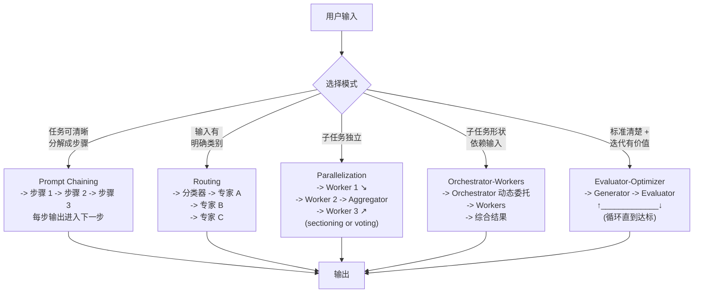

# 第 6 章：Agentic 工作流模式

### 6.1 Workflows 与 Agents

Anthropic 在更大的 “agentic systems” 类别中区分了两种架构 ([Anthropic - Building Effective Agents](https://www.anthropic.com/engineering/building-effective-agents))：

- **Workflows** 通过预定义代码路径编排 LLM 和工具。
- **Agents** 动态决定自己的流程和工具使用。

他们强调的第一原则是：先找到最简单可行方案，只在需要时增加复杂度。许多用例根本不需要 agent；带检索和上下文示例的单次 LLM 调用通常就足够。Workflow 适合结构明确、需要可预测性和一致性的任务；agent 适合需要灵活性和模型驱动决策的大规模场景。

### 6.2 Augmented LLM

基本构件是 *augmented LLM*：带有检索、工具和记忆的模型。现代模型可以主动使用这些能力：生成自己的查询、选择工具、决定保留什么 ([Anthropic - Building Effective Agents](https://www.anthropic.com/engineering/building-effective-agents))。MCP 是暴露这些增强能力的常见方式之一。

### 6.3 组合式工作流模式

从最简单到最灵活：

**Prompt chaining** 将任务分解成顺序步骤，每个 LLM 调用处理前一步的输出，并可加程序化 gate。适合任务可清晰分解、愿意用延迟换准确率的情况。例如：先写营销文案，再翻译。

**Routing** 对输入分类，并派发到专门后续流程。适合输入类别明确、且分类可靠的场景。例如：把客服问题路由到退款、技术支持或一般问题 pipeline。

**Parallelization** 同时运行多个 LLM 调用并聚合输出。两个变体是 *sectioning*（拆成独立子任务）和 *voting*（同一任务多次运行）。适合加速，或多视角能提升信心的任务，例如多 prompt 漏洞审查、内容审核投票。

**Orchestrator-workers** 由中心 LLM 动态拆分任务、委托 worker LLM，并综合结果。它不同于 parallelization，因为子任务不是预先定义的。适合子任务形状依赖输入的复杂任务，例如触及多文件的 coding agent、跨多来源研究。

**Evaluator-optimizer** 由一个 LLM 生成，另一个 LLM 批评，循环改进。适合有明确评价标准，且迭代带来可测收益的任务。两个信号是：人类反馈能显著提升输出；LLM 也可能产生类似反馈。例如文学翻译的 critic、多轮研究中的相关性 evaluator。

### 6.4 Agent 实现的三条原则

Anthropic 最后给出三条规则 ([Anthropic - Building Effective Agents](https://www.anthropic.com/engineering/building-effective-agents))：

1. **保持简单**。
2. **优先透明**，明确展示 agent 的规划步骤。
3. **认真设计 agent-computer interface**，包括工具文档和测试。

Framework 能帮助快速开始，但也可能引入抽象层，遮蔽底层 prompt 和工具调用。Anthropic 建议在仍然摸索问题形状时，从直接 API 调用开始；当重复模式和运营需求变清楚后，再引入 framework。

### 6.5 小代理模式

HumanLayer 的实践版本表达了相同洞见 ([HumanLayer - 12-Factor Agents](https://www.humanlayer.dev/blog/12-factor-agents))：“loop until done” 模式大约在 10-20 轮后会撞墙，agent 失去连贯性。有效做法是在更大的确定性 DAG 中嵌入小而聚焦的 agent。他们的 deploybot 示例中，确定性代码负责 staging deploy、e2e test 和真正的 prod deploy 命令；LLM 只负责解释人类自然语言反馈（“能先部署 backend 吗？”）并提出更新步骤。把 agent 的作用域限制在 5-10 步，错误失控发散会少很多。

原则可以推广：随着模型变强，agent 可处理步骤可能变多；但小而聚焦的 agent 方式让你今天就能交付，并随着模型能力增长逐步扩大范围。

---

## 图：五种工作流模式

---

## 要点

- **从最简单模式开始**：许多任务只需要一次 LLM 调用，过早加入 agent loop 往往浪费。
- **Workflow 给可预测性，Agent 给灵活性**：依据子任务结构是否预先已知来选择。
- **五种模式覆盖多数场景**：chaining、routing、parallelization、orchestrator-workers、evaluator-optimizer。
- **小代理模式今天更容易落地**：把 5-10 步聚焦 agent 嵌入确定性 DAG，比“loop until done”更稳。
- **抽象前先保留可见性**：直接 API 调用让早期行为更容易检查；模式稳定后 framework 才更划算。

## 延伸阅读

- Erik Schluntz and Barry Zhang, *Building Effective Agents*, Anthropic, Dec 2024. https://www.anthropic.com/engineering/building-effective-agents
- Dex Horthy, *12-Factor Agents*, HumanLayer, Apr 2025. https://www.humanlayer.dev/blog/12-factor-agents
- Vivek Trivedy, *The Anatomy of an Agent Harness*, LangChain, Mar 2026. https://blog.langchain.com/the-anatomy-of-an-agent-harness/
