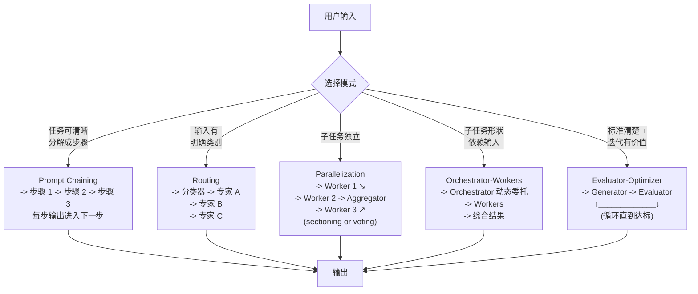

# 第 6 章：Agentic 工作流模式

### 6.1 工作流与代理

Anthropic 将广义的“代理式系统（agentic systems）”分为两类架构 ([Anthropic - Building Effective Agents](https://www.anthropic.com/engineering/building-effective-agents))：

- **工作流（workflows）**通过预先定义的代码路径编排 LLM 与工具。
- **代理（agents）**自行决定执行过程以及如何使用工具。

Anthropic 的首要原则是：采用能够解决问题的最简单方案，只有在任务确实需要时才增加复杂度。许多场景根本不需要代理，单次 LLM 调用配合检索和上下文示例通常就已足够。对于定义清晰的任务，工作流能提供可预测性和一致性；如果执行路径无法预先确定，系统需要由模型在运行时做出决策，代理才更合适。

### 6.2 增强型 LLM

最基本的构件是*增强型 LLM（augmented LLM）*，也就是接入了检索、工具和记忆的模型。现代模型能够主动运用这些能力，例如自行生成查询、选择工具，以及决定保留哪些信息 ([Anthropic - Building Effective Agents](https://www.anthropic.com/engineering/building-effective-agents))。MCP（见第 4 章）正逐渐成为向模型提供这些能力的常见方式。

### 6.3 组合式工作流模式

下面这些模式从简单、受约束的形式逐步过渡到更灵活的形式：

**Prompt chaining（提示链）**把任务拆成一系列顺序执行的步骤。每次 LLM 调用都处理上一步的输出，步骤之间还可以加入程序化检查。它适合能够清晰拆解的任务：缩小每次调用负责的任务范围，往往可以提高准确率，但代价是延迟增加。例如，第一次调用起草营销文案，第二次再完成翻译。它的主要风险是错误传播：链条越长，延迟累积越多，早期错误也可能污染所有后续结果。因此，应在关键边界设置检查关卡。

**Routing（路由）**先对输入分类，再将其分派到专门的处理路径。它适合输入可以可靠地划分为不同类别，而且各类别需要不同处理方式的场景。例如，客服系统可以把请求分别送往退款、技术支持或一般咨询流程。分类错误和含糊输入往往不会显式报错，却会让后续流程走错方向，因此必须为分类器建立监测，并持续关注错误率。

**Parallelization（并行化）**同时运行多个 LLM 调用，然后汇总输出。常见形式有两种：*sectioning* 将工作拆成相互独立的子任务，*voting* 则让同一任务重复运行多次。需要降低延迟，或希望通过多个视角提高可信度时，可以采用并行化，例如使用多组提示词审查漏洞，或让多个结果共同投票进行内容审核。不过，voting 会按运行次数成倍增加 token 成本；如果各次运行犯的是相关性很强的同类错误，即使结论全都一致，也可能只是制造虚假的确定感。

**Orchestrator-workers（编排者—工作者）**由一个中心 LLM 动态拆解任务、把子任务委派给 worker LLM，再汇总各方结果。它与普通并行化的区别在于，子任务并非事先定义，而是在运行时根据输入决定。这种模式适合拆解方式取决于具体输入的复杂工作，例如需要修改多个文件的编程任务，或需要查阅大量来源的研究任务。它的主要风险是编排者无节制地派生 worker，因此必须同时限制 worker 数量和 token 总预算。

**Evaluator-optimizer（评估者—优化者）**让生成与评估构成循环：通常由一个 LLM 产出答案，另一个 LLM 给出评价，再据此继续改进。它适合评价标准明确、迭代优化能够带来可测收益的任务。判断是否适用可以看两个信号：人类反馈是否能稳定改善结果，以及 LLM 是否有能力给出类似反馈。典型例子包括由批评者辅助的文学翻译，以及由相关性评估器指导的多轮研究。由于循环未必会自行收敛，必须设置最大迭代次数；每多一轮，都会增加延迟和成本。

### 6.4 Agent 实现的三条原则

Anthropic 最后总结了三条实现原则 ([Anthropic - Building Effective Agents](https://www.anthropic.com/engineering/building-effective-agents))：

1. **保持代理设计简单**。
2. **优先保证透明度**，明确展示代理的规划步骤。
3. **认真设计代理与计算机之间的接口**，包括工具文档和测试。

框架可以加快早期开发，但它引入的抽象层也可能遮蔽真正决定系统行为的提示词和工具调用。Anthropic 建议，在尚未摸清问题结构时先直接调用 API；等到重复模式和运维需求逐渐稳定，再引入框架来承接这些共性。

### 6.5 小代理模式

HumanLayer 从工程实践中得出了相似结论 ([HumanLayer - 12-Factor Agents](https://www.humanlayer.dev/blog/12-factor-agents))：“循环直到完成（loop until done）”的模式通常在大约 10-20 轮后遇到瓶颈。超过这个范围，上下文和每一轮的误差不断累积，代理会逐渐失去连贯性（见第 2 章《上下文是一种有限资源》）。

更可靠的做法，是把小而专注的代理嵌入确定性的 DAG 中；这里的 DAG 指由代码定义各步骤的有向无环图。LangChain 也描述了这种 harness 形态 ([LangChain - The Anatomy of an Agent Harness](https://blog.langchain.com/the-anatomy-of-an-agent-harness/))。在 deploybot 示例中，确定性代码负责预发布环境部署、端到端测试和正式生产部署命令；LLM 只在需要理解自然语言反馈时介入，例如解读“能先部署后端吗？”，然后提出调整后的步骤。将代理的职责限制在 5-10 个步骤内，可以显著减少错误失控扩散。

这条原则并不会因为模型能力提升而失效。更强的代理或许能够处理更长的任务序列，但小而专注的代理能让团队现在就交付可靠系统，并在模型能力增长后逐步扩大其职责范围。

### 6.6 推理与自我纠错模式

第 6.3 节的五种模式属于组合式*控制流*模式，解决的是如何编排调用。另一条研究路线关注*推理*模式，也就是单个代理或紧密循环如何组织推理与自我纠错。这两类模式可以彼此组合，而不是相互取代。下面这些名称经常出现在相关文献中：

- **ReAct** 将推理与行动交替进行：模型先思考，再调用工具、观察结果，然后重复这一过程。它是多数代理循环的基础模式（第 1 章；《LLM Foundations》第 12 章）。
- **Reflexion** 为代理增加自我反思记忆。一次尝试失败后，代理会用自然语言记录自己*为何*失败，再把这段反思放入上下文中重试。作者将其称为无需更新权重的“言语强化学习（verbal reinforcement learning）” ([Shinn et al. - Reflexion](https://arxiv.org/abs/2303.11366))。
- **Self-Refine** 将 evaluator-optimizer 模式（第 6.3 节）收进同一个模型：模型先生成结果，再批评并修改自己的输出，如此迭代，直到结果令人满意 ([Madaan et al. - Self-Refine](https://arxiv.org/abs/2303.17651))。
- **CRITIC** 不让批评只依赖内省，而是借助搜索、代码执行、计算器等*外部工具*来验证。这样一来，纠错依据的是外部证据，而不是模型自身的信心 ([Gou et al. - CRITIC](https://arxiv.org/abs/2305.11738))。
- **Tree of Thoughts（ToT）** 不再沿单一推理链前进，而是搜索多个分支，通过前瞻和回溯探索若干部分解，再决定采用哪一条路径 ([Yao et al. - Tree of Thoughts](https://arxiv.org/abs/2305.10601))。
- **LATS** 在代理轨迹上运行蒙特卡洛树搜索（MCTS），并由 LM 价值函数和反思引导搜索，从而把推理、行动与规划统一起来 ([Zhou et al. - Language Agent Tree Search](https://arxiv.org/abs/2310.04406))。
- **ReWOO** 将规划与执行分开：*Planner* 预先写出完整计划，*Workers* 执行工具调用，*Solver* 汇总出最终答案。由于无需在每次得到观察结果后重新推理，这种结构可以减少 token 消耗 ([Xu et al. - ReWOO](https://arxiv.org/abs/2305.18323))。

从 harness 的角度看，这些模式做的是相似的权衡：用更多 token 和延迟换取可靠性。正如第 6.1 节和第 14 章所提醒的，这种交换只在困难且可验证的任务上值得；对于简单任务，它只是额外开销。与单纯依靠模型自我批评相比，把自我纠错建立在工具或测试之上的模式更可信，例如本节的 CRITIC、第 14 章由验证器把关的级联，以及第 7 章的 generator-evaluator 分离。这也印证了本书反复强调的原则：验证比内省更可靠（第 7 章、第 10 章）。

---

## 图：五种工作流模式

```mermaid
flowchart TD
    INPUT["用户输入"] --> CHOICE{选择模式}

    CHOICE -->|"任务可清晰<br/>分解成步骤"| CHAIN["Prompt Chaining<br/>-> 步骤 1 -> 步骤 2 -> 步骤 3<br/>每步输出进入下一步"]
    CHOICE -->|"输入有<br/>明确类别"| ROUTE["Routing<br/>-> 分类器 -> 专家 A<br/>             -> 专家 B<br/>             -> 专家 C"]
    CHOICE -->|"子任务独立"| PARALLEL["Parallelization<br/>-> Worker 1 ↘<br/>-> Worker 2 -> Aggregator<br/>-> Worker 3 ↗<br/>(sectioning or voting)"]
    CHOICE -->|"子任务形状<br/>依赖输入"| ORCH["Orchestrator-Workers<br/>-> Orchestrator 动态委托<br/>-> Workers<br/>-> 综合结果"]
    CHOICE -->|"标准清楚 +<br/>迭代有价值"| EVALOPT["Evaluator-Optimizer<br/>-> Generator -> Evaluator<br/>      ↑_____________↓<br/>   (循环直到达标)"]

    CHAIN --> OUT["输出"]
    ROUTE --> OUT
    PARALLEL --> OUT
    ORCH --> OUT
    EVALOPT --> OUT
```

---

## 要点

- **从最简单的模式开始**：许多任务只需要一次 LLM 调用，过早加入代理循环往往没有必要。
- **工作流提供可预测性，代理提供灵活性**：应根据子任务结构能否预先确定来选择。
- **五种模式覆盖多数场景**：chaining、routing、parallelization、orchestrator-workers、evaluator-optimizer。
- **小代理模式现阶段更容易可靠落地**：在确定性 DAG 中嵌入只负责 5-10 个步骤的专注型代理，通常比“循环直到完成”更稳健。
- **引入抽象之前，先保留系统的可观察性**：直接调用 API 更便于检查早期行为；等模式稳定后，框架的价值才会显现。
- **推理模式可以与工作流模式组合**：Reflexion、Self-Refine、CRITIC、Tree of Thoughts、LATS 和 ReWOO 用来组织模型的推理过程。它们最适合困难且可验证的任务；如果自我纠错以工具或测试为依据，而不是只靠内省，结果会更可信。

## 延伸阅读

- Erik Schluntz and Barry Zhang, *Building Effective Agents*, Anthropic, Dec 2024. https://www.anthropic.com/engineering/building-effective-agents
- Dex Horthy, *12-Factor Agents*, HumanLayer, Apr 2025. https://www.humanlayer.dev/blog/12-factor-agents
- Vivek Trivedy, *The Anatomy of an Agent Harness*, LangChain, Mar 2026. https://blog.langchain.com/the-anatomy-of-an-agent-harness/
- Noah Shinn et al., *Reflexion: Language Agents with Verbal Reinforcement Learning*, arXiv, Mar 2023. https://arxiv.org/abs/2303.11366
- Aman Madaan et al., *Self-Refine: Iterative Refinement with Self-Feedback*, arXiv, Mar 2023. https://arxiv.org/abs/2303.17651
- Zhibin Gou et al., *CRITIC: Large Language Models Can Self-Correct with Tool-Interactive Critiquing*, arXiv, May 2023. https://arxiv.org/abs/2305.11738
- Shunyu Yao et al., *Tree of Thoughts: Deliberate Problem Solving with Large Language Models*, arXiv, May 2023. https://arxiv.org/abs/2305.10601
- Andy Zhou et al., *Language Agent Tree Search Unifies Reasoning, Acting, and Planning in Language Models*, arXiv, Oct 2023. https://arxiv.org/abs/2310.04406
- Binfeng Xu et al., *ReWOO: Decoupling Reasoning from Observations for Efficient Augmented Language Models*, arXiv, May 2023. https://arxiv.org/abs/2305.18323
