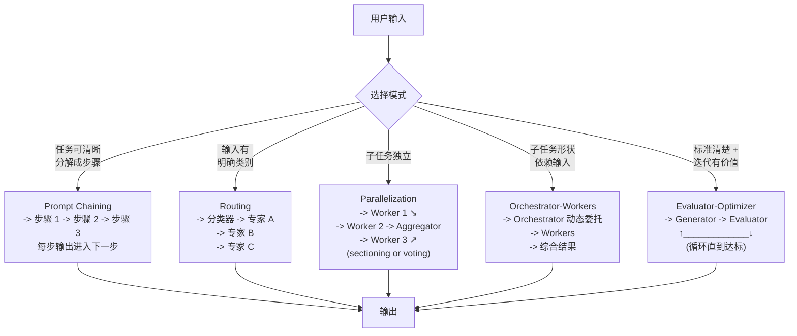

# 第 6 章：Agentic 工作流模式

### 6.1 Workflows 与 Agents

Anthropic 在更大的 “agentic systems” 类别中区分了两种架构 ([Anthropic - Building Effective Agents](https://www.anthropic.com/engineering/building-effective-agents))：

- **Workflows** 通过预定义代码路径编排 LLM 和工具。
- **Agents** 动态决定自己的流程和工具使用。

他们强调的第一原则是：先找到最简单可行方案，只在需要时增加复杂度。许多用例根本不需要 agent；带检索和上下文示例的单次 LLM 调用通常就足够。Workflow 适合结构明确、需要可预测性和一致性的任务；agent 适合需要灵活性和模型驱动决策的大规模场景。

### 6.2 Augmented LLM

基本构件是 *augmented LLM*：带有检索、工具和记忆的模型。现代模型可以主动使用这些能力：生成自己的查询、选择工具、决定保留什么 ([Anthropic - Building Effective Agents](https://www.anthropic.com/engineering/building-effective-agents))。MCP（见第 4 章）是暴露这些增强能力的常见方式之一。

### 6.3 组合式工作流模式

从最简单到最灵活：

**Prompt chaining** 将任务分解成顺序步骤，每个 LLM 调用处理前一步的输出，并可加程序化 gate。适合任务可清晰分解、愿意用延迟换准确率的情况。例如：先写营销文案，再翻译。失败模式：延迟会逐步累加，早期调用的错误会向下游传播——要积极设置 gate。

**Routing** 对输入分类，并派发到专门后续流程。适合输入类别明确、且分类可靠的场景。例如：把客服问题路由到退款、技术支持或一般问题 pipeline。失败模式：在分类错误和模糊输入上会无声失败——要对分类器做埋点，盯住它的错误率。

**Parallelization** 同时运行多个 LLM 调用并聚合输出。两个变体是 *sectioning*（拆成独立子任务）和 *voting*（同一任务多次运行）。适合加速，或多视角能提升信心的任务，例如多 prompt 漏洞审查、内容审核投票。失败模式：voting 会把 token 成本放大 N 倍，而且相关性错误会让 N 个一致的投票产生虚假的安心感。

**Orchestrator-workers** 由中心 LLM 动态拆分任务、委托 worker LLM，并综合结果。它不同于 parallelization，因为子任务不是预先定义的。适合子任务形状依赖输入的复杂任务，例如触及多文件的 coding agent、跨多来源研究。失败模式：orchestrator 可能无界地 fan out——要限制 worker 数量和总 token 预算。

**Evaluator-optimizer** 由一个 LLM 生成，另一个 LLM 批评，循环改进。适合有明确评价标准，且迭代带来可测收益的任务。两个信号是：人类反馈能显著提升输出；LLM 也可能产生类似反馈。例如文学翻译的 critic、多轮研究中的相关性 evaluator。失败模式：循环可能不收敛——要限制迭代次数，因为每一轮都会增加延迟和成本。

### 6.4 Agent 实现的三条原则

Anthropic 最后给出三条规则 ([Anthropic - Building Effective Agents](https://www.anthropic.com/engineering/building-effective-agents))：

1. **保持简单**。
2. **优先透明**，明确展示 agent 的规划步骤。
3. **认真设计 agent-computer interface**，包括工具文档和测试。

Framework 能帮助快速开始，但也可能引入抽象层，遮蔽底层 prompt 和工具调用。Anthropic 建议在仍然摸索问题形状时，从直接 API 调用开始；当重复模式和运营需求变清楚后，再引入 framework。

### 6.5 小代理模式

HumanLayer 的实践版本表达了相同洞见 ([HumanLayer - 12-Factor Agents](https://www.humanlayer.dev/blog/12-factor-agents))：“loop until done” 模式大约在 10-20 轮后会撞墙，随着累积的 context 和每轮误差不断叠加，agent 失去连贯性（见第 2 章《上下文是一种有限资源》）。有效做法是在更大的确定性 DAG（由代码定义步骤组成的有向无环图）中嵌入小而聚焦的 agent。这种把 LLM 微代理嵌入确定性代码的 harness 形态，也正是 LangChain 所描述的 ([LangChain - The Anatomy of an Agent Harness](https://blog.langchain.com/the-anatomy-of-an-agent-harness/))。他们的 deploybot 示例中，确定性代码负责 staging deploy、e2e test 和真正的 prod deploy 命令；LLM 只负责解释人类自然语言反馈（“能先部署 backend 吗？”）并提出更新步骤。把 agent 的作用域限制在 5-10 步，错误失控发散会少很多。

原则可以推广：随着模型变强，agent 可处理步骤可能变多；但小而聚焦的 agent 方式让你今天就能交付，并随着模型能力增长逐步扩大范围。

### 6.6 推理与自我纠错模式

第 6.3 节的五个模式是组合式的*控制流*模式——它们编排调用。另一条研究线贡献了*推理*模式：单个 agent（或一个紧密循环）如何组织自身的思考与自我纠错。它们与工作流模式相组合，而非取代后者，且大多是值得辨识的具名研究成果。

- **ReAct** 交错推理与行动——模型思考、调用工具、观察、重复。它是大多数 agent 循环之下的基础模式（第 1 章；《LLM Foundations》第 12 章）。
- **Reflexion** 加了一层自我批评的记忆：一次尝试失败后，agent 用自然语言写下*为何*失败的反思，并把这段反思放进上下文再试一次——一种无需更新权重的“言语强化学习（verbal reinforcement learning）” ([Shinn et al. - Reflexion](https://arxiv.org/abs/2303.11366))。
- **Self-Refine** 把 evaluator-optimizer 模式（第 6.3 节）收进单个模型：它生成、批评自己的输出、再修订，反复迭代直到满意 ([Madaan et al. - Self-Refine](https://arxiv.org/abs/2303.17651))。
- **CRITIC** 把这种批评*落地*到*外部工具*——搜索、代码执行、计算器——而非仅靠内省，使纠正被世界检验，而非被模型自己的自信检验 ([Gou et al. - CRITIC](https://arxiv.org/abs/2305.11738))。
- **Tree of Thoughts（ToT）** 用对多个分支的搜索取代单条推理链，以前瞻与回溯在提交前探索多个部分解 ([Yao et al. - Tree of Thoughts](https://arxiv.org/abs/2305.10601))。
- **LATS** 通过在 agent 轨迹上运行蒙特卡洛树搜索（MCTS）来统一推理、行动与规划，由 LM 价值函数与反思引导搜索 ([Zhou et al. - Language Agent Tree Search](https://arxiv.org/abs/2310.04406))。
- **ReWOO** 把规划与执行解耦：*Planner* 先写出完整计划，*Worker* 执行工具调用，*Solver* 合成答案——通过不在每次观察后重新推理来削减 token ([Xu et al. - ReWOO](https://arxiv.org/abs/2305.18323))。

harness 视角把它们串起来。每个大多是用 token 和延迟换可靠性，而且——正如第 6.1 节和第 14 章所警告——这笔交易在困难、可检验的任务上才划算，在简单任务上纯属额外开销。更可信的是那些自我纠错被*落地*到工具或测试的模式（这里的 CRITIC；第 14 章由验证器把关的 cascade；第 7 章的 generator-evaluator 拆分），而非靠模型自我批评，这与本书反复出现的主题一致：验证胜于内省（第 7 章、第 10 章）。

---

## 图：五种工作流模式

```mermaid
flowchart TD
    INPUT["用户输入"] --> CHOICE{选择模式}

    CHOICE -->|"任务可清晰<br/>分解成步骤"| CHAIN["Prompt Chaining<br/>-> 步骤 1 -> 步骤 2 -> 步骤 3<br/>每步输出进入下一步"]
    CHOICE -->|"输入有<br/>明确类别"| ROUTE["Routing<br/>-> 分类器 -> 专家 A<br/>             -> 专家 B<br/>             -> 专家 C"]
    CHOICE -->|"子任务独立"| PARALLEL["Parallelization<br/>-> Worker 1 ↘<br/>-> Worker 2 -> Aggregator<br/>-> Worker 3 ↗<br/>(sectioning or voting)"]
    CHOICE -->|"子任务形状<br/>依赖输入"| ORCH["Orchestrator-Workers<br/>-> Orchestrator 动态委托<br/>-> Workers<br/>-> 综合结果"]
    CHOICE -->|"标准清楚 +<br/>迭代有价值"| EVALOPT["Evaluator-Optimizer<br/>-> Generator -> Evaluator<br/>      ↑_____________↓<br/>   (循环直到达标)"]

    CHAIN --> OUT["输出"]
    ROUTE --> OUT
    PARALLEL --> OUT
    ORCH --> OUT
    EVALOPT --> OUT
```

---

## 要点

- **从最简单模式开始**：许多任务只需要一次 LLM 调用，过早加入 agent loop 往往浪费。
- **Workflow 给可预测性，Agent 给灵活性**：依据子任务结构是否预先已知来选择。
- **五种模式覆盖多数场景**：chaining、routing、parallelization、orchestrator-workers、evaluator-optimizer。
- **小代理模式今天更容易落地**：把 5-10 步聚焦 agent 嵌入确定性 DAG，比“loop until done”更稳。
- **抽象前先保留可见性**：直接 API 调用让早期行为更容易检查；模式稳定后 framework 才更划算。
- **推理模式与工作流模式相组合**：Reflexion、Self-Refine、CRITIC、Tree of Thoughts、LATS 和 ReWOO 组织模型自身的思考——在困难、可检验的任务上最有价值，当自我纠错落地到工具或测试而非内省时最可信。

## 延伸阅读

- Erik Schluntz and Barry Zhang, *Building Effective Agents*, Anthropic, Dec 2024. https://www.anthropic.com/engineering/building-effective-agents
- Dex Horthy, *12-Factor Agents*, HumanLayer, Apr 2025. https://www.humanlayer.dev/blog/12-factor-agents
- Vivek Trivedy, *The Anatomy of an Agent Harness*, LangChain, Mar 2026. https://blog.langchain.com/the-anatomy-of-an-agent-harness/
- Noah Shinn et al., *Reflexion: Language Agents with Verbal Reinforcement Learning*, arXiv, Mar 2023. https://arxiv.org/abs/2303.11366
- Aman Madaan et al., *Self-Refine: Iterative Refinement with Self-Feedback*, arXiv, Mar 2023. https://arxiv.org/abs/2303.17651
- Zhibin Gou et al., *CRITIC: Large Language Models Can Self-Correct with Tool-Interactive Critiquing*, arXiv, May 2023. https://arxiv.org/abs/2305.11738
- Shunyu Yao et al., *Tree of Thoughts: Deliberate Problem Solving with Large Language Models*, arXiv, May 2023. https://arxiv.org/abs/2305.10601
- Andy Zhou et al., *Language Agent Tree Search Unifies Reasoning, Acting, and Planning in Language Models*, arXiv, Oct 2023. https://arxiv.org/abs/2310.04406
- Binfeng Xu et al., *ReWOO: Decoupling Reasoning from Observations for Efficient Augmented Language Models*, arXiv, May 2023. https://arxiv.org/abs/2305.18323
