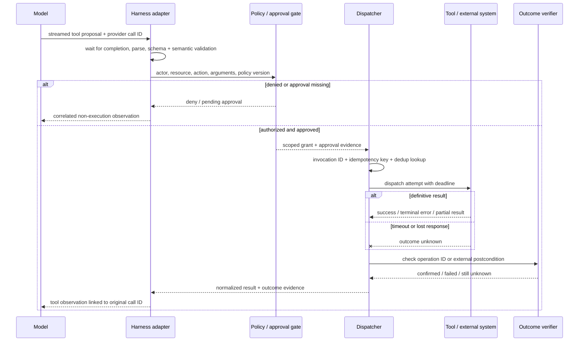

# 第 6 章：工具与调用生命周期

《LLM Foundations》第 12 章停在模型边界：工具调用是模型提出的结构化输出，工具结果则作为可能不可信的上下文返回。本章沿着 harness 继续追踪这个 proposal。核心规则很简单：**格式正确的工具调用既不代表获得许可，也不能证明执行成功。**

### 6.1 从模型提议到外部效果

对于由 client 执行的工具，模型发出结构化请求，应用代码执行操作，再把结果送回模型。Anthropic 明确把它描述为一项契约：模型本身从不执行该操作；OpenAI 也把模型生成的 tool call 与应用产生的 tool-call output 区分开来 ([Anthropic — How Tool Use Works](https://platform.claude.com/docs/en/agents-and-tools/tool-use/how-tool-use-works); [OpenAI — Function Calling](https://developers.openai.com/api/docs/guides/function-calling))。Provider 可以托管某些工具并隐藏一部分往返过程，但责任边界不变：模型输出负责提议，执行系统负责决策和行动。

一个生产级调用应通过明确的生命周期：

| 阶段 | 主要负责人 | 必须记录的内容 | Retry 的含义 |
|---|---|---|---|
| 1. 接收并关联 | Harness adapter | provider response ID、provider call ID、harness invocation ID | 尚未执行 |
| 2. 完成流式参数 | Harness adapter | 完成事件与组装后的字节 | 重连或放弃；不得 dispatch 片段 |
| 3. 解析 | Parser | 解析值或语法错误 | 要求修正调用；不得执行 |
| 4. Schema 验证 | Validator | schema version 与字段错误 | 修正参数；不得执行 |
| 5. 语义验证 | Domain adapter | 已解析资源、前置条件、边界 | 刷新状态或要求修正 |
| 6. 授权 | Dispatcher / policy enforcement point | actor、capability、resource、policy version、decision | 身份、资源、工具或 policy 变化时重新评估 |
| 7. 获得强制审批 | Runtime / product | approver、准确的 action preview、expiry、decision | 不得从模型文本推断已批准 |
| 8. 建立幂等与去重 | Dispatcher | idempotency key、既有 attempt 查询 | 恢复或返回已知结果，不重复产生效果 |
| 9. 执行 | Tool adapter 或远端服务 | attempt ID、request、start time | 由副作用语义决定 |
| 10. 强制 timeout 与 cancellation | Runtime | deadline、cancellation state | 在确认前，timeout 产生的是 unknown outcome |
| 11. 分类完成状态 | Tool adapter | success、retryable failure、terminal failure、partial success 或 unknown | 只按明确 policy retry |
| 12. 归一化结果 | Adapter | 稳定的 result/error envelope 与 artifact references | 不采用随模型变化的临时格式 |
| 13. 返回 observation | Harness | 与原 call ID 关联的结果 | Observation 是不可信 context，不是执行权限 |
| 14. 确认外部 outcome | Verifier / environment | postcondition evidence 与 final status | 对有后果的 retry，必须先 reconciliation |

并非每次只读查询都需要人工审批或额外的后置条件查询。这个生命周期是一组需要明确区分的决策，不是要求进行十四次网络往返。多个阶段可以合并在同一个可信组件里，但它们的证据和失败语义仍应可以分辨。

### 6.2 关联、流式输出与并行调用

每次调用都需要稳定身份。保留 provider 的 call ID；如果任务可能跨 queue、retry、provider 或进程边界，还要增加 harness-level invocation ID。结果必须关联到某个具体调用，不能只依赖工具名或列表位置。OpenAI 的 tool-call output 使用 `call_id` 指向原调用；Anthropic 的 tool result 同样用 `tool_use_id` 匹配特定的 `tool_use` block ([OpenAI — Function Calling](https://developers.openai.com/api/docs/guides/function-calling); [Anthropic — Handle Tool Calls](https://platform.claude.com/docs/en/agents-and-tools/tool-use/handle-tool-calls))。

Streaming 增加了一个完成边界。Argument delta 是尚在生成的 serialization，不是一系列可执行命令。OpenAI 的 streaming 契约先发出 argument-delta events，随后发送包含完整参数的完成事件；harness 应等待 provider 的完成信号，按 call identity 组装，之后才解析和验证 ([OpenAI — Function Calling, Streaming](https://developers.openai.com/api/docs/guides/function-calling#streaming))。如果 dispatch 一个看似语法合理的前缀，例如 `{"recipient":"alice"`，就可能对被截断或随后改变的 intent 执行动作。

并行调用需要各自独立的状态机。假如同一轮提出三个调用，其中一个成功、一个验证失败、一个 timeout，就应记录三个 outcome，不能压成一个 turn-level Boolean。每个完成的 observation 都应使用自己的 call ID，尚未解决的调用则保持显式状态；例如 Anthropic API 要求每个 client `tool_use` block 在下一条消息中获得对应的 `tool_result` ([Anthropic — Handle Tool Calls](https://platform.claude.com/docs/en/agents-and-tools/tool-use/handle-tool-calls))。

一个实用的内部 envelope 是：

```text
invocation_id, provider_call_id, tool_name, tool_version
actor, tenant, capability, policy_version, approval_id
arguments_hash, idempotency_key, attempt_id, deadline
status, normalized_result, artifacts, postcondition_evidence
```

[第 10 章](./10-state-event-history-production-factors.md)定义了持久的 `session → run → step → action → attempt` 层级。只有当一次 invocation 恰好表示一个 intended effect 时，dispatcher 才可以把 `invocation_id` 映射为 `action_id`；composite invocation 必须保留内部各 action 与 attempt identity，不能把它们藏进一个不透明 ID。

这些字段属于 execution state 和 lineage metadata，没有必要全部放回模型上下文。

### 6.3 Validity、Authorization 与 Outcome 是不同问题

把“验证”压成一个 Boolean，会隐藏最重要的边界：

1. **语法与 schema validity：**参数是否能解析，字段和类型是否符合声明的接口？Provider 的 strict-schema 功能可以改善这一层，但其保证取决于具体 provider 和 API ([OpenAI — Function Calling, Strict Mode](https://developers.openai.com/api/docs/guides/function-calling#strict-mode))。
2. **Semantic validity：**标识符是否存在？金额是否为正？目标状态是否允许此操作？引用的 revision 是否仍为最新？这些检查依赖领域状态，无法完全编码进 JSON Schema。
3. **Authorization：**这个 actor 此刻是否可以在该 tenant 内、出于当前 purpose、对这个 resource 执行这个 action？工具出现在模型 context 中不等于 capability grant。
4. **Approval：**Policy 是否要求某个人批准这一个准确的 action 和 payload？Mandatory gate 必须由 runtime 插入，而不是由模型决定是否调用。MCP 规范建议应用让人看到暴露给模型的工具，并能拒绝敏感调用 ([MCP — Tools Specification](https://modelcontextprotocol.io/specification/2025-06-18/server/tools))。
5. **Outcome confirmation：**预期的外部状态是否真的出现？成功的 transport response、工具返回的一段文字和验证过的 postcondition，证据强度并不相同。

以 `transfer_funds({from, to, amount})` 为例。合法 JSON 和数值型 `amount` 只能证明第一层。语义检查还要解析两个账户和业务限额；授权必须把 acting identity 绑定到 `from`；policy 可能要求审批准确的金额和收款人；执行需要 transaction identity；outcome confirmation 则检查最终交易或账户余额。跳过其中任何一层，都会改变系统可以作出的安全性和正确性声明。

### 6.4 幂等、去重、超时与重试

Retry policy 的起点应是动作的效果语义，而不是 exception class。RFC 9110 把幂等请求定义为：相同请求执行一次或多次，服务器上的预期效果相同；它还警告，除非 client 知道请求语义是幂等的，或知道第一次请求并未生效，否则不应自动 retry 非幂等请求 ([RFC 9110 §9.2.2](https://www.rfc-editor.org/rfc/rfc9110.html#section-9.2.2))。即使工具没有使用 HTTP，tool adapter 也需要同样的纪律。

| 动作类别 | 示例 | Timeout 后的默认行为 | 必需保护 |
|---|---|---|---|
| 纯读取 / read-only | 搜索、读取状态 | 在 budget 内 retry | Deadline、rate limit、request correlation |
| 天然幂等 | 把目标标签设置为 `approved` | 前置条件仍成立时 retry | Resource version 或 conditional write |
| 通过契约实现幂等 | 使用 idempotency key 创建付款 | 按 key 查询，然后恢复或 retry | Durable dedup record 与稳定 key |
| 非幂等且后果重大 | 发送消息、提交没有 key 的订单 | 不盲目 retry | Outcome lookup、reconciliation 或 human escalation |

**Idempotency key** 为多次 delivery attempt 中的同一个预期效果命名；**deduplication record** 保存该 key 对应的执行结果。Call ID 标识一项 proposal，attempt ID 标识一次 dispatch。如果每次 retry 都生成新的 idempotency key，去重就失效；如果两个不同的预期效果复用同一个 key，则会发生碰撞。

Timeout 只表示 caller 不再等待，不能证明 callee 已停止或 rollback。应把调用置为 `unknown`；如果存在 operation-status 或 target-state endpoint，先查询，再决定是否 retry。除非工具契约保证 rollback，否则 cancellation 同样只是一项停止请求。对于包含多个效果的工具，应返回哪些子操作成功，并暴露补偿动作，而不是只报告一个不可区分的 failure。

Retry logic 不能绕过 authorization 或 approval。当 identity、resource state、tool version、arguments、policy version、approval scope 或 approval expiry 发生变化时，要重新授权。所有 attempts 应计入同一个 invocation budget；budget 耗尽时返回 terminal observation，避免模型意外制造无限 retry loop。

### 6.5 先归一化结果，再确认 Outcome

不同 provider protocol 采用不同的 tool-result 编码。Harness 应把它们归一化成一套小型内部词汇，同时在需要时把原始响应保存为 artifact：

```text
status: succeeded | retryable_error | terminal_error | partial | unknown
summary: compact model-facing observation
data: typed structured result, when available
artifacts: references to large or reviewable outputs
error: stable category, safe message, retry guidance
effect: external operation ID and postcondition evidence
```

MCP 区分 protocol error 与 tool-execution error，也支持带 output schema 的结构化结果；其规范要求 server 返回符合声明 schema 的结构化结果，并建议 client 在把结果交给模型前进行验证 ([MCP — Tools Specification](https://modelcontextprotocol.io/specification/2025-06-18/server/tools))。应保留这种区别。“未知工具”不同于“付款 provider 拒绝扣款”，两者又都不同于“扣款可能成功，但响应丢失”。

结果是 observation，不是 instruction。网页、邮件、仓库文件、peer-agent response 或第三方 API 都可能包含攻击性文本；因此 Anthropic 的 tool-use 文档要求 client 把受外部来源影响的工具结果视为不可信内容 ([Anthropic — Handle Tool Calls](https://platform.claude.com/docs/en/agents-and-tools/tool-use/handle-tool-calls))。保留 provenance 和 trust label，限制结果大小，只向模型呈现下一步决策所需的信息。对于有后果的动作，confirmation 应优先使用 environment state——transaction status、file hash、deployed version、sent-message ID——而不是模型自己声称任务已完成。

### 6.6 设计 Agent–Computer Interface

Anthropic 仿照 HCI 使用 *agent–computer interface*（ACI）一词：工具 schema、description、response 和错误 affordance 都值得仔细设计。它的早期指南建议使用接近训练数据的格式，在模型提交刚性语法之前给它留下规划空间，并避免不必要的格式负担；在一个 SWE-bench agent 中，把文件工具从相对路径改成绝对路径，消除了 agent 离开 repository root 后观察到的大多数路径错误 ([Anthropic — Building Effective Agents](https://www.anthropic.com/engineering/building-effective-agents))。

不要机械地把每个 API endpoint 包装成工具。模型如果必须调用 `list_contacts`、扫描巨大响应，再调用 `send_message`，它获得的接口就不如一个有范围限制的 `search_contacts` 或 `message_contact`。可以合并几乎总是连续执行的步骤，但不要把需要分别授权或分别审查的效果藏进一个巨型工具。`get_customer_context` 可以安全合并读取；`research_and_wire_money` 则会抹掉必要的 policy boundary。

工具描述应明确原本隐含的领域知识：何时使用、何时不用、必需格式、单位、副作用以及含义明确的参数名。Anthropic 报告称，namespace 和描述变更会显著影响模型的 tool-use 表现，因此建议用 eval 持续迭代，而不是假定第一版 schema 已经足够 ([Anthropic — Writing Effective Tools for Agents](https://www.anthropic.com/engineering/writing-tools-for-agents))。Schema 设计可以提高 proposal 质量，但不能替代前述生命周期检查。

### 6.7 三种工具目录策略

第 3 章介绍了三种有效的 catalog pattern。它们解决的 context 和 continuity 问题不同：

1. **稳定目录加 action masking。**保持工具定义稳定，以维持模型连续性和 provider prompt-cache locality；同时由确定性 dispatcher 阻止当前状态下不可用的动作。Manus 报告称在自己的系统中使用了名称前缀和 masking；这是特定 provider/workload 的 case study，不是协议规则 ([Manus — Context Engineering for AI Agents](https://manus.im/blog/Context-Engineering-for-AI-Agents-Lessons-from-Building-Manus))。
2. **Deferred loading 或 tool search。**不把低频定义放进初始 context，在发现后才加载。Anthropic 的 tool-search 接口支持 deferred tools，并说明所选定义如何展开进 conversation ([Anthropic — Tool Reference](https://platform.claude.com/docs/en/agents-and-tools/tool-use/tool-reference))。
3. **稳定的 meta-tool 或代码表面。**暴露一个小型 registry、search tool 或 sandboxed code interface，在其背后解析更大的 capability set。这可以减少 schema 体积和模型往返，但 dispatcher 仍必须验证并授权每一项最终 capability。

选择时应依赖 workload-specific eval。需要测量 tool-selection accuracy、context cost、latency、provider prompt-cache behavior、stale-reference failure 和 permission exposure。“Mask, don't remove” 不是普遍定律；动态加载也不会因为可见 schema 更少就自动更安全。

### 6.8 MCP 暴露 Capability；Harness 治理调用

Model Context Protocol 是 client–server protocol：server **暴露**工具，client 列出并调用工具。Server 也可以暴露 resources 和 prompts，但协议并不意味着 server 拥有、控制或能够检查每个工具背后的所有下游系统 ([MCP — Tools Specification](https://modelcontextprotocol.io/specification/2025-06-18/server/tools); [MCP — Server Overview](https://modelcontextprotocol.io/specification/2025-06-18/server/index))。

MCP 标准化的是 discovery 与 transport，并没有消除生命周期责任。规范要求 server 验证输入、实施 access control、限制调用速率并清理输出；它建议 client 对敏感操作进行确认、dispatch 前展示输入、验证结果、设置 timeout 并记录使用情况 ([MCP — Tools Specification](https://modelcontextprotocol.io/specification/2025-06-18/server/tools))。生产 client 还可以增加更严格的 policy、mandatory approval、tenant isolation、deduplication 和 postcondition verification。

部署拓扑同样重要。私有 capability 不必为了被 hosted agent 使用而新增公网入站 endpoint。OpenAI 的 secure MCP tunnel 文档介绍了一种在私有网络中运行 outbound-only client 的方案：client 连接指定目的地，同时保留 authentication 和 streaming ([OpenAI — Connect Private MCP Servers](https://developers.openai.com/blog/connect-private-mcp-servers-to-openai-products))。应把它视为一种部署 pattern，而不是 MCP 本身保证的属性。

### 6.9 动态 Tool List 需要新的决策

MCP 的 `listChanged` capability 允许 server 通知 client：可用工具列表已经变化 ([MCP — Tools Specification](https://modelcontextprotocol.io/specification/2025-06-18/server/tools))。因此，缓存的 schema 或之前出现在模型 context 中的工具都不代表当前 authority。

收到 list-change notification 后，client 应当：

1. 使用当前 authenticated identity 获取新列表；
2. 比较 tool identity、schema、annotations、server identity 和 version；
3. 使过期的 model-visible definition 和 routing decision 失效；
4. 在下一次 dispatch 前重新运行 capability 与 policy 检查；
5. 如果 action、arguments、resource 或 risk 变化，要求新的 approval；
6. 记录治理该调用的 catalog 和 policy version。

同一规则也适用于 deferred loading 和 meta-tool。Discovery 回答“现在声明提供什么”；authorization 回答“这个 actor 现在允许做什么”。两者是不同操作。

### 6.10 Namespace 与 Context-Efficient Response

`jira_issues_search`、`asana_projects_create` 之类一致的前缀可以减少名称冲突，也让 harness 对相关 capability 分组。Anthropic 的工具设计 eval 发现，名称以及 prefix/suffix 的选择都会影响表现，最佳选择取决于具体 workload ([Anthropic — Writing Effective Tools for Agents](https://www.anthropic.com/engineering/writing-tools-for-agents))。Namespace 是 usability 和 routing 辅助信息，不能证明两个工具属于同一个 authorization domain。

工具响应应优先提供相关的 typed information，而不是追求最大 payload。应提供 pagination、filter、range、concise/detailed mode 和明确的 truncation marker。面向模型的引用可以使用有含义的 label，同时保留后续调用所需的 canonical ID。Anthropic 报告称，在工具 eval 中用更自然的 identifier 替代不透明 UUID 后准确率得到提升，并建议使用 token-efficient response control ([Anthropic — Writing Effective Tools for Agents](https://www.anthropic.com/engineering/writing-tools-for-agents))。

错误信息应当可操作但安全：给出稳定类别、失败的字段或前置条件、是否允许 retry，以及完整诊断信息保存在哪里。不要用数千行成功日志淹没 context，也不要通过原始 traceback 暴露 secret。大型原始输出应存为 artifact；归一化 observation 则携带可恢复的引用。

### 6.11 代码执行作为 Meta-Tool

Harness 不必把数百项直接工具定义和每个中间结果都放进模型 context，也可以暴露由 typed wrapper 支持的 sandboxed code surface。Anthropic 的 “Code Execution with MCP” 描述了通过生成的 TypeScript 文件进行渐进式发现，并报告了一个 Google Drive-to-Salesforce 示例：token 使用量从 150,000 降到 2,000；这是具名示例，不是通用节省比例 ([Anthropic — Code Execution with MCP](https://www.anthropic.com/engineering/code-execution-with-mcp))。

这种 pattern 适合有边界的数据流：filter、join、sort、deduplicate、aggregate 和 validate，然后只返回精简结果。OpenAI 的 programmatic tool-calling 文档描述了同样的主要收益——工具可以从生成的代码中调用，因而不必让全部中间结果经过模型——但 client-side tool 仍由应用执行并返回 output ([OpenAI — Programmatic Tool Calling](https://developers.openai.com/api/docs/guides/tools-programmatic-tool-calling))。

代码执行不会产生 ambient authority。Sandbox、typed proxy 和 dispatcher 必须限制可调用工具、credential、network、filesystem、budget 和 side effect。记录生成的程序、运行时采用的 capability set 与 policy version、每个有后果的 sub-call 和最终 artifact。不要为了减少模型往返，把需要分别审批的动作隐藏在一段程序中。

### 6.12 同时评估工具与生命周期

工具 eval 不应只测试模型是否选择了正确名称。Anthropic 建议按 prototype、realistic evaluation、programmatic runs、transcript analysis 的循环迭代工具，并根据观察到的 failure 改进工具 ([Anthropic — Writing Effective Tools for Agents](https://www.anthropic.com/engineering/writing-tools-for-agents))。针对本章生命周期，还应包含这些 slice：

- 格式错误、不完整以及 schema-invalid 的参数；
- schema 合法，但 resource 不存在或 version 已过期；
- 跨 tenant 和超出 scope 的 authorization attempt；
- 模型没有主动请求的 mandatory approval；
- duplicate delivery、lost response、effect 发生后的 timeout 与 cancellation race；
- 并行或 multi-effect tool 的 partial success；
- 不可信的 result content 与超大输出；
- proposal 与 dispatch 之间发生动态 catalog change；
- response 名义上成功，但 postcondition 不匹配。

应捕获 proposal、validation decision、policy version、approval、attempt、normalized result 和 outcome evidence。第 11 章进一步定义 eval terminology 和 grader；第 17 章进一步讲生产 tracing。此处的重点是：如果 eval 不检查 environment state，一份干净的 model transcript 仍可能掩盖重复副作用或失败的 authorization check。

### 6.13 MCP 与 A2A 跨越不同边界

MCP 把 client 连接到 server 暴露的 capability；A2A 则通过 message 和 task，把 agentic client 连接到另一个 agentic service。当前 A2A 规范定义了用于 discovery 的 Agent Card、task 和 message operation、streaming、authentication/authorization field 以及多种 protocol binding；它不会让 caller 自动检查 peer 内部的 model、memory、tool 或 sandbox ([A2A Protocol Specification](https://a2a-protocol.org/latest/specification/))。

这种区别改变了契约。MCP tool call 应具有精确的 operation schema，并返回关联到该 call 的结果。A2A delegation 可能长时间运行、交换消息、返回 artifact，并需要 task-level status 或 cancellation。无论哪种边界，本地 harness 都必须建立 identity、delegated authority、data scope、deadline、provenance 和 outcome evidence。Peer-agent output 应视为不可信的外部内容，而不是更高权限的 instruction。

Native multi-agent delegation 最适合范围有界、ownership 清楚且产物可合并的任务。共享可变状态或严格的顺序依赖通常需要单一 owner 加确定性 coordination。A2A 标准化的是 interoperability boundary，并不会消除 distributed-systems 或 trust problem。

---

## 图：一次工具调用如何从 Proposal 到 Confirmed Outcome



---

## 要点

- **工具调用是一项 proposal：**schema validity 不等于 authorization、approval、execution 或 outcome proof。
- **Call identity 必须贯穿整个生命周期：**关联 streaming fragment、retry、attempt、result 和 confirmation，不能依赖工具名或位置。
- **绝不 dispatch 未完成的流式参数：**先等待 provider 的完成边界，再解析和验证。
- **Timeout 表示 unknown outcome：**对于有后果或非幂等的 action，retry 前先 reconciliation。
- **结果需要归一化和 provenance：**返回精简 observation，同时保留结构化数据、artifact、error 和 postcondition evidence。
- **工具目录有多种有效策略：**稳定目录加 masking、deferred loading/tool search 和稳定 meta-tool 都有适合的 workload。
- **动态 discovery 不会继承 authority：**MCP `listChanged` event 或 deferred tool 都需要新的 capability 与 policy 检查。
- **MCP 负责暴露工具，不保证拥有背后的资源：**client 和 server 仍需明确的 validation、access control、approval、timeout 与 logging。
- **A2A 是 peer-agent boundary，不是 tool-schema substitute：**必须保留 delegated authority、task status、provenance，并把返回内容视为不可信。
- **评估外部状态，而不只看 transcript：**很多 lifecycle bug 在模型可见文字中看起来仍然成功。

## 延伸阅读

- Anthropic, *How Tool Use Works*. https://platform.claude.com/docs/en/agents-and-tools/tool-use/how-tool-use-works
- Anthropic, *Handle Tool Calls*. https://platform.claude.com/docs/en/agents-and-tools/tool-use/handle-tool-calls
- OpenAI, *Function Calling*. https://developers.openai.com/api/docs/guides/function-calling
- Model Context Protocol, *Tools Specification*, Jun 2025. https://modelcontextprotocol.io/specification/2025-06-18/server/tools
- A2A Project, *A2A Protocol Specification*. https://a2a-protocol.org/latest/specification/
- RFC Editor, *RFC 9110: HTTP Semantics*, Jun 2022. https://www.rfc-editor.org/rfc/rfc9110.html
- Ken Aizawa, *Writing Effective Tools for Agents — with Agents*, Anthropic, Sep 2025. https://www.anthropic.com/engineering/writing-tools-for-agents
- Adam Jones and Conor Kelly, *Code Execution with MCP*, Anthropic, Nov 2025. https://www.anthropic.com/engineering/code-execution-with-mcp
- OpenAI, *Programmatic Tool Calling*. https://developers.openai.com/api/docs/guides/tools-programmatic-tool-calling
