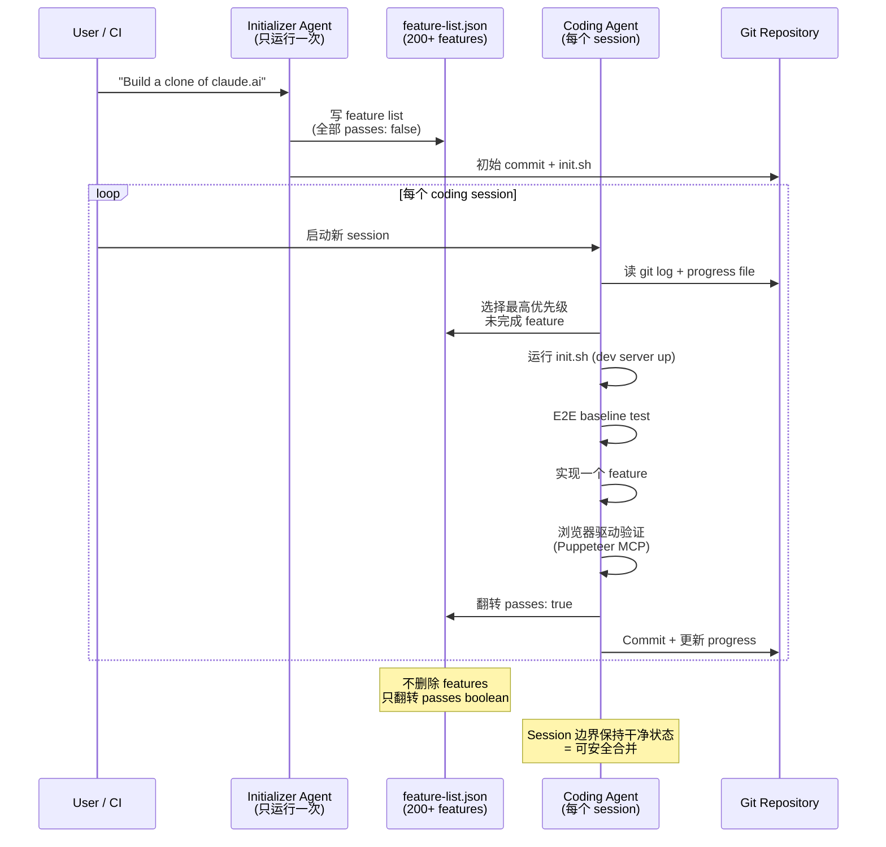

# 第 7 章：长运行代理与多上下文窗口任务

### 7.1 交接班问题

Anthropic 的 “Effective Harnesses for Long-Running Agents” 用一个比喻说明核心挑战：想象一个软件项目由轮班工程师完成，每个工程师上班时都不知道前一班发生了什么 ([Anthropic - Effective Harnesses for Long-Running Agents](https://www.anthropic.com/engineering/effective-harnesses-for-long-running-agents))。由于上下文窗口有限，而多数项目都会超过一个窗口，agent 需要桥接 session 的机制。

单靠压缩不总是足够。在 Anthropic 的长运行应用实验中，即使 Claude Agent SDK 有自动压缩，一个简单的 Opus 4.5 loop 也无法可靠地从“build a clone of claude.ai”这样的高层次 prompt 构建生产质量应用。失败集中在两类：agent 试图一次性完成应用，却在实现中途耗尽上下文，留下问题给下一 session 清理；或者前面构建了一些功能后，后续 agent 直接宣称任务完成。

### 7.2 Initializer + Coding Agent 模式

Anthropic 的解决方案将工作拆成两个角色 ([Anthropic - Effective Harnesses for Long-Running Agents](https://www.anthropic.com/engineering/effective-harnesses-for-long-running-agents))：

**Initializer agent** 只运行一次，使用专门 prompt，产出：

- 启动开发服务器的 `init.sh`。
- 每个 session 更新的 `claude-progress.txt` 日志。
- 初始 git commit。
- 完整 feature-list 文件（JSON；他们先试过 Markdown，但模型更容易不当编辑它）。在 claude.ai clone 中，列表超过 200 个 feature，每个初始 `passes: false`。

Feature list 中每项是 JSON object，包含 category、description、验证步骤和 `passes` boolean。Coding agent 允许翻转 `passes`，但被强烈告知不允许删除或编辑 feature。

**Coding agent** 在后续每个 session 运行，使用不同 prompt，要求增量推进。每个 session 从结构化 warm-up 开始：

1. 运行 `pwd` 确认目录。
2. 读取 git log 和 progress file，了解上次做了什么。
3. 读取 feature-list，选择最高优先级未完成 feature。
4. 运行 `init.sh` 启动 dev server，并在实现新功能前跑基本 e2e test。
5. 实现一个 feature。
6. 端到端验证。Anthropic 使用 Puppeteer MCP 做浏览器驱动验证，因为 agent 否则容易在 unit test 通过但实际失败时宣称完成。
7. 用描述性 message commit，并更新 progress file。

这个模式的好处是：agent 被迫在 session 边界进入干净状态，也就是适合 merge 到 main branch 的状态。下一位 agent 不需要先清理上一位留下的问题。

### 7.3 Generator-Evaluator（GAN 启发）

Prithvi Rajasekaran 的后续文章将这个模式扩展到更难的问题：从短 prompt 构建生产质量应用 ([Anthropic - Harness Design for Long-Running Application Development](https://www.anthropic.com/engineering/harness-design-long-running-apps))。其动机来自一个观察：当 agent 评估自己的工作时，即使输出普通，也会稳定地偏正面。把做事的 agent 与评判的 agent 分开是强杠杆，因为调一个独立、怀疑性的 evaluator，比让 generator 对自己严厉更容易。

受 GAN 启发，架构包含三个 agent：

- **Planner** 将 1-4 句 prompt 扩展为完整产品 spec，刻意停留在产品/架构层，而不是详细技术设计，以免错误级联，并被鼓励把 AI feature 编进 spec。
- **Generator** 用 React + Vite + FastAPI + SQLite 栈按 feature 实现 spec，并用 git 管理版本。
- **Evaluator** 使用 Playwright MCP 像用户一样点击运行中的应用，测试 UI、API endpoint、数据库状态，然后按产品深度、功能、视觉设计、代码质量 rubric 打分。每个标准都有硬阈值，一个失败就导致 sprint 失败，并给出详细反馈。

两者通过 *sprint contracts* 协调：每个 sprint 前，generator 提出要构建什么以及如何验证成功；evaluator 审查直到双方同意；generator 再按合同构建。通信基于文件：一个 agent 写文件，另一个读取并回应。

成本很高。对于 “create a 2D retro game maker” prompt，solo run 花 20 分钟、$9，产出一个看起来像样但游戏本身不能工作的应用；实体出现在屏幕上，却不响应输入。完整 harness 花 6 小时、$200，产出带 sprite editor、level editor、AI-assisted level generation 和 playable mode 的可用应用。超过 20 倍成本买到的是能工作的产品，而不是破损 stub。

### 7.4 自验证是头号杠杆

LangChain 从另一条路得到相同结论 ([LangChain - Improving Deep Agents](https://blog.langchain.com/improving-deep-agents-with-harness-engineering/))。通过 trace 分析，他们识别出最常见的失败模式：agent 写了方案，重读自己的代码，觉得看起来没问题，然后停止。他们在系统提示中加入结构化指导：Plan、Build with verification in mind、Verify by running tests and comparing output to spec、Fix；并加入 `PreCompletionChecklistMiddleware`，在 agent 退出前强制验证。

这个模式呼应社区流传的 “Ralph Wiggum loop”：一个 hook 拦截 agent 的退出尝试，并在干净上下文窗口中重新注入原始 prompt，迫使 agent 继续对照目标工作 ([LangChain - The Anatomy of an Agent Harness](https://blog.langchain.com/the-anatomy-of-an-agent-harness/))。

LangChain 的组合改动，包括上下文 middleware 映射 cwd 和工具、build-verify 指导、loop detection，以及 high-low-high reasoning compute 的 “reasoning sandwich”，在不换模型的情况下把分数提高 13.7 点，从 52.8% 到 66.5%。

### 7.5 Context Reset 与 Compaction

Anthropic 的 harness-design 后续文章明确区分两者 ([Anthropic - Harness Design for Long-Running Application Development](https://www.anthropic.com/engineering/harness-design-long-running-apps))。Compaction 是在同一对话中总结早期部分，同一个 agent 带着缩短历史继续。*Context reset* 则清空上下文，启动一个新 agent，用结构化 handoff 传递上一 agent 的状态和下一步。

两者解决不同问题。Compaction 保持连续性。Reset 用来缓解 “context anxiety”：Anthropic 在 Sonnet 4.5 中观察到，agent 在接近它认为的上下文上限时，会过早收尾。Reset 给 agent 一个干净开局；代价是 handoff artifact 必须携带足够状态，让下一 agent 干净恢复。

当 Opus 4.5 基本自行修复 context-anxiety 行为后，Anthropic 能够完全从 harness 中删除 context reset。这是第 11 章 model-harness coupling 的明确例子。

### 7.6 多代理研究系统

对具有并行结构的任务，例如有许多独立线索要探索的研究，第 6 章的 orchestrator-worker 模式适用。Anthropic 的研究功能用 Claude Opus 4 做 lead agent，用 Claude Sonnet 4 做 sub-agents ([Anthropic - How We Built Our Multi-Agent Research System](https://www.anthropic.com/engineering/multi-agent-research-system))。Lead 分析查询、制定策略、派生并行 sub-agents；每个 sub-agent 搜索并返回浓缩发现；lead 综合；citation agent 再为论断标注来源。

他们经验中出现八条 prompt engineering 原则：

1. **像 agent 一样思考**：在 Console 中用完全相同工具模拟 prompt，观察逐步行为。
2. **教 orchestrator 如何委托**：给 sub-agent 目标、输出格式、工具指导和明确边界；模糊委托会重复或误解。
3. **按查询复杂度缩放努力**：prompt 中明确规则，例如事实查找 1 个 agent / 3-10 次调用；比较任务 2-4 个 sub-agent / 每个 10-15 次调用；复杂研究 10+ sub-agent，防止过度投入。
4. **工具设计与选择很关键**：明确启发式，例如先检查所有可用工具、按用户意图匹配工具、优先专用工具而非通用工具。
5. **让 agent 改进自己**：tool-testing agent 使用有缺陷 MCP 工具、观察失败并重写描述，使后续任务完成时间下降 40%。
6. **先宽后窄**：提示 agent 从短而宽的查询开始，再逐步细化；自然倾向往往相反。
7. **引导思考过程**：extended thinking 可作为可控 scratchpad；interleaved thinking 帮助 sub-agent 在工具调用之间评估质量和细化查询。
8. **并行工具调用改变速度**：并行启动 sub-agents，并让 sub-agent 并行调用多个工具，在复杂查询中可将研究时间最多减少 90%。

### 7.7 有状态 Agent 的生产可靠性

Anthropic 的研究系统文章记录了 agent 长时间运行后的工程挑战 ([Anthropic - How We Built Our Multi-Agent Research System](https://www.anthropic.com/engineering/multi-agent-research-system))：

- **错误会复合**：没有 checkpoint-and-resume 基础设施，小系统故障也可能灾难化。Anthropic 结合 AI 适应性（让 agent 知道工具故障并信任它调整）与 retry logic、定期 checkpoint 等确定性 safeguard。
- **调试需要新工具**：agent 每次运行非确定，完整生产 tracing 是主要诊断表面，用于观察决策模式和交互结构，而不必阅读对话内容。
- **部署需要协调**：当许多 agent 正在运行时推出代码变更，需要 *rainbow deployments*，逐步把流量从旧版本切到新版本，并同时保持两者存活。
- **同步执行制造瓶颈**：当前架构中，lead agent 等待 sub-agents 完成后再继续，简化协调但受最慢 sub-agent 阻塞。异步执行可释放更多并行性，但带来结果协调、状态一致性、错误传播挑战。

---

## 图：Initializer Agent -> Feature List -> Coding Agent Sessions

---

## 要点

- **交接班问题是根本性的**：上下文限制意味着 agent 需要结构化 handoff，而不是只依赖更大窗口。
- **Initializer + coding agent 是有用的长周期模式**：规划与增量执行分角色。
- **Generator 与 evaluator 分离是强杠杆**：agent 对自己输出偏正面，独立 evaluator 更可靠。
- **Sprint contracts 协调多 agent 工作**：构建前用文件沟通并约定成功标准。
- **Context reset 可以缓解 context anxiety**：有时带结构化 handoff 的全新开始优于压缩。
- **自验证是头号杠杆**：退出前强制验证，在不换模型的情况下提升 13.7 分。

## 延伸阅读

- Justin Young et al., *Effective Harnesses for Long-Running Agents*, Anthropic, Nov 2025. https://www.anthropic.com/engineering/effective-harnesses-for-long-running-agents
- Prithvi Rajasekaran, *Harness Design for Long-Running Application Development*, Anthropic, Mar 2026. https://www.anthropic.com/engineering/harness-design-long-running-apps
- Vivek Trivedy, *Improving Deep Agents with Harness Engineering*, LangChain, Feb 2026. https://blog.langchain.com/improving-deep-agents-with-harness-engineering/
- Jeremy Hadfield et al., *How We Built Our Multi-Agent Research System*, Anthropic, Jun 2025. https://www.anthropic.com/engineering/multi-agent-research-system
- Vivek Trivedy, *The Anatomy of an Agent Harness*, LangChain, Mar 2026. https://blog.langchain.com/the-anatomy-of-an-agent-harness/
