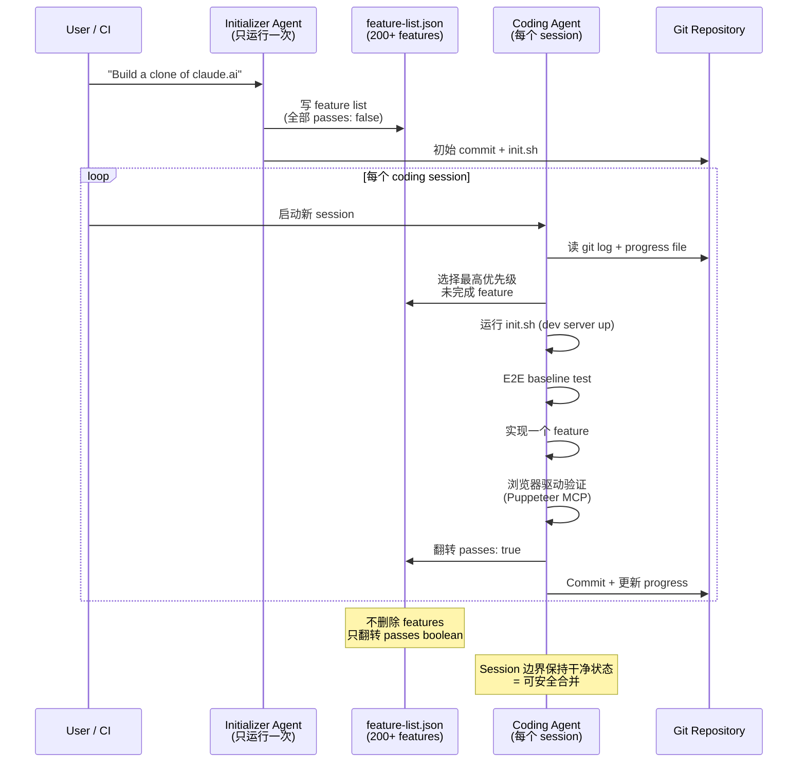

# 第 7 章：长时运行代理与跨上下文窗口任务

### 7.1 交接班问题

Anthropic 在 “Effective Harnesses for Long-Running Agents” 中用轮班来比喻这个核心难题：设想一个软件项目由多名工程师轮流接手，每位新到岗的工程师都完全不知道上一班发生了什么 ([Anthropic - Effective Harnesses for Long-Running Agents](https://www.anthropic.com/engineering/effective-harnesses-for-long-running-agents))。上下文窗口也形成了类似的边界。多数有一定规模的项目都无法在单个窗口内完成，因此代理需要一种可靠机制，将状态从一个会话传递到下一个会话。

单靠上下文压缩并不总能解决问题。在 Anthropic 的长时运行应用实验中，即使 Claude Agent SDK 会自动压缩上下文，一个简单的 Opus 4.5 循环仍无法根据“build a clone of claude.ai”这类概括性提示词，稳定构建出生产级应用。失败反复呈现为两种模式：一种是代理试图一次完成整个应用，却在实现中途耗尽上下文，只能把残局留给下一会话；另一种是后续代理看到已有部分功能完成，便误判整个项目已经结束。

### 7.2 Initializer + Coding Agent 模式

Anthropic 将工作分给两个不同角色，以解决这一问题 ([Anthropic - Effective Harnesses for Long-Running Agents](https://www.anthropic.com/engineering/effective-harnesses-for-long-running-agents))。

**初始化代理（initializer agent）**使用专门的提示词，只运行一次，负责生成：

- 用于启动开发服务器的 `init.sh` 脚本。
- 每个会话都要更新的 `claude-progress.txt` 日志。
- 初始 git commit。
- 一份完整的功能清单。Anthropic 采用 JSON，是因为实验中模型更容易不当地修改 Markdown 清单。在 claude.ai 克隆项目中，这份文件包含 200 多项功能，初始状态全部标记为 `passes: false`。

清单中的每项功能都是一个 JSON 对象，包含类别、说明、验证步骤和 `passes` 布尔值。编程代理可以修改 `passes` 的值，但指令明确禁止它删除或改写功能条目本身。

**编程代理（coding agent）**负责之后的每个会话。它的提示词强调增量推进，每个会话都从一套结构化的准备流程开始：

1. 运行 `pwd` 确认目录。
2. 读取 git 日志和进度文件，了解上一会话处理了什么。
3. 读取功能清单，选择优先级最高的未完成功能。
4. 运行 `init.sh` 启动开发服务器，并在实现新功能前完成一次基本的端到端测试。
5. 实现一项功能。
6. 对功能进行端到端验证。Anthropic 使用 Puppeteer MCP 驱动浏览器验证，因为仅靠单元测试时，代理可能在测试通过、实际功能却不可用的情况下误报完成。
7. 使用清晰的提交信息提交修改，并更新进度文件。

这套模式要求每个会话结束时，仓库都达到代码合并到主分支前所需的干净状态。这样，下一位代理可以直接继续工作，不必先花时间收拾上一位留下的问题。

### 7.3 会话生命周期与干净退出

长时运行的 harness 需要明确规定会话生命周期：启动、准备、选择范围有限的任务、验证结果、记录证据，然后干净退出。最后一步尤其重要。如果会话结束时仍有失败的测试、遗留的临时文件、未更新的功能清单或含糊的进度说明，下一位代理就必须先重建上一轮的状态，之后才能继续推进。

因此，“干净退出”应成为完成标准的一部分：

- 标准启动路径仍然可用。
- 已运行相关的 build、lint、test 或端到端检查；任何失败要么已经修复，要么已记录为阻塞项。
- 进度工件清楚说明修改了什么、验证了什么、还有哪些不确定之处，以及下一步最适合做什么。
- 功能清单或任务清单与实际状态一致：没有证据的条目不得标记为通过。
- 临时调试文件、被注释掉的实验代码和过时笔记已经删除，或被明确隔离。

OpenAI 在 Codex harness 的实践中描述了类似的维护循环：代理生成的系统往往会复刻仓库中已有的模式，因此架构规则和“黄金原则”应写入文档、linter 和周期性清理流程，而不能只依赖人类偶尔进行主观把关 ([OpenAI - Harness Engineering](https://openai.com/index/harness-engineering/))。从会话边界来看，Anthropic 的 initializer/coding-agent 模式得出了同样的工程结论：新会话应当能依靠仓库工件接续工作，而不是依赖上一位代理头脑中的私有记忆。

对于更大的项目，可以在进度日志之外再维护一份轻量的质量文档。进度日志回答“上一轮发生了什么”，质量文档则回答“哪些模块状态健康、哪些存在风险、哪些让代理难以理解，以及哪些缺少验证”。两者的区别很重要：下一位代理不仅需要知道接下来实现哪项功能，也需要知道代码库的哪些部分正在退化。

### 7.4 Generator-Evaluator（GAN 启发）

Prithvi Rajasekaran 的后续文章将这一模式扩展到更困难的问题：如何根据很短的提示词构建生产级应用 ([Anthropic - Harness Design for Long-Running Application Development](https://www.anthropic.com/engineering/harness-design-long-running-apps))。整个设计基于一个重要观察：让代理评价自己的工作时，即使结果平庸，它的判断也会持续偏向正面。因此，将负责产出的代理与负责评判的代理分开，是提升质量的有力手段。相比要求 generator 始终严厉审视自己的输出，调校一个独立且持怀疑态度的 evaluator 更容易。

受生成对抗网络（GAN）启发，这套架构为三个代理分配了不同职责：

- **Planner** 将 1-4 句话的提示词扩展成完整的产品规格。它有意停留在产品与架构层面，不预先规定详细技术设计，以免早期错误向后级联；同时，它也会被鼓励把 AI 功能纳入规格。
- **Generator** 使用 React + Vite + FastAPI + SQLite 技术栈，按照规格逐项实现功能，并用 git 管理版本。
- **Evaluator** 使用 Playwright MCP，以普通用户的方式操作运行中的应用，测试 UI、API 端点和数据库状态，再按照产品深度、功能、视觉设计和代码质量等标准评分。每项标准都有硬性门槛；任何一项不达标，整个 sprint 就判定失败，并生成详细反馈。

Generator 和 evaluator 通过 *sprint contracts* 协调。在每个 sprint 开始前，generator 提出要构建的内容以及如何验证成功；evaluator 审查方案，直到双方达成一致；随后 generator 按照已接受的合同实施。双方通过文件通信：一个代理写入文件，另一个读取并回应。

代价也相当显著。面对 “create a 2D retro game maker” 这条提示词，单代理运行耗时 20 分钟、花费 $9，得到的应用看似合理，但游戏本身无法运行：实体显示在屏幕上，却完全不响应输入。完整 harness 耗时 6 小时、花费 $200，但产出了一个真正可用的游戏制作工具，包含 sprite editor、level editor、AI-assisted level generation 和 playable mode。超过 20 倍的成本差距，换来的是可工作的应用，而不是一组表面完整、实际失效的 stub。

### 7.5 自验证是头号杠杆

LangChain 的 Top-30-to-Top-5 案例研究从另一个方向得出了相同结论 ([LangChain - Improving Deep Agents with Harness Engineering](https://blog.langchain.com/improving-deep-agents-with-harness-engineering/))。通过分析运行轨迹，他们发现一种常见失败模式：代理写出解决方案，重新读一遍自己的代码，觉得“看起来没问题”，随即停止。LangChain 因此在系统提示词中加入了结构化指引：Plan、Build with verification in mind、Verify by running tests and comparing output to spec、Fix；同时引入 `PreCompletionChecklistMiddleware`，在代理退出前拦截它，并要求完成一次验证。

这一做法与开发者社区流传的 “Ralph Wiggum loop” 类似：由一个 hook 拦截代理的退出尝试，再把原始提示词注入干净的上下文窗口，要求代理继续围绕最初目标工作 ([LangChain - The Anatomy of an Agent Harness](https://blog.langchain.com/the-anatomy-of-an-agent-harness/))。

LangChain 将多项改动组合起来，包括用上下文 middleware 映射当前工作目录和工具、加入 build-verify 指导和 loop detection，以及采用 high-low-high 推理算力分配的 “reasoning sandwich”。在模型不变的情况下，这些改动将分数从 52.8% 提高到 66.5%，增幅为 13.7 分。

### 7.6 Context Reset 与 Compaction

Anthropic 在后续的 harness 设计文章中明确区分了 compaction 与 context reset ([Anthropic - Harness Design for Long-Running Application Development](https://www.anthropic.com/engineering/harness-design-long-running-apps))。Compaction 是在原对话中总结较早的内容，让同一个代理带着缩短后的历史继续工作。*Context reset* 则彻底清空上下文，启动一个全新的代理，再通过结构化交接传递上一位代理的状态和下一步计划。

两种方法解决的问题不同。Compaction 用来维持连续性；context reset 则用来缓解 “context anxiety（上下文焦虑）”。Anthropic 在 Sonnet 4.5 中观察到，代理一旦接近自己认为的上下文上限，就会过早收尾。Reset 能让新代理从干净状态开始，但代价是交接工件必须保存足够多的状态，确保下一位代理可靠地恢复工作。

当 Opus 4.5 本身基本消除了 context anxiety 行为后，Anthropic 便可以从 harness 中完全移除 context reset。这正是第 12 章所讨论的模型与 harness 耦合关系的一个清晰例子。

### 7.7 Managed Agents：解耦 Brain、Hands 与 Session State

OpenReview 的综述描述了一种平台架构，Anthropic 后来将其称为 managed agents：把模型侧负责决策的 **brain**、执行侧负责操作的 **hands**，以及持久化的 **session/event log** 分离开来 ([OpenReview - Agent Harness Engineering: A Survey](https://openreview.net/pdf?id=3hXEPbG0dh))。Brain 决定应该做什么；hands 在可替换的环境中运行 shell 命令、编辑文件、浏览网页并调用外部服务；session log 则记录足以重建任一侧的状态。

这个拆分对长时运行任务很重要：

- 如果模型上下文耗尽，可以根据 event log 和仓库工件启动新的 brain，继续原有任务。
- 如果 sandbox 损坏、超时或遭到入侵，可以用干净镜像重新构建 hands。
- 如果操作需要凭据，可以由 proxy 和 vault 在系统边界附加凭据，而不必把 secret 放入 sandbox。
- 如果代理运行期间发生部署变更，平台可以在逐步交接过程中同时保留新旧 worker 版本。

由此可见，context reset 只是恢复手段之一。生产级的长时运行 harness 还需要环境重置、凭据隔离、支持恢复的 event log，以及对运行中会话的迁移规则。

即使产品界面把它们统称为一个“agent”，也应保持三套生命周期彼此独立：

- **session** 是持久保存的对话与事件历史；
- **harness run** 是某套模型、策略和编排配置的一次具体执行；
- **sandbox** 是可替换的计算环境，拥有自己的镜像、文件系统和网络租约。

混淆这三套生命周期会使恢复过程变得不安全。替换崩溃的 sandbox 不应抹掉 session；重置模型上下文不应悄悄保留已经受损的进程状态；升级 harness 也不应改写早期事件的来源记录。三者都应具有明确的 ID 和版本，使控制平面能够分别对它们执行恢复、迁移或撤销。

### 7.8 多代理研究系统

对于具有并行结构的任务，例如需要探索许多独立线索的研究工作，第 6 章的 orchestrator-worker 模式非常适合。Anthropic 的研究功能使用 Claude Opus 4 担任 lead agent，Claude Sonnet 4 担任 sub-agents ([Anthropic - How We Built Our Multi-Agent Research System](https://www.anthropic.com/engineering/multi-agent-research-system))。Lead agent 分析查询、制定策略并并行启动 sub-agents；每个 sub-agent 负责搜索并返回提炼后的发现；lead agent 汇总这些结果，最后由 citation agent 为相关论断标注来源。

Anthropic 从实践中总结出八条提示词工程原则：

1. **像代理一样思考**：在 Console 中使用代理将会使用的同一组工具来模拟提示词，再逐步观察其行为。
2. **教会 orchestrator 如何委派**：为每个 sub-agent 明确目标、输出格式、工具使用方式和任务边界。模糊的委派容易造成重复劳动或错误理解。
3. **根据查询复杂度分配投入**：在提示词中写明投入级别，例如事实查找使用 1 个代理、调用 3-10 次；比较任务使用 2-4 个 sub-agent、每个调用 10-15 次；复杂研究使用 10 个以上 sub-agent，从而避免投入过度。
4. **重视工具设计与选择**：明确写出启发式规则，例如先检查所有可用工具、根据用户意图选择工具，以及优先使用专用工具而非通用工具，避免代理沿错误方向行动。
5. **让代理改进自身工具**：一个工具测试代理使用存在缺陷的 MCP 工具、观察失败，再重写工具说明，使后续使用中的任务完成时间降低了 40%。
6. **先宽后窄**：要求代理先使用简短、宽泛的查询，再逐步缩小范围。代理的自然倾向往往恰好相反。
7. **引导思考过程**：extended thinking 可以作为可控的规划草稿区；interleaved thinking 则帮助 sub-agent 在多次工具调用之间评估质量、细化查询。
8. **并行调用工具能显著提速**：并行启动 sub-agents，同时允许每个 sub-agent 并行调用多个工具，在复杂查询中最多可将研究时间缩短 90%。

### 7.9 有状态 Agent 的生产可靠性

Anthropic 的研究系统文章还记录了代理长时间运行后出现的工程挑战 ([Anthropic - How We Built Our Multi-Agent Research System](https://www.anthropic.com/engineering/multi-agent-research-system))：

- **错误会累积放大**：如果没有 checkpoint-and-resume 基础设施，小型系统故障也可能演变成灾难性后果。Anthropic 将 AI 的适应能力——告知代理工具正在失败，并允许它自行调整——与 retry logic、定期 checkpoint 等确定性保护措施结合起来。
- **调试需要新的工具**：代理在不同运行之间具有非确定性，因此完整的生产 tracing 成为主要诊断界面。这类追踪可以揭示决策模式和交互结构，而无需暴露对话内容。
- **部署需要协调**：当大量代理仍在运行时发布代码变更，需要采用 *rainbow deployments*，在新旧版本同时可用的情况下，逐步把流量从旧版本迁移到新版本。
- **同步执行会形成瓶颈**：在 Anthropic 当前的架构中，lead agent 必须等待所有 sub-agents 完成才能继续。这样虽然简化了协调，却会让整个系统被最慢的 sub-agent 阻塞。异步执行可以释放更多并行能力，但也会带来结果协调、状态一致性和错误传播方面的新挑战。

### 7.10 持久化执行：Checkpoint、Replay 与恢复

第 7.9 节说明了错误如何累积放大，也介绍了 Anthropic 如何将 AI 的适应能力与确定性的 checkpoint、retry 机制结合起来。*持久化执行（durable execution）* 是支撑这种做法的通用系统工程方法。持久化执行引擎把工作流的每一步写入持久日志。如果进程因为机器故障、超时、部署或上下文窗口耗尽而停止，它可以从最后记录的步骤恢复，而不必从头开始。

这一思想早于代理系统。Temporal、DBOS 等工作流引擎正是用它来提供容错能力 ([Temporal - Durable Execution Meets AI](https://temporal.io/blog/durable-execution-meets-ai-why-temporal-is-the-perfect-foundation-for-ai))。它也直接对应第 7.7 节的 managed-agent 架构：旧 brain 消失后，新 brain 能够继续工作，依靠的正是持久化事件日志。

对代理而言，需要持久化的基本单位是它的状态，包括上下文、工具调用结果，以及当前执行到计划的哪个位置。LangGraph 通过 *checkpointer* 提供这一能力，在每个 super-step 保存图状态。借助这些 checkpoint，系统可以在失败后恢复、暂停并等待人工介入，甚至回到先前状态。开发者还可以选择不同的持久化模式，在性能与崩溃时可能丢失的工作量之间做权衡 ([LangChain - Durable Execution](https://docs.langchain.com/oss/python/langgraph/durable-execution))。

这里的核心设计矛盾是*确定性与模型的非确定性*。基于 replay 的持久化机制假设：重新执行某个步骤，就能复现它的效果。然而，模型调用和工具结果并不确定；再次运行可能偏离已经记录的历史。通常的解决办法，是把模型和工具调用视为*会产生副作用的 activity*：结果只生成并记录一次，之后直接从日志 replay，而不是重新计算。这与 ReWOO（第 6.6 节）和 context reset（第 7.6 节）背后的原则相同——“记录观察结果，不要重新计算”——只是如今被提升为基础设施层面的保证。

因此，持久化执行把第 7.3 节“干净退出、可从工件恢复”的纪律，从代理必须主动遵守的约定，变成了平台强制保证的属性。它还能减少浪费：任务中途崩溃时，不必重新支付此前已经消耗的全部 token。持久状态也是第 17 章所需回滚能力的基础；当某次 harness 变更在生产环境中表现异常时，系统正是依靠它来回滚。

Google 的 Agent Executor 将这些设计结果落实到了分布式规模 ([Google Cloud - Agent Executor](https://cloud.google.com/blog/products/ai-machine-learning/agent-executor-googles-distributed-agent-runtime/))。系统从 event log 和 snapshot 中恢复状态，因此连接中断并不意味着任务丢失。**Single-writer rule** 可以避免多个执行者并发修改同一 session，同时平台仍能分布式运行大量 session。Runtime 还可以从较早的 checkpoint 分叉出一条新 trajectory，用于人工干预、反事实调试，或在不破坏原始 lineage 的前提下尝试另一种模型或策略。

这些能力揭示了一条通用原则：durability 不只是 retry。稳健的 runtime 还需要幂等 activity 或已记录的结果、ownership lease、optimistic 或 single-writer concurrency control、重连语义，以及每个分支的 lineage。缺少这些保护时，“resume”可能重复触发副作用，并行 worker 也可能把一条连贯历史拆成多个互不兼容的版本。

### 7.11 “长”到底有多长？时间视野指标

本章讨论的是超出单个上下文窗口的任务，但“长”需要一个更精确的度量。METR 提出了*时间视野（time horizon）*指标：以熟练人类完成任务所需的时间来衡量，模型能以 50% 可靠性完成的任务长度。比如，一个“50 分钟时间视野”的模型，在熟练人类大约需要五十分钟完成的任务上，有一半概率能够成功。对 2019 至 2025 年前沿模型的测量显示，这个时间视野大约*每七个月翻一番* ([Kwa et al. - Measuring AI Ability to Complete Long Tasks](https://arxiv.org/abs/2503.14499); [METR](https://metr.org/blog/2025-03-19-measuring-ai-ability-to-complete-long-tasks/))。

这个指标对本章有两点意义。第一，时间视野是*模型与其 harness 共同具有的属性*，而非只取决于模型本身。交接、checkpoint 和自验证机制可以延长有效时间视野，使系统能够处理超出裸模型自身能力范围的任务。这就是从能力角度观察第 12 章所说的模型与 harness 耦合。

第二，这个指标有助于判断何时值得建设长时运行基础设施。随着模型自身的时间视野增长，一些脚手架会变得多余。Anthropic 就曾随着模型进步，先后移除 context reset 和 sprint 分解（第 7.6 节、第 12 章）。与此同时，值得处理的长时任务边界也会继续向外扩展。因此，harness 工程不会消失，而是转向更困难的问题（第 19 章）。

---

## 图：Initializer Agent -> Feature List -> Coding Agent Sessions

```mermaid
sequenceDiagram
    participant USER as User / CI
    participant IA as Initializer Agent<br/>(只运行一次)
    participant FL as feature-list.json<br/>(200+ features)
    participant CA as Coding Agent<br/>(每个 session)
    participant GIT as Git Repository

    USER->>IA: "Build a clone of claude.ai"
    IA->>FL: 写 feature list<br/>(全部 passes: false)
    IA->>GIT: 初始 commit + init.sh

    loop 每个 coding session
        USER->>CA: 启动新 session
        CA->>GIT: 读 git log + progress file
        CA->>FL: 选择最高优先级<br/>未完成 feature
        CA->>CA: 运行 init.sh (dev server up)
        CA->>CA: E2E baseline test
        CA->>CA: 实现一个 feature
        CA->>CA: 浏览器驱动验证<br/>(Puppeteer MCP)
        CA->>FL: 翻转 passes: true
        CA->>GIT: Commit + 更新 progress
    end

    Note over FL: 不删除 features<br/>只翻转 passes boolean
    Note over CA: Session 边界保持干净状态<br/>= 可安全合并
```

---

## 要点

- **交接班问题是根本性的**：受上下文限制，代理需要结构化交接机制，不能只依赖更大的窗口。
- **Initializer + coding agent 是实用的长时任务模式**：由不同角色分别负责规划和增量执行。
- **干净退出是完成标准的一部分**：每个会话都应留下可用的启动路径、更新后的状态工件、验证证据，以及不会拖累下一会话的工作区。
- **分离 generator 与 evaluator 是提升质量的有力手段**：代理评价自己的输出时往往偏向正面，独立 evaluator 更可靠。
- **Sprint contracts 用来协调多个代理**：每个构建 sprint 开始前，通过文件沟通并约定成功标准。
- **Context reset 可以缓解 context anxiety**：有时，带有结构化交接的全新上下文比 compaction 更有效。
- **Managed agents 将 brain、hands 和状态解耦**：模型上下文、sandbox 执行、凭据与 event log 应能独立发生故障并恢复。
- **Session、harness run 和 sandbox 拥有不同的生命周期**：应分别标识并版本化，确保重置、迁移或撤销只影响目标层。
- **自验证是最关键的杠杆**：退出前强制执行验证，在模型不变的情况下将分数提高了 13.7 分。
- **持久化执行把可恢复性变成基础设施保证**：将每一步写入持久日志，使新代理能在崩溃、上下文耗尽或部署后继续工作；非确定性的模型和工具调用应被视为已记录的副作用，而不是重新计算的步骤。
- **分布式 durability 需要 ownership 与 lineage**：single-writer session state、重连、snapshot、幂等 activity 和 trajectory branching 共同把简单 retry 转化为安全恢复。
- **时间视野用来衡量任务到底有多“长”**：METR 的时间视野是模型能以 50% 可靠性完成的任务长度，以熟练人类所需时间计；这一指标大约每七个月翻一番。它由模型与 harness 共同决定，因此本章的机制可以延长它。

## 延伸阅读

- Justin Young et al., *Effective Harnesses for Long-Running Agents*, Anthropic, Nov 2025. https://www.anthropic.com/engineering/effective-harnesses-for-long-running-agents
- Prithvi Rajasekaran, *Harness Design for Long-Running Application Development*, Anthropic, Mar 2026. https://www.anthropic.com/engineering/harness-design-long-running-apps
- Vivek Trivedy, *Improving Deep Agents with Harness Engineering*, LangChain, Feb 2026. https://blog.langchain.com/improving-deep-agents-with-harness-engineering/
- Jeremy Hadfield et al., *How We Built Our Multi-Agent Research System*, Anthropic, Jun 2025. https://www.anthropic.com/engineering/multi-agent-research-system
- Vivek Trivedy, *The Anatomy of an Agent Harness*, LangChain, Mar 2026. https://blog.langchain.com/the-anatomy-of-an-agent-harness/
- OpenAI, *Harness Engineering: Leveraging Codex in an Agent-First World*, Feb 2026. https://openai.com/index/harness-engineering/
- *Agent Harness Engineering: A Survey*, OpenReview / TMLR submission, 2026. https://openreview.net/pdf?id=3hXEPbG0dh
- Temporal, *Durable Execution Meets AI: Why Temporal Is the Perfect Foundation for AI*, 2025. https://temporal.io/blog/durable-execution-meets-ai-why-temporal-is-the-perfect-foundation-for-ai
- LangChain, *Durable Execution* (LangGraph documentation), 2025. https://docs.langchain.com/oss/python/langgraph/durable-execution
- Thomas Kwa et al., *Measuring AI Ability to Complete Long Tasks*, METR / arXiv, Mar 2025. https://arxiv.org/abs/2503.14499
- Google Cloud, *Agent Executor: Google's Distributed Agent Runtime*, 2026. https://cloud.google.com/blog/products/ai-machine-learning/agent-executor-googles-distributed-agent-runtime/
