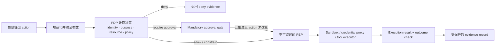
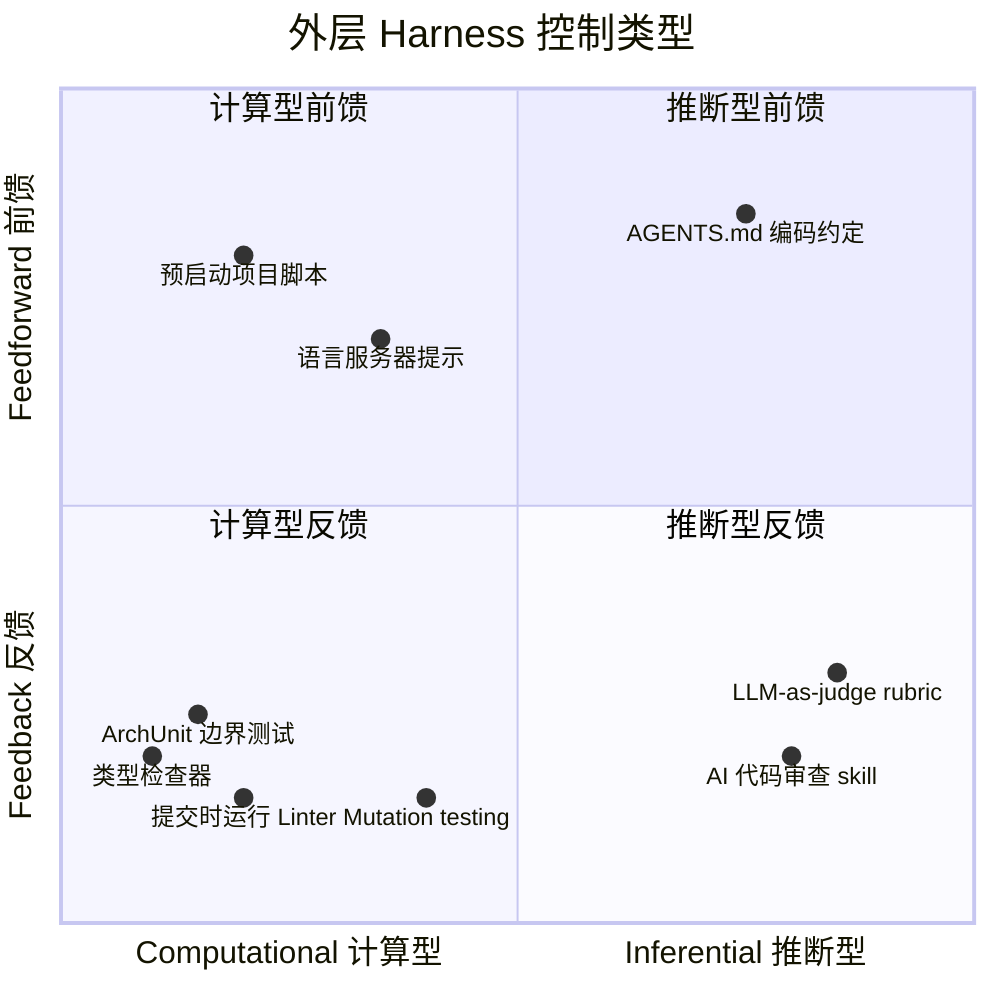

# 第 7 章：沙箱、护栏与运行时执行

### 7.1 Agent 安全威胁模型

本章主要讨论各种*缓解措施*，包括沙箱、hooks 和审批关卡。在介绍这些措施之前，必须先明确它们要防范什么。一个既能读取不可信内容、又能操作外部系统的 agent，面临以下几类特有风险 ([Anthropic - Beyond Permission Prompts](https://www.anthropic.com/engineering/claude-code-sandboxing))：

- **Prompt injection（提示注入）**（见《LLM Foundations》第 8 章 “Prompt Injection as Context Confusion”）——模型无法可靠地区分数据与指令。因此，agent 读取的网页、issue 评论、源文件或工具结果等不可信内容，都可能像命令一样影响它的行为。
- **数据外泄** — 一旦 agent 被操纵，只要它拥有网络访问权，就可能把 SSH key、API token 或专有源码等机密发送到攻击者控制的目的地。
- **破坏性操作** — 被操纵的 agent 如果拥有文件系统或 shell 访问权，就可能删除或损坏文件，也可能提交并推送有害代码。
- **工具与供应链风险** — 恶意或遭到入侵的 MCP server、软件包或依赖，可能引入敌对工具或指令，并诱使 agent 信任它们。

实践中最令人担忧的组合，有时被称为 *lethal trifecta*（致命三要素）：能够访问私有数据、会接触不可信内容，并且可以向外通信 ([Simon Willison - The lethal trifecta for AI agents](https://simonwillison.net/2025/Jun/16/the-lethal-trifecta/))。每项能力单独存在时尚可管理；如果同一个 agent 同时具备三项能力，一条注入指令就可能读取机密并将其发给攻击者。本章的大多数控制措施，都是通过切断其中一环来降低风险：网络隔离切断外部通信，文件系统隔离限制私有数据访问，审批关卡则让人类介入后果重大的操作。

贯穿本章的前提是：模型不是可信组件。它能力很强，却可能受到操纵；harness 的作用，就是在敌对指令和现实后果之间建立一道可执行的边界。

Anthropic 后续的 containment 工作从两个维度进一步细化了这一威胁模型 ([Anthropic - How We Contain Claude](https://www.anthropic.com/engineering/how-we-contain-claude))。从风险来源看，问题可能来自**滥用系统的用户**、**模型自身的异常行为**，也可能来自通过内容操纵模型的**外部攻击者**；从防御位置看，控制可以部署在**模型**、**执行环境**或**外部内容边界**上。这个矩阵之所以重要，是因为没有任何单层防御能覆盖所有风险来源：alignment 无法保证模型一定忽略提示注入，sandbox 也无法判断一封获准发送的邮件在语义上是否有害。生产环境中的 containment 必须在三个位置同时实施 defense in depth。

### 7.2 权限疲劳问题

完全无人监督的 coding agent 很危险，但每执行一步都要申请批准的 agent 同样无法实用。Anthropic 把后一种问题称为 approval fatigue：用户频繁点击 approve，不仅会拖慢开发循环，还会逐渐不再认真核对批准的内容，反而降低安全性 ([Anthropic - Beyond Permission Prompts](https://www.anthropic.com/engineering/claude-code-sandboxing))。解决办法不是增加更多弹窗，而是建立清晰的结构边界：agent 可以在边界内自由行动，只有越界时才请求权限。

Anthropic 的内部使用数据显示，在不降低安全性的前提下，沙箱把权限提示减少了 84% ([Anthropic - Beyond Permission Prompts](https://www.anthropic.com/engineering/claude-code-sandboxing))。

### 7.3 沙箱同时是笼子、重置按钮和许可证

OpenReview 综述指出，sandbox 的作用不止是保障安全。在 agent 系统中，沙箱同时承担三项任务 ([OpenReview - Agent Harness Engineering: A Survey](https://openreview.net/pdf?id=3hXEPbG0dh))：

- **Security**：限制不可预测的模型动作和 prompt injection 所造成的 blast radius。
- **Reproducibility**：为 eval、训练轨迹和长时间运行的 session 提供可重置的 baseline。容器或 microVM 可以销毁后重建，开发者工作站则不能。
- **Liveness**：划定 agent 可以自主行动的区域，使它不必在每次写文件、安装软件包或发起网络调用时都询问人类。

第三项作用尤其体现了 agent 系统的特点。沙箱不只是限制行为的笼子，也是允许行动的许可证。它把逐项询问权限改为按 session 配置权限，使长周期自治真正可用，同时避免陷入权限疲劳。

Containment 的强度应随任务风险提高。以下三种常见模式构成了一条实用的防护阶梯 ([Anthropic - How We Contain Claude](https://www.anthropic.com/engineering/how-we-contain-claude))：

- **临时容器（ephemeral container）**可随时丢弃，成本也较低，适合范围明确、且 agent 需要在较小 blast radius 内充分行动的任务。
- **Human-in-the-loop sandbox**适合交互式工作：安全操作可以自动执行，一旦跨越边界，任务就会暂停并请求审批。
- **密封虚拟机（sealed VM）**通过更强的 kernel 和网络边界隔离高风险 workload，但启动和运营成本也更高。

真正应该问的，不只是“是否使用了 sandbox”，而是“哪些资源仍然可以访问、哪些状态会在 reset 后保留、哪些权限能够跨越边界”。即使计算环境可以重置，也无法消除挂载在其中的 credential、写入环境外部的被投毒记忆，或能够传输私有数据的 egress 路径所带来的风险。

### 7.4 文件系统隔离必须与网络隔离配对

Claude Code 的沙箱同时建立文件系统和网络两类边界，Anthropic 认为缺一不可。文件系统隔离可以防止受到 prompt injection 的 agent 修改敏感文件，网络隔离则可以阻止它泄露数据或下载恶意软件。如果没有网络隔离，遭到入侵的 agent 可能外传 SSH key；如果没有文件系统隔离，它又可能逃出沙箱并获得网络访问能力 ([Anthropic - Beyond Permission Prompts](https://www.anthropic.com/engineering/claude-code-sandboxing))。

这一实现基于 OS 级 primitive，包括 Linux bubblewrap 和 macOS seatbelt；它不仅约束 Claude Code 的直接操作，也覆盖其启动的所有 subprocess。网络流量先通过 Unix domain socket 进入 proxy，再由 proxy 执行域名限制；agent 请求访问新域名时，也由 proxy 负责向用户确认。该 runtime 已经开源（[Anthropic - Beyond Permission Prompts](https://www.anthropic.com/engineering/claude-code-sandboxing)）。

Claude Code on the web 把这一设计扩展到云端沙箱。在那里，git credentials、signing keys 等敏感凭据从不与 agent 一同放入沙箱。Git 交互由自定义 proxy 处理，只有在确认操作符合权限要求后，proxy 才会附加 scoped credentials，例如确保 push 的目标是预先配置的分支（[Anthropic - How We Contain Claude](https://www.anthropic.com/engineering/how-we-contain-claude)）。

Egress allowlist 本质上是一种**能力授予**，而不是一份无害的目的地清单。允许访问 package registry，就意味着允许下载可执行代码；允许访问源码托管站点，也可能意味着允许发布内容；允许访问通用 Web endpoint，则可能补齐 lethal trifecta 中的数据外泄一环。因此，网络策略不能只判断域名，还应同时绑定目的地、协议、操作、身份和任务，并记录每条连接是由哪项规则授权的。

Containment 还必须在**建立信任之前**就生效。用户打开仓库时，系统可能在显示 trust dialog 之前，已经开始加载配置、发现依赖、启动 language server、运行 hooks 或创建本地 listener。因此，project-open 和 config-load 路径都应按敌对输入处理：可以只解析时就不要执行；关闭自动 hooks 和 listeners；在 workspace 被明确设为可信之前，不提供 credentials 和 egress ([Anthropic - How We Contain Claude](https://www.anthropic.com/engineering/how-we-contain-claude))。

### 7.5 身份、Policy 决策、执行与证据

沙箱边界必不可少，但仅有沙箱还不够。Runtime enforcement 还要回答：agent 代表谁、哪个 resource 与 action 在 scope 内、哪个 policy version 生效，以及执行后留下什么证据。NIST 把计算访问决策的组件称为 policy decision point（PDP），把针对受保护资源的请求落实该决策的组件称为 policy enforcement point（PEP）（[NIST - Zero Trust Architecture Glossary](https://pages.nist.gov/zero-trust-architecture/glossary.html)）。即使具体产品不使用这些名称，这种分离仍适合 agent action。

生产系统中有三项关键设计：

- **身份与 delegated authorization：**agent 应使用 scoped、短期 authority，而不是继承用户完整的 ambient credential。Credential broker 或 proxy 只在操作获准后、并且只针对预定 audience 附加 secret。
- **Policy decision：**PDP 可以综合 identity、tenant、purpose、tool、规范化参数、resource、session state、environment 和 risk。静态 allow/deny list 容易检查但粒度较粗；上下文 policy 只有在输入和版本被记录时才可追溯。
- **Policy enforcement：**dispatch 路径上的 PEP 负责落实 allow、deny、redact、constrain、stronger-sandbox 或 require-approval。Prompt 中的规则不是 PEP；agent 可以绕过的 hook 也不能提供硬保证。
- **证据：**记录 proposed action、identity、decision 与 policy version、必要的 approval、execution result 和 verified outcome。Trace 可以承载其中一部分证据，但只有满足完整性、integrity、retention、identity 和 access-control 要求的记录才能称为 audit record（[NIST - SP 800-53 Rev. 5，Audit and Accountability controls](https://csrc.nist.gov/pubs/sp/800/53/r5/upd1/final)）。

供应链攻击也在这里进入 harness 的治理范围。MCP tool poisoning、tool squatting、rug-pull update、幻觉包名和 retrieval-source poisoning，都跨越了 tool interface 与 governance 的边界。安全的 harness 必须检查工具、软件包、数据集和检索来源的 provenance 与 integrity；只在 prompt 中提醒一句“请小心”远远不够。

### 7.6 Advisory Hook 与 Blocking Enforcement

沙箱是一类程序化护栏，hooks 和 middleware 则可以添加更细粒度的行为。Claude Code 允许用户定义命令或脚本，并在 agent 启动、工具调用后、停止等生命周期事件上自动运行它们 ([HumanLayer - Skill Issue](https://www.humanlayer.dev/blog/skill-issue-harness-engineering-for-coding-agents))。LangChain 的 middleware 在结构上与此类似。有些 hook 是确定性脚本，另一些只会向模型注入建议。

自动运行并不等于每个 hook 都是 enforcement point。**Advisory hook** 可以发通知、补充上下文或要求模型重新考虑，但模型仍可能忽略它。**Blocking hook** 只有在所有相关动作都必经该处、deny 会阻止 dispatch、失败能够安全处理、而且 agent 没有其他路径访问受保护资源时，才可以支撑硬规则。区别取决于 placement 与 bypass resistance，而不只是 hook 是否由代码编写。

常见用途包括通知、自动批准或拒绝、系统集成和结果验证。例如，hook 可以在 agent 完成时播放声音，拒绝 migration 命令并要求用户手动执行，发送 Slack 消息或创建 PR，也可以在 agent 停止前运行 typecheck 和 build，把错误返回给 agent，要求它修复后才能结束。HumanLayer 的示例 hook 会在 Claude 每次尝试停止时并行运行 Biome 和 TypeScript；检查通过时静默退出，失败时只返回错误，并以 exit code 2 通知 harness 再次启动 agent。

LangChain 报告称，这类 middleware 是 deepagents-cli 在 Terminal-Bench 2.0 上从 Top 30 提升到 Top 5 的关键因素。`PreCompletionChecklistMiddleware` 会在 agent 退出前拦截它，提醒它按照任务 spec 验证结果；`LocalContextMiddleware` 会在启动时梳理工作目录和可用工具；`LoopDetectionMiddleware` 则记录每个文件的编辑次数，如果同一文件被编辑了 N 次，就提示 agent 重新审视当前方案。这样可以打断 “doom loop”，避免 agent 围绕一个已经失败的方法反复尝试细微变体 ([LangChain - Improving Deep Agents](https://blog.langchain.com/improving-deep-agents-with-harness-engineering/))。

综述中的 governance 分类把这些 hook 纳入一条更完整的执行管线：pre-invocation check 可以拒绝危险的工具调用；post-invocation hook 可以在不可信输出进入上下文之前添加 taint 标记或执行 redact；stop hook 可以要求完成验证；escalation hook 则可以把难以判断的情况交给人类。操作的后果越严重，安全性就越不应依赖模型是否记得某条指令（[OpenReview - Agent Harness Engineering: A Survey](https://openreview.net/pdf?id=3hXEPbG0dh)）。

### 7.7 Mandatory Approval 是 Runtime Gate

Agent 可以调用 `request_human_approval` 之类的工具，这是一种有用的 workflow suspend/resume 模式；但它不足以执行高风险 action，因为被操纵或判断错误的模型可能直接省略这次调用。对于受保护操作，dispatcher 或 PEP 必须识别规范化后的 action，并在执行前强制要求 approval record。MCP tools 规范同样把呈现工具确认、让人能够拒绝调用列为 client 的责任；确认发生在 invocation 周围，而不是因为模型自愿请求（[MCP - Tools Specification](https://modelcontextprotocol.io/specification/2025-06-18/server/tools)）。

Approval 应绑定 reviewer 实际看到的精确 action：agent 与 delegating identity、tenant、resource、规范化参数、policy version、风险解释、expiry 和执行限制。获得批准后，如果 material argument、destination、credential scope 或 policy version 发生变化，gate 必须重新评估新 action。这样可以避免 time-of-check/time-of-use 间隙：reviewer 批准的是无害提议，真正 dispatch 的却是另一项操作。

Retry 和 fallback 也必须经过同一 gate。先前批准不能授权已经改变的请求；先前 deny 也不能被转换成一条可以由模型说服绕过的 instruction。如果 run 等待期间 policy 发生变化，恢复时应重新作出决策，而不是沿用陈旧 authority。第 14 章继续讨论人工 review surface；第 19 章则把 policy administration 与分布式 PEP 放进 fleet 架构。

### 7.8 前馈与反馈：控制论视角

Thoughtworks 的 Birgitta Böckeler 从更高层次对这些控制进行了分类 ([Thoughtworks - Harness Engineering](https://martinfowler.com/articles/exploring-gen-ai/harness-engineering.html))。外层 harness 的控制可以分为两个方向：

- **Guides（前馈）** 在 agent 行动之前预判并引导其行为，目标是提高首次产出正确结果的概率。AGENTS.md、skills、参考文档和语言服务器提示都属于这一类。
- **Sensors（反馈）** 在 agent 行动之后观察结果，帮助它自行纠正错误。测试、linter、type checker 和 AI code review 都属于这一类。

如果 harness 只有前馈机制，它会不断发布规则，却无法判断规则是否奏效；如果只有反馈机制，它会反复发现同类错误，却无法提前避免这些错误。两者缺一不可。

这两个方向还可以沿另一条轴继续划分：

- **Computational** 控制，例如 linter、type checker 和结构测试，具有较强的确定性，通常可在毫秒到数秒内完成，结果也可靠。
- **Inferential** 控制，例如语义分析、AI code review 和 LLM-as-judge，能够处理细微判断，但速度更慢、成本更高，而且结果具有非确定性。

两条轴相互独立。AGENTS.md 中的编码约定属于 inferential feedforward；提交时检查模块边界的 ArchUnit 测试属于 computational feedback；`/code-review` skill 属于 inferential feedback；在启动前创建项目结构的脚本则属于 computational feedforward。设计良好的 harness 会组合使用这四类控制。

### 7.9 三类调节对象

Böckeler 还按照 harness 所调节的对象，把它们分成三类 ([Thoughtworks - Harness Engineering](https://martinfowler.com/articles/exploring-gen-ai/harness-engineering.html))：

- **Maintainability harness**：调节内部代码质量、重复、复杂度、覆盖率和风格。由于已有数十年的工具积累，这是最容易建设的一类。
- **Architecture fitness harness**：调节性能、可观测性和可调试性，覆盖应用中横跨多个模块的 “fitness functions”。
- **Behavior harness**：判断应用的功能行为是否符合预期。这一类问题尚未解决。如今，多数团队把功能 spec 用作前馈，把 AI 生成的测试用作反馈，有时再加入 mutation testing；Böckeler 坦率地指出，目前还不能充分信任 AI 生成的测试。

这套分类有助于评估 harness 的覆盖范围。一个在 maintainability 上很强、在 behavior 上却很弱的 harness，可能会给团队带来虚假的安全感。

### 7.10 时机：把质量左移

CI 的经验表明，问题发现得越早，修复成本就越低；同样的原则也适用于 harness 设计。速度快的 computational sensors，例如 linter 和快速测试，应在 commit 前运行；成本较高的 computational 与 inferential sensors，例如 mutation testing 和更全面的 code review，可以在 pipeline 中完成 integration 后运行；用于发现持续漂移的 sensors，例如死代码检测、依赖扫描和日志异常 judge，则应脱离单次变更的生命周期持续运行 ([Thoughtworks - Harness Engineering](https://martinfowler.com/articles/exploring-gen-ai/harness-engineering.html))。

Böckeler 指出，OpenAI Codex 团队的 harness 也采用了类似结构：用自定义 linter 和结构测试落实分层架构，再通过周期性的 “garbage collection” 扫描漂移，并让 agent 提出修复建议。

### 7.11 Harnessability、Agentic Readiness 与环境可供性

不同代码库搭建 harness 的难度并不相同。强类型语言天然提供 type-checking sensor；清晰的模块边界使架构约束可以转化为可执行规则；Spring 等 opinionated framework 则封装了许多细节，使 agent 不必自行处理 ([Thoughtworks - Harness Engineering](https://martinfowler.com/articles/exploring-gen-ai/harness-engineering.html))。

Böckeler 借用 Ned Letcher 提出的 *ambient affordances*（环境可供性）来概括这一点：环境本身具有某些属性，可以让 agent 更容易理解、导航和处理其中的系统 ([Thoughtworks - Harness Engineering](https://martinfowler.com/articles/exploring-gen-ai/harness-engineering.html))。Greenfield 团队可以从第一天起就有意识地设计这些 affordance；legacy 团队则面临相反的处境——最需要 harness 的地方，往往也最难建立 harness。

展望未来，Böckeler 提出了 *harness templates*：针对不同服务拓扑，把所需的 guides 和 sensors 打包在一起，例如 JVM CRUD service、Go event processor 或 Node dashboard，再随现有 service template 一同分发。她借助 Ashby 的必要变异度定律解释这一设想：调节器至少要拥有与被调节系统同等的变异度。由此可见，主动限制服务拓扑本身就在减少变异度，也让构建完整 harness 更容易实现 ([Thoughtworks - Harness Engineering](https://martinfowler.com/articles/exploring-gen-ai/harness-engineering.html))。

在生产环境中，一个更宽泛的概念是 **agentic readiness**：自治调用方能否安全地理解和调用系统，观察执行状态，在失败后重试，并在必要时撤销操作？某项服务对人类开发者可能很友好，但如果 API 隐藏副作用、错误信息含糊，或没有稳定的 operation ID，它对 agent 来说仍然很难使用。以下设计可以提高 readiness：

- mutation 接受 idempotency key，并提供可查询的 operation status；
- API 明确区分 read、propose、commit 和 compensate，而不是把这些阶段隐藏在一次不透明调用中；
- 把 machine identity 和 delegated authorization 作为一等概念；
- 错误信息说明失败位置、重试是否安全，以及哪些证据可以证明系统已经恢复；
- 状态变化应当可观察、可归因；如果无法真正 undo，则提供补偿操作。

这些设计就是自治软件所需的 ambient affordances。它们减少了必须由模型承担的概率性推理，也为第 19 章控制平面的 policy、lifecycle 和 audit evidence 提供了稳定的执行接口。

### 7.12 运营安全：熔断器、终止开关、预算与金丝雀

Sandbox、policy 和 enforcement point（第 7.3-7.7 节）约束 agent *可以*做什么。另一类控制则限制 agent 或工具在*运行时行为异常*所造成的后果。这些措施大多直接借鉴了分布式系统的可靠性工程和安全运营实践，也必须由周边系统执行——因为已经受到操纵或陷入循环的 agent，不能被指望自行约束行为。

- **熔断器（circuit breaker）。** 在不稳定或成本较高的依赖外加一层保护，例如工具、下游服务或子代理；失败次数达到阈值后，熔断器会跳闸，使后续调用立即失败，避免长时间挂起或形成重试风暴 ([Fowler - CircuitBreaker](https://martinfowler.com/bliki/CircuitBreaker.html))。对 agent 来说，这能限制持续报错的工具，或反复重试同一失败操作的 agent 所造成的爆炸半径。它与第 5 章的上下文策略相互补充：让一次仍可行动的失败保持可见，同时防止它无限重复。
- **终止开关（kill switch）。** 由人类或策略触发，能够立即停止一个 agent 或整个 fleet，并且不依赖 agent 自身的控制流。受到 prompt injection 的 agent 可能正在主动违背原有指令，因此终止开关必须存在于 harness 中，例如 supervisor 进程、可撤销凭证或 sandbox 拆除机制；不能只在 prompt 中写一句“收到要求时停止”。
- **动作预算、迭代上限与成本调节器。** 为工具调用次数、token、墙钟时间或花费设置硬性上限。达到上限后，循环必须停止并上报，而不能继续失控运行。这是第 13 章循环停止规则和第 18 章单任务预算在运营层面的实现：无界循环既会造成账单失控，也会让爆炸半径失控。
- **金丝雀令牌（canary token）。** 在受到 prompt injection 的 agent 可能读取或外泄的位置放置假机密，例如未使用的 API key、诱饵文件或陷阱 URL。金丝雀触发回调时，会发出一个高可信度警报，表明 agent 已被操纵去接触本不该访问的数据 ([Thinkst - Canarytokens](https://canarytokens.org/))。金丝雀与 sandbox 不同：它不会*阻止* lethal trifecta 中的数据外泄环节（第 7.1 节），而是负责*发现*这类行为。因此，当预防措施并不完美时，它可以成为最后一道检测防线。

本节遵循的原则与全章一致：失败后果越严重，就越不能依赖模型主动选择避开风险。预防措施，如 sandbox 和策略，应与检测措施，如金丝雀和第 18 章的漂移告警，配合使用；任何一类措施单独使用都不充分。

---

## 图：从提议到受控效果

*模型可以提出并解释 action；只有外部决策与执行路径才能授权 credential、跨越 sandbox 边界，或产生受保护的副作用。*

---

## 图：前馈/反馈 x 计算/推断

---

## 要点

- **先明确威胁模型**：当私有数据、不可信内容和外部通信组成“致命三要素”时，prompt injection、数据外泄、破坏性操作和供应链风险会尤其危险。
- **Anthropic 在内部 sandbox rollout 中报告权限提示减少了 84%**：这是带日期的 case study，不是通用缩减比例。
- **沙箱承担三项任务**：security、reproducibility 和 liveness。
- **文件系统与网络隔离必须配对**：二者对应不同攻击向量，单独使用都不足。
- **Containment 是一个矩阵，而不是单个 sandbox**：应同时在模型、环境和内容边界上防范用户滥用、模型异常与外部攻击，并根据风险选择临时容器、交互式 sandbox 或 sealed VM。
- **Egress 代表真实权限**：允许访问一个目的地，就赋予了 agent 一项实际能力，因此网络访问必须绑定操作、身份和任务；仅仅打开项目，不应自动获得 ambient trust。
- **决策与执行不同：**PDP 计算 policy，动作路径上不可绕过的 PEP 负责落实。
- **Policy 要求时 approval 必须强制执行：**模型主动调用 approval tool 是有用的编排方式，但不能成为唯一的高风险 gate。
- **Hook 的强度不同：**advisory hook 可以引导或通知；只有 blocking、不可绕过的 hook 才能执行硬规则。
- **Trace 不会自动成为 audit：**应在明确的 integrity 与 retention 要求下保存 identity、policy decision、approval、execution 和 outcome。
- **前馈与反馈都需要**：guide 没有 sensor 就没有学习回路；sensor 没有 guide 只能事后反应。
- **Harness 覆盖三类对象**：maintainability、architecture fitness 和 behavior，其中 behavior 仍然最难解决。
- **环境可供性很重要**：强类型语言和 opinionated framework 能降低搭建 harness 的难度。
- **Agentic readiness 是 API 的属性**：幂等性、明确的 operation status、machine identity、重试语义、可观察状态和补偿操作，都能让系统更适合自治调用方。
- **运行时安全还需要运营控制**：熔断器、终止开关、动作与成本预算、金丝雀令牌可以在异常发生时限制后果。它们必须存在于 harness 中，因为不能指望受到操纵的 agent 主动停止自己。

## 延伸阅读

- David Dworken and Oliver Weller-Davies, *Beyond Permission Prompts*, Anthropic, Oct 2025. https://www.anthropic.com/engineering/claude-code-sandboxing
- Birgitta Böckeler, *Harness Engineering for Coding Agent Users*, Thoughtworks / martinfowler.com, Apr 2026. https://martinfowler.com/articles/exploring-gen-ai/harness-engineering.html
- Kyle Brunet, *Skill Issue: Harness Engineering for Coding Agents*, HumanLayer, Mar 2026. https://www.humanlayer.dev/blog/skill-issue-harness-engineering-for-coding-agents
- Vivek Trivedy, *Improving Deep Agents with Harness Engineering*, LangChain, Feb 2026. https://blog.langchain.com/improving-deep-agents-with-harness-engineering/
- *Agent Harness Engineering: A Survey*, OpenReview / TMLR submission, 2026. https://openreview.net/pdf?id=3hXEPbG0dh
- Martin Fowler, *CircuitBreaker*, martinfowler.com, Mar 2014. https://martinfowler.com/bliki/CircuitBreaker.html
- Thinkst, *Canarytokens* (free tripwire tokens). https://canarytokens.org/
- Anthropic Safeguards Research Team, *How We Contain Claude*, Anthropic, May 2026. https://www.anthropic.com/engineering/how-we-contain-claude
- NIST，*Zero Trust Architecture Glossary*。https://pages.nist.gov/zero-trust-architecture/glossary.html
- NIST，*SP 800-53 Rev. 5: Security and Privacy Controls for Information Systems and Organizations*。https://csrc.nist.gov/pubs/sp/800/53/r5/upd1/final
- Model Context Protocol，*Tools Specification*，2025 年 6 月 18 日。https://modelcontextprotocol.io/specification/2025-06-18/server/tools
