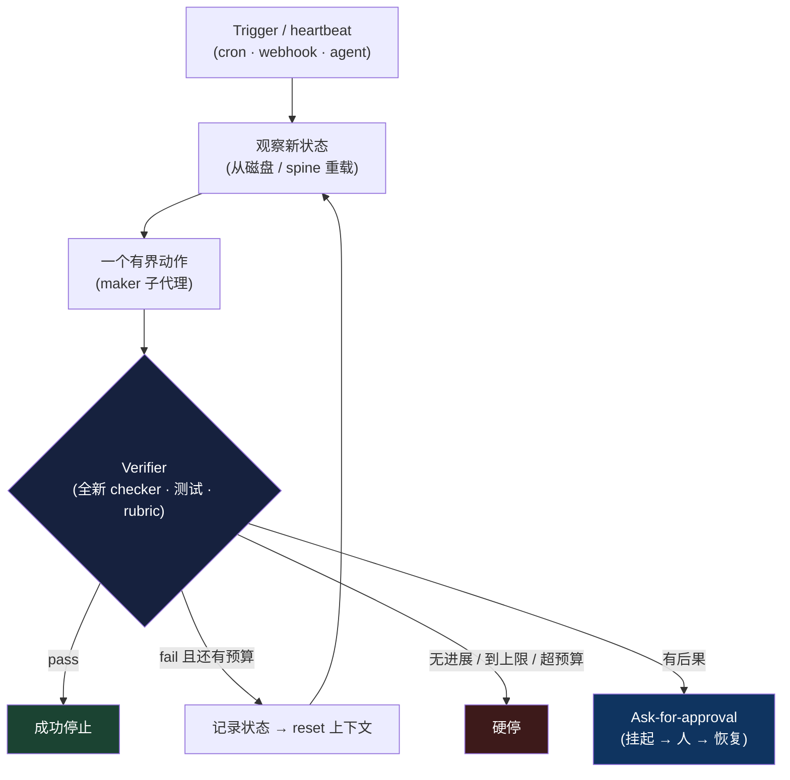

# 第 8 章：Loop Engineering（循环工程）

*Agent = Model + Harness。* 第 1 章介绍了每个 agent 的核心循环：组装上下文，让模型发出工具调用，由 harness 执行，将观察结果追加到上下文，然后重复。前面几章关注的是循环*内部*的各个组成部分：模型能看到什么、可以使用哪些工具、在哪里运行，以及如何跨 session 恢复。本章则把循环*本身*作为首要的工程单元，讨论什么会启动它、每轮执行什么、由谁检查结果，以及工作何时结束。2026 年，这种实践有了一个名字：*loop engineering*，以及一句口号：不要再逐次 prompt agent，而要构建那个负责 prompt agent 的系统。

### 8.1 从 Prompting 到 Looping

1.6 节梳理了从 prompt engineering 到 context engineering，再到更广义的 harness engineering 这一演进过程。Loop engineering 是这条路径上的下一步，也让这种转变在实践中变得更加具体。Addy Osmani 在 2026 年 6 月的文章《Loop Engineering》中为这一模式命名，描述了它的典型结构，并引入了许多如今广为使用的术语 ([Addy Osmani — Loop Engineering](https://addyosmani.com/blog/loop-engineering/))。同一周，Peter Steinberger 将这个观点浓缩成一句一天内触达数百万人的话：你不应再逐次 prompt coding agent，而应设计那些负责 prompt agent 的 loop ([O'Reilly Radar — Loop Engineering](https://www.oreilly.com/radar/loop-engineering/))。Claude Code 的构建者 Boris Cherny 则给出了更直白的实践者版本：他不再逐轮 prompt 模型，他的工作是编写驱动模型的 loop ([The New Stack — Loop Engineering](https://thenewstack.io/loop-engineering/))。

这种视角转换听起来不大，影响却很深。在 prompt engineering 中，人始终*位于*循环内部：推进每一步，并判断每个结果。Loop engineering 将人移出这个位置，并提出一个更难的问题：如果现场没有人决定下一步做什么，也没有人判断工作是否足够好，那么应由*什么机制*来作出这些决定？本章其余内容都在回答这个问题。底层机制仍然是第 1 章介绍的 agent loop，变化的是关注重点：不再只看模型的单个回合，而是看周围那个在更长周期内调度、验证和约束 agent 的控制结构。这正是 harness 的职责所在。Loop engineering 与 harness engineering 关注的是紧密相关的工作，但前者采用的是运维者视角，重点在*外*层循环。

### 8.2 Loop 就是带检查的任务

那份实践指南给出了一个很实用的定义：loop 就是带检查的任务；没有检查的任务，只能寄希望于结果碰巧正确 ([The Agentic Loop — A Practical Field Guide](https://dev.to/truongpx396/the-agentic-loop-a-practical-field-guide-mnc))。展开来说，一个结构良好的 loop 每轮包含四步：观察当前状态，采取一个有边界的动作，依据固定标准检查结果，然后决定继续还是停止。这个结构揭示了四个设计杠杆。Loop engineering 的主要工作，就是清楚地定义它们：

- **Trigger（触发器）**——什么会启动一轮执行：人给出的目标、schedule、webhook，或另一个 agent。
- **Topology（拓扑）**——loop 如何嵌套和交接：是由单个 agent 执行，由 maker 与 checker 配合，还是由 orchestrator 管理多个 worker。
- **Verifier（验证器）**——以什么固定标准判断“足够好”，以及由谁执行检查。
- **Stop rules（停止规则）**——loop 在什么明确条件下成功、放弃或请求帮助。

其中任何一项没有明确规定，失败模式都可以预见。没有 trigger，loop 就只是一段对话；没有 verifier，它可能把错误结果判为成功；没有 stop rule，它可能一直运行下去，直到耗尽预算。本章余下部分将依次讨论这些杠杆。

### 8.3 Trigger 与嵌套 Loop

Trigger 让 agent 从一个需要按需调用的工具，变成能够自行运行的系统。Osmani 将它称为 *heartbeat（心跳）*：一种无需人类 prompt 就能唤醒 loop 的 schedule 或事件 ([Addy Osmani — Loop Engineering](https://addyosmani.com/blog/loop-engineering/))。从这一步开始，coding agent 就不再只是编辑器，而成为需要纳入运维的系统：cron 可以每晚启动它，webhook 可以在新 issue 到来时启动它，监督 agent 也可以将它作为子任务发起。

Andrew Ng 指出，这些 loop 会彼此嵌套，每层都有不同的负责人和时间尺度。这为理解 loop 的拓扑提供了一张实用的地图 ([Andrew Ng — The Batch, 2026 年 6 月](https://www.deeplearning.ai/the-batch/))：

- **Agentic coding loop** 以分钟计：给定 spec 和 evals 后，agent 编写代码、运行测试并持续迭代，直到满足 spec；各轮之间不需要人介入。
- **Developer feedback loop** 以小时计：开发者检查已经完成的工作，并指导 agent 接下来做什么。
- **External feedback loop** 以天计：alpha 测试、A/B 测试和生产环境信号揭示产品在实际使用中的表现。

Loop engineering 会最大限度地自动化内层 loop，而人类判断在外层 loop 中仍然不可替代。这是因为人具备 agent 所缺少的*上下文优势*：人知道工作的真实意图，也理解产品最终要解决什么问题。在 Ng 的例子中，一个 coding agent 无人值守地工作了约一小时，期间多次在浏览器中检查自己的成果，之后才返回请求进一步指导。设计目标是让每层 loop 尽可能长时间地有效运行；只有当它需要更广泛的上下文时，才将控制权交给上一层。

### 8.4 Verifier 是瓶颈

在四个杠杆中，verifier 最值得投入精力，因为它决定了无人值守运行能否做到安全。第 7 章从另一个角度讨论过同一问题：agent 往往会对自己的工作作出过于正面的判断，因此，将产出工作结果的 agent 与评估结果的 agent 分开，是一项重要的安全措施。Loop engineering 将这一观察提升为设计原则：maker 不能同时担任 checker ([Loop Engineering Crash Course](https://agentfactory.panaversity.org/docs/loop-engineering-crash-course))。独立的 reviewer agent 应拿到 spec 而不是 diff，并被要求以怀疑的态度审查结果。这样，它才有机会发现 generator 可能自行合理化并忽略的问题。因此，7.4 节的 generator–evaluator 拆分和第 6 章的 evaluator-optimizer 工作流不再只是实用技巧，而是决定 loop 能否安全独立运行的关键。

社区里的一句口号概括了这种重心转移：编写 verifier，就是新的 prompt engineering ([The Agentic Loop — A Practical Field Guide](https://dev.to/truongpx396/the-agentic-loop-a-practical-field-guide-mnc))。真正困难而有价值的工作，不再只是组织请求的措辞，而是把“完成”定义得足够精确，让机器能够识别。由此可以区分两类 loop：

- **Closed loop（闭环）** 预先将验收标准设为明确、可检查的通过条件，例如测试全部通过、schema 校验成功或截图匹配。它的预算可预测，适合无人值守运行。
- **Open loop（开环）** 面向不够精确的目标进行探索。它更需要强有力的 verifier，因为缺少 verifier 时，它不会以明显的方式失败，反而可能反复、自信地产出看似合理却并不正确的结果。

在任务允许的范围内，验证应尽量采用机械、确定性的方式。优先使用测试、类型检查、schema 校验和浏览器断言；只有无法确定性检查的属性，才交给 LLM-as-judge。这对应第 5 章“计算型先于推断型”的排序，也对应第 10 章的 grader 分类。更可靠的做法是使用一个*全新*的模型，让它不了解工作结果的生成过程，从而减少继承 maker 盲点的可能。

### 8.5 Stop Rule 与三项硬限制

能够自行启动的 loop，也必须能够自行停止，而且停止原因不能只有“成功”。每个结构良好的 loop 都需要明确处理四种结果：success、no-op（没有剩余工作）、ask-for-approval，以及 blocked-or-exhausted（受阻或资源耗尽）。此外，还需要三项不可缺少的硬限制，用来约束失控的执行过程 ([The Agentic Loop — A Practical Field Guide](https://dev.to/truongpx396/the-agentic-loop-a-practical-field-guide-mnc))：

1. **最大迭代次数**——设置硬上限，例如“测试全部通过，或最多执行六轮，以先达到的条件为准”。
2. **无进展检测**——如果连续 N 轮没有产生可测量的变化，就停止执行，而不是继续空转。
3. **预算上限**——设置 token 或金额上限；达到上限后，loop 停止并请求指示。

这些限制就是从 loop 内部观察第 17 章所说的 per-task budget。它们在这里尤其重要，因为现场没有人能够及时发现执行过程正在空转。失败并非理论风险：Uber 的一个团队曾因某个无人值守系统在四个月内耗尽全年 AI 预算，之后将 agent 的支出上限设为每月 \$1,500 ([AI Builder Club — Loop Engineering Guide](https://www.aibuilderclub.com/blog/loop-engineering-guide-2026))。Ask-for-approval 则构成了通往第 15 章的桥梁：将升级请求建模为工具调用后，loop 可以挂起，把决定交给人类，并在人类回应后从 event log 恢复。这仍是同一种持久化 approval 模式，只是现在成为 loop 遇到重大决策时的指定出口。

### 8.6 Ralph 谱系

Loop engineering 并非突然出现，而是这个领域自 2022 年以来逐步演进的最新阶段 ([The Agentic Loop — A Practical Field Guide](https://dev.to/truongpx396/the-agentic-loop-a-practical-field-guide-mnc))：

- **ReAct**（2022）确立了 reason–act–observe 的基本循环，也就是第 1 章所说的 agent loop ([Yao et al. — ReAct](https://arxiv.org/abs/2210.03629))。
- **AutoGPT**（2023）使 loop 能够围绕目标自主运行，同时也暴露了这门工程学科如今着力防范的问题：没有 verifier 和 stop rule 的 loop，可能无限运行或偏离目标。
- **“Ralph Wiggum” loop**（2025）加入了 7.5 节介绍的关键修正：每次迭代都从干净的 context window 开始，将状态保存在磁盘文件而不是不断膨胀的历史中，并重新注入目标，让 agent 始终围绕目标工作。
- **可验证完成命令**（2026），例如由独立 validator 模型决定能否退出的 `/goal`，将 stop rule 变成一项由机器检查的一等步骤，而不再依赖 agent 对自身工作的判断。
- **Orchestration**（当前）让 loop 可以监督其他 loop：它们由系统调度，以 git 为持久化基础，并在 Ng 所描述的嵌套时间尺度之间上下交接工作。

这个演进过程通过两个观点与本书其余内容相连。第一，Ralph 的 reset 解释了为什么*记忆应保存在磁盘，而不是上下文中*（第 2–3 章）：每轮都会 reset 的 loop 必须从文件重新加载状态，这正是那几章所介绍的结构化笔记和反复复述模式。第二，可验证完成解释了为什么 *event log 至关重要*（第 9 章）：当 loop 状态存储在追加式 log 中时，loop 才能停止、恢复和重放，这些能力使长周期自治变得可调试。

### 8.7 Loop 的组成

Osmani 总结了持久化 loop 的组成部分。每一部分都对应前文介绍过的一项能力 ([Addy Osmani — Loop Engineering](https://addyosmani.com/blog/loop-engineering/))：

- **Heartbeat**——触发一轮执行的 schedule 或事件（8.3 节）。
- **Worktrees**——彼此隔离的工作目录，避免并行执行相互冲突；其基础是第 5 章介绍的 sandbox 隔离。
- **Skills**——可复用、以文件为载体、编写一次并按需加载的项目知识，也就是第 4 章的 `SKILL.md` 模式。
- **Connectors**——连接工作所依赖的实际工具，包括 MCP server 和插件（第 4 章）。
- **Sub-agents**——分别担任 maker 和 checker 的 agent（8.4 节、第 3 章）。
- **Spine（主干状态）**——能够跨多次运行持续存在，并在 reset 之间保存 loop 记忆的状态文件（第 2–3 章，以及 7.6 节的结构化 handoff）。

Loop 的效果取决于它所操作的代码库。因此，实践者提出，仓库在适合 loop 工作之前需要具备三项属性 ([AI Builder Club — Loop Engineering Guide](https://www.aibuilderclub.com/blog/loop-engineering-guide-2026))。第一是**清晰易读（legible）**：精简的 `AGENTS.md` 索引和定制 lint 应让 agent 了解代码库的组织方式，以及哪些内容不能修改。第二是**可执行（executable）**：dev server 应能以接近零 token 的成本启动，并支持并行 worktree。第三是**可验证（verifiable）**：end-to-end 测试和浏览器驱动检查应覆盖核心流程，为 8.4 节的 verifier 提供可机械判定的依据。这些都属于第 5 章所说的*环境赋能条件（ambient affordances）*；对于自治工作，它们是前提，而非锦上添花。

### 8.8 成熟度阶梯与无人值守的风险

由于 loop 会通过重复执行不断放大自身行为，采用过程应当分阶段推进。社区提出的成熟度阶梯要求一次只提升一个级别，并且只有当当前级别已经能够可靠完成原本需要人工处理的工作时，才进入下一级 ([The Agentic Loop — A Practical Field Guide](https://dev.to/truongpx396/the-agentic-loop-a-practical-field-guide-mnc))：

0. **Manual（手动）**——每一轮都由你发出 prompt。
1. **Triage（分诊）**——loop 将发现写入 markdown 文件，但不作任何修改。
2. **Draft（草稿）**——loop 在隔离分支中进行修复。
3. **Verified PR（已验证 PR）**——先由独立 verifier 检查变更，再交给人 review。
4. **Auto-merge（自动合并）**——只留给低风险类别。

Loop engineering 并没有消除困难，只是改变了困难所在的位置。速度既会放大成果，也会放大错误：无人值守的 loop 同样会在无人值守时犯错，而且它提交代码的速度可能超过人类审查代码的速度。由此会积累*comprehension debt（理解债）*，使代码库的所有者逐渐无法完全理解其中的实现 ([The New Stack — Loop Engineering](https://thenewstack.io/loop-engineering/))。因此，人类仍需在两个不可替代的端点承担责任：定义什么结果算“好”的*意图*，以及对最终发布内容承担的*所有权* ([Loop Engineering Crash Course](https://agentfactory.panaversity.org/docs/loop-engineering-crash-course))。这给出了一条实用的范围规则：结构化 loop 适合*重复、无人值守、定时触发且后果重要*的工作。如果你本来就在交互式地观察 agent，那么人的判断已经构成检查机制，普通对话通常更合适。为一次性任务过度设计 loop，本身也是一种失败模式。

### 8.9 超越单个 Loop：控制与 Evaluator Integrity

对于单个自治任务，loop engineering 是恰当的设计单元。然而，生产系统最终会在不同身份、版本、预算和策略下运行许多 loop。达到这种规模后，下一个需要设计的对象是**控制平面（control plane）**：负责注册 agent、授予权限、调度和撤销运行、记录 lineage 并治理整个 fleet 的系统。第 18 章将详细讨论这一层。

Verifier 本身同样需要治理。即使 checker 与 maker 分开，它仍可能因为知道判断会带来什么后果而产生偏差，也可能与 maker 具有相同的盲点，或被其他系统针对其判定规则进行优化。因此，第 10 章将 **evaluator integrity**——盲评、确定性证据、校准、弃权和审计——作为独立于“设置 verifier”的另一项问题。只有检查机制本身值得信任时，一个 engineered loop 才真正形成闭环。

---

## 图示：被工程化的 loop

---

## 本章要点

- **Loop engineering 是从外层循环看 harness engineering**：不要逐轮 prompt agent，而要设计负责 prompt agent 的系统，并规定由什么机制判断工作已经足够好。
- **Loop 是带检查的任务**：观察 → 执行一个有边界的动作 → 依据固定标准验证 → 继续或停止。没有检查的任务，只能寄希望于结果碰巧正确。
- **四个杠杆定义一个 loop**：trigger、topology、verifier 和 stop rules。其中任何一项没有明确规定，都会产生可预见的失败模式。
- **Loop 会彼此嵌套**：agentic coding 以分钟计，developer feedback 以小时计，external feedback 以天计。自动化内层 loop，同时保留外层 loop 中的人类判断。
- **Verifier 是瓶颈**：编写 verifier 就是新的 prompt engineering。Maker 不能同时担任 checker；薄弱的检查机制可能在没有明显报错的情况下接受看似自信却不正确的工作。
- **Stop rule 不可缺少**：设置最大迭代次数、无进展检测和预算上限，因为现场没有人能够及时发现失控的执行过程。
- **Ralph 谱系展示了模式的演进**：ReAct → AutoGPT → 干净上下文 reset → 可验证完成 → orchestration。记忆保存在磁盘，状态记录在 event log 中。
- **成熟度应逐级提升**：从 triage 到 draft，再到 auto-merge，并且只将更高自治级别用于重复、无人值守且后果重要的工作。无人值守的速度会同时放大错误和理解债。
- **单个 loop 之后的下一个设计单元是 fleet**：身份、生命周期、策略、lineage 和撤销属于控制平面；verifier 的可信度则属于评测系统。

## 延伸阅读

- Addy Osmani, *Loop Engineering*, addyosmani.com, 2026 年 6 月。https://addyosmani.com/blog/loop-engineering/
- *Loop Engineering*, O'Reilly Radar, 2026。https://www.oreilly.com/radar/loop-engineering/
- Andrew Ng, *Three Loops for Building 0-to-1 AI Products*, The Batch, 2026 年 6 月。https://www.deeplearning.ai/the-batch/
- *The Anthropic leader who built Claude Code ditched prompting — now he writes loops*, The New Stack, 2026。https://thenewstack.io/loop-engineering/
- *The Agentic Loop: A Practical Field Guide*, DEV Community, 2026。https://dev.to/truongpx396/the-agentic-loop-a-practical-field-guide-mnc
- *Loop Engineering Guide (2026)*, AI Builder Club。https://www.aibuilderclub.com/blog/loop-engineering-guide-2026
- Shunyu Yao et al., *ReAct: Synergizing Reasoning and Acting in Language Models*, arXiv, 2022 年 10 月。https://arxiv.org/abs/2210.03629
