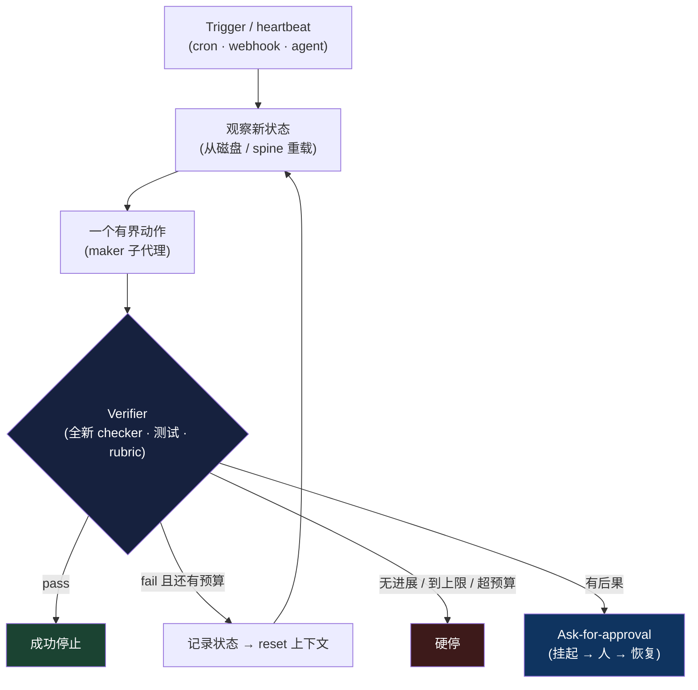

# 第 8 章：Loop Engineering（循环工程）

*Agent = Model + Harness。* 第 1 章把 agent loop 介绍为每个 agent 中心的那个循环——组装上下文、模型发出工具调用、harness 执行、把观察追加回去、重复。前面几章工程化的是这个循环的*内部*：模型看到什么、有哪些工具、在哪里运行、如何跨 session 恢复。本章讲的是把这个循环*本身*当作首要的工作单元去工程化——决定什么启动它、每一趟做什么、谁检查结果、何时停止。2026 年，这个实践有了名字：*loop engineering*，以及一句口号：别再 prompt 那个 agent，去构建那个 prompt 它的系统。

### 8.1 从 Prompting 到 Looping

1.6 节勾勒了一条脉络——prompt engineering 让位于 context engineering，而后者又位于 harness engineering 之下。Loop engineering 是同一条路上的下一站，也是让这个转变对实践者变得具体的那一站。Addy Osmani 在 2026 年 6 月的文章《Loop Engineering》中给这个模式命了名，提供了它的经典解剖和如今流传的词汇 ([Addy Osmani — Loop Engineering](https://addyosmani.com/blog/loop-engineering/))。同一周，Peter Steinberger 把它压缩成一句话，一天之内触达数百万人：你不该再 prompt coding agent 了，你该设计那些 prompt 你的 agent 的 loop ([O'Reilly Radar — Loop Engineering](https://www.oreilly.com/radar/loop-engineering/))。构建了 Claude Code 的 Boris Cherny 给出了实践者版本的直白说法：他不再一回合一回合地 prompt 模型——他的工作是写驱动它的 loop ([The New Stack — Loop Engineering](https://thenewstack.io/loop-engineering/))。

这个重构很小，却是承重的。在 prompt engineering 里，人*在*循环内，每一步之间按回车、评判每个结果。Loop engineering 把人从这个内部位置移出，并提出一个更难的问题：如果你不在场去决定工作是否够好、下一步做什么，那么*什么*来决定？本章的一切都是对这个问题的回答。相对第 1 章的机制，这里没有任何新东西——还是那个 agent loop——但重心从模型的回合转向了它周围的控制结构，而那正是 harness 的地盘。Loop engineering 和 harness engineering 是紧密相关工作的两个名字；loop engineering 是运维者的说法，聚焦在那个跨长周期调度、验证并约束 agent 的*外*层循环上。

### 8.2 一个 loop 就是带 check 的 task

那本 field guide 的一句话定义是恰当的锚点：一个 loop 就是带 check 的 task，而不带 check 的 task 只是一厢情愿 ([The Agentic Loop — A Practical Field Guide](https://dev.to/truongpx396/the-agentic-loop-a-practical-field-guide-mnc))。展开来说，一个良构 loop 的一趟是：观察当前状态、采取一个有界动作、把结果对照一个固定标准做检查、决定继续还是停止。这个结构暴露出四个设计杠杆，而 loop engineering 在很大程度上就是把它们规定好的工作：

- **Trigger（触发器）**——什么启动一趟：一个人给的目标、一个 schedule、一个 webhook，或另一个 agent。
- **Topology（拓扑）**——loop 如何嵌套与交接：单个 agent、一个 maker 加一个 checker，或一个 orchestrator 管一群 worker。
- **Verifier（验证器）**——决定“够好了”的那个固定标准，以及由谁来施加它。
- **Stop rules（停止规则）**——loop 成功、放弃或求助的明确条件。

任一个留空，失败都是可预测的。没有 trigger，loop 只是一次对话。没有 verifier，它会在垃圾上宣布胜利。没有 stop rule，它会永远跑下去——或者跑到账单来为止。本章余下部分依次处理这四个杠杆。

### 8.3 Trigger 与嵌套的 loop

Trigger 是把一个 agent 从“你去调用它”提升为“它自己会跑”的那个东西。Osmani 的解剖把它叫作 *heartbeat（心跳）*——一个无需人类 prompt 就唤醒 loop 的 schedule 或事件 ([Addy Osmani — Loop Engineering](https://addyosmani.com/blog/loop-engineering/))。正是在这里，coding agent 从一个编辑器变成一个运维关切：cron 每晚触发它、webhook 在新 issue 上触发它，或一个监督 agent 把它作为子任务触发。

Andrew Ng 通过观察这些 loop 会嵌套、且各有不同的 owner 和时间尺度，给出了这个拓扑最清晰的地图 ([Andrew Ng — The Batch, 2026 年 6 月](https://www.deeplearning.ai/the-batch/))：

- **Agentic coding loop** 以分钟计：给定一份 spec 和一些 evals，agent 写代码、测试、迭代，直到满足 spec——回合之间没有人。
- **Developer feedback loop** 以小时计：一个人检视已构建的东西，把 agent 引向下一步该做什么。
- **External feedback loop** 以天计：alpha 测试者、A/B 测试、生产信号。

内层 loop 是 loop engineering 自动化得最激进的那一个；外层 loop 则是人类判断保持不可替代的地方，因为人握有 agent 缺乏的*上下文优势*——对意图、对产品到底为何而做的了解。Ng 自己的例子：一个 coding agent 无人值守地工作了约一个小时，其间在浏览器里检查了好几次自己做的东西，然后才回来要方向。设计目标就是让每个 loop 在必须上交给下一层之前，尽可能长地高效运行。

### 8.4 Verifier 才是瓶颈

四个杠杆里，verifier 是 loop engineering 投入精力最集中的地方，因为它是让无人值守运行变得安全的东西。第 7 章从另一个方向确立了那条头号结论：agent 对自己的工作偏正面，所以把做工作的 agent 和评判它的 agent 分开是一个强杠杆。Loop engineering 把这个观察提升为一条设计法则——maker 不能是 checker ([Loop Engineering Crash Course](https://agentfactory.panaversity.org/docs/loop-engineering-crash-course))。一个独立的 reviewer agent，拿到的是 spec 而非 diff，并被要求带着怀疑，能抓住 generator 自圆其说糊弄过去的东西。这就是 7.4 节的 generator–evaluator 拆分和第 6 章的 evaluator-optimizer 工作流，从一种技术被提升为决定这个 loop 能不能被放手的那个东西。

社区的口号点出了杠杆的转移：写 verifier 是新的 prompt engineering ([The Agentic Loop — A Practical Field Guide](https://dev.to/truongpx396/the-agentic-loop-a-practical-field-guide-mnc))。稀缺、有价值的动作不再是措辞请求，而是把“done”定义得足够精确，好让机器能检查它。由此引出一个有用的区分：

- **Closed loop（闭环）** 预先把验收标准钉成硬的、可检查的通过项——测试全绿、schema 校验通过、截图匹配。它在可预测的预算上运行，放着跑是安全的。
- **Open loop（开环）** 朝一个模糊目标松散地探索。它需要一个更强的 verifier，因为没有它，它不会大声失败——它会成功地、自信地、成百上千次地产出看似合理的垃圾。

Verifier 应尽任务所允许地机械：一个测试、一次类型检查、一次 schema 校验、一个浏览器断言，最后才是对无法确定性检查之物用 LLM-as-judge——这就是第 5 章的“计算型先于推断型”排序，以及第 10 章的 grader 分类。最强的形态是用一个*全新*的模型，它对工作是如何产出的毫无记忆，因而不会继承 maker 的盲点。

### 8.5 Stop rule 与三个硬停

一个能自己启动的 loop，也必须能自己停下——且理由不止“成功”。每个良构 loop 都需要明确的停止条件——success、no-op（没剩下什么可做）、ask-for-approval、blocked-or-exhausted（受阻或耗尽）——其中三个是用来兜住失控的、不可商量的硬停 ([The Agentic Loop — A Practical Field Guide](https://dev.to/truongpx396/the-agentic-loop-a-practical-field-guide-mnc))：

1. **最大迭代次数**——一个硬上限，比如“测试全绿，或六轮，先到先算”。
2. **无进展检测**——若 N 趟都没产生可测量的变化，就停下，而不是空转。
3. **预算上限**——一个 token 或美元上限，越过它 loop 就停下来问。

这就是从 loop 内部看到的第 17 章的 per-task budget，而它在这里承重的原因是：人已经不在场去注意那种空转。失败模式是具体的：Uber 的一个团队把 agent 花费上限设为每月 \$1,500，此前一个无人值守的设置在四个月里烧光了它的年度 AI 预算 ([AI Builder Club — Loop Engineering Guide](https://www.aibuilderclub.com/blog/loop-engineering-guide-2026))。Ask-for-approval 这个停是通往第 15 章的桥：把升级建模为一次工具调用，能让 loop 挂起、把一个决定交给人、并在人回应时从 event log 恢复——同一个持久 approval 模式，如今成了 loop 面对任何有后果之事的指定出口。

### 8.6 Ralph 谱系

Loop engineering 不是凭空冒出来的；它是这个领域自 2022 年以来一直在爬的那把梯子的当前一级 ([The Agentic Loop — A Practical Field Guide](https://dev.to/truongpx396/the-agentic-loop-a-practical-field-guide-mnc))：

- **ReAct**（2022）确立了 reason–act–observe 的基本循环，也就是第 1 章所说的 agent loop ([Yao et al. — ReAct](https://arxiv.org/abs/2210.03629))。
- **AutoGPT**（2023）让它变得目标驱动、自主——并暴露了这门学科如今所防范的那个失败：一个没有 verifier、没有 stop rule 的 loop，会永远跑下去或跑偏。
- **“Ralph Wiggum” loop**（2025）加入了 7.5 节所见的关键修法：每次迭代 reset 到干净的 context window，把状态锚在磁盘上的文件里而非膨胀的历史里，并重新注入目标，逼 agent 持续对照它工作。
- **可验证完成命令**（2026），例如把退出交给一个独立 validator 模型把关的 `/goal`，把 stop rule 变成一等的、机器检查的步骤，而不是 agent 自己的意见。
- **Orchestration**（当前）让 loop 监督 loop——被调度、以 git 为后盾，在 Ng 的嵌套时间尺度间上下交接工作。

有两条主线把这个谱系和本书其余部分连起来。Ralph 的 reset 正是*记忆活在磁盘上、而非上下文里*（第 2–3 章）的原因：一个每趟都 reset 的 loop，必须从文件重新加载状态，而那正是那几章所规定的结构化笔记和反复复述。可验证完成正是*event log 之所以重要*（第 9 章）的原因：一个状态是追加式 log 的 loop，能停止、恢复、被重放，而这正是让长周期自治可调试的东西。

### 8.7 一个 loop 由什么构成

Osmani 的解剖列出了一个持久 loop 装配起来的各个部件，而每一个都对应到前面各章已经建好的一项能力 ([Addy Osmani — Loop Engineering](https://addyosmani.com/blog/loop-engineering/))：

- **Heartbeat**——触发一趟的 schedule 或事件（8.3 节）。
- **Worktrees**——隔离的工作目录，让并行的趟不相撞，借用第 5 章的 sandbox 隔离。
- **Skills**——可复用、由文件支撑、写一次并按需加载的项目知识，即第 4 章的 `SKILL.md` 模式。
- **Connectors**——触达工作所依赖的真实工具的 MCP server 和插件（第 4 章）。
- **Sub-agents**——作为分开角色的 maker 和 checker（8.4 节、第 3 章）。
- **Spine（脊柱）**——一个在多次运行间存活、跨 reset 携带 loop 记忆的持久状态文件（第 2–3 章，以及 7.6 节的结构化 handoff）。

Loop 的好坏，取决于它所对着跑的那个代码库，这也是为什么实践者描述一个仓库要“loop-ready”需具备的三项属性 ([AI Builder Club — Loop Engineering Guide](https://www.aibuilderclub.com/blog/loop-engineering-guide-2026))。它必须**可读（legible）**——一份精简的 `AGENTS.md` 索引和定制 lint，让 agent 知道代码的形状以及什么不该碰。它必须**可执行（executable）**——一个以接近零 token 成本起来、并容忍并行 worktree 的 dev server。它还必须**可验证（verifiable）**——对核心流程的 end-to-end 测试和浏览器驱动检查，好让 8.4 节的 verifier 有机械可断言之物。这些就是第 5 章的*ambient affordances*，如今是自治的前提，而不再是锦上添花。

### 8.8 成熟度阶梯与无人值守的风险

因为 loop 会把它做的一切复利放大，采用应当分级。社区的成熟度阶梯一次只爬一级，且只在当前一级已经产出你本来会亲手做的工作时才往上爬 ([The Agentic Loop — A Practical Field Guide](https://dev.to/truongpx396/the-agentic-loop-a-practical-field-guide-mnc))：

0. **Manual（手动）**——你每回合都 prompt。
1. **Triage（分诊）**——loop 把发现写进一个 markdown 文件，什么都不改。
2. **Draft（草稿）**——它在隔离分支上做修复。
3. **Verified PR（已验证 PR）**——一个独立 verifier 在人 review 之前先把关。
4. **Auto-merge（自动合并）**——只留给低风险类别。

这份纪律之所以存在，是因为 loop engineering 并没有消除那个难题；它只是把它挪了位置。速度把成与败一起复利放大：一个无人值守跑着的 loop，也是一个无人值守犯错的 loop，而它 ship 代码可以比人读代码更快，从而累积*comprehension debt（理解债）*——一个其主人不再完全理解的代码库 ([The New Stack — Loop Engineering](https://thenewstack.io/loop-engineering/))。验证与问责仍归人所有，在两个不可约的端点上：定义什么叫“好”的那个*意图*，以及对 ship 出去之物的*所有权* ([Loop Engineering Crash Course](https://agentfactory.panaversity.org/docs/loop-engineering-crash-course))。由此得到一条界定范围的规则：只对那些*重复、无人值守、被调度、有后果*的工作动用结构化 loop。对任何你正交互式盯着看的东西，check 就是你自己的眼睛，一次普通对话是更好的工具——为一次性任务过度工程化一个 loop，本身就是一种失败模式。

---

## 图示：被工程化的 loop

---

## 本章要点

- **Loop engineering 是 harness engineering 的外层循环视角**：别再一回合一回合地 prompt agent，去设计那个 prompt 它的系统，并规定由什么来决定工作何时够好。
- **一个 loop 就是带 check 的 task**：观察 → 一个有界动作 → 对照固定标准验证 → 决定继续或停止。不带 check 的 task 只是一厢情愿。
- **四个杠杆定义一个 loop**：trigger、topology、verifier、stop rules。任一个留空，失败都可预测。
- **loop 会嵌套**：agentic coding 以分钟计、developer feedback 以小时计、external feedback 以天计——自动化内层，把人类判断留在外层。
- **verifier 才是瓶颈**：写它是新的 prompt engineering，maker 不能是 checker，弱 check 会以 ship 出自信的垃圾这种方式无声失败。
- **stop rule 是必需的**：最大迭代次数、无进展检测、预算上限——因为没有人在场去注意失控。
- **Ralph 谱系是它的血统**：ReAct → AutoGPT → 干净上下文 reset → 可验证完成 → orchestration；记忆活在磁盘上，状态活在 event log 里。
- **慢慢爬成熟度阶梯**：triage 先于 draft、draft 先于 auto-merge，且只用于重复、无人值守、有后果的工作——无人值守的速度会把错误和理解债一起复利放大。

## 延伸阅读

- Addy Osmani, *Loop Engineering*, addyosmani.com, 2026 年 6 月。https://addyosmani.com/blog/loop-engineering/
- *Loop Engineering*, O'Reilly Radar, 2026。https://www.oreilly.com/radar/loop-engineering/
- Andrew Ng, *Three Loops for Building 0-to-1 AI Products*, The Batch, 2026 年 6 月。https://www.deeplearning.ai/the-batch/
- *The Anthropic leader who built Claude Code ditched prompting — now he writes loops*, The New Stack, 2026。https://thenewstack.io/loop-engineering/
- *The Agentic Loop: A Practical Field Guide*, DEV Community, 2026。https://dev.to/truongpx396/the-agentic-loop-a-practical-field-guide-mnc
- *Loop Engineering Guide (2026)*, AI Builder Club。https://www.aibuilderclub.com/blog/loop-engineering-guide-2026
- Shunyu Yao et al., *ReAct: Synergizing Reasoning and Acting in Language Models*, arXiv, 2022 年 10 月。https://arxiv.org/abs/2210.03629
