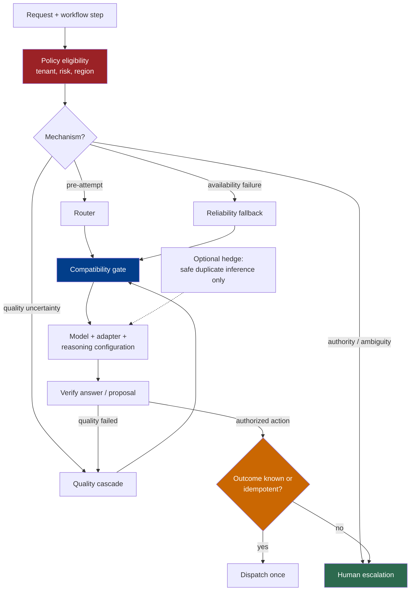

# 第 8 章：模型选择、路由与推理预算

*Agent = Model + Harness。* 模型选择属于 harness configuration，但“把它发送给另一个模型”并不是一种单一操作。Router、quality cascade、reliability fallback、hedged request 与 human escalation 解决的是不同问题，也有不同的 correctness conditions。

本章只有在目标配置能够履行当前调用的 input、output、tool、state、policy 与 data-handling contracts 时，才把一次 route 视为安全。姊妹卷 *LLM Foundations* 解释模型行为；本章负责运行层面的选择与切换。

### 8.1 选择 Model-Plus-Harness Configuration

选择单位通常是一次 model call 或 workflow step，而不是整个 application。如果 evaluation 表明较小配置仍能保持所需 outcome，一个 loop 可以把 planning 交给能力较强的模型，把范围明确的 classification 或 extraction 交给较小模型。Anthropic 同样建议采用能够成功的最简单 workflow，只在 model-driven complexity 产生可测价值时才增加它（[Anthropic — Building Effective Agents](https://www.anthropic.com/engineering/building-effective-agents)）。

被选中的对象不只是 model ID：

```text
RouteTarget {
  provider, model_snapshot, endpoint,
  modalities, context_and_output_limits,
  tool_protocol, tool_schemas,
  structured_output_contract,
  reasoning_configuration,
  policy_profile, data_region,
  timeout, price_schedule
}
```

例如，OpenAI model catalog 会按 model 发布 context window、maximum output、modalities、tools、function calling 与 structured-output support 等 capability，而不是把它们视为某种通用 API model 的属性（[OpenAI — Models](https://developers.openai.com/api/docs/models)）。Deployment 必须固定实际验证过的 capability snapshot；即使 application code 没有变化，可变的 provider alias 也可能发生变化。

Per-call selection 有一个重要例外：stateful assistant turn 或 tool-use continuation 可能把多次 API call 绑定到同一个 provider-specific protocol。除非 harness 有明确的 translation 或 restart strategy，否则在中途切换并不安全。第 8.5 节会回到这条 reasoning-state boundary。

### 8.2 五种不同的 Routing Mechanism

不要用 *routing* 统称所有模型切换。

| Mechanism | Decision point | Purpose | Required signal |
|---|---|---|---|
| **Router** | Attempt 之前 | 为 request 或 step 匹配合适 target | 执行前可获得的 features，以及经过评测的 routing policy |
| **Quality cascade** | 一次较便宜的 attempt 之后 | 首次结果未达到质量门槛时升级 | 能够接受或拒绝该结果的 verifier |
| **Reliability fallback** | Infrastructure 或 availability failure 之后 | 在兼容 target 上继续提供服务 | Failure classification 与预先验证的 fallback target |
| **Hedging** | 并发执行或短暂延迟后执行 | 让等价 attempts 竞速，以降低 tail latency | 可安全重复的 operation、winner rule 与 loser cancellation |
| **Human escalation** | Automated attempt 之前或之后 | 把 ambiguity、authority 或 high-impact judgment 移交给人 | Stop condition、review package 与 durable wait/resume path |

RouteLLM 是 learned pre-execution router 的一个研究案例：它使用 preference data 训练，在强弱模型之间做选择，并在自己的 benchmark suite 上评测 cost-quality tradeoff（[Ong et al. — RouteLLM](https://arxiv.org/abs/2406.18665)）。它测得的节省属于那套 router、model pair、prices 与 evaluation set，并不能保证 difficulty routing 会在另一个 workload 上获得收益。

FrugalGPT 是 quality cascade 的一个研究案例：它评估某个 service 首先给出的答案，再有条件地升级到另一个 service，并在所研究的数据集上执行 budget-constrained optimization（[Chen et al. — FrugalGPT](https://arxiv.org/abs/2305.05176)）。没有可靠 acceptance signal 的 cascade 只是一条更慢的 route；schema validity 本身既不能证明 semantic correctness，也不能证明 task success。

Hedging 不是 fallback。*The Tail at Scale* 描述了在大型 online services 中通过发送 redundant requests 降低 tail latency，并把额外工作作为这种方法的代价（[Dean and Barroso — The Tail at Scale](https://research.google/pubs/the-tail-at-scale/)）。在 agent system 中，只有当重复 attempts 均符合 policy，且不会各自造成 external side effects 时，才可以 hedge model generation。Harness 只能选择一份结果，并阻止 losing proposals 进入 tool dispatch。

Human escalation 不是“更强的 model tier”。当缺少的是 authorization、responsibility、domain judgment 或 clarification，而不是更多 inference compute 时，应当使用它。Workflow 必须在等待时保存 state，并向 reviewer 展示相关 evidence、proposed action、uncertainty 与 alternatives。

### 8.3 Fallback 之前必须满足 Compatibility

Fallback target 只有在通过当前调用的 compatibility gate 后才具备资格。应测试精确的 model snapshot、endpoint 与 harness adapter；provider family 和“OpenAI-compatible”transport 都不能证明 semantic equivalence。

| Dimension | Compatibility question | Failure if ignored |
|---|---|---|
| **Modalities** | Target 能否接收每种 input type，并以要求的 fidelity 产生所需 output type？ | Image、audio、file 或 tool result 被丢弃或错误转换。 |
| **Context and output limits** | 序列化 input、预留 reasoning/output budget、tool schemas 与预期 result 是否都能放入限制？ | Truncation、request 被拒绝或缺少 final output。 |
| **Tool protocol and schema** | Target 是否支持相同的 call/result protocol、parallelism、tool-choice modes、schema subset 与 call-ID continuation？ | Invalid call、丢失 correlation 或 dispatch behavior 改变。 |
| **Structured output** | Target 是否强制执行所需 schema，以及约定的 refusal/error representation？ | Downstream code 接收到 prose 或另一种 failure shape。 |
| **Reasoning and continuation state** | Provider-specific reasoning items、signatures、response IDs 与尚未完成的 tool turn 能否继续，或者能否被有意重启？ | Request 被拒绝，或者 continuation 悄悄丢失先前工作。 |
| **Safety and policy** | Target 是否获准用于该 tenant、risk class、content、tool set 与 action scope，harness 是否统一处理 refusal？ | Fallback 绕过 model allowlist 或改变 policy behavior。 |
| **Data region and retention** | Endpoint、model、tools、storage、processing region、retention mode 与 subprocessors 是否都获得许可？ | Route 违反 residency 或 data-handling requirements。 |

Capability difference 是具体的 API fact，并非理论边界情况：model catalog 会公开不同的 modality、tool、structured-output 与 context support（[OpenAI — Models](https://developers.openai.com/api/docs/models)）。Data-region support 也可能随 endpoint、model、tool、storage 与 processing mode 变化；例如 OpenAI data-control 文档会区分 regional storage 与 regional processing，并按 service 列出 eligibility（[OpenAI — Data Controls](https://developers.openai.com/api/docs/guides/your-data#data-residency-controls)）。应把 provider 当前文档当作 compatibility registry 的输入，而不是 local contract tests 的替代品。

Latency、price、capacity 与 rate limits 属于 selection constraints，而不是 semantic compatibility。一个 target 可以兼容，却对 request 的 service tier 而言太慢或太贵。反过来，如果 fast target 无法履行 output 或 policy contract，它就没有资格被选中。

为已知 targets 预先计算 compatibility graph，再在 dispatch 时重新检查 request-specific values：实际 token count、attached modalities、selected tools、tenant policy、data region 与 provider 当前状态。失败时应关闭到另一个 eligible route 或 human escalation；不能为让 target 接受调用而悄悄剥离 unsupported input。

### 8.4 Fallback 与 Retry 必须尊重 Side Effect

Model call 提出 output；第 6 章的 dispatcher 决定是否执行 external action。Retry 是低风险还是危险，取决于是否越过这条边界。

重试前先对 attempt 分类：

1. **尚未提出 action：** retry 或 fallback 可能重复 inference cost，但不会重复 external effect。
2. **已提出 action，但尚未 dispatch：** 丢弃旧 proposal，重新 route，并对新 proposal 正常执行 authorization。
3. **Dispatch outcome 已知：** 记录 outcome；只有 tool 文档中的 semantics 允许时才 retry。
4. **Dispatch outcome 未知：** 在决定 repeat、compensate 或 escalate 之前，先通过 action key 或 idempotency key 查询 target system。

HTTP Semantics 规定，除非 client 已知 request semantics 确实具有 idempotency，或者可以判断 original request 没有被应用，否则不应自动 retry non-idempotent request（[RFC 9110 §9.2.2](https://www.rfc-editor.org/rfc/rfc9110.html#section-9.2.2)）。即使 tool transport 不是 HTTP，agent retry 也需要同样的纪律。

对于 side-effecting action，使用能跨越 model fallback、gateway retry、worker restart 与 timeout 的稳定 action ID 或 idempotency key。在 dispatch 前持久化 proposed operation，并把 external resource ID 或 outcome 与之一起保存。如果 target system 既不提供 idempotency，也不提供 status lookup，ambiguous timeout 就属于 human-review 或 compensation case，而不是再次调用 action 的许可。

Retry 不会仅仅因为第一次 attempt 获准，就自动继承 authorization。当 identity、resource state、action arguments、policy version、route target 或 approval validity 发生变化时，应重新评估 policy。Fallback 也不能把 refusal、deny 或 mandatory approval 重新解释成 infrastructure error。

### 8.5 Reasoning Budget 是 Provider-Specific Control

Reasoning effort 是一条有用的 routing axis，但并不存在名为“一个 reasoning token”或“high effort”的跨 provider 通用单位。每个 provider 都会定义自己的 parameters、token accounting、supported models、continuation objects，以及它们与 tools 和 caching 的交互。

OpenAI 当前文档按 model 定义 `reasoning.effort` levels，并通过 `reasoning.context` 与 response continuation 管理 persisted reasoning；其指南要求在 representative workloads 上比较不同设置，而不是假设最高 level 一定最佳（[OpenAI — Model Guidance](https://developers.openai.com/api/docs/guides/latest-model)）。Anthropic 则按 model 记录 manual/adaptive thinking mode、`budget_tokens` 或 effort controls，以及 tool-use continuation 中保留 thinking blocks 的规则（[Anthropic — Extended Thinking](https://platform.claude.com/docs/en/build-with-claude/extended-thinking)）。这是两套不同的 API contracts，而不是同一个通用 control 的两种拼写。

Harness 应暴露 provider-neutral objective，例如：

```text
ReasoningPolicy {
  quality_tier,
  max_end_to_end_latency,
  max_call_cost,
  allow_persisted_reasoning,
  data_handling_profile
}
```

Provider adapter 把这个 objective 映射到受支持 parameters，并记录 resolved settings 与 usage。不能只按名称把 `high` 翻译成 `high`。应在同一 task slice 上校准每个 provider/model configuration。

Reasoning state 同样属于 compatibility。Anthropic 要求某些 tool-use continuation 完整、原样传回 thinking blocks；OpenAI 则通过 provider-specific response items 与 IDs 记录 continuation（[Anthropic — Extended Thinking](https://platform.claude.com/docs/en/build-with-claude/extended-thinking)；[OpenAI — Model Guidance](https://developers.openai.com/api/docs/guides/latest-model)）。Harness 不能把一个 provider 的 opaque state 序列化进另一个 provider 的 protocol，就把它称为 continuation。系统必须留在原 target，从 explicit context summary 与 durable tool outcomes 重启，或者使用拥有独立 eval 的 translation。

Visible 或 summarized reasoning 不是 verifier。Provider 可能省略或总结 internal reasoning，返回的 representation 也只属于各自的 API contract（[Anthropic — Extended Thinking](https://platform.claude.com/docs/en/build-with-claude/extended-thinking)）。应当评判 answer、evidence、tool outcomes 与 environment state。

### 8.6 先应用 Policy，再优化 Cost

Routing 是 constrained optimization problem。首先确定 eligible set，然后才在集合内进行优化。

Eligibility 可能取决于：

- tenant 与 user entitlements；
- approved provider、model snapshot 与 endpoint；
- data classification、storage/processing region 与 retention mode；
- 所需 safety 或 domain policy profile；
- allowed modalities、hosted tools 与 third-party subprocessors；
- action risk、approval status 与当前 incident controls。

Eligible set 之外的 cheap route 并不是节省。Provider data-residency 文档表明，eligibility 为什么必须覆盖完整 request path：regional storage 不一定意味着 regional processing，third-party tools 也可能有各自的 policy（[OpenAI — Data Controls](https://developers.openai.com/api/docs/guides/your-data#data-residency-controls)）。

为每次 routing decision 记录 policy version 与 eligibility result。如果 provider error 后不存在 eligible automated target，应返回显式 fail-closed result 或 human escalation，而不是继续落到未经批准的 default。

### 8.7 评测 Routing System，而不只是各个 Model

Routing policy 即使让每个 candidate 单独看都很好，也可能因为选错 candidate 而失败。应评测完整的 model-plus-harness configurations、router decisions、escalation signals 与 failure handling。Anthropic 的 evaluation 指南会区分 task、trial、grader、transcript、outcome、agent harness 与 evaluation harness；这种区分有助于把 routing failure 归因到 decision，而不只是 selected model（[Anthropic — Demystifying Evals for AI Agents](https://www.anthropic.com/engineering/demystifying-evals-for-ai-agents)）。

使用 representative slices，而不是一个混合平均数：

| Slice | What to measure |
|---|---|
| **Quality** | Task success、required evidence、verifier false accept/reject，以及 easy/hard 与 domain cohorts |
| **Cost** | 每个 successful outcome 的 input、output、reasoning、cache、tool、hedge 与 escalation cost |
| **Latency** | Queue、router、provider、tool、verifier 与 end-to-end p50/p95/p99；各阶段 timeout |
| **Failure class** | Rate limit、timeout、transport error、context overflow、schema failure、refusal、tool mismatch、ambiguous side effect |
| **Policy** | Ineligible-route rate、region/retention/model-allowlist violations，以及 approval 与 tenant-isolation tests |
| **Routing behavior** | Route distribution、misroutes、cascade escalation rate、fallback success、hedge win/cancel rate、human escalation rate |

在 router eval 中，同时标注代价较高的 false escalation，以及更严重的 false economy：被发送给 cheap target、最终却违反 task 或 policy 的 cases。在 cascade eval 中，独立评估 first answer，避免 weak verifier 让 cascade 显得高效。在 fallback test 中，注入每类 failure 并断言哪些 transition 合法。在 hedging test 中，统计 duplicate tokens，并验证 losing outputs 无法 dispatch action。

在 trial manifest 中固定 model snapshots、adapters、prompts、tools、policy versions、prices 与 regional endpoints。Current price 应作为带日期的 configuration data 报告，而不是 model family 的永久属性。只有 quality、cost、latency、failure 与 policy slices 全部满足 gate，一条 route 才算 ready。

### 8.8 AI Gateway 是部署位置选项，而不是架构角色

AI gateway 可以集中 provider adapters、credentials、quotas、routing、retries、telemetry，有时也会承载 policy checks。它可以是有用的 implementation location，但产品名称并不会让它自动成为 control plane 或 policy enforcement point。

Kubernetes 用 *control plane* 指管理整个 cluster overall state 的 components，并把它们与运行 workloads 的 node components 区分开来（[Kubernetes — Components](https://kubernetes.io/docs/concepts/overview/components/)）。在本书中，fleet control plane 同样负责跨多个 agents 管理 desired configuration、identity、policy administration/decisions、versions 与 lifecycle。即使另有 control service 对 gateway 进行配置，位于同步 model-call path 上的 gateway 通常仍是 data-path component。

NIST 按 function 定义 policy enforcement point（PEP）：subject 请求 protected resource 时，它负责强制执行 access-policy decision（[NIST — Zero Trust Glossary](https://pages.nist.gov/zero-trust-architecture/glossary.html)）。Gateway 只有在不可绕过的路径上实际执行某项 decision 时，才是该 decision 的 PEP。记录 policy result、增加 guardrail callback 或托管 routing logic，本身并不会使 gateway 成为 tool execution、file access 或 downstream side effects 的 PEP。

集中化也会带来 correlated risk。围绕 gateway 设置明确 timeout 与 circuit breaker，保留 end-to-end call/action IDs，并保证 gateway retry 与 application retry 使用同一套 idempotency/outcome rules。把 route policy 保存为 versioned configuration，并在脱离具体 gateway product 的情况下独立测试它。

### 8.9 把每次 Route Change 当作一次 Release

Model upgrade、provider swap、reasoning-setting change、新的 cascade verifier、region change 或 gateway policy edit，都会改变 model-plus-harness configuration。应使用与代码相同的 eval 与 rollback discipline 发布它们。

只有在 data policy 允许，而且 duplicate request 不可能触发 action 时，才使用 shadow traffic。在有边界的流量上 canary eligible configuration，比较第 8.7 节中的 slices，并在 trace 中保留 route target 与 decision reason。Alias 便于 provider update，但如果 provider 暴露 resolved model snapshot，production reproducibility 就要求将其记录下来。

Rollback 同样受 compatibility gate 约束。较旧 target 可能已经无法支持新的 tool schema、output contract 或 policy requirement。“Last known good”应指相对于当前 harness contract 的 last known good，而不只是以前部署过的 model ID。

---

## 图：经过 Policy 与 Compatibility Gate 的 Route



---

## 要点

- **选择 configuration，而不是 model name：** endpoint、modalities、limits、tools、output contract、reasoning state、policy 与 region 必须一起迁移。
- **明确 mechanism 名称：** router、quality cascade、reliability fallback、hedging 与 human escalation 各有不同 trigger 与 proof。
- **Compatibility 先于 fallback：** 绝不能仅仅为了让 backup target 接受调用，就剥离 input、tool、state 或 policy requirement。
- **Retry 不等于重复 side effect：** 再次 dispatch 前使用稳定 action ID、idempotency 与 outcome verification。
- **Reasoning control 依赖 provider：** 通过经过测试的 adapter 映射中立的 quality/latency/cost objective；opaque continuation state 通常不可移植。
- **Policy 定义 eligible set：** 只能在 tenant、risk、data path 与 action 允许的 targets 中优化 cost 与 latency。
- **把 routing 当作系统评测：** 分别切分 quality、cost、latency、failure class、policy 与 routing behavior。
- **Gateway 不自动等于 control plane 或 PEP：** 应按它实际承担的 management 与 enforcement function 分类。

## 延伸阅读

- Erik Schluntz and Barry Zhang, *Building Effective Agents*, Anthropic, Dec 2024. https://www.anthropic.com/engineering/building-effective-agents
- Isaac Ong et al., *RouteLLM: Learning to Route LLMs with Preference Data*, 2024. https://arxiv.org/abs/2406.18665
- Lingjiao Chen, Matei Zaharia, and James Zou, *FrugalGPT: How to Use Large Language Models While Reducing Cost and Improving Performance*, 2023. https://arxiv.org/abs/2305.05176
- Jeffrey Dean and Luiz André Barroso, *The Tail at Scale*, 2013. https://research.google/pubs/the-tail-at-scale/
- OpenAI, *Models*. https://developers.openai.com/api/docs/models
- OpenAI, *Model Guidance*. https://developers.openai.com/api/docs/guides/latest-model
- Anthropic, *Extended Thinking*. https://platform.claude.com/docs/en/build-with-claude/extended-thinking
- IETF, *RFC 9110: HTTP Semantics*, §9.2.2. https://www.rfc-editor.org/rfc/rfc9110.html#section-9.2.2
- OpenAI, *Data Controls in the OpenAI Platform*. https://developers.openai.com/api/docs/guides/your-data#data-residency-controls
- Anthropic, *Demystifying Evals for AI Agents*. https://www.anthropic.com/engineering/demystifying-evals-for-ai-agents
- Kubernetes, *Kubernetes Components*. https://kubernetes.io/docs/concepts/overview/components/
- NIST, *Zero Trust Glossary*. https://pages.nist.gov/zero-trust-architecture/glossary.html
