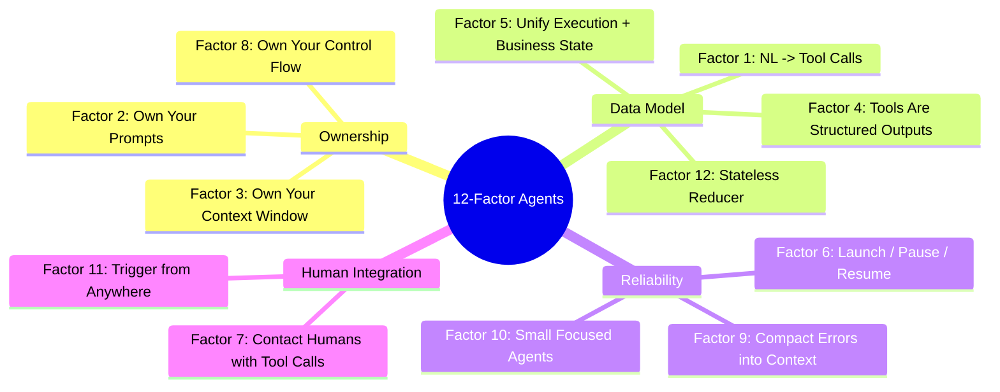

# 第 8 章：生产级 Agent 的十二要素

前几章讨论了单个 harness 技术：上下文管理、工具、沙箱、工作流和长运行 handoff。HumanLayer 的 “12 Factor Agents” 更适合作为一张生产 checklist，把这些技术重新连接到普通软件架构。它借用了经典 Twelve-Factor App 的命名风格，但要素本身针对 LLM agent。

HumanLayer 的 “12 Factor Agents” 是宣言，而不是完整参考架构。十二条原则来自许多生产部署 ([HumanLayer - 12-Factor Agents](https://www.humanlayer.dev/blog/12-factor-agents))：

1. **Natural Language to Tool Calls**：原子模式是把用户自然语言转换成结构化 JSON call，再由确定性代码执行。
2. **Own Your Prompts**：不要把 prompt engineering 外包给 framework 黑箱。把 prompt 当作一等代码，使其可测试、可评估、可调优。
3. **Own Your Context Window**：标准 message format 只是一个选择；把 history 压进单个 XML-tagged event log 也是选择。目标是最大信息密度、最小 token。
4. **Tools Are Just Structured Outputs**：工具调用就是模型输出 JSON，命名意图与参数。确定性代码决定如何执行。
5. **Unify Execution State and Business State**：不要把“当前步骤/下一步骤/retry count”与“对话中发生了什么”分开。应从单一 event log 推导执行状态。
6. **Launch / Pause / Resume with Simple APIs**：agent 是程序，应支持标准 lifecycle，包括在工具选择和执行之间暂停。
7. **Contact Humans with Tool Calls**：不要依赖模型选择普通文本还是结构化输出；给它明确的 `request_human_input` 工具，并带 urgency、format、choices 等结构化选项。
8. **Own Your Control Flow**：接管 loop，用于审批中断、总结工具结果、对输出运行 LLM-as-judge、管理记忆、记录 trace、限流、durable sleep。
9. **Compact Errors into Context Window**：让错误可见才能 self-heal；用连续错误计数器在阈值后升级给人类。
10. **Small, Focused Agents**：把单个 agent 范围控制在 3-10 步，最多也许 20 步。上下文越大，性能越差。
11. **Trigger from Anywhere**：允许从 Slack、email、SMS、webhook、cron 启动。结合 factor 7，可以形成 *outer loop*：由事件启动的 agent，在关键点联系人类求助。
12. **Make Your Agent a Stateless Reducer**：agent 是对 events 的 fold。纯、可序列化、可重放。

贯穿这些要素的深层主张是：“好的 agent 至少不是‘给你一个 prompt、一袋工具，循环直到目标完成’这种模式。它们大多只是软件” ([HumanLayer - 12-Factor Agents](https://www.humanlayer.dev/blog/12-factor-agents))。这些要素基本是把软件工程卫生应用到一个有状态、非确定性的组件上。它们不应被当成普遍法则：研究原型、本地 coding assistant、受监管客服 agent 会需要不同权衡。真正有用的方向是：让状态显式、让控制流可检查、把人类交互放在结构化接口后面。

---

## 图：按主题分组的十二要素

---

## 要点

- **“大多只是软件”**：好的 agent 是带有非确定性 LLM 组件的确定性程序，而不是一袋工具循环到完成。
- **Own your prompts**：framework 会隐藏 prompt；prompt 应作为一等代码纳入版本控制。
- **Stateless reducer 模式**：把 agent 看作对 event log 的 fold，使其可序列化、可重放、可测试。
- **小而聚焦的 agent**：每个 agent 3-20 步；上下文越长，性能越差。
- **用工具联系人类**：结构化 `request_human_input` 工具优于依赖模型自由文本选择。
- **压缩错误，不要隐藏错误**：可见错误 trace 支持 self-healing，连续错误计数器提供安全升级路径。

## 延伸阅读

- Dex Horthy, *12-Factor Agents*, HumanLayer, Apr 2025. https://www.humanlayer.dev/blog/12-factor-agents
- Kyle Brunet, *Skill Issue: Harness Engineering for Coding Agents*, HumanLayer, Mar 2026. https://www.humanlayer.dev/blog/skill-issue-harness-engineering-for-coding-agents
- Erik Schluntz and Barry Zhang, *Building Effective Agents*, Anthropic, Dec 2024. https://www.anthropic.com/engineering/building-effective-agents
