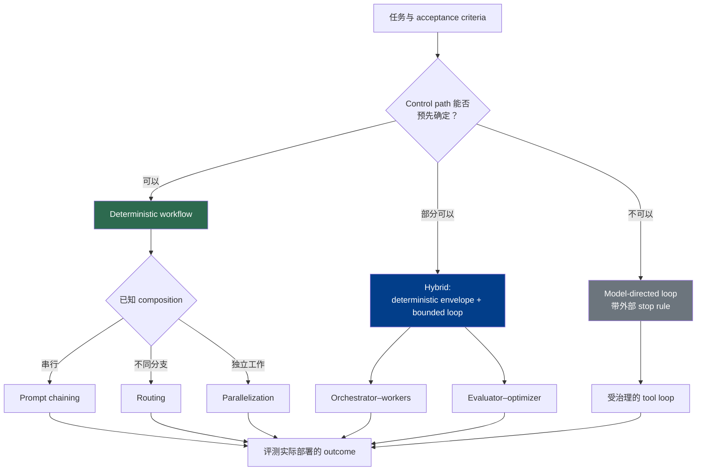

# 第 9 章：Agentic 工作流模式

Workflow pattern 描述系统如何排列模型调用、工具、检查和状态转换。它们不会改变第 6 章建立的责任边界：模型可以提出内容、route、任务分解或下一步动作，而 harness 或 runtime 负责验证 proposal、执行经过授权的 effect、记录状态，并返回 observation。对于由 client 执行的工具，Anthropic 的 API contract 同样要求模型发出 tool-use request，再由应用代码执行（[Anthropic — How Tool Use Works](https://platform.claude.com/docs/en/agents-and-tools/tool-use/how-tool-use-works)）。

本章比较 control-flow shape。第 10 章负责 durable execution state 与 event history，第 11 章负责 system evaluation，第 13 章展开 verifier hierarchy。仅靠一张 workflow diagram 无法获得其中任何一种能力。

### 9.1 三种控制形态

Anthropic 把 **workflow** 定义为沿预设代码路径调用模型和工具，把 **agent** 定义为由模型动态决定 process 和 tool use，并建议从能够满足需求的最简单架构开始（[Anthropic — Building Effective Agents](https://www.anthropic.com/engineering/building-effective-agents)）。落到实现上，更准确的做法是区分三种形态：

| 形态 | 谁选择下一步？ | 谁执行并持有状态？ | 最适合的任务 |
|---|---|---|---|
| **Deterministic workflow（确定性工作流）** | 代码选择预定义 transition；模型可以填充某个 node 的输出 | Workflow controller/runtime | 分支和检查可以预先确定的稳定流程 |
| **Model-directed loop（模型引导循环）** | 模型根据当前 observation 提出下一步 action | Harness 负责验证和 dispatch；runtime 持有 budget、status 和 stop rule | 下一步有效动作无法预先可靠枚举的开放任务 |
| **Hybrid workflow（混合工作流）** | 代码固定外层 graph，模型在有限 node 或 loop 中进行选择 | 外层 controller 保持权威；内层循环具有明确 budget 和 handoff contract | 同时需要可预测边界与局部灵活性的生产任务 |

*Augmented LLM* 是 Anthropic 对接入 retrieval、tool 和 memory 的模型所用的术语；它可以出现在上述任何一种形态中（[Anthropic — Building Effective Agents](https://www.anthropic.com/engineering/building-effective-agents)）。在一个 node 中加入模型，不会让 deterministic workflow 自动变成 autonomous agent。反过来，允许模型选择 action，也不意味着向它授予 credential，或把 transcript 变成 execution state 的权威来源。

**Routing** 这个词也出现在两个层次。Workflow routing 选择 processing branch；model routing 选择由哪个模型或 reasoning budget 执行一次调用。第 8 章负责第二种决策。一个 workflow 可以同时使用两者，但应分别记录和评测。

### 9.2 每种模式都需要运行契约

只有方框和箭头的图并不完整。每种 pattern 都必须定义六个字段：

1. **Applicability（适用条件）：** 什么样的任务结构值得引入额外调用和协调？
2. **State owner（状态所有者）：** 哪个外部组件记录当前 node、attempt、artifact、budget 和 pending work？
3. **Stop condition（停止条件）：** 哪个 success、failure、abstention、escalation、cancellation 或 exhaustion event 会结束执行？
4. **Failure propagation（失败传播）：** 如何表示无效输出、工具故障、timeout、partial effect 与 downstream contamination？
5. **Evaluation unit（评测单元）：** 质量是在 call、route、branch、iteration、完整 run、最终 artifact 还是 external outcome 上打分？
6. **Effect boundary（影响边界）：** 模型 proposal 在哪里得到验证、授权、执行与确认？

Anthropic 的 evaluation 术语区分 task 与重复 trial、transcript 与最终 outcome，以及 agent harness 与 evaluation harness（[Anthropic — Demystifying Evals for AI Agents](https://www.anthropic.com/engineering/demystifying-evals-for-ai-agents)）。这一区分对本章很重要：一种模式可能生成看起来很漂亮的 transcript，同时 route 到错误分支、重复执行 side effect、遗漏 subtask，或接受质量不合格的最终 artifact。Pattern eval 必须检查相关 external state 和 outcome，而不能只看模型文本。

所有模式的 effect boundary 都相同。第 6 章定义了从 proposal 到 outcome 的完整 lifecycle。以下各节重点讨论另外五个字段，并默认任何有实际后果的 tool call 仍须经过该 lifecycle。

### 9.3 组合式工作流模式

Anthropic 把 prompt chaining、routing、parallelization、orchestrator–workers 和 evaluator–optimizer 列为常见组合模式；它们在 latency、cost 和 predictability 上各有取舍（[Anthropic — Building Effective Agents](https://www.anthropic.com/engineering/building-effective-agents)）。根据 selection 发生的位置不同，这些模式可以是 deterministic、model-directed 或 hybrid。

#### 9.3.1 Prompt Chaining（提示链）

Prompt chaining 把一个 stage 经过验证的输出交给后续 stage。即使每个 stage 都包含模型调用，chain 通常仍是 deterministic 的：选择下一 node 的是代码，而不是模型。

- **适用条件：** 任务可以拆成稳定序列，而且 intermediate interface 能够清楚定义。
- **状态所有者：** Workflow controller 记录当前 stage、经过验证的 intermediate value、artifact 和 attempt。
- **停止条件：** 最后一个 stage 通过 acceptance gate，或者任一 stage 进入 terminal failure 或 escalation path。
- **典型失败：** 早期遗漏或格式错误的 intermediate value 污染后续 stage；串行执行也会累积 latency。
- **评测单元：** 同时评测每个 stage contract 与 end-to-end outcome。最终分数很高，也不能掩盖某一步发生了数据泄漏或错误 effect。

如果可以使用 typed intermediate representation，就不要在 stage 之间传递任意 prose。Gate 可以在无效 proposal 变成下一 stage 的假定事实之前拒绝或修复它。

#### 9.3.2 Routing（路由）

Routing 把输入分配到专门 branch。Deterministic rule、传统 classifier 或模型都可以提出 route；harness 应用 routing policy 并执行 dispatch。

- **适用条件：** 输入能够划分为具有运行意义的类别，各类别有不同 handler，而且类别边界可以被评测。
- **状态所有者：** Router/controller 记录候选 label、confidence 或 abstention signal、policy version、选中 branch 与 fallback。
- **停止条件：** 一个获准 branch 接受该输入，或者 router 按明确规则 abstain、escalate 或 reject。
- **典型失败：** 含糊输入被高置信度地分错，并在看似合理但实际错误的 branch 中静默失败。
- **评测单元：** 在带 label 的 slice 上评测 routing decision，并按 route 条件评测 downstream task outcome；同时纳入 abstention 与 fallback cost。

应把 workflow routing 与第 8 章的 model routing 分开。“送到 billing branch”和“使用 model B”是不同的决策，即使两者由同一组件计算。

#### 9.3.3 Parallelization（并行化）

Parallelization 会在 aggregation 之前启动多个 branch。**Sectioning** 分派彼此独立的 subtask；**voting** 让多个 worker 处理同一个 decision（[Anthropic — Building Effective Agents](https://www.anthropic.com/engineering/building-effective-agents)）。模型可以提出拆分方式或 vote，但必须由外部 coordinator 创建 branch record、执行限制，并聚合已经完成的结果。

- **适用条件：** 各 branch 足够独立，能够并行执行；或者多次 sample 对某个 decision 的价值已经得到测量。
- **状态所有者：** Coordinator 持有 branch set、call ID、deadline、partial result、cancellation status 和 aggregation rule。
- **停止条件：** 所有必需 branch 完成、达到指定 quorum，或 deadline/failure policy 选择 partial-result 或 escalation path。
- **典型失败：** 把部分完成误认为整体成功；worker 重复工作或共享同一错误前提；aggregation 丢弃少数证据。
- **评测单元：** 同时评测 branch 和 aggregate outcome，包括 coverage、agreement calibration、wall-clock latency 与总资源消耗。

一致不等于证明。Voting 需要测量 diversity 和 calibration；sectioning 需要显式 coverage check，防止拆分时遗漏必要工作。

#### 9.3.4 Orchestrator–Workers（编排者—工作者）

在 orchestrator–workers 中，模型动态提出任务分解，worker 完成有边界的 subtask，最后由 synthesis step 合并结果。Anthropic 在自己的研究系统中使用了这种模式：lead agent 把搜索工作委派给并行 subagent，再综合调查结果（[Anthropic — How We Built Our Multi-Agent Research System](https://www.anthropic.com/engineering/multi-agent-research-system)）。这是一个有文档记录的系统与 workload，并不能证明该模式会改善每种任务。

- **适用条件：** 必要的 subtask shape 取决于具体输入；subtask 具有清晰 ownership；结果能通过显式 artifact 或 evidence 合并。
- **状态所有者：** Coordinator/runtime 持有 task graph、worker identity 与 scope、budget、artifact、completion status 和 synthesis attempt。
- **停止条件：** 所有必需 subtask 都已交代清楚，且 synthesized outcome 通过 task-level gate；或者达到 fan-out、time、cost、no-progress limit。
- **典型失败：** 无限制 fan-out、coverage 重复或遗漏、冲突写入、provenance 丢失，或 synthesis 夸大 worker 的发现。
- **评测单元：** 评测完整 task outcome，同时评测 decomposition coverage、worker handoff quality、synthesis faithfulness、latency 与 cost。

第 5 章的 handoff contract 在这里同样适用：worker 结果需要 evidence、artifact pointer、identity 与 authority scope、uncertainty 和 verification status。更高权限的 orchestrator 不能把未经验证的 worker summary 直接转化成高权限 effect。

#### 9.3.5 Evaluator–Optimizer（评估者—优化者）

Evaluator–optimizer 在 candidate generation、feedback 与 revision 之间循环。Anthropic 建议在 evaluation criteria 清楚，而且迭代确实带来可验证收益时使用该模式（[Anthropic — Building Effective Agents](https://www.anthropic.com/engineering/building-effective-agents)）。模型生成的 critique 是 controller 的一项 observation；它本身既不会执行下一轮 iteration，也不能宣布 external task 已经完成。

- **适用条件：** Candidate 可以迭代改善；acceptance criteria 可重复；收益足以抵消额外调用。
- **状态所有者：** Loop controller 持有 candidate version、feedback、score、iteration count、budget 与 accepted artifact。
- **停止条件：** Acceptance rule 通过、进展停滞、达到 iteration/budget cap，或 evaluator abstain 并升级处理。
- **典型失败：** Evaluator 和 generator 共享同一 blind spot；score 来回振荡；candidate 迎合 rubric 却没有改善真实 outcome；循环永不收敛。
- **评测单元：** 检查每次 iteration 和最终 accepted outcome；测量相对初始 candidate 的改善、false accept/reject、资源消耗，以及优化标准以外的 regression。

这一模式只规定 evaluation checkpoint 放在哪里。第 11 章解释 task、trial、grader 和 outcome measurement；第 13 章解释 deterministic check、self-check 和 independent evaluator 分别适用于何种 assurance。这里不规定普遍适用的“maker 绝不能是 checker”规则。

### 9.4 模型引导循环与有边界的混合代理

ReAct 风格的循环交替进行模型推理、action proposal、由外部产生的 observation 和下一次模型 decision（[Yao et al. — ReAct](https://arxiv.org/abs/2210.03629)）。在生产系统中，harness 必须让这层抽象具有可运行语义：

- **适用条件：** 下一项有效 action 在很大程度上取决于 observation，无法在固定 graph 中预先预测。
- **状态所有者：** Runtime 持有 run/step/action identity、context reference、budget、approval、tool outcome 和 current status。Transcript 是面向模型的视图，而不是权威状态。
- **停止条件：** 外部检查确认 success、没有剩余工作、task blocked、需要 approval 或 human input，或者 iteration/time/cost/no-progress/cancellation limit 被触发。
- **典型失败：** Drift、反复执行无效 action、在 outcome unknown 时 retry、过早自行宣布完成，或者 context 增长导致早期 constraint 消失。
- **评测单元：** 评测完整 run 与 external outcome，再在 action 和 step 层诊断；同时纳入 side effect、recovery behavior、latency 与 resource use。

**Hybrid** 会把这种 loop 放进 deterministic envelope。代码可以固定 ingest → analyze → review → publish，而有边界的 agent 在 analyze node 内选择 search 和 analysis action。外层 workflow 持有 entry condition、allowed capability、budget、handoff artifact 与 exit gate。这种结构能把模型不确定性限制在局部，同时不假装 static DAG 可以枚举每个有效的内部步骤。

HumanLayer 的 12-Factor Agents 与 LangChain 的 deploybot 描述都主张把职责聚焦的 agentic component 放进更确定的控制结构（[HumanLayer — 12-Factor Agents](https://www.humanlayer.dev/blog/12-factor-agents)；[LangChain — The Anatomy of an Agent Harness](https://blog.langchain.com/the-anatomy-of-an-agent-harness/)）。应把它们建议的形态视为 practitioner case study，而不是通用 turn-count limit；loop boundary 应由 workload-specific eval 决定。

对于 hybrid pattern：

- **状态所有者：** 外层 workflow 保持权威；内层 loop 接收 scoped task state，并返回 typed handoff。
- **停止条件：** 必须同时满足内层 loop 的 budget/exit contract 与外层 node 的 acceptance gate。
- **失败传播：** 内层 failure 应变成显式 node result——retryable、terminal、partial、unknown 或 escalated——而不是虚构 success。
- **评测单元：** 既测试内层 loop 处理有边界任务的能力，也测试完整 workflow outcome，包括 handoff correctness。

### 9.5 研究模式代表设计谱系，而非生产保证

多篇重要论文探索了 search、reflection 与 planning structure。它们提供了有价值的设计语言，但论文中针对特定 task、model、tool 和 budget 的结果，并不能证明这些模式具有同等的生产成熟度或能够普遍带来改善。如果实现这些模式，其 search frontier、reflection、candidate set、tool result 和 termination status 仍必须由外部 harness 或 runtime 持有。

| 模式 | 研究的机制 | 生产环境中的解释 |
|---|---|---|
| **Reflexion** | 在收到反馈后保存自然语言 reflection，并在后续 attempt 中复用（[Shinn et al. — Reflexion](https://arxiv.org/abs/2303.11366)） | 应把 reflection 当作带 provenance 和 expiry 的易错 memory，而非已经验证的 diagnosis |
| **Self-Refine** | 使用模型生成的 feedback 反复修改模型之前的输出（[Madaan et al. — Self-Refine](https://arxiv.org/abs/2303.17651)） | Controller 仍需设置外部 cap 和 acceptance rule；模型自我满意不等于 outcome confirmation |
| **CRITIC** | 在 critique 和 correction 过程中使用外部工具（[Gou et al. — CRITIC](https://arxiv.org/abs/2305.11738)） | Tool evidence 可以加强检查，但每次调用仍须经过第 6 章的 validation 和 authorization lifecycle |
| **Tree of Thoughts（ToT）** | 对候选“thought”branch 执行带 lookahead 和 backtracking 的搜索（[Yao et al. — Tree of Thoughts](https://arxiv.org/abs/2305.10601)） | Harness 持有 frontier、branching budget、value record 和 termination；文本 branch 不是 durable execution state |
| **Language Agent Tree Search（LATS）** | 使用 value estimate 和 reflection，对 language-agent trajectory 运行 Monte Carlo tree search（[Zhou et al. — LATS](https://arxiv.org/abs/2310.04406)） | Tree growth、environment effect 与 rollout budget 都需要显式 isolation 和 accounting |
| **ReWOO** | 分离预先制定计划的 Planner、执行工具的 Worker 与组合 observation 的 Solver（[Xu et al. — ReWOO](https://arxiv.org/abs/2305.18323)） | 在论文所研究的设置中，预先规划可以减少重复 planning；但 worker 必须上报使计划失效的 observation，不能盲目执行陈旧步骤 |

这些机制可以嵌套进前述组合 pattern。例如，ToT 可以在一个 deterministic node 内搜索，Reflexion 可以在 failed trial 后更新有限 scope 的 memory，ReWOO 可以定义 hybrid 的 plan–execute–synthesize workflow。应评测实际部署的组合，而不是把质量归因于 pattern 名称。

### 9.6 选择与组合模式

Pattern 可以沿不同轴线组合。Router 可以选择一条 chain；chain 可以包含 parallel stage；orchestrator 可以依据第 8 章的 policy 把 worker route 到不同模型；evaluator–optimizer 可以运行在一个 bounded node 内。在每个边界，都要保留稳定的 task identity、typed state transition、显式 budget、failure status 与 outcome evidence。

应优先选择能够满足任务的最不动态形态。当 observation 会改变路径时，更强的 model-directed control 可能有价值，但它也会扩大 stop rule、recovery 和 evaluation 必须覆盖的状态空间。Framework 可以封装这些 pattern，却不能消除检查真实 prompt、call、state transition 与 effect 的需要。Anthropic 同样提醒，framework abstraction 在早期开发中可能遮蔽底层 prompt 和 response（[Anthropic — Building Effective Agents](https://www.anthropic.com/engineering/building-effective-agents)）。

---

## 要点

- **模型负责提出，外部系统负责执行和记忆：** Workflow pattern 永远不会把 authority 或 state ownership 转移给模型。
- **区分 deterministic、model-directed 与 hybrid control：** 包含 LLM 的 workflow 不会自动变成 autonomous agent。
- **为每种模式定义运行契约：** Applicability、state owner、stop condition、failure propagation、eval unit 与 effect boundary 都必须明确。
- **选择正确的评测单元：** Call、route、branch、iteration、run、artifact 与 external outcome 回答的是不同问题。
- **把 workflow routing 与 model routing 当作两个决策：** 第 8 章负责模型与 reasoning-budget selection。
- **并行和委派需要 coverage accounting：** 一致不等于证明，worker summary 也不是 authorization。
- **Evaluator–optimizer 不定义 verifier 强度：** Grader design 属于第 11 章，verifier independence 属于第 13 章。
- **研究模式的名称不是成熟度声明：** Reflexion、Self-Refine、CRITIC、ToT、LATS 与 ReWOO 必须在实际部署配置中评测。
- **Hybrid pattern 往往是实用的中间形态：** Deterministic outer boundary 可以容纳局部灵活的 model-directed work。

## 延伸阅读

- Erik Schluntz and Barry Zhang, *Building Effective Agents*, Anthropic, Dec 2024. https://www.anthropic.com/engineering/building-effective-agents
- Anthropic, *How Tool Use Works*. https://platform.claude.com/docs/en/agents-and-tools/tool-use/how-tool-use-works
- Anthropic, *Demystifying Evals for AI Agents*, Jan 2026. https://www.anthropic.com/engineering/demystifying-evals-for-ai-agents
- Jeremy Hadfield et al., *How We Built Our Multi-Agent Research System*, Anthropic, Jun 2025. https://www.anthropic.com/engineering/multi-agent-research-system
- Dex Horthy, *12-Factor Agents*, HumanLayer, Apr 2025. https://www.humanlayer.dev/blog/12-factor-agents
- Vivek Trivedy, *The Anatomy of an Agent Harness*, LangChain, Mar 2026. https://blog.langchain.com/the-anatomy-of-an-agent-harness/
- Shunyu Yao et al., *ReAct: Synergizing Reasoning and Acting in Language Models*, ICLR 2023. https://arxiv.org/abs/2210.03629
- Noah Shinn et al., *Reflexion: Language Agents with Verbal Reinforcement Learning*, NeurIPS 2023. https://arxiv.org/abs/2303.11366
- Aman Madaan et al., *Self-Refine: Iterative Refinement with Self-Feedback*, NeurIPS 2023. https://arxiv.org/abs/2303.17651
- Zhibin Gou et al., *CRITIC: Large Language Models Can Self-Correct with Tool-Interactive Critiquing*, 2023. https://arxiv.org/abs/2305.11738
- Shunyu Yao et al., *Tree of Thoughts: Deliberate Problem Solving with Large Language Models*, NeurIPS 2023. https://arxiv.org/abs/2305.10601
- Andy Zhou et al., *Language Agent Tree Search Unifies Reasoning, Acting, and Planning in Language Models*, 2023. https://arxiv.org/abs/2310.04406
- Binfeng Xu et al., *ReWOO: Decoupling Reasoning from Observations for Efficient Augmented Language Models*, 2023. https://arxiv.org/abs/2305.18323
