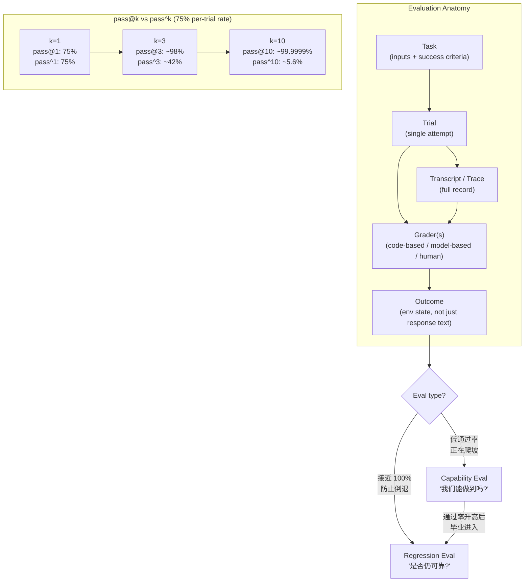

# 第 9 章：评估

### 9.1 为什么需要 Evals

没有 evals，调试就是被动的：等投诉、手动复现、修复，然后祈祷别回归 ([Anthropic - Demystifying Evals for AI Agents](https://www.anthropic.com/engineering/demystifying-evals-for-ai-agents))。团队无法区分真实回归与噪声，无法自动测试大量场景，也无法衡量改进。采用新模型也会很慢：没有 evals，新模型上线意味着数周手工测试；有 evals 的团队可以在数天内验证优势并调 prompt。

Eval 比单元测试更宽。单元测试通常检查一个确定性的函数或模块；agent eval 运行的是整个 model + harness 系统，并在环境中判断最终状态是否满足任务。这一点很重要，因为 agent 可能通过了中间测试、回答得很流畅、甚至走了一条看似合理的路径，但仍然没有完成用户真正的目标。

Anthropic 将 evals 视为复利型基础设施：成本在前期可见，收益在 agent 生命周期中累积。他们建议尽早开始，哪怕只有 20-50 个简单任务。Agent 早期开发中 effect size 很大，小样本也足以发现方向；成熟 agent 需要更大 eval 才能检测较小效果。

### 9.2 Evaluation 的结构

Anthropic 的词汇 ([Anthropic - Demystifying Evals for AI Agents](https://www.anthropic.com/engineering/demystifying-evals-for-ai-agents))：

- **Task**：有定义好的输入和成功标准。
- **Trial**：对一个 task 的一次尝试。因为输出有随机性，一个 task 会有多次 trial。
- **Grader**：评分某个性能方面；一个 task 可以有多个 grader，每个包含 assertions。
- **Transcript**（trace、trajectory）：trial 的完整记录。
- **Outcome**：trial 结束时的最终环境状态，不同于 agent 的文本回应。例如订票 agent 说“机票已订好”是 response；SQL 数据库是否有对应行才是 outcome。
- **Evaluation harness**：运行 eval end-to-end 的基础设施，区别于 agent harness。
- **Agent harness**（或 scaffold）：与模型一起被评估的系统。“当我们评估一个 agent 时，评估的是 harness 与模型协同工作。”

### 9.3 三类 Grader

- **Code-based**：字符串匹配、二进制测试、静态分析、outcome verification、tool-call verification、transcript analysis。快、便宜、客观、可复现，但对有效变体脆弱。
- **Model-based**：rubric scoring、自然语言断言、pairwise comparison、多 judge 共识。灵活、可扩展、能处理开放任务，但非确定性，需要人类校准。
- **Human**：领域专家 review、众包判断、A/B testing。最适合校准和主观判断，但昂贵、慢，如果 rubric 弱也会不一致。

Anthropic 建议：能用确定性 grader 就用确定性；必要时用 model-based；human 用于周期性校准。他们还提醒，不要过度评分 agent 采取的路径，而应评估产物。Agent 经常能找到 eval 设计者没想到的有效路径，路径评分会使 eval 脆弱。

### 9.4 Capability Eval 与 Regression Eval

两类目的不同 ([Anthropic - Demystifying Evals for AI Agents](https://www.anthropic.com/engineering/demystifying-evals-for-ai-agents))：

- **Capability evals** 问“这个 agent 擅长什么？”它们从低通过率开始，目标是 agent 正在挣扎的任务，给团队一座可爬的山。
- **Regression evals** 问“agent 是否仍能完成过去能完成的事？”它们应接近 100%，用于防止倒退。

Agent 成熟后，通过率高的 capability eval 会 *graduate* 到 regression suite。曾经衡量“能不能做到”的任务，会变成“是否仍可靠做到”的任务。

### 9.5 pass@k 与 pass^k

对行为在运行间变化的 agent，有两个斜率相反的指标 ([Anthropic - Demystifying Evals for AI Agents](https://www.anthropic.com/engineering/demystifying-evals-for-ai-agents))：

- **pass@k**：k 次尝试中至少一次正确的概率。随着 k 增大而上升。
- **pass^k**：k 次 trial 全部成功的概率。随着 k 增大而下降。

这些指标之所以必要，是因为 agent 运行具有随机性。同一个 prompt、模型和 harness，在不同 trial 中可能产生不同的工具顺序、搜索路径或最终答案。因此，单次运行只能提供很弱的证据；重复 trial 才能看出系统只是偶尔成功、稳定可靠，还是碰巧走通了一条脆弱路径。

如果单次成功率 75%，pass^3 约为 42%，pass^10 约为 5.6%，而 pass@10 约为 99.9999%。正确指标取决于产品：当系统可以生成多个候选并选择或展示最佳结果时，一次成功就有价值；面向客户重复执行的 agent 则需要 pass^k 式可靠性。

### 9.6 八步路线图

Anthropic 将从无 eval 到可信 eval 的路线概括为 ([Anthropic - Demystifying Evals for AI Agents](https://www.anthropic.com/engineering/demystifying-evals-for-ai-agents))：

0. **尽早开始**：从真实失败中收集 20-50 个任务。
1. **从已有手工测试开始**：pre-release check 和 bug tracker 中的项目。
2. **写清晰任务和参考解**：两个领域专家应得出相同判断；大量 trial 0% 通过率通常意味着 task 坏了，而不一定是 agent 不行。
3. **构建平衡问题集**：既包含某行为应出现，也包含不应出现的情况。单侧 eval 会导致单侧优化。
4. **构建稳定 eval harness**：隔离 trial，避免共享状态。Anthropic 观察到 Claude 会因查看前一 trial 留下的 git history 而获得不公平优势。
5. **谨慎设计 graders**：能确定性就确定性；多组件任务给部分分；校准 LLM-as-judge rubric；允许 “Unknown” 以避免幻觉；防 eval hacking。
6. **阅读 transcripts**：失败应看起来公平；当分数不再上升，要判断是 agent 回归，还是 eval 本身不公平。
7. **监控 capability eval 饱和**：100% 的 eval 不再提供改进信号。SWE-Bench Verified 从 30% 起步，现在接近 80%，小分数提升可能掩盖大能力提升。
8. **开放维护**：领域专家和产品团队应贡献 eval task；PM、CS、sales 也可以用 Claude Code 把 eval 作为 PR 提交。

### 9.7 不同 Agent 类型的真实 Evals

- **Coding agents**：确定性 grader 很自然，例如代码是否运行、测试是否通过。SWE-bench Verified 基于固定 GitHub issue 跑测试套件；Terminal-Bench 测试端到端任务，例如从源码构建 Linux kernel。
- **Conversational agents**：成功是多维的，例如 ticket resolved（状态检查）、对话少于 10 轮（transcript constraint）、语气合适（LLM rubric）。常需要第二个 LLM 模拟用户（tau-Bench、tau2-Bench）。
- **Research agents**：groundedness check（论断有来源支持）、coverage check（包含关键事实）、source-quality check（权威来源，而非首个检索结果）。需要频繁与人类专家校准。
- **Computer-use agents**：真实或 sandbox 环境，URL/page-state check，后端状态验证（订单是否真的创建，而不仅是出现确认页面）。WebArena 和 OSWorld 是典型例子。

### 9.8 面向修复的验证反馈

对 coding agent 来说，最有用的 grader 往往同时也是修复信号。只说 “test failed” 的检查能确认 outcome 不好，但给 agent 的抓手很少。更好的失败消息会说明违反的是哪条路径、期望状态是什么、实际状态是什么、下一步该检查哪里。OpenAI 的 Codex harness 指南强调，应把反复出现的 review 意见和架构规则转成 repo-local 检查，让 agent 在还能修复时收到具体反馈 ([OpenAI - Harness Engineering](https://openai.com/index/harness-engineering/))。

端到端验证也应作为完成门槛，而不是象征性的最后一步。Anthropic 的长运行应用 harness 要求 coding agent 启动应用，并通过浏览器驱动路径验证 feature，因为 agent 否则容易在本地测试或视觉检查通过后宣称完成，但真实用户流程仍然坏着 ([Anthropic - Effective Harnesses for Long-Running Agents](https://www.anthropic.com/engineering/effective-harnesses-for-long-running-agents))。第 9.2 节的通用规则在这里直接适用：评估环境状态，而不是评估 agent 的自信。

### 9.9 阅读 Transcript 是核心技能

反复出现的主题是：在有人阅读 transcripts 前，不要直接相信 eval 分数。Anthropic 提到 Opus 4.5 在 CORE-Bench 上初始得分 42%，但调查发现严格 grader 会惩罚把期望答案 `96.124991...` 写成 `96.12`，任务 spec 模糊，还有无法精确复现的随机任务。修复 grader bug 并使用限制更少的 scaffold 后，分数跳到 95% ([Anthropic - Demystifying Evals](https://www.anthropic.com/engineering/demystifying-evals-for-ai-agents))。类似地，METR 发现 time-horizon benchmark 中有任务要求 agent 优化到某个阈值，但评分要求超过阈值，于是惩罚遵循指令的模型，奖励忽略指令的模型。

通用规则是：失败应显得公平。当分数平台期时，要问 eval 是否仍在测它应该测的东西。

### 9.10 Evals 只是多层体系中的一层

自动 eval 不是完整图景。Anthropic 将其类比安全工程中的 Swiss-cheese model：没有一层能抓住所有问题 ([Anthropic - Demystifying Evals](https://www.anthropic.com/engineering/demystifying-evals-for-ai-agents))。完整栈包括：

- **自动 evals**：快速迭代、回归检测、模型升级。
- **生产监控**：获得真实世界失败和 ground truth。
- **A/B testing**：在流量足够后验证重大改动。
- **用户反馈**：发现没人预料的问题。
- **人工 transcript review**：建立对失败模式的直觉。
- **系统性人类研究**：校准 LLM grader 或主观输出评分。

---

## 图：Eval 结构与 pass@k / pass^k

---

## 要点

- **Evals 是复利型基础设施**：即使 agent 未成熟，也从 20-50 个真实失败任务开始。
- **Eval 比单元测试更宽**：它在环境中检查 model + harness 系统是否达成任务 outcome。
- **Outcome 不等于 response**：测环境状态（数据库行、URL、文件），而不是只测 agent 说了什么。
- **面向修复的反馈能提高自我修正**：检查应说明哪里失败、为什么失败，以及什么证据才算修好。
- **三类 grader 形成金字塔**：code-based 负责速度，model-based 负责细微判断，human 负责校准。
- **pass@k 与 pass^k 服务不同产品**：多候选生成可用 pass@k，重复面向客户执行需要 pass^k 式可靠性。
- **阅读 transcript 是核心技能**：分数平台期可能是 agent 回归，也可能是 eval 不公平；只有 transcript 能区分。
- **Evals 是多层之一**：自动 eval + 生产监控 + A/B testing + 用户反馈 + 人工 review。

## 延伸阅读

- Mikaela Grace et al., *Demystifying Evals for AI Agents*, Anthropic, Jan 2026. https://www.anthropic.com/engineering/demystifying-evals-for-ai-agents
- Gian Segato, *Quantifying Infrastructure Noise in Agentic Coding Evals*, Anthropic, Feb 2026. https://www.anthropic.com/engineering/infrastructure-noise
- Vivek Trivedy, *Improving Deep Agents with Harness Engineering*, LangChain, Feb 2026. https://blog.langchain.com/improving-deep-agents-with-harness-engineering/
- Ken Aizawa, *Writing Effective Tools for Agents - with Agents*, Anthropic, Sep 2025. https://www.anthropic.com/engineering/writing-tools-for-agents
- OpenAI, *Harness Engineering: Leveraging Codex in an Agent-First World*, Feb 2026. https://openai.com/index/harness-engineering/
- Justin Young et al., *Effective Harnesses for Long-Running Agents*, Anthropic, Nov 2025. https://www.anthropic.com/engineering/effective-harnesses-for-long-running-agents
