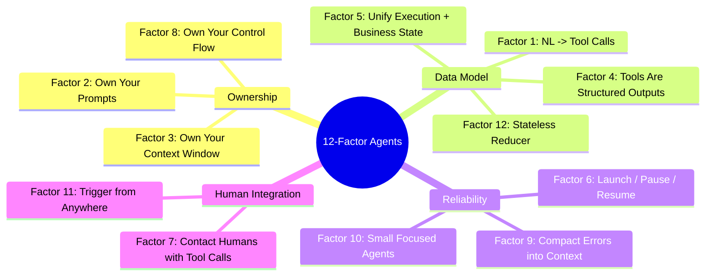

# 第 9 章：生产级 Agent 的十二要素

前几章分别讨论了上下文管理、工具、沙箱、工作流，以及长周期任务的 handoff。本章将视角拉远，考察这些 harness 技术如何融入常规的软件架构。HumanLayer 的 “12 Factor Agents” 最适合被理解为一份生产实践清单。它借用了经典 Twelve-Factor App 的名称，但其中的要素专门面向 LLM agent。它是一份原则宣言，而不是完整的参考架构。

本章建立在两个关键的软件概念之上。*状态* 是继续执行所需的全部信息，包括当前步骤、重试次数、审批、用户消息、工具结果，以及此前受到影响的业务对象。*事件日志* 是一份只追加、不覆写的记录，可以据此重建状态。将 agent 建模为作用于这些事件的 reducer 后，暂停与恢复、重放、调试和测试就会成为普通的软件问题，而不再依赖隐藏在对话中的状态。

### 9.1 作为软件架构的十二要素

这十二条原则总结自许多生产部署 ([HumanLayer - 12-Factor Agents](https://www.humanlayer.dev/blog/12-factor-agents))：

1. **Natural Language to Tool Calls**：基本模式是将用户请求转换成结构化 JSON call，再交给确定性代码执行。
2. **Own Your Prompts**：不要把 prompt engineering 交给 framework 黑箱。应将 prompt 视为一等代码，以便测试、评估和调优。
3. **Own Your Context Window**：标准 message format 是一种选择；另一种选择是使用带 XML 标记的 event log，将历史记录压缩到一条 user message 中。无论采用哪种方式，目标都是用尽可能少的 token 保留尽可能多的有效信息。
4. **Tools Are Just Structured Outputs**：工具调用本质上是模型生成的结构化 JSON，其中包含意图及其参数；随后由确定性代码决定如何执行。
5. **Unify Execution State and Business State**：不要将“当前步骤/下一步骤/retry count”和“对话中发生了什么”分别维护，而应从同一份 event log 推导执行状态。
6. **Launch / Pause / Resume with Simple APIs**：agent 是程序，因此应支持标准 lifecycle 操作，包括在工具选择之后、实际执行之前暂停。
7. **Contact Humans with Tool Calls**：不要依赖模型自行决定使用普通文本还是结构化输出。应提供明确的 `request_human_input` 工具，并设置 urgency、format、choices 等结构化字段。
8. **Own Your Control Flow**：主动控制 loop，以便暂停并等待审批、总结工具结果、用 LLM-as-judge 检查输出、管理记忆、记录日志和 trace、实施限流，或进行持久休眠（durable sleep）。
9. **Compact Errors into Context Window**：保留可见的错误信息，让 agent 能够尝试自我恢复；同时使用连续错误计数器，在达到阈值后升级给人类处理。这里的关键词是 *compact*：原始 stack trace 会迅速消耗 token 预算，并加剧 context rot（见《LLM Foundations》第 9 章）。Context 中应只保留最新错误或有用的摘要，并折叠或移除更早的重复 trace，避免它们挤占继续工作所需的信息。
10. **Small, Focused Agents**：将每个 agent 的工作范围控制在约 3–10 步，最多可以放宽到 20 步。上下文越大，性能通常越差。
11. **Trigger from Anywhere**：允许通过 Slack、email、SMS、webhook 和 cron job 启动 agent。它与 factor 7 结合后会形成 *outer loop*：事件负责启动 agent，agent 则在遇到关键决策点时联系人类。
12. **Make Your Agent a Stateless Reducer**：将 agent 建模为对 events 执行 fold 的纯函数，使其可以序列化和重放。只有当每次 LLM 响应和工具结果都记录为 event 时，重放才是确定性的。恢复时，应对已记录的结果执行 fold，而不是再次调用模型或重新运行具有副作用的工具。

贯穿这些要素的核心主张是：“好的 agent 至少不是‘给你一个 prompt、一袋工具，然后循环到目标完成’的模式。它们大多只是软件” ([HumanLayer - 12-Factor Agents](https://www.humanlayer.dev/blog/12-factor-agents))。换句话说，这些要素是在将熟悉的软件工程纪律应用于一个有状态、非确定性的组件。它们并不是放之四海而皆准的定律：研究原型、本地 coding assistant 和受监管的客服 agent 各有不同的权衡。真正重要的是实践方向：让状态显式可见，让控制流可以检查，并通过结构化接口处理人类交互。

### 9.2 从 Agent Program 到 Agent Platform

OpenReview 的综述指出，整个生态正在从 agent framework 走向 agent platform ([OpenReview - Agent Harness Engineering: A Survey](https://openreview.net/pdf?id=3hXEPbG0dh))。Framework 封装的是 agents、tools、memory stores 和 loops 等本地抽象。Platform 则增加了共享基础设施，为多次运行和多个用户提供 durable workspace、managed sandbox、identity、billing、observability、evaluation、governance 和 human handoff。

这种转变不会取代十二要素，而是扩大它们的适用范围。Launch / pause / resume 变成平台 API；Unify execution state and business state 变成带 tenancy 和 migration 语义的 event-log storage；Contact humans with tool calls 变成能够追踪 permission state 和 audit history 的 handoff interface；Own your control flow 则要求明确决定哪些检查同步运行、哪些离线运行，以及哪些失败值得启动成本较高的恢复流程。

平台边界也会改变责任划分。本地 agent 或许可以使用临时的 state files，共享平台却需要明确的状态所有权、保留策略、billing attribution、credential scoping 和可重放的 audit trail。在这一规模上，harness 不再只是包围单次模型调用的一层结构，而是管理多个 agents、多个 environments 和多方人类参与者的控制系统。

这个控制系统并不只是另一个 agent framework，而是第 18 章展开的 **agent control plane**：registry 记录可用的 agents 和 capabilities；identity layer 记录谁在代表谁行动；policy enforcement 决定每次运行可以做什么；lifecycle、lineage 和 audit service 则跨 session 运作。十二要素仍然是每个 agent program 内部的设计纪律，而控制平面使由这些 program 组成的 fleet 具备可治理性。

---

## 图：按主题分组的十二要素

---

## 本章要点

- **“大多只是软件”**：好的 agent 主要是由确定性软件包围一个非确定性的 LLM 组件，而不是简单地把一袋工具交给模型，让它循环到完成为止。
- **Own your prompts**：不要让 framework 隐藏 prompt；应将 prompt 作为一等代码纳入版本控制。
- **使用 stateless reducer 模式**：对 event log 执行 fold 以得到当前状态，使 agent 可以序列化、重放和测试。
- **平台范围会改变十二要素**：lifecycle、state、identity、billing、observability 和 human handoff 会变成共享基础设施问题。
- **Fleet 需要控制平面**：十二要素塑造每个 agent program；registry、identity、policy、lifecycle 与 audit 治理整个集合。
- **保持 agent 小而聚焦**：将每个 agent 限制在 3–20 步，因为性能通常会随着上下文增长而下降。
- **通过工具联系人类**：结构化的 `request_human_input` 工具，比依赖模型选择自由文本更可靠。
- **压缩错误，而不是隐藏错误**：可见的错误信息支持自我恢复，连续错误计数器则提供安全的升级路径。

## 延伸阅读

- Dex Horthy, *12-Factor Agents*, HumanLayer, Apr 2025. https://www.humanlayer.dev/blog/12-factor-agents
- Kyle Brunet, *Skill Issue: Harness Engineering for Coding Agents*, HumanLayer, Mar 2026. https://www.humanlayer.dev/blog/skill-issue-harness-engineering-for-coding-agents
- Erik Schluntz and Barry Zhang, *Building Effective Agents*, Anthropic, Dec 2024. https://www.anthropic.com/engineering/building-effective-agents
- *Agent Harness Engineering: A Survey*, OpenReview / TMLR submission, 2026. https://openreview.net/pdf?id=3hXEPbG0dh
