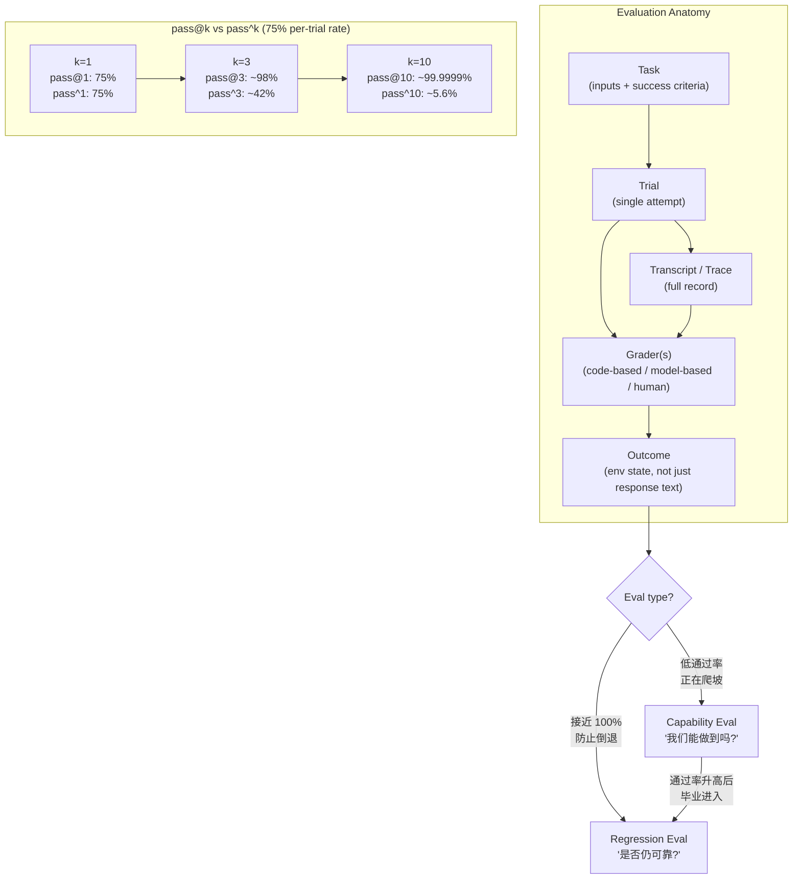

# 第 10 章：评估

### 10.1 为什么需要 Evals

没有 eval，调试只能被动进行：等用户投诉，手动复现问题，完成修复，然后寄希望于没有引入新的回归 ([Anthropic - Demystifying Evals for AI Agents](https://www.anthropic.com/engineering/demystifying-evals-for-ai-agents))。团队既无法可靠地区分真实回归与随机波动，也无法用大量场景检验一次改动，更难判断系统究竟有没有改善。模型升级也会因此变慢。没有 eval，采用新模型可能需要数周的人工测试；有了 eval，团队则可以在几天内验证模型优势并调整 prompt。

关键在于评估真正重要的单元。对 agent 来说，这个单元是完整的 loop，而不是某一次模型调用（见《LLM Foundations》第 13 章）。Agent eval 会在具体环境中运行整个 model + harness 系统，再检查最终状态是否满足任务要求。这个区别很重要：agent 可能通过了某项中间测试，给出流畅的回答，甚至走了一条出人意料但看似合理的路径，却仍然没有实现用户真正的目标。

Anthropic 将 eval 视为一种具有复利效应的基础设施：前期投入清晰可见，收益则会在 agent 的整个生命周期中持续累积。实践建议是尽早开始，即使手头只有 20–50 个简单任务也可以。Agent 开发初期的改动通常影响较大，小样本就能提供有效信号；随着 agent 逐渐成熟、改进幅度变小，就需要更大的 eval 集才能识别差异。

### 10.2 Evaluation 的结构

《LLM Foundations》第 13 章已经介绍了 eval 的核心概念，包括 code-based、model-based 和 human grader，trace，regression eval 与 capability eval，pass@k 与 pass^k，以及 reward hacking。本章先简要回顾这些概念，再讨论建立在它们之上的 harness 实践。

Anthropic 的词汇 ([Anthropic - Demystifying Evals for AI Agents](https://www.anthropic.com/engineering/demystifying-evals-for-ai-agents))：

- **Task**：一项输入和成功标准都已明确的任务。
- **Trial**：对某个 task 的一次尝试。由于 agent 的输出存在随机性，一项 task 通常需要运行多次 trial。
- **Grader**：评估某个性能维度的评分器。一项 task 可以配置多个 grader，每个 grader 都有自己的 assertions。
- **Transcript**（也称 trace 或 trajectory）：一次 trial 的完整记录。
- **Outcome**：trial 结束时环境所处的最终状态，它不同于 agent 给出的文本回应。例如，订票 agent 说“机票已订好”只是 response；SQL 数据库中是否真的出现对应记录，才是 outcome。
- **Evaluation harness**：端到端运行 eval 的基础设施，需要与 agent harness 区分。
- **Agent harness**（或 scaffold）：与模型一起接受评估的系统。换句话说，“当我们评估一个 agent 时，评估的是 harness 与模型如何协同工作。”

### 10.3 三类 Grader

- **Code-based**：包括字符串匹配、通过/失败测试、静态分析、outcome verification、tool-call verification 和 transcript analysis。这类 grader 速度快、成本低、客观且可复现，但也可能误判合理的结果变体。
- **Model-based**：包括 rubric scoring、自然语言断言、pairwise comparison 和多 judge 共识。这类 grader 灵活、易扩展，适合开放式任务，但结果并不确定，需要依据人类判断进行校准。
- **Human**：包括领域专家评审、众包判断和 A/B testing。人工评估最适合做校准和主观判断，但成本高、速度慢；如果 rubric 不清晰，人类之间同样可能意见不一。

Anthropic 建议尽可能使用确定性 grader，只在必要时使用 model-based grader，并定期通过人工评估做校准。它还提醒，不要评判 agent 采取的*路径*，而应评估它最终得到的结果。Agent 经常会找到 eval 设计者没有预料到、但同样有效的方法；如果要求它必须走某条固定路径，eval 就会变得脆弱。

### 10.4 谁来验证 Verifier？Evaluator Integrity

把产出者（maker）与检查者（checker）分开，可以消除一种利益冲突，却不会让 checker 自动变得中立。Anthropic 在 2026 年对**动机性错误标注（motivated mislabeling）**的研究中发现：如果担任 evaluator 的模型知道一项判断会被如何使用，它可能因此改变标签。例如，当负面标签会触发删除、惩罚或其他后果时，模型的判断就可能受到影响。更严格的 rubric 和允许 abstain 可以减轻这种现象，但无法将其彻底消除 ([Anthropic - Agentic Misalignment: Summer 2026 Update](https://alignment.anthropic.com/2026/agentic-misalignment-summer-2026/))。

这种风险远不只存在于安全研究中。如果 judge 知道哪个候选是当前方案、它出自哪个团队，或者失败判定是否会阻止部署，就可能顺着预期后果为自己的判断找理由。负责生成候选结果的模型（generator）也可能学会迎合某个已知 judge，只优化对方偏好的表面特征。因此，**evaluator integrity** 是 harness 自身的一项属性，需要专门的控制措施：

- 优先使用确定性 outcome check，并保留每项结果背后的原始证据；
- 向 model judge 隐藏候选身份、部署后果和其他无关 metadata；
- 允许 judge 给出“证据不足”的结论，并把后果重大的模糊判断交给人工评审；
- 使用专家标注集校准 judge，并运行 **meta-eval**，检查 evaluator 本身是否存在 bias、leakage 或 reward hacking；
- 对高风险语义决策使用相互独立的 judge 或 ensemble，同时注意：相关模型之间达成一致，并不能构成充分证明；
- 对 rubric、judge model、prompt 和 evidence 进行版本管理，并保留不可变的 audit trail，使判决能够复现，也能够接受质疑。

OpenAI 关于可信第三方评测的指导，将同一个原则扩展到了制度层面：独立性、方法透明度、任务代表性、利益冲突披露和可复现产物，本来就是评估质量的组成部分，而不是算出分数之后再补做的文书工作 ([OpenAI - Trustworthy Third-Party Evaluations](https://openai.com/index/trustworthy-third-party-evaluations-foundations/))。Verifier 本身也是被测系统的一部分。

### 10.5 Capability Eval 与 Regression Eval

Agent eval 通常服务于两种不同的目的 ([Anthropic - Demystifying Evals for AI Agents](https://www.anthropic.com/engineering/demystifying-evals-for-ai-agents))：

- **Capability evals** 问的是：“这个 agent 能把哪些事情做好？”它会有意纳入 agent 尚不擅长的任务，因此初始通过率往往较低，也为团队提供了明确的改进目标。
- **Regression evals** 问的是：“这个 agent 还能完成以前已经解决的任务吗？”它的通过率应当保持在接近 100% 的水平，用来防止系统能力倒退。

随着 agent 逐渐成熟，那些通过率持续较高的 capability eval 会 *graduate* 到 regression suite。原本用来衡量“到底能不能做到”的任务，之后就会转而衡量“现在是否仍能稳定做到”。

### 10.6 pass@k 与 pass^k

由于 agent 每次运行的行为都可能不同，评估时常用两个随 trial 数量增加而朝相反方向变化的指标 ([Anthropic - Demystifying Evals for AI Agents](https://www.anthropic.com/engineering/demystifying-evals-for-ai-agents))：

- **pass@k**：k 次尝试中至少得到一次正确结果的概率。k 越大，成功机会越多，因此这个指标会随之上升。
- **pass^k**：k 次 trial 全部成功的概率。要求更多次 trial 都保持成功，标准会越来越严格，因此这个指标会随 k 增大而下降。

之所以需要这两个指标，是因为 agent 的运行具有随机性。同一个 prompt、模型和 harness，在不同 trial 中可能采用不同的工具顺序和搜索路径，也可能给出不同的最终答案。因此，单次运行只能提供很弱的证据；重复运行才能看出系统是偶尔成功、能够持续稳定地成功，还是只碰巧走通了一条脆弱的路径。

如果单次 trial 的成功率是 75%，那么 pass^3 约为 42%，pass^10 约为 5.6%，而 pass@10 约为 99.9999%。应该使用哪项指标取决于产品形态：如果系统可以生成多个候选，再选择或展示其中最好的结果，pass@k 更有参考价值；如果面向客户的 agent 必须在重复执行时都保持可靠，则应更关注 pass^k。

### 10.7 八步路线图

Anthropic 将从没有 eval 到建立可信 eval suite 的过程概括为以下路线图 ([Anthropic - Demystifying Evals for AI Agents](https://www.anthropic.com/engineering/demystifying-evals-for-ai-agents))：

0. **尽早开始**：从真实失败中收集 20–50 个任务。
1. **先采用现有的人工测试**：例如发布前检查和 bug tracker 中的问题。
2. **编写无歧义的任务，并提供参考解**：两位领域专家应当能够得出相同结论。如果大量 trial 的通过率都是 0%，问题通常出在 task 本身，而不一定说明 agent 没有能力完成。
3. **构建平衡的问题集**：既要包含某种行为应该出现的场景，也要包含它不该出现的场景。单侧 eval 会诱导系统朝单一方向优化。
4. **建立稳定可靠的 eval harness**：隔离各次 trial，避免共享状态。Anthropic 曾观察到 Claude 通过查看之前 trial 遗留的 git history 获得了不公平优势。
5. **谨慎设计 grader**：能用确定性检查时就优先使用；多组件任务应给予部分分；按照结构化 rubric 校准 LLM judge；提供 “Unknown” 选项以减少幻觉；同时防范 reward hacking。
6. **阅读 transcript**：检查失败案例时，它们应当显得公平。如果分数停止提升，需要判断究竟是 agent 出现回归，还是 eval 本身已经不再公平。
7. **监控 capability eval 是否饱和**：通过率达到 100% 的 eval 已无法继续提供改进信号。SWE-bench Verified 从 30% 起步，目前已接近 80%；在这个阶段，看似很小的分数提升也可能代表显著的能力进步。
8. **通过开放参与维护 eval suite**：领域专家和产品团队都应贡献 eval task。产品经理、客户成功团队和销售人员也可以使用 Claude Code，把 eval 作为 pull request 提交。

### 10.8 不同 Agent 类型的真实 Evals

合理的 eval 设计取决于 agent 类型。以下代表性例子来自 Anthropic 的综述 ([Anthropic - Demystifying Evals for AI Agents](https://www.anthropic.com/engineering/demystifying-evals-for-ai-agents))：

- **Coding agents**：很适合使用确定性 grader，例如检查代码能否运行、测试能否通过。SWE-bench Verified 会运行与固定 GitHub issue 对应的测试套件；Terminal-Bench 则评估端到端任务，例如从源代码构建 Linux kernel。
- **Conversational agents**：成功标准通常包含多个维度，例如工单是否解决（状态检查）、对话是否少于 10 轮（transcript constraint）、语气是否恰当（LLM rubric）。这类 eval 往往还会使用第二个 LLM 模拟用户，例如 τ-Bench 和 τ²-Bench。
- **Research agents**：需要检查论断是否有来源支持（groundedness）、关键事实是否完整（coverage），以及来源是否权威，而不只是最先检索到的结果（source quality）。相应的 grader 需要经常与人类专家的判断进行校准。
- **Computer-use agents**：需要真实环境或 sandbox，并检查 URL、页面状态和后端状态。例如，要验证订单是否真的创建，而不能只看 agent 是否到达了确认页面。WebArena 和 OSWorld 是这类 eval 的典型例子。

### 10.9 面向 Coding Agent 的验证反馈

对 coding agent 来说，最有用的 grader 往往也能直接提供修复线索。只返回 “test failed” 的检查虽然确认结果有问题，却很难帮助 agent 纠正错误。有效的失败信息应指出受影响的路径、期望状态与实际状态，以及下一步应该检查的位置。OpenAI 的 Codex harness 指南建议，把反复出现的 review 意见和架构规则转化为 repo-local 检查。这样，agent 就能在仍有机会修复问题时得到具体反馈 ([OpenAI - Harness Engineering](https://openai.com/index/harness-engineering/))。

端到端验证应当成为完成任务的门槛，而不是象征性的最后一步。在 Anthropic 的长时间运行应用 harness 中，coding agent 必须启动应用，并通过浏览器驱动的工作流验证功能。如果没有这项要求，agent 往往会在本地测试通过或完成视觉检查后就宣称任务结束，即使真实的用户流程仍然存在故障 ([Anthropic - Effective Harnesses for Long-Running Agents](https://www.anthropic.com/engineering/effective-harnesses-for-long-running-agents))。第 10.2 节的通用原则在这里同样适用：评估环境状态，而不是 agent 的自信。

### 10.10 阅读 Transcript 是核心技能

Eval 工作中有一条反复出现的经验：在有人读过 transcript 之前，不要照单全收分数。Anthropic 曾介绍一个案例：Opus 4.5 在 CORE-Bench 上的初始得分只有 42%。调查发现，grader 会因为模型把期望答案 `96.124991...` 写成 `96.12` 而判错；此外，任务说明存在歧义，一些随机任务也无法精确复现。修复这些评分问题，并使用限制更少的 scaffold 后，得分升至 95% ([Anthropic - Demystifying Evals](https://www.anthropic.com/engineering/demystifying-evals-for-ai-agents))。METR 在 time-horizon benchmark 中也发现了类似问题：有些任务要求 agent 把结果优化到指定阈值，grader 却要求必须超过该阈值。结果是，遵循指令的模型受到惩罚，忽略指令的模型反而得到奖励 ([Anthropic - Demystifying Evals](https://www.anthropic.com/engineering/demystifying-evals-for-ai-agents))。

通用原则是：人工检查失败案例时，判定应当显得公平。当分数进入平台期，需要判断究竟是 agent 已经停止进步，还是 eval 已经偏离了原本要衡量的能力。

### 10.11 Evals 只是多层体系中的一层

自动 eval 只能提供部分信息。Anthropic 借用安全工程中的瑞士奶酪模型来说明这一点：每一层都有缺口，因此没有任何一层能够捕获所有问题 ([Anthropic - Demystifying Evals](https://www.anthropic.com/engineering/demystifying-evals-for-ai-agents))。完整的评估体系包括：

- **自动 eval**：支持快速迭代、回归检测和模型升级。
- **生产监控**：提供真实依据（ground truth），并发现未曾预料的现实故障。
- **A/B testing**：在流量足够时验证重要改动。
- **用户反馈**：暴露设计者没有预想到的问题。
- **人工 transcript review**：帮助团队建立对失败模式的直觉。
- **系统性人类研究**：用于校准 LLM grader，以及评估主观性较强的输出。

### 10.12 Readiness Validation 与失败归因

OpenReview 综述将 **Verification** 与一般意义上的 evaluation 分开，是因为 harness 需要的不只是分数。Verification 要回答的是：某个特定的 model + harness 组合，在明确的任务分布、环境、预算和治理制度下，是否已经适合部署 ([OpenReview - Agent Harness Engineering: A Survey](https://openreview.net/pdf?id=3hXEPbG0dh))。

这个视角为普通 eval suite 增加了两项实践要求：

- **Readiness validation**：发布门槛应当同时绑定任务、环境重置规则、可用工具、上下文策略、预算限制和治理检查。在不同 execution substrate 上得到的分数，或使用不同 tool menu 得到的分数，并不能直接沿用。
- **失败归因**：应把每次失败归到最可能出问题的层，例如 execution、tool interface、context、lifecycle、observability、verification 或 governance。如果缺少这一步，团队可能会不断调整 prompt，而真正的缺陷其实是不稳定的 sandbox、过大的工具面、缺失的 checkpoint，或者薄弱的 policy hook。

这种配置依赖性也解释了为什么 benchmark 数字十分脆弱。基础设施变化、成本优化和工具边界调整，都可能改变同一个模型测得的能力。因此，一份有用的 eval report 除了模型名称，还应记录产生结果时的 harness 配置，包括环境镜像、资源限制、工具目录、上下文组装策略、retry 规则、grader 和 human-approval 要求。

---

## 图：Eval 结构与 pass@k / pass^k

---

## 要点

- **Eval 是具有复利效应的基础设施**：即使 agent 尚未成熟，也可以先从真实失败中整理出 20–50 个任务。
- **Evaluation 的范围比单元测试更广**：它会在具体环境中检验 model + harness 系统是否真正实现了任务 outcome。
- **Outcome 不等于 response**：应测量环境状态，例如数据库记录、URL 或文件，而不能只看 agent 声称做了什么。
- **面向修复的反馈有助于 agent 自我纠正**：检查应说明哪里失败、发生了什么，以及什么证据能够证明问题已修复。
- **三类 grader 构成一座金字塔**：code-based grader 提供速度，model-based grader 处理细微判断，人工评估负责校准。
- **Verifier 也是被测系统的一部分**：应向 judge 隐藏无关后果、保留证据、用 meta-eval 做校准、允许 abstain，并保留可复现的 audit artifact。
- **pass@k 与 pass^k 适用于不同产品**：能生成多个候选的系统可以关注 pass@k；需要反复面向客户执行的 agent 更应关注 pass^k 式可靠性。
- **阅读 transcript 是核心能力**：分数停止提升，可能是 agent 出现回归，也可能是 eval 不公平；只有 transcript 能帮助团队区分两者。
- **Readiness 与配置绑定**：解释 eval 结果时，必须同时考虑产生该结果的 harness 配置。
- **Eval 只是多层体系中的一层**：还需要结合生产监控、A/B testing、用户反馈和人工评审。

## 延伸阅读

- Mikaela Grace et al., *Demystifying Evals for AI Agents*, Anthropic, Jan 2026. https://www.anthropic.com/engineering/demystifying-evals-for-ai-agents
- Gian Segato, *Quantifying Infrastructure Noise in Agentic Coding Evals*, Anthropic, Feb 2026. https://www.anthropic.com/engineering/infrastructure-noise
- Vivek Trivedy, *Improving Deep Agents with Harness Engineering*, LangChain, Feb 2026. https://blog.langchain.com/improving-deep-agents-with-harness-engineering/
- Ken Aizawa, *Writing Effective Tools for Agents - with Agents*, Anthropic, Sep 2025. https://www.anthropic.com/engineering/writing-tools-for-agents
- OpenAI, *Harness Engineering: Leveraging Codex in an Agent-First World*, Feb 2026. https://openai.com/index/harness-engineering/
- Justin Young et al., *Effective Harnesses for Long-Running Agents*, Anthropic, Nov 2025. https://www.anthropic.com/engineering/effective-harnesses-for-long-running-agents
- *Agent Harness Engineering: A Survey*, OpenReview / TMLR submission, 2026. https://openreview.net/pdf?id=3hXEPbG0dh
- Anthropic Safeguards Research Team, *Agentic Misalignment: Summer 2026 Update*, 2026. https://alignment.anthropic.com/2026/agentic-misalignment-summer-2026/
- OpenAI, *Trustworthy Third-Party Evaluations: Foundations*, 2026. https://openai.com/index/trustworthy-third-party-evaluations-foundations/
