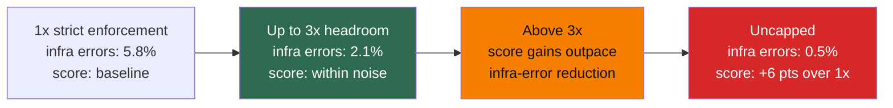

# 第 10 章：基础设施噪声

阅读 benchmark leaderboard 的实践者需要知道：小分差的不确定性比报告数字看起来更大。Anthropic 的 “Quantifying Infrastructure Noise” 记录了这种影响的量级 ([Anthropic - Quantifying Infrastructure Noise in Agentic Coding Evals](https://www.anthropic.com/engineering/infrastructure-noise))。

静态 benchmark 直接评分模型输出。Agentic coding eval 不同：模型写程序、跑测试、安装依赖、多轮迭代。Runtime 不是被动容器，而是问题求解过程的一部分。资源预算不同的两个 agent，其实并不是在参加同一场考试。

### 10.1 头号结果

Anthropic 在 Google Kubernetes Engine cluster 上用六种资源配置运行 Terminal-Bench 2.0：同一 Claude 模型、同一 harness、同一任务集，只改变资源 floor 和 ceiling。最充足与最不足资源设置之间相差 6 个百分点（p < 0.01）([Anthropic - Quantifying Infrastructure Noise](https://www.anthropic.com/engineering/infrastructure-noise))。

这超过了许多 leaderboard 顶部模型之间的典型差距。直接含义是：leaderboard 上 2 分领先可能是真实能力差异，也可能只是某次 eval 跑在更强硬件上。

### 10.2 两个区间

数据呈现两个区间：

- **从 1x 到 3x 单任务资源规格**，分数在噪声范围内波动（p = 0.40），但基础设施错误率单调下降：从严格 enforcement 的 5.8% 到 3x headroom 的 2.1%，p < 0.001。在 1x 崩溃的任务本来也会失败；额外资源修复了瞬时内存峰值导致的 OOM kill，并没有让 eval 本身更简单。
- **3x 以上**，分数上升快于基础设施错误下降。从 3x 到 uncapped，infra errors 下降 1.6 个百分点，但成功率上升接近 4 点。额外资源让 agent 能尝试只有在资源宽松时才成立的方法，例如拉大型依赖、跑高内存测试套件、用 heavyweight 工具 brute force。

### 10.3 对测量意味着什么

严格资源限制会无意中奖励高效策略；宽松限制奖励善用可用资源的 agent。二者都可以是合法测试目标，但如果不说明配置就折成单一分数，解释会变困难。

Anthropic 的 `bn-fit-modify` 例子说明了这一点：在宽松限制下，一些模型默认先安装完整 Python 数据科学栈（pandas、networkx、scikit-learn），再写方案代码。在严格限制下，pod 在安装时内存耗尽。其实也存在更轻的策略：只用标准库从头实现数学。一些模型默认走轻策略。资源配置决定哪种默认策略成功。

同样效应也出现在 Terminal-Bench 之外，但幅度较小。Anthropic 的 SWE-bench 实验中，5x RAM 在 227 个问题上比 1x 高 1.54 个百分点；比 Terminal-Bench 小，因为 SWE-bench 任务资源密集度更低，但仍非中性。

### 10.4 建议

Eval 应分别说明保证分配（floor）和硬上限（ceiling），不要只给一个固定值。对 Terminal-Bench 来说，任务规格 3x ceiling 是合理默认：它将 infra errors 减少三分之二，同时让分数提升保持在噪声内 ([Anthropic - Quantifying Infrastructure Noise](https://www.anthropic.com/engineering/infrastructure-noise))。具体倍数取决于 benchmark 和任务分布，应当报告。

对 leaderboard 读者来说，操作规则是：低于 3 个百分点的差距，在资源配置被文档化并匹配前都应保持怀疑。几分领先可能是真实能力，也可能只是更大的 VM。

---

## 图：资源配置与分数

下表总结 Anthropic 报告的两个区间。只有 1x、3x 和 uncapped 错误率在文章中明确量化；中间行保持定性，以免暗示来源没有给出的精度。

| 资源水平 | Infra Error Rate | 分数变化 | 解释 |
|---|---|---|---|
| 1x（严格） | 5.8% | baseline | OOM kill 掩盖真实失败 |
| 3x | 2.1% | 噪声内 | 甜点：infra errors 减少 2/3 |
| 3x 以上 | 更低 | 分数开始比 infra errors 更快上升 | Agent 开始利用额外 RAM |
| Uncapped | 0.5% | 比 1x +6 pts | 资源密集默认策略成功 |

*3x 以上，分数收益超过基础设施错误下降；额外资源启用了策略，而不只是提高稳定性。*

---

## 要点

- **硬件本身就可带来 6 点差距**：Terminal-Bench 2.0 最强与最弱资源配置差距超过常见顶部模型差距。
- **两个区间**：1x-3x 修复基础设施不稳定；3x 以上启用资源密集策略。
- **3x ceiling 是实践默认**：降低三分之二 infra errors，并让分数提升保持在噪声范围。
- **Leaderboard 怀疑阈值**：3 个百分点以下差异，需等资源配置文档化并匹配后再解读。
- **资源限制塑造策略**：严格限制奖励效率，宽松限制奖励资源利用；二者都有效，但必须区分。

## 延伸阅读

- Gian Segato, *Quantifying Infrastructure Noise in Agentic Coding Evals*, Anthropic, Feb 2026. https://www.anthropic.com/engineering/infrastructure-noise
- Mikaela Grace et al., *Demystifying Evals for AI Agents*, Anthropic, Jan 2026. https://www.anthropic.com/engineering/demystifying-evals-for-ai-agents
- Vivek Trivedy, *Improving Deep Agents with Harness Engineering*, LangChain, Feb 2026. https://blog.langchain.com/improving-deep-agents-with-harness-engineering/
