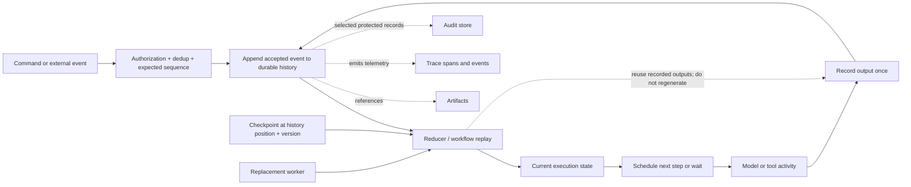

# 第 10 章：状态、事件历史与生产要素

如果 agent 唯一的状态就是下一次 prompt，它就无法从 crash 中恢复、无法安全等待 approval，也无法解释重复的副作用。本章定义后续 evaluation、long-running task、tracing、AgentOps 与 fleet 所依赖的持久数据模型。HumanLayer 的 “12 Factor Agents” 仍是一份有价值的具名从业者 manifesto，但它不是正式标准，也不是完整架构 ([HumanLayer — 12-Factor Agents](https://www.humanlayer.dev/blog/12-factor-agents))。

### 10.1 不能合并成一个概念的六种对象

*History* 一词常被用于几种不同的数据产品。本书采用以下定义：

| 对象 | 规范含义 | 主要用途 | 它不是什么 |
|---|---|---|---|
| **Execution state** | 结构化的当前 workflow state：status、current step、pending action、budget、retry count、approval state 及相关业务引用 | 决定下一步允许发生什么 | 模型 context 或无结构 transcript |
| **Event history** | 按顺序持久记录、且在声明的 replay contract 下足以恢复的已接受 workflow events | 重建 state 并 resume | 自动成为合规 audit log |
| **Checkpoint** | 可恢复的 state snapshot，加上继续执行所需的 history position 和引用 | 限制恢复时间并提供 resume point | 完整因果历史 |
| **Artifact** | 文件、diff、报告、dataset、build 或大型原始结果等可寻址工作产物 | 在 live context 之外保存输出和证据 | 仅因为模型可读取就成为 execution state |
| **Trace** | 用 span、timestamp、attribute、event、link 与 status 表示执行路径的 observability data | 调试 latency、causality 与 failure | 天然就是 durable recovery source 或 audit record |
| **Audit record** | 为 accountability 保存的受保护记录，对 content、identity、timestamp、integrity、access 与 retention 有明确要求 | Investigation、governance 与 compliance | 每一行 log 或 sampled trace |

Temporal 把 Event History 定义为 append-only log，用于 workflow 在 crash 或 failure 后恢复 ([Temporal — Events and Event History](https://docs.temporal.io/workflow-execution/event))。OpenTelemetry 用 spans 定义 trace，并允许 sampling，因此 trace 可以有意省略某些执行或细节 ([OpenTelemetry — Tracing API](https://opentelemetry.io/docs/specs/otel/trace/api/); [OpenTelemetry — Tracing SDK](https://opentelemetry.io/docs/specs/otel/trace/sdk/))。NIST SP 800-53 的 AU control family 则分别规定 audit-record content、generation、protection、review 与 retention ([NIST SP 800-53 Rev. 5](https://csrc.nist.gov/pubs/sp/800/53/r5/upd1/final))。这些资料说明，一种产品可以成为另一种产品的数据来源，但不会因此成为它的同义词。

Production trace 可以链接到 event ID，event 可以引用 artifact，选定 events 也可以复制进受保护的 audit store。这种 lineage 很有价值，但仍不能推出 `trace = history = audit`。Context 和 memory 又是另外两类对象：context 是一次 model call 可见的 representation；memory 是被选择、供未来调用使用的信息。两者都不应成为权威 execution state。

### 10.2 ID 层级：Session、Run、Step、Action、Attempt 与 Call

Durability 需要能够跨越 process 和 model-context boundary 的 identifier。本书采用一套本地层级，而不假设某个 vendor 的命名：

| Identifier | 标识什么 | 生命周期与关系 |
|---|---|---|
| `session_id` | 持久的用户或工作流，包括其 conversation 与 artifact | 可以包含多个 run、resume 或 branch |
| `run_id` | 在固定 objective 与 configuration lineage 下的一次逻辑 workflow execution | 属于一个 session，并能跨 worker replacement 保持不变 |
| `step_id` | 一个逻辑 state transition 或 orchestration position | 属于一个 run；只有在明确 loop semantics 下才能再次访问 |
| `action_id` | 一个预期的外部效果 | 属于一个 step，在 delivery retry 间保持稳定 |
| `attempt_id` | 对 step 或 action 的一次执行或 delivery 尝试 | 是同一逻辑 step/action 下的 retry 维度 |
| `call_id` | 一次 model-call 或 tool-call protocol exchange 及其相关 output | 属于 step 或 attempt；不能代替 action 的 idempotency identity |

典型包含关系是 `session → run → step → action → attempt`；model 和 tool 的 `call_id` 则挂在发起它们的 step 或 attempt 上。Branch 获得新的 run 或 branch identity，并记录 parent history position。Worker ID、sandbox ID、model context ID 和 trace ID 都是关联信息，不能替代这些 durable ID。

有些 dispatcher 使用 `invocation_id` 表示内部 tool-dispatch record。应公开它与本章层级的映射，而不是增加一个有歧义的同义词：当一次 invocation 只表示一个预期效果时，它可以与 `action_id` 相同；composite invocation 则可以包含多个 action 和 attempt。

这种划分能够回答实际问题。Crash 的 worker 可以替换，而不改变 `run_id`。Timeout 的 payment retry 使用新的 `attempt_id`，但保留 `action_id` 与 idempotency key。Model retry 使用新的 `call_id`，不能悄悄重新定义已获 approval 的 action。Temporal 自身也会在 workflow-execution chain 中区分 durable Workflow ID 与各个 Run ID，这说明逻辑工作与一次执行实例需要不同身份 ([Temporal — Workflow Execution](https://docs.temporal.io/workflow-execution))。

### 10.3 Reducer、Event Sourcing、Checkpoint 与 Workflow Engine

四种相关技术解决的是不同问题：

1. **Reducer。**类似 `state_next = reduce(state_previous, event)` 的确定性函数负责计算 projection。它可以处理完整 history、checkpoint 之后的 suffix，或从其他 store 复制来的 events。Reducer 是代码，不是 persistence。
2. **Event sourcing。**已接受的 domain change 以 append-only event stream 保存，并成为被 sourcing state 的权威来源。Microsoft 把该 pattern 描述为持久保存一系列 action，再通过 replay 重建 current state；它同时警告这个 pattern 会增加复杂度，应选择性采用，而不是用于所有 CRUD subsystem ([Azure Architecture Center — Event Sourcing](https://learn.microsoft.com/en-us/azure/architecture/patterns/event-sourcing))。
3. **Snapshot 或 checkpoint。**位于已知 history position 的 materialized state image 可以减少 rehydration cost。Azure 的 event-sourcing 指南把 snapshot 作为避免 replay 完整 stream 的优化 ([Azure Architecture Center — Event Sourcing](https://learn.microsoft.com/en-us/azure/architecture/patterns/event-sourcing))。在本书中，*checkpoint* 还包含继续执行所需的引用与 resume contract。
4. **Workflow engine。**Runtime infrastructure 负责 scheduling、持久 timer 与 wait、task dispatch、retry policy、ownership 以及 failure 后恢复。例如 Temporal 会记录 command 和 event，使 Workflow Execution 能从最近的 durable state 恢复 ([Temporal — Workflow Execution](https://docs.temporal.io/workflow-execution); [Temporal — History Service Architecture](https://github.com/temporalio/temporal/blob/main/docs/architecture/history-service.md))。

这些选择可以组合，并不要求成套采用。系统可以在普通 append-only workflow log 上使用 reducer，而不对 customer database 采用 event sourcing；可以创建 checkpoint，而不删除之前的 event history；workflow engine 可以编排 activity，而 domain data 仍留在传统 transaction store 中。反过来，event-sourced business aggregate 本身也不提供 timer、worker lease、approval wait 或 activity retry。

应明确记录 source-of-truth map。例如 event history 可以负责 workflow position 和 approval transition；payment system 负责 transaction outcome；artifact store 负责生成文件；current-state projection 负责 query。“Unify state” 应表示共享 identity 与有意设计的 derivation，而不是把每个 byte 强塞进同一个 prompt、table 或 event stream。

### 10.4 Durable Execution 与诚实的 Replay

*Durable execution* 表示 progress 能够跨 process、worker、network 或 infrastructure failure 保存，并从已记录 state 恢复。Temporal 的 replay 机制会针对既有 Event History 运行 workflow code，把新生成的 command 与 history 对照，然后从最后一个记录事件继续 ([Temporal — Workflow Execution](https://docs.temporal.io/workflow-execution))。这是一个具体实现，而不是唯一可选 engine。

Agent workflow 增加了一条关键边界：model call 和外部 tool call 都是非确定性 activity。Temporal 会把已完成 Activity result 写入 Event History；它的 Side Effect primitive 在 replay 时返回已记录 result，而不是重新执行 function ([Temporal — Activities](https://docs.temporal.io/activities); [Temporal — Events and Event History](https://docs.temporal.io/workflow-execution/event))。Agent 应采用同一规则：

- 在对应 `call_id` 下记录完整 model response 或 structured proposal；
- 记录每个 tool result、error、external operation ID 与 outcome status；
- replay 时把这些已记录 outputs 交回 reducer 或 workflow code；
- **不要**再次调用模型或重新运行有副作用的工具，却把新 trajectory 标记成 replay；
- 如果需要新答案，应创建具有新 identity 和 lineage 的显式 retry、fork 或 new run。

Replay event history 是重建原来的 execution。使用相同 user input 重新运行，则是在采样新的 execution。后一种操作对 eval 和 recovery experiment 很有价值，但不是 deterministic replay。

Workflow-code change 同样需要 version discipline。如果新的 reducer 或 workflow version 针对同一份旧 history 产生不同 command sequence，replay 就可能不兼容。保存 run 对应的 code、model、prompt、tool-schema、policy 和 reducer version；使用 migration、version gate 或 new run，而不是静默重新解释旧 events。Checkpoint 必须注明生成它的 history position 与 reducer/schema version。

### 10.5 Event 需要明确契约

Event 应描述已经接受的事实，不能把尚未提交的 intention 伪装成过去式。一个实用 envelope 包括：

```text
event_id, event_type, schema_version, occurred_at, recorded_at
session_id, run_id, step_id, action_id, attempt_id, call_id
actor, tenant, source, causation_id, correlation_id
payload_or_artifact_ref, policy_version, previous_sequence
```

并非每个 event 都需要所有 ID。`approval_received` 需要 approver 和 action；`worker_replaced` 需要 run 和 worker identity；`model_call_completed` 需要 call 和 step。Envelope 应让字段省略显得有意且明确，而不是产生歧义。

Append 时应携带 expected sequence 或 version，防止两个 worker 都提交互不兼容的 next event。Inbound command 和外部投递 event 应使用稳定 deduplication identity。Microsoft 指出，ordering 与 per-entity event identifier 是 event sourcing 的核心问题，event store 也不能与 message broker 互换 ([Azure Architecture Center — Event Sourcing](https://learn.microsoft.com/en-us/azure/architecture/patterns/event-sourcing))。Queue 可以 delivery work；已接受的 workflow history 才决定什么真正成为 run 的一部分。

大型 payload 通常应存为 immutable 或 versioned artifact，并用 content hash 或 durable URI 引用。保留足够 metadata，以便授权访问并验证引用版本。Redaction 应保留 event 确实发生过的事实与适用 lineage；从 model-facing context 删除字节，与对 durable store 实施 retention 或 erasure policy 不是同一操作。

### 10.6 Recovery 是状态机，不是“全部 Retry”

Runtime 应为每一种 interruption 定义恢复 transition：

| 中断 | 恢复前的 durable record | 安全的下一步 transition |
|---|---|---|
| **Process 或 machine crash** | 最后 committed event、当前 checkpoint、ownership lease | 使用已记录 history rehydrate；只发出尚未 accepted 的工作 |
| **Worker replacement 或 deploy** | Run ID、worker/config version、in-flight step 与 lease | 获得 ownership，replay recorded output，在明确兼容 version 下继续 |
| **Tool timeout 或响应丢失** | Action ID、attempt ID、idempotency key、external operation reference、`unknown` status | 对有后果 action，retry 前先 reconciliation external state |
| **Duplicate delivery** | Command/event dedup key 与 accepted sequence | 返回已记录 disposition；不重复 append 或 execution |
| **Approval wait** | 准确的 pending action、policy decision、所需 approver scope、expiry | 释放 compute；只从 authenticated approval/deny event 恢复 |
| **Cancellation request** | Requester、scope、reason、time、current action state | 停止调度新工作，传播 cancellation，再记录实际 terminal 或 partial outcome |

Temporal 的 workflow status model 区分 cancellation request 与成功处理后的 `Cancelled` terminal state；其 Activity history 也分别记录发出取消请求和接受取消 ([Temporal — Workflow Execution](https://docs.temporal.io/workflow-execution); [Temporal — Events and Event History](https://docs.temporal.io/workflow-execution/event))。必须保留这一区别。Cancellation 不是 rollback，timeout 也不能证明没有发生 side effect。

Approval wait 应采用 durable event，而不是让 web process sleep。HumanLayer manifesto 正确强调 launch/pause/resume API 和结构化 human-input event ([HumanLayer — 12-Factor Agents](https://www.humanlayer.dev/blog/12-factor-agents))。不过，对于高风险 action，[第 7 章](./07-sandboxing-runtime-enforcement.md)不可绕过的 policy gate 和[第 14 章](./14-human-agent-interaction.md)的 approval semantics 仍然适用：模型可以请求 consultation，但 runtime 决定 approval 是否 mandatory，并验证 approver。

每条 recovery path 都需要 budget 和 terminal state。反复 transient failure 可以进入 `failed` 或 `needs_human`；不兼容 workflow code 可以进入 `migration_required`；尚未解决的外部效果可以维持 `unknown`，而不是被错误标为 failed。Event history 应保留系统如何得出该决定。

### 10.7 十二要素：通用原则还是实现选择？

HumanLayer 把以下十二项作为 production LLM software 的实践建议 ([HumanLayer — 12-Factor Agents](https://www.humanlayer.dev/blog/12-factor-agents))。应把它们看作需要评估的 manifesto，而不是 standards checklist：

| HumanLayer factor | 值得保留的 durable principle | 依赖具体情境的 implementation choice |
|---|---|---|
| 1. Natural Language to Tool Calls | 把 model proposal 与 deterministic execution 分开 | 不是每个任务都需要工具；wire format 不一定是 JSON |
| 2. Own Your Prompts | 对 model-visible configuration 进行 versioning 与 eval | 只要 version 和 rendered input 可检查，团队可以使用 provider/framework template |
| 3. Own Your Context Window | 让 context assembly 显式可见 | XML 和 single-message event rendering 是格式选择 |
| 4. Tools Are Just Structured Outputs | Tool call 是 output，不是 effect | Provider-native、MCP 或 custom serialization 都可以表达它 |
| 5. Unify Execution and Business State | 使用共享 ID 与明确 source of truth | 是否从一个 event stream 推导所有 execution state 是可选的；外部系统可以拥有 business fact |
| 6. Launch/Pause/Resume With Simple APIs | Long-running work 需要显式 lifecycle operation | Endpoint shape 与 workflow engine 属于实现选择 |
| 7. Contact Humans With Tool Calls | Human request 和 response 应成为结构化 durable event | Model-requested consultation 不能替代 mandatory runtime approval gate |
| 8. Own Your Control Flow | Harness 必须拥有 stopping、waiting、retry 与 dispatch | Custom loop、graph runtime 和 managed workflow engine 都是可选方案 |
| 9. Compact Errors Into Context | 为下一步决策保留 actionable error information | 完整诊断属于 history/artifact；具体 compaction 与 escalation threshold 需要 eval |
| 10. Small, Focused Agents | 限定 scope，并在 model capability frontier 附近评估可靠性 | “3–10，最多约 20 步”是 manifesto heuristic，不是通用上限 |
| 11. Trigger From Anywhere | 把 external trigger 归一化成 authenticated、idempotent event | Slack、email、SMS、webhook 与 cron support 是产品选择 |
| 12. Make the Agent a Stateless Reducer | 在可行时从 durable input 重建当前 execution state | Pure reducer 不要求对每个 domain system 采用 event sourcing |

这种解读保留了 manifesto 最重要的洞见——agent system 主要是包围概率调用的软件——同时不会把其中的示例提升为通用事实。尤其是，“stateless reducer”描述的是 worker behavior：可替换 worker 可以从 durable input 进行计算。整个系统则是有意保持 stateful 的。

### 10.8 从单一 Program 到 AgentOps 与 Fleet

本地 prototype 可以把 execution state 和 artifact 放在 repository 里。共享服务还需要 tenant boundary、schema migration、retention、quota、worker ownership、configuration rollout，以及跨多个 active run 的 reconciliation。这是 operational scope 的变化，不能据此把一个 event log 变成 universal control plane。

[第 17 章](./17-trace-driven-iteration.md)把 trace 作为 iteration 所需的 observability input。[第 18 章](./18-agentops.md)把本章的 identity 和 data boundary 应用于 cost attribution、privacy、retention、deployment 与 incident response。[第 19 章](./19-agent-fleets-control-plane.md)再加入 fleet identity、policy administration、distributed policy enforcement、lineage 与受保护的 audit record。这里的交接是有意设计的：

- 本章负责 execution state、recovery history、checkpoint 与 replay semantics；
- AgentOps 负责在规模化环境中安全运营和改变这些系统；
- fleet/control-plane 章负责跨 run identity、governance 与 enforcement topology。

这条边界也阻止一种常见捷径：event history 可以向 AgentOps 或 audit pipeline 提供选定证据，但它不会自动具备每项 audit requirement 所需的 completeness、access control、immutability 或 retention。这些属性必须单独设计并验证。

---

## 图：Durable State、Replay 与 Evidence Product



---

## 本章要点

- **Execution state、event history、checkpoint、artifact、trace 与 audit record 是不同产品：**通过 lineage 关联它们，不要混用其保证。
- **采用 durable identity：**session、run、step、action、attempt 和 call ID 回答不同的 recovery 与 deduplication 问题。
- **Reducer、event sourcing、checkpoint 与 workflow engine 不是同义词：**每一种技术都可以独立采用。
- **Replay 必须复用已记录的 model 和 tool output：**再次调用会产生新的 attempt 或 branch，而不是 replay 旧 execution。
- **Recovery 是明确的 state transition：**crash、worker replacement、timeout、duplicate delivery、approval wait 与 cancellation 分别需要不同证据和下一步 action。
- **Timeout 或 cancellation request 不是已确认的 external outcome：**对有后果的效果进行 reconciliation。
- **HumanLayer 十二要素是一份具名 manifesto：**保留通用 ownership 和 lifecycle 原则，同时把 XML format、step count、channel 与全面 event sourcing 标为选择。
- **Stateless worker 运行在 stateful system 之上：**durable state 位于可替换 compute 之外。
- **本章为 AgentOps 和 fleet governance 提供基础：**它不会把 trace 重定义为 history，也不会把 history 重定义为 audit record。

## 延伸阅读

- Temporal, *Workflow Execution*. https://docs.temporal.io/workflow-execution
- Temporal, *Events and Event History*. https://docs.temporal.io/workflow-execution/event
- Temporal, *Activities*. https://docs.temporal.io/activities
- Temporal, *History Service Architecture*. https://github.com/temporalio/temporal/blob/main/docs/architecture/history-service.md
- Microsoft Azure Architecture Center, *Event Sourcing Pattern*. https://learn.microsoft.com/en-us/azure/architecture/patterns/event-sourcing
- OpenTelemetry, *Tracing API*. https://opentelemetry.io/docs/specs/otel/trace/api/
- NIST, *SP 800-53 Rev. 5: Security and Privacy Controls*. https://csrc.nist.gov/pubs/sp/800/53/r5/upd1/final
- Dex Horthy, *12-Factor Agents*, HumanLayer, Apr 2025. https://www.humanlayer.dev/blog/12-factor-agents
