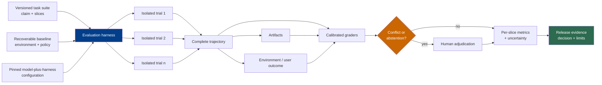

# 第 11 章：评估

《Foundations》第 13 章建立了 model-behavior layer 的基础：representative tasks、repeated trials、grader types、pass@k、pass^k，以及 metrics 作为 proxies 的局限。它明确把 tool execution、permissions、side effects、agent trajectories、environment-state grading、operational reliability 与 release gates 交给本卷（[LLM Foundations — 第 13 章](../llm-foundations-zh/13-evaluation-for-llm-behavior.md)）。

本章评测用户真正遇到的系统：model 加上 agent harness、runtime、tools、policies 与 environment。它的输出不只是一项分数，而是支持某条有限主张的 evidence，例如：“Configuration C 在 budget B 与 policy P 下，已经可以用于 task distribution D。”

### 11.1 Evaluation Contract

Evaluation 要先陈述 claim，再选择 task 或 metric。OpenAI 的可信评测指南区分 capability elicitation、controlled comparison 与 safeguard-performance claims，因为三者需要不同的 harness 和不同的 supporting evidence（[OpenAI — Trustworthy Third-Party Evaluations](https://openai.com/index/trustworthy-third-party-evaluations-foundations/)）。

面向 release 的 contract 应当说明：

- task distribution 与 excluded cases；
- 接受测试的 model-plus-harness configuration；
- 可用的 environment、tools、permissions 与 data；
- token、time、attempt、cost 与 side-effect budgets；
- success、failure、abstention 与 policy-violation criteria；
- graders 与 human adjudication policy；
- 做出 decision 所需的 uncertainty 与 per-slice reporting。

缺少这份 contract 的 headline score 很容易被过度泛化。它只描述一个 setup 下观察到的 behavior，而不是 model 或 agent 的内在属性。

### 11.2 Agent Eval 的规范词汇

Anthropic 定义了 agent evaluation 的主要组件，并明确区分 evaluation harness 与 agent harness（[Anthropic — Demystifying Evals for AI Agents](https://www.anthropic.com/engineering/demystifying-evals-for-ai-agents)）。本书使用以下规范词汇：

| 术语 | 本书定义 |
|---|---|
| **Task** | 一条 test case，包含声明过的 inputs、initial environment、available capabilities、budgets 与 success criteria。 |
| **Trial** | 一套 tested configuration 从已恢复 baseline 出发，对一个 task 进行的一次 attempt。 |
| **Grader** | 依据声明的 evidence 判断一项明确 property，并返回 verdict 或 score 的 versioned logic。 |
| **Eval transcript / trajectory** | 为某次 trial 判分而完整保存的 model、tool 与 observation-level record。 |
| **Outcome** | Trial 产生的最终 relevant state，包括 environment 与 external-effect state，而不只是 response text。 |
| **Evaluation harness** | 负责 provision baseline、调用 agent harness、记录 evidence、运行 graders、聚合 trials 并生成报告的 test infrastructure。 |
| **Agent harness** | 被测试的 model-facing system，负责组装 context、驱动 loop、验证 proposals，并协调 tools 与 runtime。 |
| **Evaluation suite** | 用于支持某项 capability、regression、reliability 或 policy claim 的 versioned task collection。 |

Anthropic 有时把 *transcript*、*trace* 与 *trajectory* 当作完整 eval run 的近义词。本书把 **trace** 专门用于由 span、attribute、event、link、timestamp 与 status 构成的 observability data；OpenTelemetry 也允许 tracing layer 进行 sampling（[OpenTelemetry — Trace API](https://opentelemetry.io/docs/specs/otel/trace/api/)）。只有当 evaluation harness 保证每项 grader-required event 与 artifact 都完整时，才能从 trace instrumentation 派生 eval trajectory。经过采样的 production trace 并不会自动成为 eval transcript。

### 11.3 分别评估四层 Evidence

Agent success 包含多个层级。不能把所有 grader 都压缩为同一种“correct”。

| Evidence layer | 能够证明什么 | Typical graders | 单独使用时不能证明什么 |
|---|---|---|---|
| **Process / trajectory** | Required/forbidden actions、approval use、tool arguments、turn count、budget 与 recovery behavior | Event assertions、policy checks、trajectory rubric | Final artifact 或 environment 是否正确 |
| **Artifact** | Produced file、diff、report、dataset、build 或 citation set 的属性 | Unit tests、static analysis、schema/content checks、expert rubric | Artifact 是否已部署或造成预期 external effect |
| **Environment state** | Database row、filesystem state、UI/backend state、message sent、permission change 与 cleanup completion | State queries、integration tests、independent API checks | User 是否体验到或认可结果 |
| **User / business outcome** | Resolution、acceptance、satisfaction、conversion、loss avoided 或其他 product-level effect | User confirmation、business event、controlled study、delayed outcome join | 在缺少更多 evidence 时进行细粒度归因 |

Anthropic 的订票案例具体说明了 environment distinction：agent 声称机票已经预订，属于 transcript content；environment 中是否存在 reservation row 才是 outcome（[Anthropic — Demystifying Evals for AI Agents](https://www.anthropic.com/engineering/demystifying-evals-for-ai-agents)）。同一原则也适用于代码：可信的 final message 不等于 passing build，passing unit test 也未必等于真正可用的 end-to-end user flow。

如果 path 本身属于 contract，例如 mandatory approval、prohibited data access 或 cost ceiling，那么 process grading 是合适的。不能仅仅因为作者预期某条路径，就要求一种精确 tool sequence；Anthropic 报告过 rigid path grading 会拒绝通过另一条路径实现目标的有效解法（[Anthropic — Demystifying Evals for AI Agents](https://www.anthropic.com/engineering/demystifying-evals-for-ai-agents)）。

保留四层之间的 links：`task_id → trial_id → trajectory events → artifact versions → environment snapshot → user/business event`。这条 lineage 让 reviewer 能区分 process violation、artifact defect、environment failure，以及 trial 之后才发生变化的 outcome。

### 11.4 从隔离、可恢复的 Baseline 运行多个 Trial

一次成功 trial 只能证明可能性，不能证明可靠性。Agent output 与 tool path 可能在运行之间变化，因此当 product claim 依赖 repeatability 时，evaluation harness 应对每个 task 运行多个 trials（[Anthropic — Demystifying Evals for AI Agents](https://www.anthropic.com/engineering/demystifying-evals-for-ai-agents)）。

每个 trial 都从一份声明过的 baseline 开始：

- immutable environment image 或 reproducible fixture version；
- 干净的 filesystem、database、queues、caches、browser profile 与 external-resource namespace；
- task-specific credentials 与 tenant identity；
- 必要时使用 controlled clock、network stubs 或 recorded external responses；
- 已知 resource quotas，且不存在早先 trials 遗留的 artifacts；
- teardown verification，以及 setup 或 cleanup 失败时的 recovery path。

Anthropic 记录过 shared state 同时会造成 failure correlation 和虚假的分数膨胀，其中一个内部案例是 agent 检查了早先 trials 遗留的 git history（[Anthropic — Demystifying Evals for AI Agents](https://www.anthropic.com/engineering/demystifying-evals-for-ai-agents)）。因此，isolation 保护的是 measurement validity，而不只是 test hygiene。

区分三种结果：

1. **Task verdict：** tested system 获得 pass、fail 或 partial credit。
2. **Infrastructure-invalid trial：** setup、dependency、grader 或 cleanup 失败，因此该 attempt 没有测量 agent claim。
3. **System reliability failure：** 在声明的 production-like contract 内出现 in-scope timeout、tool error、recovery failure 或 resource exhaustion。

不能把第 3 类作为“eval noise”丢弃。也不能在不单独报告的情况下，把第 2 类算成 agent failure。只有根据被记录的 policy 才能 retry invalid trial；否则重复 retry 会掩盖不稳定的 evaluation harness。

### 11.5 固定 Tested Configuration，并按 Slice 报告

Eval result 属于完整的 tested configuration。需要固定或记录：

```text
EvalConfiguration {
  model_snapshot, provider_endpoint, reasoning_settings,
  agent_harness_version, prompt_and_context_policy,
  tool_catalog_and_schemas, runtime_and_environment_image,
  retrieval_and_index_versions, policy_and_approval_rules,
  retry_timeout_and_budget_rules,
  task_suite, graders, adjudication_policy
}
```

OpenAI 的 evaluation playbook 同样要求报告披露 system、harness、tool access、elicitation method、budgets、safeguards 与 validity checks，因为这些选择可能显著改变 score 能够支持的 claim（[OpenAI — Trustworthy Third-Party Evaluations](https://openai.com/index/trustworthy-third-party-evaluations-foundations/)）。

先报告 per-slice result，再给 blended aggregate。至少包括：

- **task 与 quality：** domain、difficulty、language、input shape，以及 ordinary/edge/historical failure；
- **routing：** 第 8 章定义的 route target、reasoning tier、cascade/fallback/hedge/human escalation；
- **cost：** input、output、reasoning、cache、retrieval、tool、grader 与 human-review cost；
- **latency：** router、model、tool、grader、end-to-end p50/p95/p99、timeout 与 queue time；
- **failure class：** model、transport、schema、tool、environment、recovery、grader、policy 与 ambiguous side effect；
- **policy：** tenant、identity、data region、model allowlist、approval、restricted-content 与 cross-tenant tests。

Aggregate 可能在 high-risk slice 回归的同时得到改善。因此，release gate 应作用于 critical slices 与 hard policy checks，而不只是一项 weighted average。

### 11.6 正确使用 pass@k、pass^k 与 Uncertainty

令 $p$ 表示单次 trial 的成功概率。如果 $k$ 次 trials 相互独立且同分布，那么：

- **pass@k** 是至少成功一次的概率：$1-(1-p)^k$；
- **pass^k** 是所有 attempts 都成功的概率：$p^k$。

Pass@k 适用于真正会生成多个 candidates，并能识别 successful candidate 的产品；pass^k 表示重复一致性。Anthropic 强调，应由 product contract 决定使用哪项 metric（[Anthropic — Demystifying Evals for AI Agents](https://www.anthropic.com/engineering/demystifying-evals-for-ai-agents)）。不能仅仅因为 pass@k 数字更大，就为只允许一次 attempt 的 user experience 报告它。

当 $n$ 个 sampled candidates 中有 $c$ 个正确时，HumanEval/Codex 论文在 $n \ge k$ 时使用估计量 $1-\binom{n-c}{k}/\binom{n}{k}$ 计算 pass@k（[Chen et al. — Evaluating Large Language Models Trained on Code](https://arxiv.org/abs/2107.03374)）。该估计量回答的是 sampling question；它不会使 correlated trials 变得独立，也不能证明 selector 能找到 passing candidate。

汇总结果必须同时报告 counts 与 uncertainty：task 数量、每个 task 的 trial 数、successes、invalid trials 和 interval method。NIST 介绍了用于 binomial proportion 的 Wilson 等 confidence interval；与把 observed fraction 当作精确事实相比，这类区间能表达估计不确定性（[NIST/SEMATECH — Confidence Intervals for a Proportion](https://itl.nist.gov/div898/handbook/prc/section2/prc241.htm)）。Binomial interval 假设用于计算的 observations 符合声明的 binomial sampling model。

Agent trials 往往按 task 或 environment 聚类。如果 attempts 共享 task、outage、cache、account 或 fixture defect，把每次 attempt 当作独立 observations 会夸大 precision。应视情况使用 task-level paired comparison、task-level bootstrap 或 hierarchical model，并披露 sampling unit。第 16 章会分析一个 infrastructure configuration 显著改变 agentic coding 结果的实测案例（[Anthropic — Infrastructure Noise](https://www.anthropic.com/engineering/infrastructure-noise)）。

Uncertainty 不只是一条 confidence interval。还要报告对 task-set version、grader version、invalid-trial policy 与 infrastructure configuration 的 sensitivity。即使统计区间很窄，misconfigured eval 仍然是无效 evidence。

### 11.7 把 Grader 作为 Measurement Instrument 校准

对于能够确定的 property 使用 deterministic grader；对于 rubric-based semantic judgment 使用 model grader；对于 expert 或 consequential ambiguity 使用 human。Anthropic 记录了这三类 grader，并建议用 human judgment 校准 model-based grader（[Anthropic — Demystifying Evals for AI Agents](https://www.anthropic.com/engineering/demystifying-evals-for-ai-agents)）。

每个 grader 都要有 contract：

```text
GraderResult {
  grader_version, evidence_ids,
  verdict: pass | fail | partial | abstain,
  score, reason_code, explanation,
  confidence_or_supporting_checks
}
```

构建经过 adjudication 的 calibration set，其中包含 clear positives、clear negatives、boundary cases、valid alternative solutions、insufficient-evidence cases，以及企图利用 grader 的 adversarial attempts。对每个 grader 与 critical slice 测量：

- **false positive：** grader 让已经 adjudicate 为 failure 的 case 通过；
- **false negative：** grader 把已经 adjudicate 为 success 的 case 判为失败；
- **abstention rate：** grader 正确或过度地拒绝下结论；
- **coverage：** grader 能对 intended cases 中多少比例给出有 evidence 支持的 verdict；
- **agreement by slice：** model 与 human judgments 在哪些位置有分歧，而不只是 aggregate agreement；
- **cost 与 latency：** grader 是否适用于 live loop、CI gate 或 offline audit。

这里的 *positive* 指 grader 的 `pass` label。如果 safety classifier 把“violation”定义为 positive，这些名称就会反转；因此应发布带 label 的 confusion matrix，而不能只依靠术语名称。

错误代价并不对称。Destructive-action safety check 中一个 false positive 可能比许多 false negatives 更重要；creative-writing rubric 中的 false negative 可能主要只是浪费 review time。Threshold 与 escalation rule 应根据 consequence 设置，而不是使用一个通用 target accuracy。

为 semantic grader 提供明确的 **abstain** 或 **insufficient evidence** 选项。Anthropic 报告 model grader 需要仔细 calibration，并建议在 evidence 不足时提供 “Unknown” path（[Anthropic — Demystifying Evals for AI Agents](https://www.anthropic.com/engineering/demystifying-evals-for-ai-agents)）。其 motivated-mislabeling 研究还发现，向 model evaluator 透露后果可能改变 labels；abstention 与更严格 rubric 能减轻、但不能消除观察到的效应（[Anthropic — Agentic Misalignment in Summer 2026](https://alignment.anthropic.com/2026/agentic-misalignment-summer-2026/)）。当 candidate identity 与 deployment consequence 与 rubric 无关时，应向 judge 隐藏它们。

在运行 release eval 前定义 conflict resolution：

1. deterministic evidence 只对该 check 真正能证明的狭窄 property 优先；
2. mandatory policy failure 不能被 quality graders 的分数平均掉；
3. grader disagreement 或 abstention 连同全部 evidence 进入 review queue；
4. human adjudicator 使用 versioned rubric，并记录 reason code；
5. adjudicated cases 返回 calibration set，但 rubric 发生变化时必须创建新的 grader version。

Human judgment 不会自动成为一致的 ground truth。对 high-impact dispute 使用多位 reviewer 或 escalation reviewer，测量 disagreement；当 experts 对 rubric 有不同理解时，应改进 rubric。

### 11.8 测量 Agent Loop 使用的 Verifier

第 13 章会在 schema check、deterministic test、environment check、same-agent critique、independent model grader 与 human review 之间做选择。本章为该选择提供 evidence。

对每个 proposed verifier 测量：

- 它能检测和遗漏哪些 failure classes；
- false-positive、false-negative、abstention 与 disagreement rates；
- 它在实际运行位置上的 latency 与 cost；
- 它的 failure 是否与 generator failure 相关；
- 它是否容易受到 leaked answer、reward hacking 或 path overfitting 影响；
- 接受 bad result 或拒绝 good result 的 consequence。

Live loop 中使用的 verifier 与 evaluation harness 中使用的 grader 可以共享代码，但二者扮演不同角色。Live verifier 会改变 trajectory，也可以向 agent 提供 repair information；holdout grader 则测量最终系统。如果 agent 可以检查 hidden tests、reference answer 或 release grader，eval 测到的可能是 grader exploitation，而不是 task success。

不要因为“maker must not be checker”就直接选择 independent model judge。Independence 可以减少一种 correlated failure，但它是否有用，取决于测得的 error profile、consequence、latency 与 cost。第 13 章会使用这些 evidence 构建 verifier hierarchy，而不是规定一条普遍 checker rule。

### 11.9 把 Eval Result 转化为 Release Evidence

Release packet 应当能够从 immutable artifacts 中重建：

- claim 与 decision owner；
- tested configuration 与 comparison baseline；
- task-suite manifest 与 slice coverage；
- environment baseline、isolation 与 reset evidence；
- trial counts、invalid-trial accounting 与 pass/fail/partial results；
- product semantics 确实需要时的 pass@k 或 pass^k，以及 uncertainty；
- grader calibration results、conflicts、abstentions 与 human adjudications；
- policy 与 safety gate results；
- cost、latency、reliability 与 routing slices；
- representative trajectories、artifacts、environment diffs 与 known limitations；
- release decision、exception owner、expiry、rollback trigger 与 post-release monitors。

OpenAI 建议 evaluation report 说明 claim、tested system、harness/tools、budgets、elicitation choices，以及对 broken task、reward hacking、contamination、refusal 与 sandbagging 等 hazard 的检查（[OpenAI — Trustworthy Third-Party Evaluations](https://openai.com/index/trustworthy-third-party-evaluations-foundations/)）。同样的纪律能让 internal release decision 接受 review，而不是让一项 dashboard number 变成原因不明的批准。

Release gate 应结合 hard constraints 与 statistical evidence。即使 aggregate task success 得到改善，一项得到确认的 cross-tenant disclosure、unauthorized action 或 broken mandatory approval 仍然属于 gate failure。轻微 quality regression 则可能需要 uncertainty-aware decision，而不是自动 block。应记录由哪条 rule 产生 decision。

### 11.10 维护 Suite，并闭合 Production Loop

每次重要 evaluation run 都要阅读 trajectories 与 grader disagreements。Anthropic 报告过 transcript review 会发现 aggregate score 看不见的 ambiguous tasks、overly rigid graders、shared-state shortcuts 与其他 defects（[Anthropic — Demystifying Evals for AI Agents](https://www.anthropic.com/engineering/demystifying-evals-for-ai-agents)）。Failure 应显得公平：task 可以解决，environment 正常工作，verdict 也能从声明的 evidence 推导出来。

Evaluation suite 是 versioned product。加入逃逸到生产环境的 failures，保留重要 regressions，轮换 held-out cases，退役不合理的 tasks，并保留历史，而不是原地编辑 old scores。如果 task 或 grader 发生变化，就不能把新旧 score 当作只有 agent 发生变化来比较。

Offline eval 不能替代 production monitoring、user feedback、controlled experiment 或 incident review。Production 会带来新的 task distribution 和延迟出现的 user/business outcomes；evaluation harness 则把合适案例变成隔离、可重复的 tests。第 17 章会使用 trace 寻找 failure pattern，但本章的 release evidence 仍以完整 trial trajectories、artifacts、outcomes 与 declared graders 为基础。

---

## 图：从隔离 Trial 到 Release Evidence



---

## 要点

- **Foundations 止步于 model-behavior eval；Harness 负责 system evidence：** trajectory、tool、permission、side effect、environment outcome、reliability 与 release gate 都属于本章。
- **使用精确 eval objects：** task、trial、grader、eval trajectory、outcome、evaluation harness 与 agent harness 各不相同。
- **Trace 不会自动成为 trajectory：** observability data 可能被 sampling；grader evidence 必须完整。
- **分别评估 evidence layers：** process、artifact、environment state 与 user/business outcome 回答不同问题。
- **运行重复、隔离的 trials：** recoverable baseline 与 invalid-trial accounting 是 reliability claim 的前提。
- **报告 tested configuration 与 slices：** quality、routing、cost、latency、failure 与 policy result 必须与 aggregate 一起呈现。
- **根据 product semantics 使用 pass@k 与 pass^k：** 说明 independence assumption、counts、intervals 与 sampling unit。
- **校准 graders：** 测量 false positive、false negative、abstention、coverage、conflict 与 human adjudication。
- **在 verifier 进入 loop 前先测量它：** 第 13 章会使用这些 error、consequence、latency 与 cost profiles。
- **发布 release evidence，而不是裸分数：** 保留 claim、versions、artifacts、uncertainty、exceptions、rollback rules 与 post-release monitors。

## 延伸阅读

- Mikaela Grace et al., *Demystifying Evals for AI Agents*, Anthropic, Jan 2026. https://www.anthropic.com/engineering/demystifying-evals-for-ai-agents
- OpenAI, *A Shared Playbook for Trustworthy Third-Party Evaluations*, May 2026. https://openai.com/index/trustworthy-third-party-evaluations-foundations/
- OpenTelemetry, *Tracing API*. https://opentelemetry.io/docs/specs/otel/trace/api/
- Mark Chen et al., *Evaluating Large Language Models Trained on Code*, 2021. https://arxiv.org/abs/2107.03374
- NIST/SEMATECH, *Confidence Intervals for a Proportion*. https://itl.nist.gov/div898/handbook/prc/section2/prc241.htm
- Gian Segato, *Quantifying Infrastructure Noise in Agentic Coding Evals*, Anthropic, Feb 2026. https://www.anthropic.com/engineering/infrastructure-noise
- Anthropic Safeguards Research Team, *Agentic Misalignment in Summer 2026*, 2026. https://alignment.anthropic.com/2026/agentic-misalignment-summer-2026/
