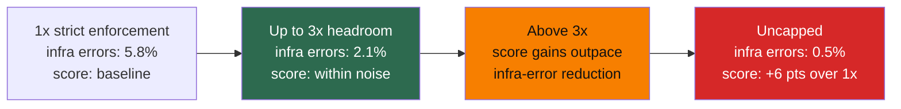

# 第 11 章：基础设施噪声

Benchmark leaderboard 上的微小分差，往往不像小数点后的数字所暗示的那样确定。Anthropic 的 “Quantifying Infrastructure Noise” 展示了这种不确定性可能有多大 ([Anthropic - Quantifying Infrastructure Noise in Agentic Coding Evals](https://www.anthropic.com/engineering/infrastructure-noise))。

静态 benchmark 直接对模型输出评分，agentic coding eval 则不一样：模型需要编写程序、运行测试、安装依赖，并在多轮交互中不断调整方案。因此，runtime 不是一个被动的容器，而是求解过程的一部分。资源预算不同的两个 agent，实际上参加的并不是同一场考试。

### 11.1 主要结果

Anthropic 在 Google Kubernetes Engine 集群上，以六种资源配置运行了 Terminal-Bench 2.0。Claude 模型、harness 和任务集全部保持不变，唯一变化的是资源 floor 与 ceiling。资源最充足和最受限的两种配置，最终相差 6 个百分点（p < 0.01）([Anthropic - Quantifying Infrastructure Noise](https://www.anthropic.com/engineering/infrastructure-noise))。

这个差距比 leaderboard 顶部模型之间的典型分差还要大。含义很直接：领先 2 个百分点，可能代表真实的能力优势，也可能只是因为其中一次 eval 使用了性能更强的硬件。

### 11.2 两种资源区间

实验结果呈现出两种不同的资源区间：

- **从 1x 到 3x 单任务资源规格**，分数只在统计噪声范围内波动（p = 0.40），但基础设施错误率持续下降：从严格 enforcement 时的 5.8%，降至提供 3x headroom 时的 2.1%（p < 0.001）。新增资源为瞬时内存峰值留出了余量，避免容器因此发生 OOM。也就是说，在这个区间内，额外资源明显提高了 eval 的稳定性，却没有在可测量的程度上让任务变得更容易。
- **超过 3x 后**，分数上升的速度快于基础设施错误率下降的速度。从 3x 增加到 uncapped，infra errors 只下降了 1.6 个百分点，任务成功率却上升了将近 4 个百分点。此时，额外资源不再只是防止崩溃，还让 agent 能采用依赖宽裕资源的策略，例如安装大型依赖、运行高内存测试套件，或借助重量级工具暴力求解（brute force）。

### 11.3 对测量意味着什么

严格的资源限制奖励高效策略，宽松的限制则奖励善于利用可用容量的 agent。这两种能力都值得测量。问题在于，如果不记录资源配置，就把不同配置下的结果合并成一个分数，这个分数将很难解释。

Anthropic 的 `bn-fit-modify` task 很好地说明了这一点。在资源宽松时，一些模型还没开始编写解法，就会先安装完整的 Python 数据科学栈，包括 pandas、networkx 和 scikit-learn。资源受限时，pod 会在安装过程中耗尽内存。其实还有一种更轻量的策略：只用标准库从头实现所需的数学计算，有些模型默认就会选择这种方法。因此，资源配置决定了哪一种默认策略能够成功 ([Anthropic - Quantifying Infrastructure Noise](https://www.anthropic.com/engineering/infrastructure-noise))。

同样的效应也出现在 Terminal-Bench 之外，只是幅度较小。在 Anthropic 的 SWE-bench 实验中，使用 5x RAM 的配置，在 227 个问题上的得分比 1x 配置高 1.54 个百分点。这个差距小于 Terminal-Bench，是因为 SWE-bench 任务对资源的需求较低；但增加资源依然不是一个中性变化 ([Anthropic - Quantifying Infrastructure Noise](https://www.anthropic.com/engineering/infrastructure-noise))。

### 11.4 建议

Eval 应分别指定保证分配量（floor）和硬上限（ceiling），而不是把资源固定在单一数值。对 Terminal-Bench 来说，把 ceiling 设为单任务资源规格的 3x 是一个合理的默认值：这样既能把 infra errors 减少三分之二，又能让分数增幅保持在统计噪声范围内 ([Anthropic - Quantifying Infrastructure Noise](https://www.anthropic.com/engineering/infrastructure-noise))。合适的倍数取决于具体 benchmark 和任务分布，因此每次报告结果时都应明确说明。

对 leaderboard 的读者来说，实践规则很简单：在资源配置得到完整记录并彼此匹配之前，应谨慎看待低于 3 个百分点的分差。领先几分可能意味着真实的能力差异，也可能仅仅意味着使用了更大的 VM。

---

## 图：资源配置与分数（Terminal-Bench 2.0 汇总）

下表总结了 Anthropic 报告的两种资源区间。原文只明确给出了 1x、3x 和 uncapped 配置的错误率，因此中间一行采用定性描述，避免表现出来源并未提供的精度。

| 资源水平 | Infra Error Rate | 分数变化 | 解释 |
|---|---|---|---|
| 1x（严格） | 5.8% | baseline | OOM kill 掩盖任务本身的失败 |
| 3x | 2.1% | 噪声内 | 实践平衡点：infra errors 减少 2/3 |
| 3x 以上 | 更低 | 分数开始比 infra errors 更快上升 | Agent 开始利用额外 RAM |
| Uncapped | 0.5% | 比 1x +6 pts | 资源密集型默认策略得以成功 |

*超过 3x 后，分数增幅开始超过基础设施错误率的降幅：额外资源不仅提高稳定性，还会启用新的策略。*

---

## 要点

- **仅硬件差异就能造成 6 个百分点的分差**：Terminal-Bench 2.0 中资源最充足与最受限配置之间的差距，超过了 leaderboard 顶部模型之间常见的分差。
- **存在两种资源区间**：从 1x 增加到 3x，主要作用是减少基础设施不稳定；超过 3x 后，则会启用资源密集型策略。
- **3x ceiling 是实用的默认值**：它能把 infra errors 减少三分之二，同时让分数增幅保持在统计噪声范围内。
- **应谨慎看待微小的 leaderboard 分差**：在资源配置得到完整记录并彼此匹配之前，低于 3 个百分点的差异很难解释。
- **资源限制会塑造策略**：严格限制奖励效率，宽松限制奖励利用可用容量的能力。二者都是有效的测量目标，但必须明确区分。

## 延伸阅读

- Gian Segato, *Quantifying Infrastructure Noise in Agentic Coding Evals*, Anthropic, Feb 2026. https://www.anthropic.com/engineering/infrastructure-noise
- Mikaela Grace et al., *Demystifying Evals for AI Agents*, Anthropic, Jan 2026. https://www.anthropic.com/engineering/demystifying-evals-for-ai-agents
- Vivek Trivedy, *Improving Deep Agents with Harness Engineering*, LangChain, Feb 2026. https://blog.langchain.com/improving-deep-agents-with-harness-engineering/
