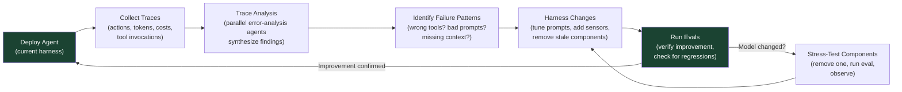

# 第 11 章：基于 Trace 的迭代与 Model-Harness 共同演化

### 11.1 Traces 是反馈回路

今天的模型很大程度上是黑箱，内部机制难以解释。但输入和输出以文本形式可见，这足以驱动系统改进。LangChain 将 traces 视作 harness 调试的主要表面：每个 agent 动作都被存储，包括延迟、token 数、成本和工具调用 ([LangChain - Improving Deep Agents](https://blog.langchain.com/improving-deep-agents-with-harness-engineering/))。

他们的 *Trace Analyzer Skill* 自动化了这个循环：

1. 从 LangSmith 拉取实验 traces。
2. 派生并行错误分析 agents；主 agent 综合发现和建议。
3. 聚合反馈，并对 harness 做目标明确的改动。

这在结构上类似经典机器学习中的 boosting：迭代聚焦于上一轮错误。第 3 步有人类 review 会有帮助，但不严格必要，主要用于防止改动过拟合特定任务而损害泛化。

### 11.2 压力测试负载组件

Anthropic 的 harness-design 后续文章增加了互补纪律 ([Anthropic - Harness Design for Long-Running Application Development](https://www.anthropic.com/engineering/harness-design-long-running-apps))。Harness 中每个组件都编码了一个关于“模型无法独立完成什么”的假设。随着模型改进，这些假设会过期。推荐做法是：一次移除一个组件，跑 eval，然后观察结果。

当 Opus 4.6 推出并带来更强长上下文检索和长周期 coding 行为后，Anthropic 在一个 harness 版本中移除了 sprint construct。Generator 可以不经 sprint decomposition 连续运行两个多小时。Evaluator 在早期模型上更 load-bearing，但在 4.6 上变得更情境化：对处在当前模型 solo 能力边缘的任务有用，在能力范围内则可能是不必要开销。团队总结的原则是：“evaluator 不是固定的 yes/no 决策。任务超出当前模型 solo 可靠边界时，它才值得成本。”

### 11.3 Model-Harness 共同演化

今天的 frontier coding models 往往在其 harness 中一起 post-train ([LangChain - The Anatomy of an Agent Harness](https://blog.langchain.com/the-anatomy-of-an-agent-harness/))。有用 primitive 被发现、加入 harness，并用于训练下一代模型；下一代模型在该 harness 中表现更强。这形成反馈回路，也带来副作用：改变 harness 逻辑可能让模型表现更差，即使改动看起来中性。

Codex 的 `apply_patch` 工具是典型例子。Codex 模型在这种具体 patch 格式上 post-train。OpenCode 作为 Claude Code 的开源替代，为 GPT/Codex 模型专门添加了 `apply_patch` 工具，以模拟 Codex harness；Claude 和其他模型仍使用普通 `edit` 与 `write` 工具 ([HumanLayer - Skill Issue](https://www.humanlayer.dev/blog/skill-issue-harness-engineering-for-coding-agents))。

### 11.4 最佳 Harness 不一定是模型训练时的 Harness

对应推论，也是实践中可以大胆迭代的理由：模型训练时的 harness 通常不自动等于某个任务上的最优 harness。Terminal-Bench 2.0 是实践讨论中的常见数据点：HumanLayer 引用 Opus 4.6 在 Claude Code 中排名 33，而同一模型在另一 harness 中排名 5，leaderboard noise 大约为 4 个名次 ([HumanLayer - Skill Issue](https://www.humanlayer.dev/blog/skill-issue-harness-engineering-for-coding-agents); [LangChain - The Anatomy of an Agent Harness](https://blog.langchain.com/the-anatomy-of-an-agent-harness/))。应把具体名次视为 leaderboard 快照，而不是永久模型事实。

LangChain 的案例研究也实验性地得出同结论。他们用早期 harness 测 Claude Opus 4.6，得分 59.6%，有竞争力但低于调优后的 Codex 配置。原则可以泛化，例如上下文准备和验证；但针对模型再做几轮 harness 迭代，可能弥合差距 ([LangChain - Improving Deep Agents](https://blog.langchain.com/improving-deep-agents-with-harness-engineering/))。

实用规则是：换模型时，重新审查 harness。调优仍然 load-bearing 的部分，移除不再承担负载的部分。

### 11.5 实践要点

LangChain 总结的 harness 迭代原则 ([LangChain - Improving Deep Agents](https://blog.langchain.com/improving-deep-agents-with-harness-engineering/))：

1. **替 agent 做 context engineering**：用目录结构、可用工具、编码最佳实践、问题解决策略给模型 onboard 环境。
2. **帮助 agent 自我验证**：模型偏向第一个看似合理方案；应强提示其通过测试验证。
3. **Tracing 作为反馈信号**：同时调试工具和推理；模型走错路可能因为缺工具，也可能因为缺使用工具的指令。
4. **短期检测并修复坏模式**：loop detection 等 guardrail 是会随模型进步而消失的拐杖，但今天有用。
5. **按模型定制 harness**：Claude 与 Codex prompting guide 不同是有原因的；原则泛化，细节不泛化。

HumanLayer 的平行经验 ([HumanLayer - Skill Issue](https://www.humanlayer.dev/blog/skill-issue-harness-engineering-for-coding-agents))：

有效的是：从简单开始，只在真实失败后添加配置；迭代并丢弃无效内容；通过 repo-level config 在团队内分发经过验证的配置；优化迭代速度，而不是只优化一次成功概率；在知道真正需要什么后修剪能力。

无效的是：预先设计理想 harness；“以防万一”安装几十个 skills 和 MCP servers；每次 session 末尾跑完整测试套件；微调每个 sub-agent 可访问哪些工具。

### 11.6 关于 AGENTS.md 的误导性数据

一个值得阅读的细节：ETH Zurich 研究测试了多个 repo 中 138 个 agentfiles，发现 LLM 生成的 agentfile 会损害性能并增加 20% 成本；人类写的只提升约 4%；agent 处理 context-file 指令时多花 14-22% reasoning tokens；代码库概览和目录列表在该 benchmark 中没有帮助，因为 agent 自己可以发现 repo 结构 ([HumanLayer - Skill Issue](https://www.humanlayer.dev/blog/skill-issue-harness-engineering-for-coding-agents) citing the ETH Zurich paper)。

HumanLayer 将其解读为支持自己的 AGENTS.md 建议：文件要简短，避免自动生成，用渐进披露而不是前置倒入所有指令，内容应普遍适用，而不是充满条件规则。他们自己的 CLAUDE.md 不到 60 行。

通用原则是：更多配置不等于更好。每条无关指令都是 agent 必须处理但没有收益的指令；*instruction budget* 与 token budget 同样重要。

---

## 图：基于 Trace 的迭代循环

---

## 要点

- **Traces 是主要调试表面**：模型内部不可见，但文本 I/O 可见；系统化 trace 分析驱动 harness 改进。
- **训练时 harness 不自动最优**：leaderboard 快照显示，同一模型在不同 harness 下可能大幅移动。
- **模型变化时压力测试组件**：每个 harness 组件都编码了可能过期的假设。
- **Model-harness 共同演化真实存在**：post-training 将 harness 纳入训练回路，改变任一侧都可能破坏耦合。
- **AGENTS.md ROI 有限**：简短、人写、普遍适用；LLM 生成可能伤害性能。
- **迭代速度胜过前置设计**：从简单开始，只在真实失败后添加，并积极修剪。

## 延伸阅读

- Vivek Trivedy, *Improving Deep Agents with Harness Engineering*, LangChain, Feb 2026. https://blog.langchain.com/improving-deep-agents-with-harness-engineering/
- Prithvi Rajasekaran, *Harness Design for Long-Running Application Development*, Anthropic, Mar 2026. https://www.anthropic.com/engineering/harness-design-long-running-apps
- Vivek Trivedy, *The Anatomy of an Agent Harness*, LangChain, Mar 2026. https://blog.langchain.com/the-anatomy-of-an-agent-harness/
- Kyle Brunet, *Skill Issue: Harness Engineering for Coding Agents*, HumanLayer, Mar 2026. https://www.humanlayer.dev/blog/skill-issue-harness-engineering-for-coding-agents
