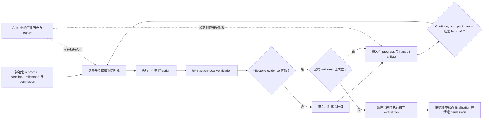

# 第 12 章：长时运行 Agent 与跨上下文任务

长时运行 Agent 工程的本质是**延长任务跨度（horizon extension）**：保存足够多且经过验证的意图、进度和操作上下文，让有效工作可以跨越单个模型上下文或 worker session 的有效生命周期继续推进。它不是让同一条 transcript 无限延长。

本章以[第 10 章](./10-state-event-history-production-factors.md)建立的持久化 runtime 为前提。事件历史、replay、checkpoint、retry、action identity、approval state 的持久化和崩溃恢复由第 10 章负责；人类审批契约则由[第 14 章](./14-human-agent-interaction.md)负责。本章回答另一个问题：**每次跨越边界时，哪些语义工作状态必须保留下来，下一份上下文才能正确续接任务？**

### 12.1 先定义要延长的“跨度”

“长”可能指几种不同的量：

- **Wall-clock duration（墙钟时长）**：一次 run 保持开启的时间。
- **Model-context span（模型上下文跨度）**：一次模型调用或一份上下文可见的输入量。
- **Session span（会话跨度）**：一个 worker 或 sandbox 被保留的时间。
- **Task horizon（任务跨度）**：完整的模型加 harness 系统能以某一可靠性完成多困难的连贯端到端任务。

这些量不能互换。一个六小时进程可能大部分时间都在等待；一次 reset 可以替换模型上下文，却不结束 run，也不替换 sandbox。反过来，一次很短的调用也可能完成一个人类专家需要数小时才能完成的任务。

METR 的 **task-completion time horizon（任务完成时间跨度）**是一个有用但范围更窄的能力指标。截至 METR 在 2026 年 5 月 8 日更新的 Time Horizon 1.1，50% time horizon 指：以人类专家任务时长为自变量拟合成功率后，预测 Agent 成功率为 50% 时对应的任务时长。METR 用 logistic curve 拟合 Agent 成功率与人类任务时长；对大多数任务，人类时长取在相似说明和工具条件下、受邀专业人员成功尝试时长的几何平均值。当前 suite 包含一百多个可自动评分、相对自包含的任务，来自 RE-Bench、HCAST 和一组较短的软件任务，主要分布在软件工程、机器学习和网络安全领域。METR 同时警告，当前 suite 对 16 小时以上的估计并不可靠（[METR — Task-Completion Time Horizons](https://metr.org/time-horizons/)）。

这个指标**不是** Agent 能连续自主运行多长时间，也不表示它能完成低于该时长的所有任务。该任务分布相对干净、上下文依赖较低，而真实的长期项目往往需要协作、隐性知识和与人互动。METR 在 2026 年 1 月 22 日的方法说明中，仍将 2019–2025 年的长期趋势概括为大约每 6–7 个月翻一番；但同一说明也警告，任务分布并没有被非常精确地定义，把结果外推到数月或数年的工作并不稳健（[METR — Clarifying Limitations of Time Horizon](https://metr.org/notes/2026-01-22-time-horizon-limitations/)）。

这里的方法论结论是：引用任何 horizon 数字时，都要记录日期、任务分布、harness 配置、成功阈值和拟合方法。除非用合适的任务分布重新评测完整系统，否则不要声称某个新 handoff 机制“延长了 METR horizon”。

### 12.2 把语义连续性与持久化执行分开

长时运行系统需要两个互补层次：

| 层次 | 它回答的问题 | 是否由本章负责？ |
|---|---|---|
| 持久化执行 | 哪个 action 已经发生、记录了什么结果，以及从哪里恢复才不会重复副作用？ | 否——见[第 10 章](./10-state-event-history-production-factors.md) |
| 任务跨度延长 | 已经达成了什么、证据是什么、还有哪些风险、下一份上下文该做什么？ | 是 |

这个区分可以避免两个常见的类别错误：

1. Progress document 是一种**投影（projection）**，不是完整的因果事件历史。它可能过时、不完整或被覆盖。
2. Event log 也不会自动成为好的 handoff。继任者不应为了找到当前目标和下一步动作，被迫重读数千条底层事件。

持久历史使恢复安全；handoff 使恢复可理解。生产系统通常两者都需要。

### 12.3 Initializer 建立一个可续接的工作世界

**Initializer** 是首次运行时的角色，不一定必须使用独立模型。它把请求和环境转化为一套后续上下文能够检查和操作的工作系统。在 Anthropic 的长时编码实验中，initializer 创建了启动脚本、进度文件、初始 commit 和完整 feature list；之后的 coding session 逐步推进，并给下一份上下文留下工件（[Anthropic — Effective Harnesses for Long-Running Agents](https://www.anthropic.com/engineering/effective-harnesses-for-long-running-agents)）。

通用 initializer 应建立：

- **目标 outcome 与非目标**：满足请求时应出现什么可观测状态，哪些内容不在范围内。
- **Acceptance map**：milestone、依赖和验证方法。
- **可复现的进入路径**：用于检查、运行和测试当前环境的命令或流程。
- **Baseline evidence**：相关测试、服务、数据或外部资源的初始状态。
- **Progress state**：对 milestone 状态、决策、风险和后续工作的版本化投影。
- **Artifact namespace**：代码、报告、数据集、截图、日志等工作产物的稳定位置或 ID。
- **Policy 与 permission envelope**：适用限制、已授予能力、approval 状态，以及权威 policy 的位置。

对软件工作而言，仓库内、版本化的工件尤其有效，因为继任者能够发现并验证它们。OpenAI 介绍过一种实践：使用简短的仓库地图、结构化文档、版本化 execution plan、进度与决策日志、lint 和文档维护任务，而不是一份巨大的 instruction file（[OpenAI — Harness Engineering](https://openai.com/index/harness-engineering/)）。这是一种实现模式，并不要求每个领域都使用 Git；不变条件是：权威工件必须可寻址，在需要时可版本化，并且下一位 worker 能访问。

Initializer 也必须能够明确失败。如果它无法建立可运行 baseline、无法确定目标 outcome，或无法取得必要权限，就应记录 blocker，而不是在未知状态上生成一份自信的计划。

### 12.4 用 Milestone 把大目标变成有界工作

Milestone 是**可验证的中间 outcome**，而不是“处理后端”这类活动标签。实用的 milestone record 包含：

| 字段 | 用途 |
|---|---|
| `milestone_id` | 跨上下文保持稳定的身份 |
| `outcome` | 应当存在的可观测状态 |
| `dependencies` | 所需先决状态和工件 |
| `verification` | 可以证伪完成状态的检查 |
| `evidence` | 已执行检查的结果和 artifact pointer |
| `status` | `not_started`、`in_progress`、`blocked` 或 `verified` |
| `risks` | 已知不确定性、技术债或验证盲区 |

Anthropic 的实验使用 JSON feature list，并要求每个 coding session 一次只处理一个 feature。选择 JSON、包含 200 多个 feature 的案例，以及 one-feature slice，都是那套特定编码实验中的观察，不是普遍常数（[Anthropic — Effective Harnesses for Long-Running Agents](https://www.anthropic.com/engineering/effective-harnesses-for-long-running-agents)）。Slice 大小应通过实验选择：足够小，能在边界前完成、验证并干净交接；也足够大，能产生有意义的进展。

只有证据仍然有效时，milestone state 才应保持单调。如果依赖变化，或 regression 使原证据失效，已经 `verified` 的项目也可以退回 `in_progress` 或 `blocked`。勾选框只是导航工具，不是证明。

### 12.5 把每次 Handoff 变成 Artifact Contract

**Handoff** 是让继任者无需猜测即可继续工作的语义包。无论继任者是 reset 后的同一模型、不同模型、人类还是另一个 worker，每次 handoff 都必须包含：

1. **Completed work（已完成工作）**——具体变更和 milestone 转换，而不是“有一些进展”。
2. **Verified evidence（验证证据）**——实际执行过的检查、结果、必要的时间戳，以及检查覆盖范围。
3. **Open risks（未决风险）**——失败、不确定性、未测试路径、过时假设和 blocker。
4. **Next action（下一步动作）**——一个有界、可执行的步骤，以及它的预期结果。
5. **Artifact pointers（工件指针）**——稳定的路径或 ID；在漂移会影响正确性时，还要带 version、commit 或内容身份。
6. **Permission context（权限上下文）**——有效 grant、denial、待审批项、过期时间或 scope，以及必须重新授权的操作。

一种可行的 schema 是：

```yaml
handoff_version: 1
objective: "observable target state"
completed_work:
  - milestone_id: M-03
    change: "what changed"
verified_evidence:
  - check: "command, query, or inspection"
    result: "pass/fail plus relevant measurement"
    artifact: "artifact://run/.../evidence/..."
open_risks:
  - "known uncertainty or blocker"
next_action:
  step: "one bounded action"
  expected_result: "observable result"
artifact_pointers:
  - uri: "artifact://project/..."
    version: "commit, digest, or revision"
permission_context:
  grants: ["scoped capabilities"]
  denials: ["known restrictions"]
  pending_approvals: []
```

不要把 secret 复制进 handoff。只记录 capability reference、scope 或 approval ID；让 runtime 在[第 7 章](./07-sandboxing-runtime-enforcement.md)描述的执行边界重新附加凭据。

旧上下文被丢弃前，handoff 必须已经持久化。它的更新与 milestone 转换应使用 runtime 定义的一致性机制——最好是原子 commit 或版本检查——以免两个 worker 静默发布互不兼容的后继状态。该 commit 的因果记录仍然属于[第 10 章](./10-state-event-history-production-factors.md)的事件历史。

### 12.6 有意识地选择上下文转换

[第 5 章](./05-compaction-memory-context-handoffs.md)区分了 context、compaction、memory 和 handoff。对长时任务，harness 必须明确选择转换方式，不能把所有上下文压力都视作同一个问题：

| 转换 | 保留什么 | 适用情况 | 主要风险 |
|---|---|---|---|
| Continue | 当前可见上下文 | 相关证据仍可容纳且保持连贯 | 噪声累积和过时假设 |
| Compact | 持续上下文内的摘要表示 | 连续性有价值，且可信摘要能容纳 | 遗漏或扭曲 |
| Reset + handoff | 新上下文中的精选语义状态 | 干净推理界面值得付出重建成本 | Handoff 状态缺失 |
| Worker handoff | 跨 worker 的工件和执行状态 | ownership、专业分工或 runtime placement 改变 | 版本与权限不匹配 |
| Durable recovery | 已记录结果与执行位置 | 故障、取消、部署或 lease 丢失 | 由第 10 章定义，而不是由 prompt text 定义 |

Anthropic 明确区分了 compaction 与 context reset：前者在原位总结历史，后者启动新上下文并依赖结构化 handoff。在一项与模型版本绑定的实验中，reset 对 Sonnet 4.5 表现出的 “context anxiety” 很重要，而 Opus 4.5 使该 reset 机制可以移除；同一后续研究又在 Opus 4.6 上移除了 sprint decomposition（[Anthropic — Harness Design for Long-Running Application Development](https://www.anthropic.com/engineering/harness-design-long-running-apps)）。这些证据说明应按模型和任务测试 scaffolding，而不是证明 reset、compaction 或 sprint 永远必要。

Context reset 不得隐式重置 durable run、sandbox、permission 或外部资源；这些生命周期拥有不同身份。反过来，sandbox 因受损或遭到入侵而被替换，也不能被描述为一次普通 context reset。

### 12.7 恢复时重新验证，不盲信进度说明

继任者应把 handoff 当作高价值索引，但仍需将其中的主张与权威状态进行 reconciliation。

Resume protocol 应：

1. 确认 objective、run identity、配置版本、artifact revision 和 permission context。
2. 读取最新已提交的 handoff 与 progress state。
3. 检查被引用的工件，而不是只依赖粘贴的摘要。
4. 复现最小但有用的 baseline：启动服务、查询外部状态、打开文档或执行聚焦检查。
5. 把观测状态与已完成 milestone 和证据对照；对证据过期或被反驳的项目重新打开。
6. 选择一个有界的 next action，并说明其预期可观测结果。
7. 执行动作后，更新 evidence、progress state、risk 和下一份 handoff。

Anthropic 的 coding session 也会在实现下一个 feature 前，先检查工作目录、Git 历史、progress file、feature list 和基础端到端 baseline（[Anthropic — Effective Harnesses for Long-Running Agents](https://www.anthropic.com/engineering/effective-harnesses-for-long-running-agents)）。这条规则不限于编码：**从工件恢复，但对照环境验证。**

如果 handoff 指向缺失工件、不同版本、已过期授权或失败 baseline，继任者应进入 reconciliation 或 blocked 状态。不能为了维持“进度感”，从想象出来的状态继续。

### 12.8 让自验证停留在 Action-Local 层

Self-verification 是 action loop 内的即时反馈。例如：编辑后运行聚焦测试、打开生成文件、实际走一遍浏览器路径、写入后查询数据库，或把输出与 schema 对照。Anthropic 的长时编码实验发现，明确要求端到端浏览器测试，可以发现代码检查和较窄验证遗漏的失败（[Anthropic — Effective Harnesses for Long-Running Agents](https://www.anthropic.com/engineering/effective-harnesses-for-long-running-agents)）。

因此 self-verification 很有价值，但它不能让 acting agent 成为全局完成状态的最终裁决者。局部检查可能覆盖不全，Agent 可能误读结果，主观质量也可能需要经过校准的判断。

是否使用**独立 evaluator**取决于具体条件，并非每个 milestone 都必须使用。Anthropic 在 2026 年的后续实验中发现，独立评价对主观任务以及接近 generator 能力边界的任务尤其有用；但对新模型已经可以可靠独立处理的工作，它也可能只是额外开销。随着模型和 harness 变化，更新后的 harness 还把 evaluator 从每个 sprint 执行改成了末尾单次执行（[Anthropic — Harness Design for Long-Running Application Development](https://www.anthropic.com/engineering/harness-design-long-running-apps)）。

应根据[第 11 章](./11-evaluation.md)的 evaluation design 和[第 13 章](./13-loop-engineering.md)的 loop control 决定何时加入 evaluator。相关条件包括：影响高、标准主观或对抗性强、确定性检查薄弱、任务靠近模型可靠性边界，以及有证据表明 evaluator feedback 对 outcome 的改善足以抵偿 latency 和 cost。独立性只是设计杠杆之一，不能替代经过校准的 grader 和基于环境的证据。

### 12.9 依据 Outcome 与环境状态完成任务

Agent 说“完成了”只是 transcript event，不是 outcome。Anthropic 的评测术语给出了具体区分：订票 Agent 可以说 reservation 已经创建，但真正的 outcome 是环境数据库里是否实际存在这条 reservation（[Anthropic — Demystifying Evals for AI Agents](https://www.anthropic.com/engineering/demystifying-evals-for-ai-agents)）。

因此，finalization 应针对权威工件和环境状态，执行与任务对应的成功谓词：

```text
finalize only if
    required_outcomes_hold(environment, artifacts)
    and required_evidence_is_current
    and no_blocking_risk_is_open
    and required_approvals_are_satisfied
```

例如：数据库中存在字段正确的记录、已部署 endpoint 通过健康与行为检查、文件的内容与格式符合要求，或外部 transaction 已提交且有可验证 receipt。由 acceptance map 决定哪些 outcome 是必要的；不是每个任务都需要同一套检查。

Checklist 可以帮助 Agent 导航，progress file 也可以概括之前的工作，但两者都不能成为唯一 completion oracle。如果 outcome 无法验证，应报告 `unverified` 或 `blocked`，同时说明缺少的证据与 next action，而不是基于自信报告 `complete`。

Finalization 还要生成 terminal artifact：已达成 outcome、验证证据、残留风险、artifact pointer，以及权限清理或移交状态。清理阶段应撤销临时 capability，并标明仍保持运行的资源；但不能删除 audit 或 recovery 仍需要的持久证据。

### 12.10 失败模式与控制措施

| 失败模式 | 可观测症状 | Harness 控制 |
|---|---|---|
| One-shot overreach | 大片变更只完成一半，没有干净停止点 | 有界 milestone 与 slice budget |
| Premature completion | 把局部可见进展误认为完整 outcome | Acceptance map 加基于环境的 finalization |
| Stale progress state | Handoff 与工件不一致 | 版本化指针与 resume-time reconciliation |
| Evidence laundering | 声称“测试通过”，却没有命令、结果或覆盖范围 | 结构化 evidence record |
| Half-finished boundary | 离开上下文时 baseline 已损坏 | 边界健康检查与明确 blocker state |
| Permission amnesia | 继任者重复被拒操作，或假定自己拥有 grant | 强制 permission context 与重新验证 |
| Artifact loss | 摘要引用了无法访问的工作 | 可寻址 artifact store 与 retention policy |
| Reset cargo cult | 频繁 reset 增加成本，却不改善 outcome | 按模型/任务做 ablation，并记录 reset telemetry |
| Self-certified finish | Agent 文字或 checklist 是唯一证明 | 对权威状态执行 outcome predicate |
| Infinite local repair | verification-fix loop 反复执行却没有净进展 | 第 13 章的 loop budget 与 escalation |

长期项目的维护负担也会增长。OpenAI 介绍过把仓库 “golden principles” 编码为机械规则和周期性清理任务的实践，原因是 Agent 会复制仓库中既有的模式，其中也包括坏模式（[OpenAI — Harness Engineering](https://openai.com/index/harness-engineering/)）。通用控制原则是：让质量约束可执行，并把维护安排成明确工作，而不是期待每位继任者重新发现架构意图。

### 12.11 参考生命周期



图中的 loop 是语义流程。崩溃恢复、replay、幂等性和并发 ownership 仍然是第 10 章的 runtime 职责。

### 12.12 设计检查表

启用跨上下文执行前，确认：

- 目标 outcome 与非目标可观测。
- Initializer 能建立 baseline，或明确报告失败。
- Milestone 具有稳定 ID、依赖、verification 和 evidence 字段。
- 每次 handoff 都包含 completed work、verified evidence、open risks、next action、artifact pointers 和 permission context。
- Artifact pointer 稳定，并在漂移重要时带版本。
- Resume 会把说明文档与权威工件、环境状态进行 reconciliation。
- Context reset、sandbox replacement 与 durable recovery 是不同操作。
- Self-verification 保持 action-local；evaluator 的使用由任务风险与测得的收益证明。
- 全局完成状态由 outcome 与环境状态决定，而不是 Agent 文字或 checklist。
- 第 10 章的 runtime 能持久化、replay、去重并恢复底层执行。
- Finalization 会记录证据，并清理临时权限与资源。

---

## 要点

- **长时运行设计延长的是任务跨度，不是 transcript。**
- **第 10 章提供持久恢复，第 12 章提供语义连续性。**
- **Initializer 用 baseline、milestone、artifact、progress state 和 permission 建立可续接世界。**
- **每次 handoff 都需要六项内容：** completed work、verified evidence、open risks、next action、artifact pointers 和 permission context。
- **Reset 与 compaction 是与模型和任务相关的选择。** 应测试，而不是把历史 scaffolding 固化。
- **Self-verification 提供局部反馈。** 独立 evaluation 有条件地使用，也不能替代基于环境的证据。
- **只有 outcome 能结束任务。** Agent 自述与 checklist 是有用投影，但永远不足以证明完成。
- **Time-horizon 数字必须附带测量上下文。** 包括日期、任务分布、可靠性阈值、harness setup 和方法。

## 延伸阅读

- Justin Young et al., *Effective Harnesses for Long-Running Agents*, Anthropic, Nov 2025. https://www.anthropic.com/engineering/effective-harnesses-for-long-running-agents
- Prithvi Rajasekaran, *Harness Design for Long-Running Application Development*, Anthropic, Mar 2026. https://www.anthropic.com/engineering/harness-design-long-running-apps
- OpenAI, *Harness Engineering: Leveraging Codex in an Agent-First World*, Feb 2026. https://openai.com/index/harness-engineering/
- Anthropic, *Demystifying Evals for AI Agents*, Jan 2026. https://www.anthropic.com/engineering/demystifying-evals-for-ai-agents
- METR, *Task-Completion Time Horizons of Frontier AI Models*, updated May 8, 2026. https://metr.org/time-horizons/
- Joel Becker, *Clarifying Limitations of Time Horizon*, METR, Jan 22, 2026. https://metr.org/notes/2026-01-22-time-horizon-limitations/
