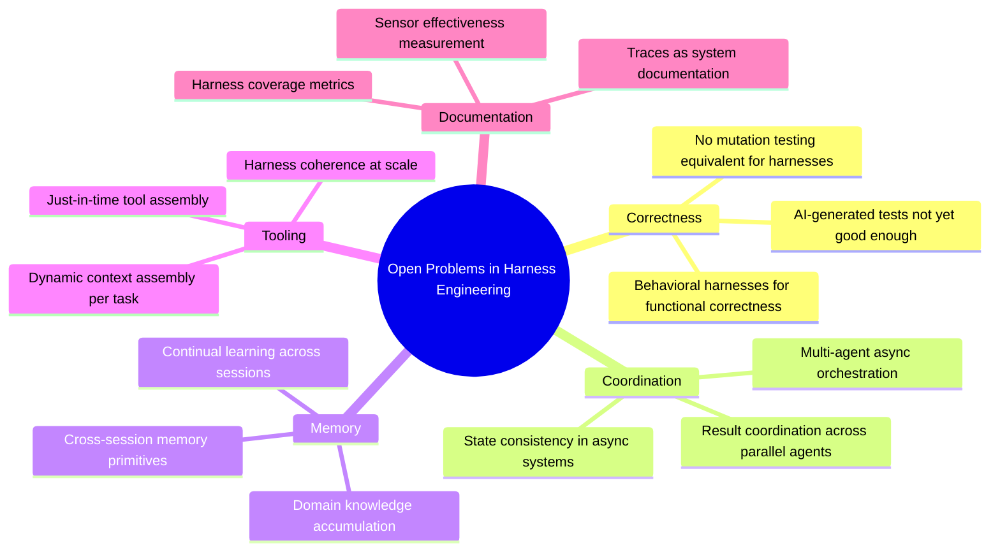

# 第 12 章：展望

### 12.1 这个领域仍然年轻

本书使用的许多词汇，例如 initializer agents、context firewalls、sprint contracts、reasoning sandwiches、ambient affordances、computational vs. inferential controls，都是在最近十二到十八个月里进入主流 agent-engineering 讨论的。部分底层思想出现得更早，但共享语言很新。多数来源文章发表于 2025 和 2026 年。这个领域变化快于任何单本书能记录的速度。

LangChain 对演进轨迹的描述很诚实：随着模型改进，今天 harness 中的一些东西会被模型吸收。模型会在规划、自验证、长周期连贯性上更原生地变强，因此需要更少上下文注入。但有趣的 harness 组合空间不会随模型变强而收缩；它会移动 ([LangChain - The Anatomy of an Agent Harness](https://blog.langchain.com/the-anatomy-of-an-agent-harness/); [Anthropic - Harness Design for Long-Running Application Development](https://www.anthropic.com/engineering/harness-design-long-running-apps))。

### 12.2 开放问题

文献中反复出现几类开放问题：

- **面向功能正确性的 behavior harness**。Maintainability 和 architecture-fitness harness 有几十年现成工具。Behavior harness，即应用功能行为是否满足用户意图，没有这样的成熟工具。今天多数团队依赖 AI 生成测试，普遍共识是这还不够好 ([Thoughtworks - Harness Engineering](https://martinfowler.com/articles/exploring-gen-ai/harness-engineering.html))。
- **规模化 harness 的一致性**。当 guides 和 sensors 增多，它们如何保持一致？sensor 从不触发意味着质量好，还是检测不足？今天还没有类似 code coverage 或 mutation testing 的 harness coverage 指标。
- **超越同步编排的多 agent 协调**。Anthropic 的研究系统同步运行 sub-agents；异步协调会释放更多并行性，但带来结果协调、状态一致性、错误传播挑战 ([Anthropic - How We Built Our Multi-Agent Research System](https://www.anthropic.com/engineering/multi-agent-research-system))。
- **Harness 层的持续学习**。让 agent 在多个 session 中积累代码库或领域知识，而不是每次从零开始的 memory primitive，仍是活跃研究方向 ([LangChain - Improving Deep Agents](https://blog.langchain.com/improving-deep-agents-with-harness-engineering/))。
- **Just-in-time tool assembly**。根据任务动态组装合适工具与上下文，而不是预配置一切，是 LangChain 等探索的方向。
- **Trace 作为文档**。LangChain 观察到“在软件中，代码记录 app；在 AI 中，traces 记录系统”，这暗示了一种新文档模型，但领域尚未完全解决。

### 12.3 长期建议

几条原则几乎贯穿所有文章：

- **把上下文当有限资源**。寻找最小高信号 token 集合，以产生期望结果。
- **做最简单可行的事**。Agent 昂贵；workflow 往往足够；许多任务二者都不需要。
- **阅读 transcripts**。其他一切都从这里流出。
- **迭代 load-bearing 的东西**。模型变化时压力测试组件。移除不再有负载的部分，调优仍有负载的部分。
- **按模型定制 harness，但把原则用于整个领域**。具体 prompt 和工具会随模型变化；工作形状，例如上下文工程、工具设计、评估、沙箱、自验证，不会消失。

这个领域还没有成熟到可以拥有一本 textbook。本文件是在它仍然会快速过时的前提下，尝试写一本。希望引用能让读者在对话继续演进时回到原文。

---

## 图：开放问题 Mindmap

---

## 要点

- **共享词汇仍很年轻**：许多术语在 2025-2026 年才变得常见，尽管底层思想更早。
- **模型吸收 harness，但 harness 会移动**：模型原生能力增强后，有趣 harness 工作会转向更难问题，而不是消失。
- **六类开放问题主导议程**：behavioral correctness、规模化一致性、异步多 agent 协调、持续学习、just-in-time tool assembly、traces-as-documentation。
- **五条长期原则跨场景成立**：有限上下文、最简单可行、读 transcript、迭代 load-bearing、按模型定制。
- **Harness engineering 是长期工作**：不是模型变强后丢弃的脚手架，而是围绕越来越强核心构建有效系统的持续工艺。

## 延伸阅读

- Vivek Trivedy, *The Anatomy of an Agent Harness*, LangChain, Mar 2026. https://blog.langchain.com/the-anatomy-of-an-agent-harness/
- Prithvi Rajasekaran, *Harness Design for Long-Running Application Development*, Anthropic, Mar 2026. https://www.anthropic.com/engineering/harness-design-long-running-apps
- Birgitta Böckeler, *Harness Engineering for Coding Agent Users*, Thoughtworks / martinfowler.com, Apr 2026. https://martinfowler.com/articles/exploring-gen-ai/harness-engineering.html
- Jeremy Hadfield et al., *How We Built Our Multi-Agent Research System*, Anthropic, Jun 2025. https://www.anthropic.com/engineering/multi-agent-research-system
- Vivek Trivedy, *Improving Deep Agents with Harness Engineering*, LangChain, Feb 2026. https://blog.langchain.com/improving-deep-agents-with-harness-engineering/
- *Awesome Harness Engineering* reading list: https://github.com/walkinglabs/awesome-harness-engineering
