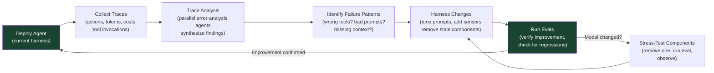

# 第 12 章：基于 Trace 的迭代与 Model–Harness 共同演化

### 12.1 Traces 是反馈回路

今天的模型在很大程度上仍是黑箱，内部机制难以解释。不过，模型的文本输入和输出是可见的，仅凭这些信息就足以开展系统化改进。因此，LangChain 把 trace 视为调试 harness 的主要入口，记录 agent 的每一步动作，以及相应的延迟、token 数、成本和工具调用 ([LangChain - Improving Deep Agents](https://blog.langchain.com/improving-deep-agents-with-harness-engineering/))。

它的 *Trace Analyzer Skill* 将这套循环自动化：

1. 从 LangSmith 获取实验 trace。
2. 启动多个并行的错误分析 agent，由主 agent 汇总发现与建议。
3. 汇总反馈，并据此对 harness 做有针对性的修改。

这套方法在结构上类似经典机器学习中的 boosting：每轮迭代都聚焦于之前暴露的错误。第 3 步最好加入人工审查，但并非绝对必要。人工审查的主要作用，是防止修改只改善少数特定任务，却损害更广泛的表现。

### 12.2 运行时可观测性与过程可观测性

基于 trace 的迭代依赖两类可观测性。**运行时可观测性**记录系统实际做了什么，包括工具调用、命令输出、浏览器操作、延迟、token 使用量、错误、重试，以及最终的环境状态。LangChain 强调的正是这一层：记录 agent 的每一步动作，并从 trace 中归纳反复出现的失败模式。

**过程可观测性**记录成功的含义，以及为什么可以接受已经完成的工作，包括任务范围、sprint contract、rubric、验证证据、明确排除的工作和 handoff note。Anthropic 的 generator-evaluator harness 明确体现了这一点：实现开始前，双方先通过协商确定 sprint contract 和工作范围；如果 sprint 失败，evaluator 再依据 rubric 给出具体反馈 ([Anthropic - Harness Design for Long-Running Application Development](https://www.anthropic.com/engineering/harness-design-long-running-apps))。

这两层可观测性相互补充。只有运行时信号而没有过程工件，只能知道发生了什么，却无法判断结果是否符合预定范围。只有过程工件而没有运行时信号，则可能为实际已经出错的行为包装出一套看似可信的文档。生产级 harness 应同时开放两类信息供人检查：任务的执行轨迹、验收标准，以及环境确实达到目标状态的证据。

OpenReview 综述还补充了一个重要的实现细节：agent trace 应组织成 span tree，而不是平铺的日志 ([OpenReview - Agent Harness Engineering: A Survey](https://openreview.net/pdf?id=3hXEPbG0dh))。这些 span 至少应覆盖模型调用、工具调用、检索步骤、上下文组装操作、延迟、token 使用量、成本、重试、权限决策和最终结果状态。

这套结构如今正逐步走向标准化。OpenTelemetry 是分布式系统中广泛使用的厂商中立可观测性标准，目前正在定义 *GenAI semantic conventions*，即一套供 LLM 和 agent 遥测共同使用的 span 与属性命名规范 ([OpenTelemetry - Semantic conventions for generative AI spans](https://opentelemetry.io/docs/specs/semconv/gen-ai/gen-ai-spans/))。这些约定为 harness 产生的 span 规定了名称，包括顶层的 `invoke_agent` span、每次模型调用对应的子 `chat` span，以及每次工具调用对应的 `execute_tool` span；同时还定义了操作时长和 token 使用量等标准指标。

采用这些约定有两项好处。第一，agent trace 可以与系统中的其他服务*共用*同一套可观测性技术栈。团队能够直接使用现有工具查询延迟、成本和错误，无须单独维护一套 agent 日志系统。第二，这项标准直接回应了隐私问题：对于 prompt 和 completion 内容，可以选择完全不记录、附加到 span，或存储在外部并在 span 中保留引用。标准还建议默认不要捕获敏感载荷，这与第 12.3 节和第 17 章要求的脱敏原则一致。在撰写本文时，GenAI 约定仍标记为 *Development*，具体名称可能继续变化；真正重要的是标准的发展方向，而非某个版本中的名称。

### 12.3 从生产 Trace 到 Regression Case

可观测性应直接服务于验证。能够揭示真实生产故障的 trace 十分宝贵，不应只作为调试工件留存。一套成熟的工作流程如下：

1. 捕获失败或出乎预期的生产执行轨迹。
2. 对敏感数据进行脱敏，并冻结相关环境或 fixture。
3. 提取用户意图、工具调用序列、中间状态和最终结果。
4. 为修正后的行为编写确定性断言或由模型评分的断言。
5. 将该用例加入 regression suite，并保留原始 trace 作为证据。

这套流程会把 trace 转化为 eval 任务的来源，也能避免团队只针对合成 benchmark 优化，却忽视真实用户遇到的故障。治理要求必须贯穿整条流程：trace-to-eval pipeline 要保留隐私、数据来源和权限元数据，否则生成的测试即使在技术上有用，也可能在实际运营中并不安全。

### 12.4 从实践者纠正到有界改进任务

OpenAI 的 tax-agent 案例又将这条反馈回路向前推进了一步。专家的纠正意见和生产 trace 不会直接改写已经部署的 agent，而是先转化为经过审查的发现、针对性的 eval，以及能够在发布前验证的有界 Codex 任务 ([OpenAI - Building Self-Improving Tax Agents with Codex](https://openai.com/index/building-self-improving-tax-agents-with-codex/))。

一条安全的改进 pipeline 会明确规定每一步由谁接管、如何交接：

1. 记录实践者的纠正意见，以及促成这项纠正的 trace 和结果。
2. 对敏感数据进行脱敏，审查发现，并将重复问题归并为稳定的失败类别。
3. 以不可变的证据为依据，将该失败类别转化为可复现的 regression eval。
4. 向 coding agent 分配一个有明确边界的修改任务，而不是授权它随意修改自身。
5. 将目标 eval、更广泛的 regression suite、安全检查、成本和延迟共同设为 patch 的发布门槛。
6. 在生产环境中以 canary 方式发布新版本，监控最初的故障信号；如果情况恶化，则回滚。

这是**受控自我改进（controlled self-improvement）**，而不是不受约束的自我修改。已经部署的 agent 不会直接改写自己的 prompt、工具、memory policy 或 evaluator。外部改进循环只负责提出一个版本化变更，能否进入下一阶段则由独立证据和发布控制决定。Evaluator integrity（第 10.4 节）在两个环节都很重要：最初发现的问题必须真实，发布关卡也不能预设“这项修复应该获准发布”。

### 12.5 对关键组件进行压力测试

Anthropic 后续发布的 harness 设计文章补充了一项配套原则 ([Anthropic - Harness Design for Long-Running Application Development](https://www.anthropic.com/engineering/harness-design-long-running-apps))。Harness 中的每个组件，都隐含着一项关于“模型无法独立完成什么”的假设。随着模型能力提升，这些假设可能逐渐过时。检验方法很简单：每次移除一个组件，运行 eval，再观察结果。

Opus 4.6 推出后，长上下文检索能力和长周期编码表现都有所增强，Anthropic 因而得以在一个 harness 版本中移除 sprint 机制。即使不再把工作拆成多个 sprint，generator 仍能连贯运行两个多小时。Evaluator 在早期模型上承担了更多关键职责，但到了 4.6，是否需要它开始取决于具体任务：任务接近 generator 独立完成能力的边界时，它仍然有用；任务明显处于能力范围内时，它只会增加不必要的开销。团队将这项原则概括为：“是否使用 evaluator，并不是一个答案固定的是非题。只有当任务超出当前模型能够独立可靠完成的范围时，它的成本才值得付出。”

### 12.6 Model–Harness 共同演化

今天的前沿 coding model 通常会把 harness 纳入 post-training 流程 ([LangChain - The Anatomy of an Agent Harness](https://blog.langchain.com/the-anatomy-of-an-agent-harness/))。团队先发现有用的操作原语（primitive），将其加入 harness，再利用这些原语训练下一代模型；训练出的模型也会在这套 harness 中表现得更好。这形成了一条反馈回路，同时也使模型与 harness 相互耦合：即使某项 harness 修改在行为上看似中性，也可能导致模型表现下降。

Codex 的 `apply_patch` 工具就是典型例子。Codex 模型针对这种特定的 patch 格式接受过 post-training。OpenCode 是 Claude Code 的开源替代方案，为了模拟 Codex harness，它不得不专门为 GPT/Codex 模型加入 `apply_patch` 工具；Claude 和其他模型则继续使用常规的 `edit` 与 `write` 工具 ([HumanLayer - Skill Issue](https://www.humanlayer.dev/blog/skill-issue-harness-engineering-for-coding-agents))。

### 12.7 最佳 Harness 不一定是模型训练时的 Harness

这种耦合并不意味着模型训练时使用的 harness 对所有任务都是最优选择。Terminal-Bench 2.0 是实践讨论中经常引用的例子：HumanLayer 提到，Opus 4.6 在 Claude Code 中排名第 33，在另一套 harness 中却排名第 5，而 leaderboard 本身约有 4 个名次的噪声 ([HumanLayer - Skill Issue](https://www.humanlayer.dev/blog/skill-issue-harness-engineering-for-coding-agents); [LangChain - The Anatomy of an Agent Harness](https://blog.langchain.com/the-anatomy-of-an-agent-harness/))。这些具体名次只是某个时点的 leaderboard 快照，不能视为关于模型的永久结论。

LangChain 的案例研究也通过实验得出了相同结论。Claude Opus 4.6 在其早期 harness 版本中得分 59.6%，虽然具备竞争力，但仍低于调优后的 Codex 配置。上下文准备和验证等原则可以跨模型复用，不过要弥合剩余差距，仍需针对 Claude 再进行几轮 harness 迭代 ([LangChain - Improving Deep Agents](https://blog.langchain.com/improving-deep-agents-with-harness-engineering/))。

实用规则很直接：更换模型时，要重新审视 harness。加强当前仍然关键的组件，移除不再发挥作用的组件。

### 12.8 实践要点

LangChain 将 harness 迭代经验归纳为五项原则 ([LangChain - Improving Deep Agents](https://blog.langchain.com/improving-deep-agents-with-harness-engineering/))：

1. **为 agent 做好 context engineering**：通过目录结构、可用工具、编码实践和问题解决策略，帮助模型了解所处环境。
2. **帮助 agent 验证自己的工作**：模型容易停留在第一个看似合理的方案上，因此要明确要求它运行测试并检查结果。
3. **把 trace 作为反馈信号**：工具和推理需要一起调试。模型走错方向，可能是因为缺少工具，也可能是因为不知道如何使用已有工具。
4. **在短期内遏制不良模式**：随着模型进步，loop detection 等 guardrail 可能不再必要，但在当前阶段仍有价值。
5. **根据模型定制 harness**：Claude 与 Codex 的 prompting guide 之所以不同，是因为通用原则可以迁移，具体实现往往不能照搬。

HumanLayer 也总结了一组相近的经验 ([HumanLayer - Skill Issue](https://www.humanlayer.dev/blog/skill-issue-harness-engineering-for-coding-agents))：

有效的做法包括：从简单的 harness 起步，只在真实失败暴露后添加配置；快速迭代，并及时舍弃没有帮助的改动；通过仓库级文件在团队内分发经过验证的配置；优先提高迭代速度，而不是追求一次成功；在团队弄清实际需求后，删除多余能力。

效果不佳的做法包括：提前设计所谓的理想 harness；“以防万一”安装数十个 skill 和 MCP server；每个 session 结束时都运行完整测试套件；以及过度细调每个 sub-agent 能够访问哪些工具。

### 12.9 关于 AGENTS.md 的误导性数据

有一项结果尤其值得注意。ETH Zurich 的研究在多个仓库中测试了 138 个 agentfile——即 AGENTS.md、CLAUDE.md 一类指令文件的统称。研究发现，由 LLM 生成的 agentfile 不仅降低了性能，还使成本增加 20%；人工编写的文件则只带来约 4% 的性能提升。Agent 在处理这类上下文文件中的指令时，使用的 reasoning token 也增加了 14–22%。在该 benchmark 中，代码库概览和目录列表没有帮助，因为 agent 能够自行探索仓库结构 ([HumanLayer - Skill Issue](https://www.humanlayer.dev/blog/skill-issue-harness-engineering-for-coding-agents) citing the ETH Zurich paper)。

HumanLayer 认为，这些结果印证了它对 AGENTS.md 的建议：文件应保持简洁，避免自动生成；采用渐进式披露，不要在一开始塞入全部指令；根目录文件只保留普遍适用的规则，而不是各种带条件的指导。它自己的 CLAUDE.md 不到 60 行。

这并不意味着“不应编写仓库指令”，而是说根目录的指令文件应该充当路由器，而不是百科全书。OpenAI 的 Codex harness 指南也采用同样的思路：把关键上下文保留在仓库中，让 `AGENTS.md` 保持简洁，并在需要时将 agent 引导到更深入的文档；最重要的规则则尽可能通过自动化检查强制执行 ([OpenAI - Harness Engineering](https://openai.com/index/harness-engineering/))。

更一般的原则是：配置并非越多越好。每条无关指令都会占用 agent 的注意力，却不能改善结果。*Instruction budget* 与 token budget 同样值得重视。

### 12.10 可复用 Harness 包与 Skills

一套 harness 模式经过实践验证后，不应继续作为只存在于某个仓库中的内部经验，而应被封装成可复用的形式。它可以是 skill、模板包、小型脚手架生成器，或一组仓库检查。无论采用哪种形式，都应同时提供指令和可以直接使用的工件：不只是提醒使用者“记得维护状态”，还要包含 progress log 模板、feature list schema、启动脚本和验证命令。

Learn Harness Engineering 课程用 `harness-creator` 展示了这种封装方式。这个 skill 用于创建、评估和改进五个 harness 子系统，涵盖指令、状态、验证、范围和会话生命周期 ([Learn Harness Engineering — Skills](https://walkinglabs.github.io/learn-harness-engineering/zh/skills/))。这形成了一条实用的工程边界：可复用 harness 包不应把某个所谓的理想 workflow 永久固化，而应让经过验证的默认做法易于安装和检查；当 trace 表明某个组件不再承担关键作用时，也应同样容易将其移除。

### 12.11 Meta-Harness：优化 Harness 本身

一旦具备 eval 和 trace，harness 本身也可以成为优化对象。OpenReview 综述提到的 *meta-harness* 研究，不再把 harness 视为固定不变的前提，而是探索不同的 harness 结构、prompting 策略、工具接口和控制循环设计 ([OpenReview - Agent Harness Engineering: A Survey](https://openreview.net/pdf?id=3hXEPbG0dh))。

在实践中，这并不一定意味着完全自动化的架构搜索。团队可以先从有纪律的实验做起：

- 在同一套 task suite 上，对工具 schema 或 prompt 修改进行 A/B test。
- 移除一个组件进行消融实验，例如 planner、context reset、memory layer 或 evaluator。
- 调整成本控制、重试策略和工具响应截断方式，观察质量从何处开始下降。
- 衡量完整的闭环，而不只看模型输出：成功率、pass^k 可靠性、延迟、成本、转交人工处理的次数和安全误报。

这进一步扩展了“关键组件”原则：harness 中的每个部分都应持续证明自身收益足以抵偿成本。如果某个组件只对少数高价值任务提升可靠性，就只将这些任务选择性地路由给它；如果模型升级后它不再有帮助，就将其移除。

### 12.12 跨层耦合

ETCLOVG 也可以作为调试地图。Trace 中看似糟糕的模型决策，根本原因可能位于 harness 的其他层 ([OpenReview - Agent Harness Engineering: A Survey](https://openreview.net/pdf?id=3hXEPbG0dh))：

- 工具选择错误可能来自 **Tool** 层，因为动作空间过大，或 schema 没有把关键能力表达清楚。
- 过早宣布完成可能来自 **Lifecycle** 层，因为退出条件没有表示为持久状态机。
- 成本调优后的性能回退可能来自 **Observability** 与 **Execution** 层，因为资源限制改变了延迟、超时设置或 benchmark 的保真度。
- 安全故障可能来自 **Governance** 层，因为训练阶段的 alignment、部署配置和运行时 enforcement 在 policy、permission 和 audit hook 上并不一致。

在修改 prompt 之前，应先在 trace review 中标注可能负责的层。先问清楚：是哪一层让错误行为更容易发生、难以被发现，或几乎没有成本？然后再决定正确的修复方式究竟是修改 prompt、重新设计工具、调整沙箱、增加指标、使用更强的 grader，还是加入 governance hook。

---

## 图：基于 Trace 的迭代循环

---

## 要点

- **Trace 是主要的调试入口**：即使模型内部机制不可见，文本输入和输出仍然可见；系统化分析 trace 可以持续推动 harness 改进。
- **可观测性分为两层**：运行时 trace 说明系统实际做了什么，过程工件说明为什么可以接受这项工作。
- **Trace span 应采用结构化形式**：模型调用、工具调用、检索、上下文组装、权限、成本和结果状态都需要机器可读的遥测数据。
- **遥测标准正在形成**：OpenTelemetry 的 GenAI semantic conventions（`invoke_agent`、`chat`、`execute_tool` span）让 agent trace 能够接入常规可观测性技术栈，并为保护隐私明确规定内容捕获方式。
- **生产 trace 应转化为 regression case**：只要妥善保留隐私和数据来源，真实故障就是信号最强的 eval 任务。
- **自我改进必须通过外部、有边界的发布循环完成**：先审查并归类纠正意见，将其转化为 eval 和范围明确的修改任务，再对版本化产物执行 gate、canary 和 rollback。
- **训练时使用的 harness 不一定最优**：leaderboard 快照表明，同一模型采用不同 harness 时，表现可能大幅变化。
- **模型变化后要对组件进行压力测试**：每个 harness 组件都隐含着一项可能随模型进步而过时的假设。
- **Model–harness 共同演化确实存在**：post-training 将 harness 纳入模型训练循环；任何一侧出现意外变化，都可能破坏原有耦合。
- **臃肿的 AGENTS.md 收益有限**：内容应简洁并由人编写，再通过渐进式披露引导 agent 查阅仓库内的局部文档和自动化检查。
- **可复用 harness 包能够保存来之不易的经验**：当 trace 证明某种稳定模式确实有效时，应将其沉淀为 skill、模板、脚手架和检查。
- **Meta-harness 将 eval 变成设计搜索**：prompt、工具、重试、上下文策略和 evaluator 都可以像其他系统组件一样接受消融实验和优化。
- **按层归因可以避免凡事只改 prompt**：先用 ETCLOVG 判断是哪一层使故障成为可能，再决定是否修改指令。
- **迭代速度比前置设计更重要**：从简单方案开始，只在真实故障出现后增加组件，并主动移除多余部分。

## 延伸阅读

- Vivek Trivedy, *Improving Deep Agents with Harness Engineering*, LangChain, Feb 2026. https://blog.langchain.com/improving-deep-agents-with-harness-engineering/
- Prithvi Rajasekaran, *Harness Design for Long-Running Application Development*, Anthropic, Mar 2026. https://www.anthropic.com/engineering/harness-design-long-running-apps
- Vivek Trivedy, *The Anatomy of an Agent Harness*, LangChain, Mar 2026. https://blog.langchain.com/the-anatomy-of-an-agent-harness/
- Kyle Brunet, *Skill Issue: Harness Engineering for Coding Agents*, HumanLayer, Mar 2026. https://www.humanlayer.dev/blog/skill-issue-harness-engineering-for-coding-agents
- OpenAI, *Harness Engineering: Leveraging Codex in an Agent-First World*, Feb 2026. https://openai.com/index/harness-engineering/
- Walking Labs, *Learn Harness Engineering - Skills*. https://walkinglabs.github.io/learn-harness-engineering/zh/skills/
- OpenTelemetry, *Semantic conventions for generative AI spans*. https://opentelemetry.io/docs/specs/semconv/gen-ai/gen-ai-spans/
- *Agent Harness Engineering: A Survey*, OpenReview / TMLR submission, 2026. https://openreview.net/pdf?id=3hXEPbG0dh
- OpenAI, *Building Self-Improving Tax Agents with Codex*, 2026. https://openai.com/index/building-self-improving-tax-agents-with-codex/
