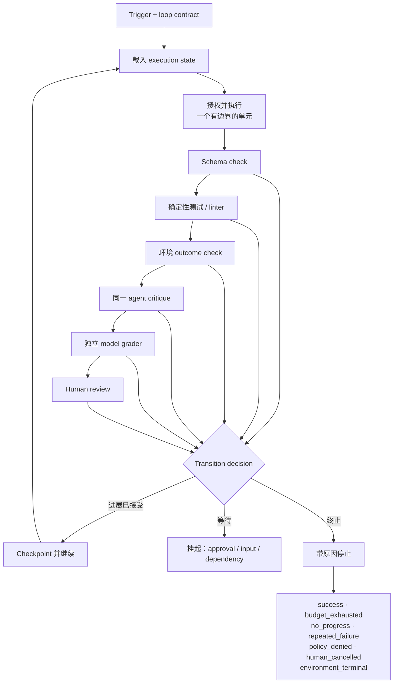

# 第 13 章：Loop Engineering 与 Verifier 层级

*Agent = Model + Harness。* 第 1 章介绍了 agent 的内层循环：harness 组装上下文，模型提出动作，runtime 执行动作，环境返回 observation，然后循环继续。本章把这个循环外围的控制结构视为工程对象，明确什么会启动 run、单次迭代允许做什么、什么证据算作进展或成功，以及 run 为什么停止。

*Loop engineering* 是有用的实践者术语，但不是正式标准或参考架构。Addy Osmani 用它描述一类能够发现工作、分发工作、检查结果、持久化状态并决定下一步的系统（[Addy Osmani — Loop Engineering](https://addyosmani.com/blog/loop-engineering/)）。本章保留这一运维洞见，但使用全书既有的 harness、runtime、policy 与 evaluation 术语来定义 loop。

### 13.1 研究根源与实践者谱系

底层动作循环早于这个标签出现。ReAct 交错生成 reasoning trace 与特定任务动作，使动作能从外部环境获取信息，也使 observation 能够更新计划（[Yao et al. — ReAct](https://arxiv.org/abs/2210.03629)）。生产 harness 不必暴露私有 reasoning trace，但必须实现可观察的控制循环：提出动作 → 执行策略 → 运行 → 记录 observation → 更新 execution state。

后来出现的两个实践者标签，描述了运行这类循环的特定方式：

- **Ralph** 描述一种面向仓库的实践：单一进程每轮执行一个任务，并在每次迭代中重新载入 specification 与 plan（[Geoffrey Huntley — Ralph Wiggum as a “software engineer”](https://ghuntley.com/ralph/)）。
- **Loop engineering** 强调 trigger、隔离工作区、可复用指令、connector、sub-agent，以及位于单次对话之外的状态（[Addy Osmani — Loop Engineering](https://addyosmani.com/blog/loop-engineering/)）。

这些属于实践者谱系，而不是一致性目标。它们都没有确立“每个 agent 都必须在每轮 reset 上下文、使用多个 agent、按 schedule 运行，或逐步走向无人自治”。每种模式都只是设计选项，其价值必须在具体任务上得到证明。

### 13.2 从 Loop Contract 开始

**Loop contract** 是使重复运行有边界且可测试的 harness 配置。启用重复执行之前，应定义：

- **Trigger：** 人类请求、事件、schedule 或父 run，以及去重语义。
- **Goal 与 acceptance contract：** 请求的结果、允许范围、约束和判定成功所需的证据。
- **Execution state：** 当前 task、attempt、预算消耗、policy 状态、artifact 和最近一次已接受的 checkpoint。
- **Iteration boundary：** 单轮最多可以尝试并提交的工作单元。
- **Action envelope：** 可用 tool、identity、resource、副作用类别与 mandatory approval gate。
- **Verifier plan：** 要运行的检查、顺序、阈值、abstention 行为和 escalation 目标。
- **Progress function：** 区分有效变化与“看似忙碌但没有进展”的度量。
- **Stop 与 suspend rule：** 终止原因、重试规则和可恢复的等待状态。

这份 contract 属于 harness 与 control plane，而不属于模型生成的文字。模型可以提出“目标已完成”，但由 harness 判断配置要求的证据是否支持 `success`。Anthropic 的生产模式指南也把 agent 描述为在循环中使用环境反馈、在 checkpoint 或 blocker 处暂停并请求人类输入，同时通过迭代上限等停止条件保留控制（[Anthropic — Building effective agents](https://www.anthropic.com/engineering/building-effective-agents)）。

一个有边界的迭代可以表示为：

```text
载入 execution state
→ 选择一个符合条件的工作单元
→ 授权并执行有边界的动作
→ 收集 artifact 与环境 observation
→ 运行配置好的 verifier plan
→ checkpoint 已接受的进展
→ 继续、挂起或带原因终止
```

迭代次数本身不等于进展。有效的 progress function 取决于任务：失败测试数量下降、必填字段通过校验、目标环境进入预期状态、证据覆盖率提高，或者由人类解决一个具名歧义。应持久化这些度量和 artifact identity，使后续 run 能判断是否真的发生了变化。

### 13.3 默认 Verifier 层级

先使用能够为当前后果提供充分证据的最低成本 verifier；如果低层证据仍留下重大不确定性，再向上叠加。默认升级层级如下：

| 层级 | Verifier | 最适合提供的证据 | 主要局限 |
|---|---|---|---|
| 1 | **Schema check** | 必填字段、类型、范围和协议形状 | 形状合法不代表结果正确 |
| 2 | **确定性测试与 linter** | 可复现的行为断言、不变量和静态规则 | 测试可能不完整，也可能与某种实现方式耦合 |
| 3 | **环境 outcome check** | 外部系统确实达到预期状态 | 良好终态可能掩盖不安全或不允许的路径 |
| 4 | **同一 agent 的 critique** | 低成本、上下文充分地发现并修复明显缺陷 | Critique 可能沿用 maker 的假设与盲点 |
| 5 | **独立 model grader** | 对开放式或细腻属性进行 rubric 判断 | 独立身份无法消除模型错误或相关失败 |
| 6 | **Human review** | 意图、问责、专家判断与歧义处理 | 慢、昂贵，而且不会自动保持一致 |

这是升级层级，不是要求每个任务都采用全部六层，也不是说后一层在所有方面都优于前一层。人类不应替代 checksum，独立模型也不应替代可执行测试。Agent eval 通常组合 code-based、model-based 和 human grader：代码检查快速且可复现；模型 grader 能处理细腻判断，但需要用 human grader 校准；人工评分更慢且成本更高（[Anthropic — Demystifying evals for AI agents](https://www.anthropic.com/engineering/demystifying-evals-for-ai-agents)）。

“Maker must not be the checker” 这句旧口号过于绝对。当后果较低且缺陷在局部可见时，同一 agent 的 critique 可以是高效的修复步骤。反过来，一个名义上独立的 checker 可能与 maker 共用相同的基础模型、训练分布、prompt 假设、tool 或不完整 rubric。只有当角色分离带来的错误下降经过测量、足以抵偿成本，而且相关失败得到理解时，这种分离才有价值。

### 13.4 根据证据选择 Verifier，而不是根据口号

第 11 章定义了本章使用的 verifier profile：失败类别、false positive 与 false negative、abstention、disagreement、coverage、latency、cost 和 correlated failure。应根据五项任务属性选择和组合层级：

1. **Consequence。** 后果越重大、越难逆转，越需要更强证据、更严格的 false-accept 目标，而且往往需要 policy gate 或由可问责的人进行 review。
2. **Task ambiguity。** 精确输出适合 schema 与确定性检查；开放式质量或意图问题可能需要经过校准的模型 rubric、专家 review 或明确 abstain。
3. **Capability boundary。** 应根据 eval 结果而不是直觉，判断 maker 能否可靠处理该任务类别。接近测得的能力边界时，额外 critique 或 evaluator 可能带来价值；远在边界以内时，它可能只增加 latency 与 cost。Anthropic 在一个长时运行 coding harness 中报告了这种与任务相对的效果：随着模型能力提升，对于 generator 已能可靠完成的工作，evaluator 变成了额外开销；但在能力边缘，它仍然有用（[Anthropic — Harness design for long-running application development](https://www.anthropic.com/engineering/harness-design-long-running-apps)）。
4. **Latency 与 cost。** 先运行便宜且信号强的检查，把较慢 grader 留给尚未消除的不确定性。Verifier 的 cost 与 latency 应和 maker 的 cost 与 latency 分开记录。
5. **Correlated failure。** 估计 maker 与 checker 是否会在相同样本上失败。不同角色、prompt 或模型本身并不能证明存在有用的独立性；应使用第 11 章的 joint-error 与 disagreement 度量。

一条实际策略可以是：对每个 tool result 进行 schema check；对每个候选 artifact 运行测试与 linter；在宣称外部 outcome 之前检查真实环境；用同一 agent critique 进行低成本修复；仅对剩余的 rubric 属性调用独立 grader；当后果或未解决歧义超过阈值时要求 human review。

每个 verifier 都应至少定义三种结果，而不是强制二元判断：`pass`、`fail` 和 `abstain`；版本化 contract 也可以定义 `partial`。Abstention 必须路由到另一个 verifier 或交给人类解决，绝不能被静默转换为通过。对于研究等主观、开放式任务，应根据专家人类判断持续校准模型 grader（[Anthropic — Demystifying evals for AI agents](https://www.anthropic.com/engineering/demystifying-evals-for-ai-agents)）。

### 13.5 将在线验证与发布评测分开

**Live verifier** 会影响 trajectory：它选择重试、提供反馈、接受 checkpoint 或停止 loop。**Holdout grader** 在不引导 trajectory 的前提下衡量完成后的系统。把 release grader 的隐藏答案或完整 rubric 作为迭代反馈，会形成 evaluator leakage 的路径，使系统针对检查而不是底层任务进行优化。

因此：

- 只暴露有助于修复所必需的 acceptance evidence；
- 把 holdout case 和 release threshold 放在 maker 无法写入的状态之外；
- 为每个 schema、test suite、rubric、grader model 和 human-review protocol 建立版本；
- 记录哪个 verifier result 导致了每次 transition；
- 定期把自动 verifier decision 与 blind human label 比较；
- 调查 disagreement 与 joint error，而不只看整体 pass rate。

Outcome check 与 trajectory check 回答不同问题。前者问预期状态是否已经达到；后者问达到该状态的路径是否遵守 policy、budget 与 tool constraint。Anthropic 的 eval 指南明确区分对 outcome 与 transcript 的评分，并给出了组合 state check、required tool call、turn limit 与 quality rubric 的示例（[Anthropic — Demystifying evals for AI agents](https://www.anthropic.com/engineering/demystifying-evals-for-ai-agents)）。当正确结果可能通过不可接受的路径获得时，loop 同时需要两类检查。

### 13.6 Stop、Suspend 与 Resume 是不同状态

每个 run 都必须以机器可读的 `stop_reason` 终止，或者进入具名的非终止挂起状态。最小终止集合是：

| Stop reason | 必要条件 | 重试语义 |
|---|---|---|
| `success` | 配置要求的 acceptance contract 已通过；自我宣称不足以成立 | 只有在出现新 goal 或证据失效时才开始新 run |
| `budget_exhausted` | 达到任一 token、time、money、action 或 iteration 上限 | 只有获得新授权预算后才恢复 |
| `no_progress` | Progress function 在配置的窗口内持续低于阈值 | 改变证据、plan、tool 或任务表述后再恢复 |
| `repeated_failure` | 同一个归一化 failure signature 超过允许重试次数 | 应改变可疑原因后再恢复，不能只重置计数器 |
| `policy_denied` | Policy decision point 拒绝动作，而且不存在允许的替代方案 | 模型重试不能覆盖该决定；只能通过授权路径改变 policy 或 scope |
| `human_cancelled` | 获得授权的人取消 run | 不得自动恢复；必须有新的明确请求 |
| `environment_terminal` | 环境报告吸收态，例如已删除、已过期、已关闭或不可恢复失败 | 只有环境和 task contract 允许时才开始新 run |

`approval_wait`、缺少输入、rate-limit backoff 和依赖暂时不可用，通常属于**挂起**，而不是成功或失败的终止状态。应持久化 checkpoint、尚未解决的请求、过期时间以及有权解决它的 identity。恢复时应从已记录的 execution state 继续，而不是让模型从对话文字重建等待状态。

Policy enforcement 必须位于模型 loop 之外。NIST 把 policy decision point 定义为计算访问决策的组件，把 policy enforcement point 定义为对受保护资源执行访问决策的组件（[NIST — Zero Trust Architecture Glossary](https://pages.nist.gov/zero-trust-architecture/glossary.html)）。因此，在本书架构中，`policy_denied` 是 harness/runtime outcome，而不是模型可以靠辩解绕过的异议。

优先级也必须明确。例如，在调度下一次 retry 前应先检查 `human_cancelled`、`policy_denied` 与 `environment_terminal`；`success` 必须有当前有效的证据；预算消耗的提交应具有足够的原子性，避免并发 worker 各自花掉同一份剩余额度。

### 13.7 嵌套 Loop 需要所有权边界

一种实用拓扑，是把快速的内层动作循环与较慢的外层控制循环分开：

- **Action loop** 执行一个有边界的工作单元，并消费即时环境反馈；
- **Repair loop** 根据 verifier failure 选择下一次尝试；
- **Task loop** 选择下一工作单元，并检查 goal-level completion；
- **Release loop** 应用 holdout evaluation、policy、approval 或 deployment control；
- **Product loop** 使用真实世界 outcome 修改 goal 与 acceptance contract。

不要让内层 loop 改写父级 success criteria。Worker 可以提出修改 plan，但必须由父 contract 的所有者接受。同样，子 run 可以返回 artifact 与 evidence；父级仍负责判断这些证据是否满足自己的 verifier plan。

Evaluator–optimizer loop 适用于 evaluation criteria 清晰且迭代改进能够产生可测量价值的情况；它不是每次模型调用都应套用的默认 wrapper（[Anthropic — Building effective agents](https://www.anthropic.com/engineering/building-effective-agents)）。每个嵌套 loop 都应拥有自己的 budget、state owner、stop reason 与 escalation route，避免一次“retry”扩展成无边界的委派树。

### 13.8 Context Reset 只是一种恢复策略

Ralph 实践有意让每个 loop 只执行一个仓库任务，并在每轮重新加载 plan 与 specification artifact（[Geoffrey Huntley — Ralph Wiggum as a “software engineer”](https://ghuntley.com/ralph/)）。这样做可以减少长交互造成的污染，也使 durable artifact 更重要。但它不能证明“memory 必须存在磁盘上”这一更强主张，也不能证明每轮都应丢弃上下文。

应根据失败模式选择 context policy：

- 当近期 observation 和未解决的局部状态仍然有用时，**继续使用同一上下文**；
- 当相关 trajectory 可以被压缩为带可追溯引用的摘要时，执行 **compaction**；
- 当陈旧假设或 context pressure 导致 repeated failure 时，执行 **reset and rehydrate**；
- 当 capability、authority 或 responsibility 发生变化时，**handoff 到另一个 run**。

把 canonical execution state、artifact、checkpoint 和 event history 持久化在 harness 管理的存储中。仓库文件可以是其中一种 artifact，但它不会自动成为 identity、budget、approval 或 policy state 的事实来源。Anthropic 的长时运行 harness 报告介绍了使用结构化 artifact 在 session 间 handoff，同时也表明：当更强模型能力使某些 scaffolding 成为多余开销时，应移除这些结构（[Anthropic — Harness design for long-running application development](https://www.anthropic.com/engineering/harness-design-long-running-apps)）。

### 13.9 用 Capability–Control Profile 取代自治阶梯

单一成熟度阶梯会错误暗示所有产品都应从人工运行进化到 auto-merge。设计成熟度是多维的。至少应记录以下维度：

| 维度 | 示例值 | 设计问题 |
|---|---|---|
| Trigger autonomy | manual · event · schedule · parent run | 谁可以启动工作，如何避免重复？ |
| Action scope | read-only · draft · reversible write · irreversible effect | 单轮可以改变什么？ |
| Verifier strength | 各层级及其测量 profile | 什么证据足以支持继续或成功？ |
| Runtime durability | ephemeral · checkpointed · replayable | 中断后什么能够保留？ |
| Policy 与 approval | allowlist · dynamic policy · mandatory gate | 哪些决策不属于模型权限？ |
| Observability | final artifact · trace · event history · lineage | 运维者能否重建决策路径？ |
| Recovery | retry · compensate · rollback · human repair | 如何控制部分失败？ |
| Human responsibility | operator · reviewer · approver · accountable owner | 哪些位置仍保留判断与问责？ |

一个系统可以在 durability 与 observability 上高度成熟，同时有意保持 read-only 与 manual trigger。另一个系统可以定时执行低后果、可逆动作，但在 release 时要求 human approval。目标 profile 应由产品价值、失败后果与证据决定，而不是普遍追求最大自治。Anthropic 同样建议只在能够证明改善 outcome 时增加 agentic complexity，并指出 latency、cost 与错误累积方面的取舍（[Anthropic — Building effective agents](https://www.anthropic.com/engineering/building-effective-agents)）。

### 13.10 把 Loop 作为可测量的控制系统运行

每个 run 都应生成 loop control record，其中包含 contract version、trigger identity、iteration 与 retry count、已用 budget、verifier version 与 result、progress measurement、artifact、policy 与 approval event、最终 checkpoint 和 `stop_reason`。第 10 章提供 durable execution 语义；第 11 章提供 verifier calibration；第 12 章提供局部 self-verification 模式；第 14 章提供 human review 与 approval 语义；第 17–19 章把 trace、budget、policy enforcement、lineage 和 fleet operation 连接起来。

使用这些记录回答运维问题：

- 哪些 failure signature 消耗了最多 retry？
- 哪些 verifier 层真正改变 decision，而不只是增加 cost？
- Maker 与 checker 在哪些地方共同失败？
- `success` 有多大比例能通过 holdout 与 human review？
- 哪些任务因为预算、无进展、策略拒绝、人类取消或环境终态而停止？
- Context reset 是否改善了目标 failure class 的恢复表现？

只有当证据支持某项具体变化时，才扩大 loop 的 action scope、trigger autonomy 或 retry allowance。当 continuation 由测得的进展证明合理、termination 由可审计原因证明合理时，这个 loop 才称得上经过工程化。

---

## 图示：使用递进证据的有界 Loop



---

## 本章要点

- **“Loop engineering”与“Ralph”是实践者谱系，而不是标准。** 应选择性地采用其中的模式，并测量结果。
- **Loop contract 使重复运行有边界。** 它定义 trigger、state、action envelope、evidence、progress、budget，以及 stop 或 suspend 语义。
- **使用 verifier 层级。** 从 schema check 开始，依次经过确定性证据、环境证据、critique、独立模型评分和 human review；只有不确定性与后果要求时才逐层升级。
- **Maker 可以 critique 自己的工作。** 只有当独立检查经过校准的错误 profile 与相关失败下降足以证明成本合理时，它才有价值；这不是无条件规则。
- **每个 run 都需要明确的终止原因。** 必须覆盖成功、预算耗尽、无进展、重复失败、策略拒绝、人类取消与环境终态。
- **等待不等于停止。** Approval、缺少输入与暂时性依赖等待属于持久化挂起，并具有明确的恢复权限。
- **不存在普遍适用的自治阶梯。** 成熟系统会选择适合自身任务与风险的 capability–control profile。

## 延伸阅读

- Shunyu Yao 等，*ReAct: Synergizing Reasoning and Acting in Language Models*。https://arxiv.org/abs/2210.03629
- Anthropic，*Building effective agents*。https://www.anthropic.com/engineering/building-effective-agents
- Anthropic，*Harness design for long-running application development*。https://www.anthropic.com/engineering/harness-design-long-running-apps
- Anthropic，*Demystifying evals for AI agents*。https://www.anthropic.com/engineering/demystifying-evals-for-ai-agents
- Geoffrey Huntley，*Ralph Wiggum as a “software engineer”*。https://ghuntley.com/ralph/
- Addy Osmani，*Loop Engineering*。https://addyosmani.com/blog/loop-engineering/
- NIST，*Zero Trust Architecture Glossary*。https://pages.nist.gov/zero-trust-architecture/glossary.html
