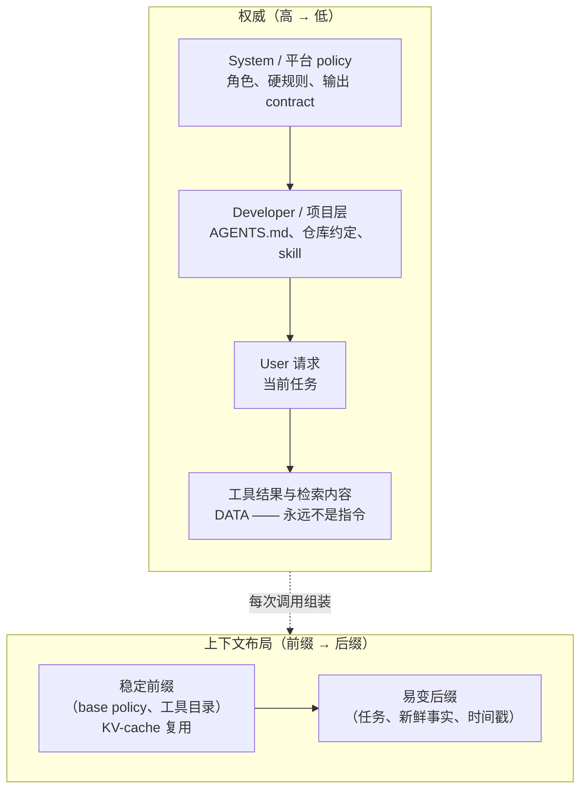

# 第 13 章：System Prompt 与指令架构

[前言](./00-preface.md)里的核心图把 *System Prompts* 列为 harness 的第一个组件，但前面各章一直把它当成既定前提。本章直接看这一指令层：它应该装什么、相互冲突的指令如何排优先级、运行时如何组装，以及为什么它值得用和系统其他部分一样的工程纪律来对待。

### 12.1 System Prompt 是 harness 层，不是一句 prompt

随口说的“prompt”是聊天框里敲进去的一个问题。Agent 的 system prompt 是另一回事：它是随 harness 一起发布的持久程序，框定 agent loop 的每一个回合。HumanLayer 的十二要素宣言把这点直接讲明——*own your prompts*——并主张对生产 agent 而言，prompt 是核心工程逻辑，而不是一个交给框架隐藏默认值的字符串 ([HumanLayer — 12-Factor Agents](https://www.humanlayer.dev/blog/12-factor-agents))。把它当应用代码看待，是下文一切的前提。

这个区别重要，是因为 system prompt 做着别的层做不了的工作：确立 agent 的角色与目标、声明可用工具及何时使用、编码 agent 不可违反的 policy、设定输出 contract。其中任何一项含糊时，失败不会表现为语法错误，而表现为漂移、过度积极、拒绝，或在错误时机用错工具——这些都很难精确归因（第 10 章、[第 12 章](./12-trace-driven-iteration.md)）。

### 12.2 指令层级（Instruction Hierarchy）

Agent 同时从多个来源收到指令：平台的 system prompt、开发者的配置、用户的请求，以及——关键地——藏在工具结果和检索文档里的文本。它们的权威并不相等，必须明确告诉模型这一点。OpenAI 把这形式化为 *instruction hierarchy*：可以训练模型把 system 级指令视为高于 user 级指令，两者又都高于工具输出里遇到的内容，从而让低优先级指令无法覆盖高优先级指令 ([OpenAI — The Instruction Hierarchy](https://arxiv.org/abs/2404.13208))。

对 harness engineer 来说，这正是[第 5 章](./05-sandboxing-guardrails.md)从安全角度画出的同一条边界，只是换到指令一侧来看。Prompt injection 恰恰是层级的失效：网页或文件里的文本（[*lethal trifecta*](https://simonwillison.net/2025/Jun/16/the-lethal-trifecta/)，第 5 章）试图把自己提升到指令级。层级给出两道互补的防线：

- **依靠模型训练出的优先级**：把真正的 policy 放在 system 位置，绝不放在用户可编辑或工具提供的位置。
- **从结构上再加固**：把不可信片段标注为 data，因为训练出的优先级只是一种倾向，不是保证。

实用规则是：一条指令的权威应当来自 *harness 把它放在哪里*，而不是它措辞多强硬。重要的约束属于 system 层；写进检索文档里的约束只是建议，agent 可以忽略——也应该被要求忽略。

### 12.3 什么该进 system prompt

并非所有为真的东西都需要写出来；一个塞得过满的 system prompt 会在任务还没开始前就花掉[第 2 章](./02-context-as-finite-resource.md)的 attention 预算。一个有用的划分：

- **属于 system prompt**：agent 的角色与目标、它必须始终遵守的高价值规则、工具描述自身表达不了的工具使用 policy（何时*不要*用某工具、工具之间的关系）、输出 contract。
- **属于工具描述，而非 system prompt**：每个具体工具的机制（第 4 章）。把工具细节复制进 system prompt 会制造两份会逐渐漂移的真相来源。
- **属于检索上下文，而非 system prompt**：会变化、体量大、或只是偶尔需要的事实。它们应通过 just-in-time retrieval（第 2 章）到达，而不是烤进一个静态前缀。

### 12.4 动态组装与稳定前缀约束

大多数真实 agent 并不发布一个固定字符串。System prompt 是按调用 *组装* 的：一段 base policy、当前工具集、项目特定指令，可能还有一个检索到的 skill（[第 4 章](./04-tools-agent-computer-interface.md)）。这个组装和[第 2 章](./02-context-as-finite-resource.md)的 KV-cache 经济学相撞：cache 只在前缀逐字节相同时复用，所以任何在调用之间会变的东西，都应放在所有不变的东西*之后*。

这把指令架构变成一个布局问题。稳定、可复用的材料——base policy、常驻工具目录——放在最前。易变材料——当前任务、刚检索的事实、时间戳——放在最后。一个在顶部插入当前时间或请求 ID 的 system prompt，会在每个回合悄悄废掉前缀缓存，为零行为收益付出延迟和成本代价。

### 12.5 把 prompt 当版本化代码

因为 system prompt 是承重的，对它的改动就是对系统的改动，带着和代码改动一样的回归风险。[第 10 章](./10-evaluation.md)的纪律原封不动地适用：一次 prompt 编辑应该在改动前后各跑一遍 eval 套件，比较 pass rate、失败类别、成本和延迟。[第 12 章](./12-trace-driven-iteration.md)的 model–harness 耦合更使这点尖锐——为某个模型调好的 prompt 可能在下一个模型上回退，所以 prompt 要和它被验证时所针对的模型一起版本化。

具体地，指令层值得拥有：版本控制、一份与 eval 结果挂钩的 changelog，以及一个负责人。“Own your prompts”正是这个意思——prompt 是一个有历史、被维护的产物，而不是某人在生产环境里现场改的字符串 ([HumanLayer — 12-Factor Agents](https://www.humanlayer.dev/blog/12-factor-agents))。

### 12.6 合适的“高度”

写 system prompt 最难的判断是它的具体程度。Anthropic 把这描述为找到合适的 *altitude（高度）*：太低，prompt 会变成一堆脆弱的硬编码 if-then 规则，碰到第一个没预料到的情况就崩，而且无止境地膨胀；太高，指引又含糊到模型没有可据以行动的具体信号 ([Anthropic — Effective Context Engineering for AI Agents](https://www.anthropic.com/engineering/effective-context-engineering-for-ai-agents))。目标是：具体到能可靠塑造行为，又一般到能迁移到 agent 实际会遇到的各种情况。

高度也是过度工程藏身的地方。每一条为单次坏 trace 而加的特例规则都是一份人质：它收窄行为、消耗上下文，还可能和下个月加的规则冲突。往往更好的修法不是在 system prompt 里再加一句，而是改工具、加一个 sensor（第 5 章），或加一个把行为钉死的 eval case（第 10 章）。Transcript 会告诉你该选哪个（[第 12 章](./12-trace-driven-iteration.md)）。

### 12.7 跨三层 harness 的分层指令

指令层不是铁板一块；它镜像[第 1 章](./01-what-is-an-agent-harness.md)的 inner/outer harness 结构。一个 coding agent 通常组合：

- 实验室发布的 **builder harness** system prompt，
- 团队加上的 **user harness** 项目指令——`AGENTS.md` 文件、仓库约定、review 规则（第 12 章）——以及
- 为特定任务按需加载的 **skill**（第 4 章）。

它们在运行时组合成模型看到的有效指令集。[第 12 章](./12-trace-driven-iteration.md)的教训在此延续：不要假设项目指令越多越好。关于臃肿 `AGENTS.md` 文件的证据是混杂的，一个过度规定的项目层可能和它所依附的 builder harness 互相打架。指令架构是要去测量的，而不是去最大化的。

---

## 图：指令栈

*权威自上而下流动，由位置而非措辞强制；布局自前缀向后缀流动，受缓存经济学支配。两条轴相互独立，都必须设计。*

---

## 要点

- **System prompt 是应用代码**：一个持久、承重的 harness 层，不是随口字符串——拥有它、版本化它、用 eval 检验它的改动。
- **权威来自位置，而非强调**：instruction hierarchy 让 system 指令高于用户输入和工具内容；prompt injection 是层级失效，所以要把不可信片段标注为 data。
- **把各自该在的东西分开**：角色与 policy 进 system prompt，机制进工具描述，会变的事实进 just-in-time retrieval。
- **为缓存而组装**：稳定指令在前，易变材料在后，否则前缀缓存会悄悄失效。
- **瞄准合适的高度**：具体到能引导，一般到能迁移；克制住用一条新硬编码规则去补每个 trace 的冲动。

## 延伸阅读

- Eric Wallace et al., *The Instruction Hierarchy: Training LLMs to Prioritize Privileged Instructions*, OpenAI, Apr 2024. https://arxiv.org/abs/2404.13208
- Anthropic Applied AI Team, *Effective Context Engineering for AI Agents*, Anthropic, Sep 2025. https://www.anthropic.com/engineering/effective-context-engineering-for-ai-agents
- Dex Horthy, *12-Factor Agents*, HumanLayer, Apr 2025. https://www.humanlayer.dev/blog/12-factor-agents
- Simon Willison, *The lethal trifecta for AI agents*, Jun 2025. https://simonwillison.net/2025/Jun/16/the-lethal-trifecta/
