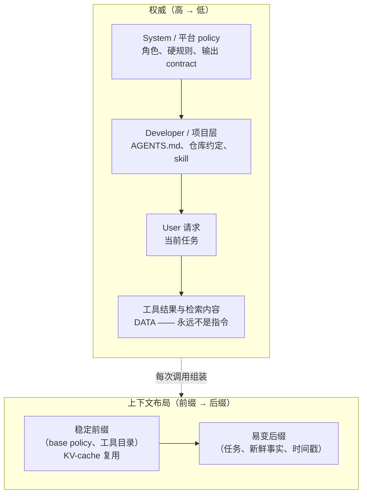

# 第 13 章：System Prompt 与指令架构

[前言](./00-preface.md)中的核心图将 *System Prompts* 列为 harness 的第一个组件，但此前各章大多把它视为既定前提。本章将直接讨论指令层：其中应该包含什么，agent 如何确定相互冲突的指令的优先级，harness 如何在运行时组装这些指令，以及为什么整个指令层都应当像系统的其他部分一样接受严谨的工程管理。

### 13.1 System Prompt 是 Harness 层，不是一句 Prompt

日常所说的“prompt”，通常是用户在聊天框中输入的一个问题。Agent 的 system prompt 则不同：它是随 harness 一起发布的持久程序，影响 agent loop 的每一个回合。HumanLayer 的十二要素宣言用 *own your prompts* 概括了这一区别。对于生产级 agent，prompt 是核心工程逻辑，不应成为隐藏在框架默认设置中的字符串 ([HumanLayer — 12-Factor Agents](https://www.humanlayer.dev/blog/12-factor-agents))。本章以下内容都建立在同一个前提上：把 system prompt 当作应用代码。

这个区别之所以重要，是因为 system prompt 承担着其他层无法替代的职责：定义 agent 的角色与目标，说明何时使用可用工具，写入 agent 必须遵守的 policy，并设定输出 contract。如果其中任何一项含糊不清，系统不会抛出语法错误；agent 反而可能逐渐偏离任务、行动过于积极、做出不必要的拒绝，或在错误的时机使用原本正确的工具。这些故障通常很难准确归因（第 10 章、[第 12 章](./12-trace-driven-iteration.md)）。

### 13.2 指令层级（Instruction Hierarchy）

Agent 会同时接收来自多个来源的文本：平台的 system prompt、开发者配置、用户请求，以及工具结果和检索文档中的内容；最后这一类尤其需要注意。这些文本并不具有同等权威。OpenAI 将这种差异形式化为 *instruction hierarchy*：通过训练，模型可以优先遵循 system 级指令，其次是 user 级指令，最后才是工具输出中的内容。其目标是防止低优先级文本覆盖高优先级指令 ([OpenAI — The Instruction Hierarchy](https://arxiv.org/abs/2404.13208))。

对于 harness engineer 来说，这正是[第 5 章](./05-sandboxing-guardrails.md)所述安全边界在指令层的体现。Prompt injection 就是这条边界失效的结果：网页或文件中的不可信文本试图把自己从数据提升为有权威的指令（[*lethal trifecta*](https://simonwillison.net/2025/Jun/16/the-lethal-trifecta/)，第 5 章）。Instruction hierarchy 提供了两道相互补充的防线：

- **利用模型训练出的优先级**：把真正的 policy 放在 system 位置，绝不放入用户可编辑或由工具提供的内容中。
- **从结构上加固边界**：将不可信片段明确标注为 data，因为训练形成的优先级只是一种倾向，而不是绝对保证。

实用规则是：指令的权威来自 *harness 将它放置的位置*，而不是措辞有多强硬。重要约束属于 system 层；同样的文字如果出现在检索文档中，就没有相应的权威，应被当作数据而非 policy。

### 13.3 什么该进 system prompt

并非所有相关事实都应写入 system prompt。塞得过满的 prompt 会在任务尚未开始时，就耗掉[第 2 章](./02-context-as-finite-resource.md)所讨论的 attention 预算。可以按以下方式划分职责：

- **System prompt**：agent 的角色与目标、始终适用的高价值规则、单个工具描述无法表达的工具使用 policy（例如何时*不应*使用某个工具，以及工具之间如何配合），还有输出 contract。
- **工具描述**：每个具体工具的使用机制（第 4 章）。在 system prompt 中重复这些细节，会产生两份可能逐渐偏离的事实来源。
- **检索上下文**：变化频繁、内容庞大，或只在特定任务中需要的事实。它们应通过 just-in-time retrieval（第 2 章）按需提供，而不是写死在静态前缀中。

### 13.4 动态组装与稳定前缀约束

大多数生产级 agent 并不使用一个固定字符串。Harness 会为每次调用*组装* system prompt，组成部分包括 base policy、当前工具集、项目特定指令，以及可能按需检索到的 skill（[第 4 章](./04-tools-agent-computer-interface.md)）。组装方式必须考虑[第 2 章](./02-context-as-finite-resource.md)所述的 KV-cache 经济学。缓存只能复用逐字节完全一致的前缀，因此会随调用变化的内容，都应放在稳定内容*之后*。

因此，指令架构也是一个布局问题。稳定且可复用的内容——例如 base policy 和常驻工具目录——应放在前面；易变内容——例如当前任务、刚刚检索到的事实和时间戳——应放在最后。如果 system prompt 在靠前位置插入当前时间或请求 ID，就会在每个回合悄然破坏前缀缓存，增加延迟与成本，却无法改善 agent 行为。

### 13.5 把 prompt 当版本化代码

System prompt 是关键组件，修改它就等于修改系统，也会带来与代码变更相同的回归风险。因此，[第 10 章](./10-evaluation.md)的工程纪律可以直接应用：在修改 prompt 前后分别运行 eval 套件，并比较通过率、失败类别、成本和延迟。[第 12 章](./12-trace-driven-iteration.md)讨论的 model–harness 耦合进一步说明了这一点：为一个模型调优的 prompt 可能使另一个模型出现回退，因此 prompt 应与经过联合验证的模型一同进行版本管理。

具体来说，指令层需要版本控制、与 eval 结果关联的 changelog，以及明确的负责人。“Own your prompts”说的正是这件事：prompt 是有修改历史、需要持续维护的工程工件，而不是任何人都能在生产环境中临时改动的字符串 ([HumanLayer — 12-Factor Agents](https://www.humanlayer.dev/blog/12-factor-agents))。

### 13.6 合适的“高度”

编写 system prompt 时，最难判断的是应当具体到什么程度。Anthropic 将其描述为寻找合适的 *altitude（高度）*：高度过低，prompt 会变成一组脆弱的硬编码 if-then 规则，一遇到未预料的情况就会失效，并且不断膨胀；高度过高，指导又会过于抽象，模型找不到可以据此行动的明确信号 ([Anthropic — Effective Context Engineering for AI Agents](https://www.anthropic.com/engineering/effective-context-engineering-for-ai-agents))。目标是让指导足够具体，能够稳定影响行为，同时又足够通用，可以迁移到 agent 实际会遇到的不同情况。

过度工程往往就隐藏在高度选择中。为了修复一次异常 trace 而加入的特例规则，可能变成长期负担：它会限制 agent 行为、占用上下文，还可能与以后新增的规则发生冲突。更好的修复方式常常不是继续向 system prompt 添加句子，而是修改工具、增加 sensor（第 5 章），或添加一个明确约束预期行为的 eval case（第 10 章）。Trace 能够为这项选择提供依据（[第 12 章](./12-trace-driven-iteration.md)）。

### 13.7 跨三层 harness 的分层指令

指令层并非一个不可分割的整体。它映射了[第 1 章](./01-what-is-an-agent-harness.md)所述的内外层 harness 结构。一个 coding agent 通常会组合以下内容：

- 实验室发布的 **builder harness** system prompt，
- 团队添加的 **user harness** 项目指令——`AGENTS.md` 文件、仓库约定和 review 规则（第 12 章）——以及
- 针对特定任务按需加载的 **skill**（第 4 章）。

这些层在运行时共同组成模型实际看到的指令集。[第 12 章](./12-trace-driven-iteration.md)的结论在这里同样适用：不要假设项目指令越多越好。关于大型 `AGENTS.md` 文件的研究结果并不一致，而且规定过细的项目层可能与其下方的 builder harness 发生冲突。指令架构需要衡量效果，而不是一味增加内容。

### 13.8 把 Scoped Review Rules 当作指令接口

仓库指令不仅可以指导代码生成，也可以指导代码 review。OpenAI 的 Codex 自定义 review 指南将简洁的 `AGENTS.md` 规则视为一种**review interface**：每条规则都应指出一种具体缺陷、说明适用范围，并解释 reviewer 如何识别该问题；目录级文件则把规则限制在其所治理的代码附近 ([OpenAI - Custom Code Review Rules for Codex](https://developers.openai.com/blog/custom-code-review-rules-for-codex))。

好的 review rule 应简短、可测试且信号明确，例如“标记绕过 `authorize()` 的新 endpoint”，而不是“遵循安全最佳实践”。规则应指向相关代码或 policy，并尽可能关联确定性检查。它们也需要像其他指令一样进行版本管理和评测，因为噪声过多的规则会制造 false positive，久而久之还会让人忽略整个 review 界面。这是 progressive disclosure 在质量 policy 上的应用：把规则放在其所治理的代码附近，全局指令只保留普遍要求，并将稳定的 invariant 逐步转化为 linter 或 test。

---

## 图：指令栈

*权威自上而下传递，由位置而非措辞决定；内容布局则从前缀延伸到后缀，受缓存经济学约束。这两个维度相互独立，都需要专门设计。*

---

## 要点

- **System prompt 是应用代码**：它是持久存在、承担关键作用的 harness 层，不是随意编写的字符串；应指定负责人、进行版本管理，并用 eval 检验每次修改。
- **权威来自位置，而非强调语气**：instruction hierarchy 让 system 指令优先于用户输入和工具内容。Prompt injection 是层级边界失效，因此不可信片段必须标注为 data。
- **不同内容应各归其位**：角色与 policy 放入 system prompt，使用机制写进工具描述，变化的事实则通过 just-in-time retrieval 提供。
- **组装时要考虑缓存**：稳定指令放在前面，易变内容放在后面，否则前缀缓存会在不易察觉的情况下失效。
- **选择合适的高度**：指导应具体到足以影响行为，又通用到可以迁移；不要用一条新的硬编码规则修补每个异常 trace。
- **Review rule 是一种指令接口**：将简短、可测试的缺陷规则放在其治理的代码附近，持续衡量信号质量，并把稳定 invariant 转化为确定性检查。

## 延伸阅读

- Eric Wallace et al., *The Instruction Hierarchy: Training LLMs to Prioritize Privileged Instructions*, OpenAI, Apr 2024. https://arxiv.org/abs/2404.13208
- Anthropic Applied AI Team, *Effective Context Engineering for AI Agents*, Anthropic, Sep 2025. https://www.anthropic.com/engineering/effective-context-engineering-for-ai-agents
- Dex Horthy, *12-Factor Agents*, HumanLayer, Apr 2025. https://www.humanlayer.dev/blog/12-factor-agents
- Simon Willison, *The lethal trifecta for AI agents*, Jun 2025. https://simonwillison.net/2025/Jun/16/the-lethal-trifecta/
- OpenAI, *Custom Code Review Rules for Codex*, Jul 2026. https://developers.openai.com/blog/custom-code-review-rules-for-codex
