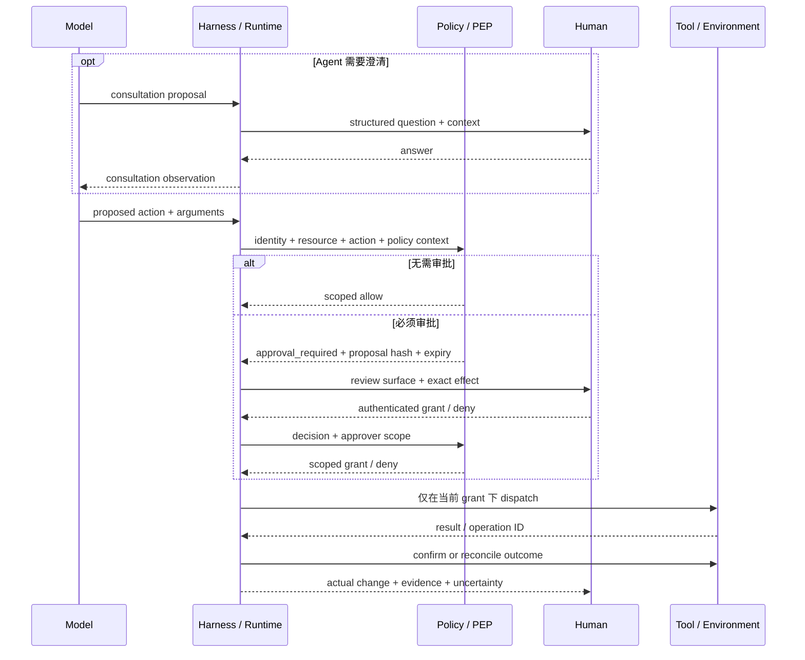

# 第 14 章：人–Agent 交互

人在 agent system 中扮演多种角色：提供 intent、回答问题、批准或拒绝有重要后果的动作、引导进行中的工作、取消 run，以及 review 证据。这些角色需要 product 与 runtime 的支持，不能只靠一条含糊指令来安全实现，例如要求模型“在适当的时候询问”。

Mixed-initiative interface 研究早在现代 agent 出现之前就提出了底层设计问题：代人行事的系统必须判断何时行动、何时让人决定，如何衡量打断用户的成本，以及如何保留交互 context（[Horvitz — Principles of Mixed-Initiative User Interfaces](https://www.microsoft.com/en-us/research/publication/principles-of-mixed-initiative-user-interfaces/)）。Agent system 又加入了 external side effect 与 long-running state，因此接口还必须明确表示 authority、evidence、timing 与 recovery。

### 14.1 咨询与强制审批是两条不同路径

两种人机交互模式在 chat UI 中看起来可能相似，但它们具有不同的安全语义：

| 模式 | 触发方式 | 含义 | Enforcement owner |
|---|---|---|---|
| **Agent-requested consultation（Agent 主动咨询）** | 模型或 workflow 因 intent、事实或判断不清楚而提出问题 | 人的输入成为一项 observation，可以指导下一次模型调用 | Harness/runtime 记录问题与回答；回答不会自动授予无关 capability |
| **Runtime-mandated approval gate（Runtime 强制审批门）** | Policy 判定 proposed action 在 dispatch 前必须获得批准 | 经过认证且限定 scope 的 decision，在明确条件下允许或拒绝该准确动作 | 动作路径上不可绕过的 policy enforcement point（PEP） |

HumanLayer 提出的 “contact humans with tool calls” 是第一条路径中很有用的 orchestration pattern：把问题表示成结构化工作，挂起执行，再把回答作为 observation 返回 loop（[HumanLayer — 12-Factor Agents](https://www.humanlayer.dev/blog/12-factor-agents)）。模型可以请求澄清，也可以建议由人 review 某个选择，但它也可能根本没有提出请求。

因此，第二条路径不能依赖模型自愿调用。NIST 把 PEP 定义为执行 access decision 的组件，其 access-control 指南还要求 enforcement mechanism 不可被绕过（[NIST — Zero Trust Architecture Glossary](https://pages.nist.gov/zero-trust-architecture/glossary.html)；[NIST IR 7987](https://nvlpubs.nist.gov/nistpubs/ir/2014/NIST.IR.7987.pdf)）。MCP tools specification 同样建议应用展示 tool input，并对 sensitive operation 请求确认（[MCP — Tools Specification](https://modelcontextprotocol.io/specification/2025-06-18/server/tools)）。即使模型从未发出 `request_human_approval`，runtime 仍必须拦截动作。

Consultation answer 可以促使 policy 重新评估某个动作，但除非回答是由 authenticated gate 按所需 scope 收集的，否则它本身不是 mandatory approval。反过来，runtime 也可以要求审批 agent 认为很普通的动作。

### 14.2 根据风险分配人的注意力

每个动作都要求审批会让人形成习惯并拖慢有用工作；review 太少又会鼓励盲目信任。Anthropic 描述了怎样把文件与网络操作放进明确 sandbox boundary，从而减少重复 permission prompt，同时继续要求确认越过边界的动作（[Anthropic — Beyond Permission Prompts](https://www.anthropic.com/engineering/claude-code-sandboxing)）。一般原则是：把人的注意力用在 policy-relevant consequence 足以证明其必要性的地方。

至少应沿以下维度对 action 分类：

- **Reversibility（可逆性）：** 能否恢复准确的先前状态，rollback 是否已经测试？
- **Blast radius（影响半径）：** 影响一个 scratch file、一个 user、一个 tenant、production service，还是公开 audience？
- **External communication（外部通信）：** 动作是否会向 working boundary 之外发送、发布、提交或共享内容？
- **Money（金钱）：** 动作是否会产生购买、转账、订阅、合同或按量计费支出？
- **Production（生产环境）：** 动作是否会改变 live infrastructure、data、access 或 availability？
- **Sensitive data（敏感数据）：** 动作是否会读取、转换、暴露、保留或传输 secret、personal data、regulated data 或 tenant-confidential content？

下面是一张起始矩阵：

| 动作画像 | 示例 | 默认交互 | 必需证据 |
|---|---|---|---|
| 可逆、位于 sandbox、影响半径小 | 读取允许的文件；运行测试；编辑一次性 workspace | 在现有 authorization 下执行，并按需报告 | Action/result record；sandbox boundary |
| 可逆且 scope 有限，但会改变持久工作 | 创建 draft 或 branch；更新非生产 artifact | 执行并报告，或按 policy 抽样 review | Diff 或 versioned artifact；rollback path；已运行的 check |
| 外部通信 | 发送邮件；发表评论；提交表单 | 预览准确 audience 与 payload；除非有限 standing policy 已覆盖，否则通常需要审批 | Recipient/destination、normalized payload、identity、policy reason |
| 金钱或有约束力的承诺 | 购买、转账、扩大付费 API 使用、接受合同 | 必须审批，并显示 amount、recipient/vendor、limit 与 expiry | 准确 transaction proposal；budget 与 authorization evidence |
| 生产环境或大影响半径 | 部署、修改 access、变更 live data、轮换 credential | 必须审批，或者进入更严格的 change-management gate | Diff/plan、affected resource、test、rollback、current health |
| 敏感数据披露或移动 | 导出客户数据；发送 secret；改变 sharing scope | 除非得到明确授权，否则拒绝；policy 允许时仍需 mandatory approval | Data class、source、destination、purpose、minimization/redaction evidence |
| 不可逆或破坏性动作 | 永久删除；不可撤回地发布；破坏性 migration | 必须审批，并提供 recovery 或 exception plan | 准确 target、impact analysis、backup/recovery evidence、expiry |

这不是通用 allowlist。可逆性可能具有迷惑性：如果文件受版本控制，删除本地文件或许没有危险；而发送一条“可编辑”的消息仍然可能造成不可逆的信息披露。Policy 应结合这些维度与 identity、purpose、environment 和当前 resource state 作出判断。

### 14.3 强制审批门把批准绑定到准确 Proposal

Mandatory approval 应针对 immutable 或 content-addressed 的 action preview 发放。Pending record 至少包括：

```text
proposed_action
normalized_arguments
resource_identity_and_version
acting_user_agent_and_delegation_identity
policy_id_and_version
risk_class_and_policy_reason
approval_scope_and_expiry
```

Decision record 还应加入 authenticated approver identity、approver authority scope、decision、time、condition 与 proposal hash。UI 可以展示友好的 label，但 grant 必须绑定 normalized argument 与 stable resource identifier，而不能只绑定 natural-language prose。

发生 **material change（实质变化）** 后，先前批准立即失效，proposal 必须重新通过 policy。典型变化包括 amount、recipient、destination、target resource 或 version、data class、external audience、acting identity 或 delegation、tool semantics、side-effect scope、policy version，或者执行时间已经超过 grant expiry。Policy 应针对具体 domain 定义 materiality；模型不能自行判断两个动作“足够接近”。第 6 章对 retry 采用相同规则：approval、authorization 与 outcome status 的输入改变后，必须重新检查。

批准只允许系统尝试执行有限 scope 的动作。它不能证明工具已经运行，不能证明 timeout 没有产生 effect，也不能证明目标 outcome 已经发生。Approval ID、dispatch attempt 与 outcome evidence 必须保持分离。

### 14.4 审批事件支持恢复；审计还需要更多保证

Consultation 与 approval 应通过显式 transition 进入 workflow event history，例如：

```text
consultation_requested -> consultation_answered
approval_required -> approval_granted | approval_denied | approval_expired
approval_granted -> approval_revoked | action_dispatched
```

每个 event 都携带 run/action identity、sequence、actor、time、proposal 或 artifact reference、policy version 与 previous state。这样，durable runtime 可以在等待期间释放 compute，并在之后重建是否允许恢复执行。Temporal 的 event-history model 是一个具体案例：系统用持久化 event 在故障后重建 workflow state（[Temporal — Events and Event History](https://docs.temporal.io/workflow-execution/event)）。第 10 章定义本书的 event 与 replay contract。

Event history 不会自动成为 audit record。NIST SP 800-53 把 audit-record content、generation、review、protection、access 与 retention 分别列为明确 control（[NIST SP 800-53 Rev. 5](https://csrc.nist.gov/pubs/sp/800/53/r5/upd1/final)）。只有当系统能够建立所需的 **completeness、identity、timestamp、integrity、retention 与 access** 属性时，approval event 才能成为 audit evidence。Sampled trace 或可修改的 application log 可以链接到 event，却不能悄悄继承这些保证。

Audit representation 应保留展示过什么、谁作出 decision、其 authority 是什么、决定之后发生了哪些变化、dispatch 了哪个 action，以及确认了什么 outcome。同时还应尽量减少不必要的 prompt、personal data 与 secret；可审计性并不意味着获准永久保留所有内容。

### 14.5 围绕决策与证据设计 Review Surface

有效的 review surface 应帮助人理解正在发生什么、需要作出哪项决定，以及哪些证据支持该决定。Human–AI interaction guideline 建议界面清楚说明系统 capability、展示 status、支持 correction，并让人能够轻松 dismiss 或 override 错误输出（[Amershi et al. — Guidelines for Human-AI Interaction](https://www.microsoft.com/en-us/research/publication/guidelines-for-human-ai-interaction/)）。

应根据情况展示：

- **Plan 与 current status：** 预期 milestone、已完成工作、pending work 与 blocker；
- **Tool action：** Operation name、normalized argument、resource、acting identity、预期 side effect，以及 idempotency/outcome status；
- **Diff 或 artifact：** 准确 version、content hash、rendered change、destination 与 rollback option；
- **Test 与 evidence：** 实际运行的 check、result、citation、environment state 与完整输出链接；
- **Uncertainty：** assumption、冲突 evidence、缺失 check、unknown outcome，以及解决这些问题需要什么；
- **Policy reason：** 为什么 action 被 allow、deny、redact、sandbox 或送去 approval，适用哪个 policy/version；
- **Decision consequence：** Approval 允许什么、何时 expiry，以及哪些 material change 会要求重新决定。

这不要求暴露 hidden chain-of-thought。OpenAI Model Spec 指出，部分模型会生成 hidden chain-of-thought，但除可能提供摘要外，它不会暴露给 developer 或 user（[OpenAI — Model Spec, Hidden Chain of Thought](https://model-spec.openai.com/2025-10-27)）。Review system 应依赖简洁 plan、可观察 action、artifact、check、source、policy decision 与 environment outcome，而不是 private reasoning text 或模型事后生成的 rationale。

应区分 **pre-action approval** 与 **post-action review**。Dispatch 之前，重点展示准确 proposed effect 与 approval scope；执行以后，重点展示实际变化、verification evidence、剩余 uncertainty 与 recovery option。无论在哪个界面，只显示一句 “done” 都不充分。

### 14.6 Steering 与 Cancellation 需要事件语义

Steering 不能只是追加一条消息。应记录 `steering_requested` event，其中包含 requester identity、scope、instruction reference、reason 与 time。Controller 随后记录该请求是 accepted、rejected 还是 superseded，以及它从哪个 sequence 或 step 开始生效。通常，它可以影响下一次模型调用，并阻止尚未 dispatch 的后续 action；却不能倒过来修改已经 dispatch 的 action argument。

Cancellation 同样至少具有两种状态：**cancellation requested**，以及最终的 **cancelled**、**partially completed**、**failed** 或 **unknown** outcome。Temporal 的 workflow model 区分取消请求与最终 terminal state，而且 activity cancellation 采用协作语义，并不证明 rollback 已经发生（[Temporal — Workflow Execution](https://docs.temporal.io/workflow-execution)；[Temporal — Events and Event History](https://docs.temporal.io/workflow-execution/event)）。

收到 steering 或 cancellation event 后：

1. 停止在其 scope 内安排新 action；
2. 记录当前 model/tool call，以及是否已经发生 dispatch；
3. 如果 in-flight operation 的 contract 支持取消，就发出 cancellation request；
4. 不得假定已经 dispatch 的 effect 被回滚；
5. 对 external state 进行 reconciliation，并记录 succeeded、partial、cancelled、failed 或 unknown outcome；
6. 如果新方向对 pending approval 造成 material change，就让该批准失效；
7. 在按新 instruction 恢复之前建立 checkpoint 或 handoff。

一次长时间、不可中断的 model call 可能只能在返回后看到 steering。Remote tool 可能忽略 cancellation，也可能在收到请求前已经完成。UI 必须如实显示这种时序：“request received”并不等于“action stopped”。第 6 章负责单次调用的 cancellation 与 unknown-outcome handling；第 10 章负责 durable state transition。

### 14.7 从一次 Review 到 Fleet Queue

对于一个 run，reviewer 可以直接检查 pending action；面对整个 fleet，queue 应按**风险与证据**排序，而不是只按 arrival time 或 transcript length。值得升级的信号包括即将 expiry 的 mandatory approval、sensitive-data 或 production action、广泛 blast radius、external communication 或 spend、deterministic check 失败、artifact 缺失、evidence 冲突、unknown side effect、新的 tool/policy combination，以及反复发生的 human override。

验证充分的低风险工作可以根据 policy 只展示摘要或抽样；有重要后果的工作则应保留准确 proposal 与 review artifact。Queue status 必须链接到 run/action ID 和当前 event-history state，防止一张过时 card 批准已经变化或完成的 action。

跨 run identity、queue ownership、policy administration、revocation 与 fleet lifecycle 属于[第 19 章](./19-agent-fleets-control-plane.md)。本章提供 fleet control plane 必须保留的人工 decision 与 review contract。

### 14.8 围绕一个动作的两条人工路径



Consultation path 改善 intent 与 judgment；mandatory path 执行 policy。两条路径可以出现在同一个 run 中，却不能互相替代。

---

## 要点

- **区分咨询与审批：** 模型可以向人询问信息，但 runtime-mandated gate 不能依赖模型自愿调用。
- **把批准绑定到准确动作：** 记录 normalized argument、resource、identity、policy/version、risk、scope 与 expiry；material change 必须重新决定。
- **根据风险分配注意力：** 综合考虑 reversibility、blast radius、external communication、money、production 与 sensitive data。
- **批准是权限，不是 outcome evidence：** Dispatch 与 postcondition confirmation 仍是不同的 lifecycle stage。
- **Event history 不会自动成为 audit：** 只有具备明确 completeness、identity、integrity、timestamp、retention 与 access，approval event 才能成为 audit evidence。
- **Review 可观察工作，而不是隐藏推理：** 展示 plan/status、tool action、diff 或 artifact、test 与 evidence、uncertainty、policy reason 和 decision consequence。
- **Steering 与 cancellation 是状态转换：** 记录它们何时生效，并 reconcile 任何已经 dispatch 的 action。
- **Fleet review 属于 control plane：** 第 19 章负责跨 run queue、identity、policy administration、revocation 与 lifecycle。

## 延伸阅读

- Eric Horvitz, *Principles of Mixed-Initiative User Interfaces*, CHI 1999. https://www.microsoft.com/en-us/research/publication/principles-of-mixed-initiative-user-interfaces/
- Saleema Amershi et al., *Guidelines for Human-AI Interaction*, CHI 2019. https://www.microsoft.com/en-us/research/publication/guidelines-for-human-ai-interaction/
- Dex Horthy, *12-Factor Agents*, HumanLayer, Apr 2025. https://www.humanlayer.dev/blog/12-factor-agents
- David Dworken and Oliver Weller-Davies, *Beyond Permission Prompts: Making Claude Code More Secure and Autonomous*, Anthropic, Oct 2025. https://www.anthropic.com/engineering/claude-code-sandboxing
- Model Context Protocol, *Tools Specification*, Jun 2025. https://modelcontextprotocol.io/specification/2025-06-18/server/tools
- NIST, *Zero Trust Architecture Glossary*. https://pages.nist.gov/zero-trust-architecture/glossary.html
- NIST, *IR 7987: Policy Machine*. https://nvlpubs.nist.gov/nistpubs/ir/2014/NIST.IR.7987.pdf
- NIST, *SP 800-53 Rev. 5*. https://csrc.nist.gov/pubs/sp/800/53/r5/upd1/final
- Temporal, *Workflow Execution*. https://docs.temporal.io/workflow-execution
- Temporal, *Events and Event History*. https://docs.temporal.io/workflow-execution/event
- OpenAI, *Model Spec*, Oct 2025. https://model-spec.openai.com/2025-10-27
