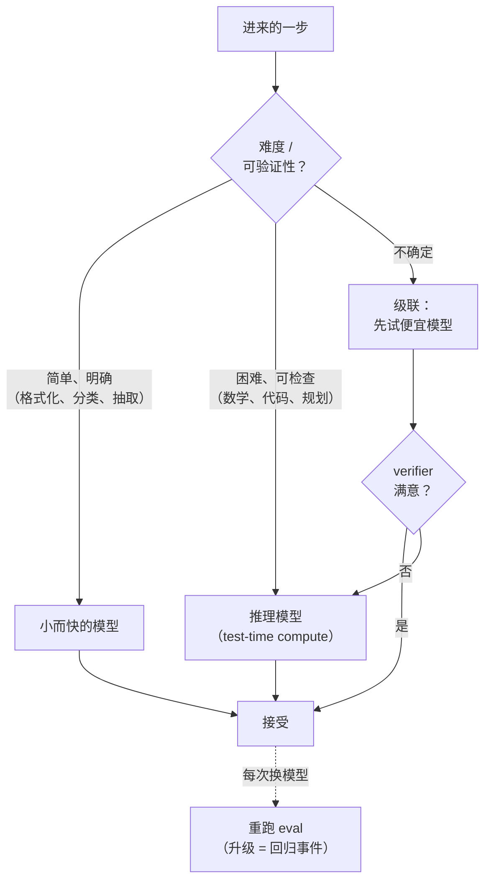

# 第 14 章：模型选择、路由与推理模型

*Agent = Model + Harness。* 前面各章主要讨论 harness，并一直把“模型”视为一个固定选项。但在实际系统中，模型选择本身也是一个重要的设计维度：每一步该调用哪个模型，较便宜的模型是否已经足够；而在推理模型出现之后，harness 还要决定在模型行动前投入多少推理预算。本章关注这些运行层面的决策。模型内部的工作原理则见姊妹卷 [*LLM Foundations*](../llm-foundations-zh/)。

### 14.1 模型选择是 harness 决策

[第 6 章](./06-agentic-workflow-patterns.md)的第一条原则——采用能够奏效的最简单方案——不仅适用于控制流，也适用于模型选择。最大、能力最强的模型很少适合作为 agent loop 每一步的默认选项。大多数 loop 只包含少量困难的规划或综合任务，同时包含大量较简单的任务，例如输入分类、结果格式化和字段提取。困难步骤可能确实需要前沿模型；简单步骤通常交给更小、更快、更便宜的模型也能取得同样好的结果 ([Anthropic — Building Effective Agents](https://www.anthropic.com/engineering/building-effective-agents))。

如果把模型当作单一的全局设置，就无法利用这种差异。harness 可以为每个步骤分别选择模型；选择的单位应当是一次调用，而不是整个应用。这是对[第 3 章](./03-compaction-memory-subagent.md)中模型路由思路的推广：不能改善结果的额外模型能力就是浪费。在生产环境中，这种浪费会直接体现为每个请求增加的延迟和成本。

### 14.2 路由：让模型强度匹配任务难度

在工作流中，*routing*（路由，第 6 章）是把输入分派到专门的处理分支。*Model routing*（模型路由）则把同样的思路用于模型选择：估计请求难度，把简单请求交给更小、更便宜的模型，把更强、更昂贵的模型留给困难请求。真正的难点在于分类器。只有当路由判断足够可靠，而且判断本身的成本远低于节省的模型开销时，路由才有价值。

RouteLLM 表明，这种判断可以通过学习获得：router 在偏好数据上训练后，会把每个 query 分派给强模型或弱模型；在标准 benchmark 上，整个系统只花强模型的一小部分成本，就能保留后者的大部分质量 ([RouteLLM](https://arxiv.org/abs/2406.18665))。对 harness 而言，重点不在某个具体 router，而在这个通用杠杆：在昂贵调用之前增加一个小而快的判断，可以改善成本与质量之间的权衡，但前提是该判断本身既便宜又可靠。困难任务如果被错送到能力不足的模型，可能会静默失败；由此造成的损失，可能远高于省下的模型调用成本。

### 14.3 级联与回退

路由会在执行任务之前选择模型。*级联（cascade）*则把决定推迟到第一次尝试之后：先调用较便宜的模型；如果答案通过 verifier，就直接接受；只有未通过时，才升级到更强的模型。FrugalGPT 展示了这类级联：大多数 query 由便宜模型处理，只有剩余的困难请求需要升级，因此能够在显著降低成本的同时，达到与前沿模型相当的准确率 ([FrugalGPT](https://arxiv.org/abs/2305.05176))。

级联的质量取决于升级信号，也就是判断第一个答案是否合格的 verifier。这里可以沿用本书反复讨论的验证机制：基于代码的检查、测试、schema 校验，或基于模型的 grader（第 5 章、[第 10 章](./10-evaluation.md)）。没有可信的信号，级联只会增加延迟，最后仍可能返回同一个错误答案。

与此相关的另一个生产模式是 *fallback（回退）*。当主模型报错、超时或受到限流时，harness 会切换到备用模型，使 agent 能够降级运行，而不是停滞不前。Fallback 解决的是可靠性问题，而不是质量判断问题，与[第 7 章](./07-long-running-agents.md)的 checkpoint/resume 同属可靠性机制。

### 14.4 推理模型与 test-time compute

推理模型通常会经过 post-training（后训练），例如在答案可检查的问题上采用 reinforcement learning，使模型在给出最终答案之前进行更充分的内部推理。它通过消耗额外的 inference token，提升解决困难问题的表现。DeepSeek-R1 表明，使用可验证奖励的 reinforcement learning 可以激发出较强的推理能力 ([DeepSeek-R1](https://arxiv.org/abs/2501.12948))。其他研究还发现，对某些问题而言，在固定预算下增加 *test-time compute*——也就是让模型在 inference 阶段投入更多计算——可能比选择更大的模型更有效 ([Snell et al. — Scaling LLM Test-Time Compute](https://arxiv.org/abs/2408.03314))。具体机制见姊妹卷（*LLM Foundations*，第 7–8 章）。对 harness 的直接影响是：“让模型推理多久”已经成为独立于“选择哪个模型”的另一条可控轴。

这与[第 11 章](./11-infrastructure-noise.md)讨论的扩展方式不同。那里，增加硬件是为了支持更多 agent *动作*；这里，增加 inference 预算是在单次调用中、尚未使用任何工具之前，换取更多内部*推理*。两者都会消耗资源，但不能相互替代。

### 14.5 驾驭推理模型：不要和训练对着干

推理模型改变了若干 harness 假设。最常见的错误，是用提示和配置去干扰模型已经通过训练获得的行为：

- **不要手动要求模型执行它已经具备的推理过程。** 对经过推理训练的模型额外加入“think step by step”之类的指令，可能浪费 token，也可能与训练形成的行为冲突。应当遵循供应商针对该类模型给出的指引。
- **为不可见的 token 预留预算。** 推理模型可能在给出第一个可见输出之前，先生成数千个隐藏的推理 token。这些 token 同样会增加延迟和成本。如果模型提供 reasoning-effort 控制，应将其视为一等的 harness 参数，并在适当情况下开放给用户。
- **不要把推理 trace 当作可信解释。** 推理文本可能被隐藏、压缩为摘要，也可能无法忠实反映模型的实际计算过程。任何可见的推理都只能作为 debug 辅助，不能替代验证——这与第 10 章对模型自我报告的谨慎态度一致。
- **推理不等于 grounding。** 增加内部推理并不会凭空产生证据。模型可以更仔细地分析 harness 提供的材料，却无法创造从未获得的事实。因此，工具、检索和验证仍然不可缺少（第 4 章、[第 10 章](./10-evaluation.md)）。

### 14.6 路由到推理：额外 token 何时划算

推理模型最适合数学、代码、规划和多步分析等任务，因为这类任务通常包含困难但可检查的子问题。对于简单的抽取、格式化和分类，额外推理往往只会增加延迟和成本，并不能提升质量。因此，推理能力也应当像其他能力一样按需路由：把困难且可验证的步骤交给推理模型，把前后的简单步骤留给快速的非推理模型（§14.2）。

这与[第 6 章](./06-agentic-workflow-patterns.md)的 micro-agent 模式可以自然组合。确定性 DAG 能够把推理模型调用准确放在需要深入分析的节点，并在其前后安排成本较低的确定性处理。这个“reasoning sandwich”可以避免在开放式 loop 的每个回合都为长时间推理付费。

### 14.7 模型升级是 harness 事件

前沿模型越来越多地在包含 harness 的环境中接受 post-training，因此模型行为与 harness 会相互耦合（[第 12 章](./12-trace-driven-iteration.md)）。所以，更换模型——无论是升级版本、改用更便宜的供应商、采用量化变体，还是切换到不同的推理类型——都是一次系统变更，而不是即插即用的替换。一个在公开 benchmark 上表现更好的模型，仍可能在具体 workflow 中退步：它可能以不同方式理解工具描述，输出详略程度不同，或在本应快速回答时投入过多推理。

这里应遵循[第 10 章](./10-evaluation.md)的纪律：把每次模型变更都视为一次回归事件。变更前后都要运行 eval 套件；除了 pass rate，还要比较失败类别和成本。Prompt 与工具应当和它们所验证的模型版本一起管理。Readiness 不是模型自身的属性，而是整个 model-plus-harness 配置的属性。

### 14.8 AI 网关：把路由做成基础设施

第 14.2–14.3 节把路由、cascade 和 fallback 视为应用*逻辑*。在生产环境中，其中许多逻辑可以放到专门的基础设施组件中：*AI 网关（AI gateway，也称 LLM gateway 或 LLM proxy）*。网关位于 harness 与模型供应商之间，在多个供应商之上提供一个统一端点，通常兼容 OpenAI 接口。它还集中处理模型路由与 fallback、负载均衡、重试、按 key 设置的预算和限流、缓存，以及请求/响应日志等共性问题。开源方案包括 LiteLLM，它通过单一接口接入 100 多家供应商，并提供成本追踪和负载均衡 ([LiteLLM](https://github.com/BerriAI/litellm))；Portkey 则进一步把 guardrails 和 PII 脱敏纳入网关层 ([Portkey - AI Gateway](https://github.com/Portkey-AI/gateway))。

AI 网关之所以属于 harness 的讨论范围，是因为它把原本需要各 agent 分别实现的多项职责集中起来。第 14.3 节的 fallback 可以改为网关配置，不必重复写进每个 agent。第 17 章讨论的成本预算和 span 级归因也适合放在网关，因为它能观察到每一次模型调用。稳定的网关接口还便于执行第 14.7 节的模型替换纪律：无需修改 agent 代码，就能只向一小部分流量灰度新模型。

这种集中化也有代价。网关成为热路径上的依赖，因此自身需要采用第 5.11 节介绍的熔断器和超时机制；一旦网关故障，接入它的所有 agent 都会受到影响。集中化也不会消除对*可靠路由决策*的需要（第 14.2 节），只是为这些决策提供一个统一的执行位置。与第 4.3 节讨论的 MCP 类似，网关只是管道：它能降低可靠路由策略的运维难度，却不能把糟糕的策略变好。

---

## 图：模型选择决策

*把简单步骤交给较小的模型，把困难且可检查的步骤交给推理模型。无法预先确定时，可以使用级联，由 verifier 决定是否升级。任何模型变更都是对整个配置的一次回归事件。*

---

## 要点

- **按步骤选择模型，而不是为整个应用固定一个模型**：只在确实能改善结果的调用上使用前沿能力，把简单工作路由给更小、更快的模型。
- **路由在执行前决定，级联在首次尝试后决定**：通过学习得到的 router 可以改善成本与质量的权衡（[RouteLLM](https://arxiv.org/abs/2406.18665)）；由 verifier 把关的级联则能以更低成本达到强模型的准确率（[FrugalGPT](https://arxiv.org/abs/2305.05176)）。两者都依赖便宜而可靠的决策信号。
- **推理模型增加了一条独立的设计轴**：test-time compute 能在困难、可检查的任务上用 inference token 换取更高质量。这不同于选择更大的模型或增加硬件。
- **顺应模型的训练方式**：不要手动要求模型执行它原本就会的推理；为隐藏 token 预留预算；不要把 reasoning trace 当成验证；还要记住，推理本身不能提供 grounding。
- **把模型升级视为 harness 事件**：每次更换模型都要重新运行 eval。Readiness 属于整个 model-plus-harness 配置，而不是模型本身。
- **用 AI 网关集中承载路由基础设施**：LiteLLM、Portkey 等 proxy 可以在统一接口后处理 fallback、预算、缓存和日志，但仍然需要可靠的路由决策以及网关自身的熔断器。

## 延伸阅读

- Isaac Ong et al., *RouteLLM: Learning to Route LLMs with Preference Data*, 2024. https://arxiv.org/abs/2406.18665
- Lingjiao Chen, Matei Zaharia, and James Zou, *FrugalGPT: How to Use Large Language Models While Reducing Cost and Improving Performance*, 2023. https://arxiv.org/abs/2305.05176
- Charlie Snell et al., *Scaling LLM Test-Time Compute Optimally Can Be More Effective Than Scaling Model Parameters*, 2024. https://arxiv.org/abs/2408.03314
- DeepSeek-AI, *DeepSeek-R1: Incentivizing Reasoning Capability in LLMs via Reinforcement Learning*, 2025. https://arxiv.org/abs/2501.12948
- Erik Schluntz and Barry Zhang, *Building Effective Agents*, Anthropic, Dec 2024. https://www.anthropic.com/engineering/building-effective-agents
- *LLM Foundations for Harness Engineering*（姊妹卷），第 5–8 章。[../llm-foundations-zh/](../llm-foundations-zh/)
- LiteLLM (BerriAI), *Python SDK and Proxy Server (AI Gateway)*. https://github.com/BerriAI/litellm
- Portkey, *AI Gateway*. https://github.com/Portkey-AI/gateway
