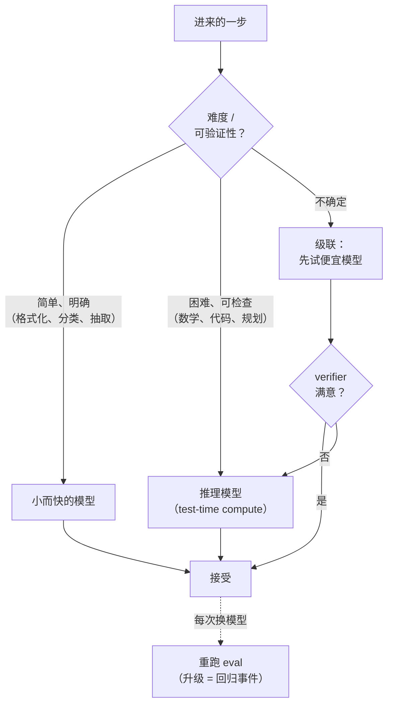

# 第 14 章：模型选择、路由与推理模型

*Agent = Model + Harness。* 前面各章都在做 harness，而把“模型”当成一个固定的单一选择。实际上模型这一侧本身就是一个设计面：某一步该跑哪个模型、用更便宜的是否也行，以及——自从推理模型出现以来——在行动前该让模型思考多久。本章讲 harness 拥有的、面向模型的决策。至于这些模型内部在做什么，姊妹卷 [*LLM Foundations*](../llm-foundations-zh/) 是参考；这里关心的是运维层面。

### 13.1 模型选择是 harness 决策

[第 6 章](./06-agentic-workflow-patterns.md)的第一原则——做能奏效的最简单的事——对模型和对控制流一样适用。最大、最强的模型很少是 agent loop 每一步的正确默认。大多数 loop 里是混合工作：一个真正需要前沿模型的困难规划或综合步骤，被一圈简单步骤——给输入分类、格式化结果、抽取字段——包围着，而后者用一个更小、更快、更便宜的模型一样能搞定 ([Anthropic — Building Effective Agents](https://www.anthropic.com/engineering/building-effective-agents))。

把模型当成一个全局设置，就把这块收益留在了桌上。Harness 可以按步选择，而选择的单位是“调用”，不是“应用”。这和[第 3 章](./03-compaction-memory-subagent.md)的 model-routing 提法是同一个直觉的推广：花在不改变结果之处的能力就是被浪费的能力，而在生产中这种浪费体现为每个请求上的延迟和金钱。

### 13.2 路由：让模型强度匹配任务难度

工作流意义上的 *routing*（第 6 章）把输入派发到专门分支。*Model routing* 是同一思路用在模型选择上：给请求的难度分类，把简单的送给弱而便宜的模型、把困难的送给强而昂贵的模型。难点在分类器——只有当“决定走哪条路”远比它带来的节省更便宜时，路由才划算。

RouteLLM 表明这可以学出来：一个在偏好数据上训练的 router 把 query 送往强或弱模型，在标准 benchmark 上以一小部分成本恢复了强模型的大部分质量 ([RouteLLM](https://arxiv.org/abs/2406.18665))。harness 层的要点不是某个具体 router，而是这个杠杆的形状：在昂贵调用前放一个小而快的决策，可以推动 cost-quality 前沿——*前提是*路由决策本身可靠且便宜。一个被错误路由、又静默失败的困难任务，可能比它省下的那个模型贵得多。

### 13.3 级联与回退

路由是事先决定。*级联（cascade）*则推迟决定：先试便宜模型，若 verifier 满意就接受其答案，只在不满意时升级到更强的模型。FrugalGPT 演示了这种级联：把大多数 query 送给便宜模型、只把困难的残差升级，从而在大幅降本的同时匹配前沿模型的准确率 ([FrugalGPT](https://arxiv.org/abs/2305.05176))。

级联的好坏完全取决于它的升级信号——那个判断“这个答案不够好”的 verifier。这就是本书各处一样的验证机制：基于代码的检查、测试、schema 校验，或基于模型的 grader（第 5 章、[第 10 章](./10-evaluation.md)）。没有可信信号，级联只是在产出同一个错误答案之前多加一段延迟。与之相关的生产模式是 *fallback（回退）*：当主模型出错、超时或被限流时，切换到备用模型，让 agent 优雅降级而不是卡死——这是一个可靠性问题，归属[第 7 章](./07-long-running-agents.md)的 checkpoint/resume 纪律。

### 13.4 推理模型与 test-time compute

推理模型经过 post-training——通常是在可检查的问题上做 reinforcement learning——学会在给出答案前生成一长串内部推理，花额外的 inference token 在困难问题上做得更好。DeepSeek-R1 记录了强推理行为可以主要通过在可验证奖励上做 RL 来诱发 ([DeepSeek-R1](https://arxiv.org/abs/2501.12948))，而一条研究线表明 *test-time compute*——让模型在推理时想得更久——在某些问题上可能比换更大的模型更划算 ([Snell et al. — Scaling LLM Test-Time Compute](https://arxiv.org/abs/2408.03314))。机制见姊妹卷（*LLM Foundations*，第 7–8 章）；这里的后果是：“模型思考多久”已成为一个 harness 可控的轴，独立于“用哪个模型”。

这是和[第 11 章](./11-infrastructure-noise.md)里任何东西都不同的一条 scaling 轴。那里，更多硬件带来更多 agent *动作*。这里，更多 inference 预算在单次调用内、在任何工具被触碰之前，买到更多*思考*。两者都花钱，且不可互换。

### 13.5 驾驭推理模型：不要和训练对着干

推理模型改变了若干 harness 假设，而失败模式就是去和模型已有的行为对着干：

- **不要去手动 prompt 它天生就会的推理。** 对一个被训练成会推理的模型强塞“think step by step”，可能浪费 token 或与其训练行为冲突。遵循供应商对该类模型的指引。
- **为不可见的 token 做预算。** 一个推理模型可能在它第一个可见字之前吐出几千个隐藏推理 token。那是真实的延迟和成本。模型若暴露 reasoning-effort 控制，就把它当一等 harness 参数，必要时透出给用户。
- **不要把 trace 当解释信任。** 推理文本可能被隐藏、被摘要，或与模型实际计算不忠实。把任何暴露出的推理当 debug 辅助，而非验证——这正是 eval 章对模型自我报告所持的谨慎（第 10 章）。
- **推理不是 grounding。** 更长的内部独白仍然是无依据的生成。它能在 harness 提供的证据上推理得更仔细，却造不出从未给过它的事实。工具、检索和验证仍是必须（第 4 章、[第 10 章](./10-evaluation.md)）。

### 13.6 路由到推理：额外 token 何时划算

推理模型在数学、代码、规划和多步分析上帮助最大——这些活的 loop 里坐着一个可检查的困难子问题。它在简单抽取、格式化、分类上帮助最小，那里它更慢更贵却没有质量提升。这使推理成为和其他任何东西一样的路由目标：把困难、可验证的步骤送给推理模型，把周围简单步骤留在快速的非推理模型上（§13.2）。

[第 6 章](./06-agentic-workflow-patterns.md)的小代理模式在此自然组合。一个确定性 DAG 可以把推理模型调用放在恰好需要斟酌的那个节点——一个两侧是便宜确定性工作的“reasoning sandwich”——而不是在开放式 loop 的每个回合都为斟酌付费。

### 13.7 模型升级是 harness 事件

因为前沿模型越来越是带着它们的 harness 一起 post-training 的，模型和 harness 是耦合的（[第 12 章](./12-trace-driven-iteration.md)）。因此换模型——升级、换更便宜的供应商、换量化变体、换不同推理类别——是对系统的改动，不是即插即换。一个在公开 benchmark 上分更高的模型，仍可能在你的 workflow 上回退，因为它对工具描述的遵循不同、verbosity 不同，或在你想要快答时却去推理。

纪律就是[第 10 章](./10-evaluation.md)那一条：每次模型改动都是回归事件。改动前后各跑一遍 eval 套件，既看 pass rate 也看失败类别和成本，并把针对旧模型验证过的 prompt 和工具与它一起版本化。Readiness validation 是针对每个 model-plus-harness 配置的，不是针对每个模型的。

---

## 图：模型选择决策

*简单步骤往下路由，困难可检查的步骤往上路由；不确定时级联，由 verifier 决定升级。对模型的任何改动都是整个配置的回归事件。*

---

## 要点

- **模型选择是按步、不是按应用**：只在改变结果之处花前沿能力；把简单步骤路由到小而快的模型。
- **路由事先决定，级联事后决定**：学出来的 router 能移动 cost-quality 前沿（[RouteLLM](https://arxiv.org/abs/2406.18665)）；verifier 把关的级联以更低成本匹配强模型准确率（[FrugalGPT](https://arxiv.org/abs/2305.05176)）——两者都依赖一个便宜、可靠的决策信号。
- **推理模型加了一条新轴**：test-time compute 在困难、可检查的任务上用 inference token 换质量——区别于选更大的模型或买更多硬件。
- **不要和训练对着干**：不手动 prompt 天生的推理、为隐藏 token 做预算、不把 trace 当解释、记住推理不是 grounding。
- **模型升级是 harness 事件**：每次换模型都重跑 eval；readiness 是针对每个 model-plus-harness 配置的。

## 延伸阅读

- Isaac Ong et al., *RouteLLM: Learning to Route LLMs with Preference Data*, 2024. https://arxiv.org/abs/2406.18665
- Lingjiao Chen, Matei Zaharia, and James Zou, *FrugalGPT: How to Use Large Language Models While Reducing Cost and Improving Performance*, 2023. https://arxiv.org/abs/2305.05176
- Charlie Snell et al., *Scaling LLM Test-Time Compute Optimally Can Be More Effective Than Scaling Model Parameters*, 2024. https://arxiv.org/abs/2408.03314
- DeepSeek-AI, *DeepSeek-R1: Incentivizing Reasoning Capability in LLMs via Reinforcement Learning*, 2025. https://arxiv.org/abs/2501.12948
- Erik Schluntz and Barry Zhang, *Building Effective Agents*, Anthropic, Dec 2024. https://www.anthropic.com/engineering/building-effective-agents
- *LLM Foundations for Harness Engineering*（姊妹卷），第 5–8 章。[../llm-foundations-zh/](../llm-foundations-zh/)
